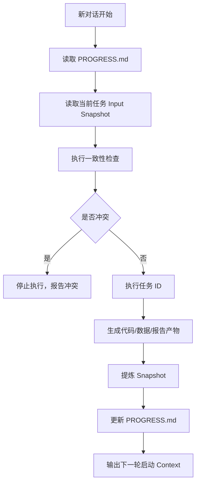

# Project Progress

## Project Goal

基于公开光伏、天气、负荷、电价数据，构建可复现实验链路：数据处理 -> 特征工程 -> 预测模型 -> 储能调度 -> 报告/展示。

本文件是跨对话的唯一进度锚点。它只保存可执行结论、关键产物路径和下一步任务，不复制阶段报告细节。

## Current State

- Documentation paths:
  - Project plan: `docs/project_plan.md`
  - Report index: `docs/reports_index.md`
  - Reference papers: `docs/references/papers/`

- 已完成阶段：
  - Stage 1: 数据采集与标准化。
  - Stage 2: 数据清洗与质量报告。
  - Stage 3: 特征工程。
  - Stage 4: LightGBM 基线预测。
  - Stage 5: LightGBM 诊断、消融和调参。
  - Stage 6: TCN 序列模型。
- 当前主线数据集：
  - `configs/data_sources.pvdaq_nsrdb_2020_2022.json`
  - `data/processed/pvdaq_nsrdb_2020_2022/stage3_feature_dataset.parquet`
  - 原因：该链路已有 Stage4、Stage5、Stage6 完整产物，样本规模支撑 24h/48h/72h 序列窗口实验。
- 已确定技术栈：
  - Python >= 3.11
  - pandas / numpy / pyarrow
  - LightGBM / scikit-learn
  - PyTorch
- 已确定 CLI 入口：
  - `python -m new_energy_sys.cli.bootstrap_data`
  - `python -m new_energy_sys.cli.clean_data`
  - `python -m new_energy_sys.cli.build_features`
  - `python -m new_energy_sys.cli.train_baseline`
  - `python -m new_energy_sys.cli.optimize_lightgbm`
  - `python -m new_energy_sys.cli.train_tcn`
- 关键已生成产物：
  - `data/processed/pvdaq_nsrdb_2020_2022/stage4_lightgbm_report.md`
  - `data/processed/pvdaq_nsrdb_2020_2022/stage5_optimization_report.md`
  - `data/processed/pvdaq_nsrdb_2020_2022/stage6_tcn_report.md`
- 当前核心指标：
  - Stage4 LightGBM: `t+1h` nRMSE `0.0637`, `t+6h` nRMSE `0.1196`, `t+24h` nRMSE `0.1238`。
  - Stage5 tuned LightGBM: `t+1h` nRMSE `0.0636`, `t+6h` nRMSE `0.1182`, `t+24h` nRMSE `0.1225`。
  - Stage6 TCN: `t+24h` nRMSE `0.1159`，优于 tuned LightGBM 的 `0.1225`。
- 当前工作流：



## Dependencies

- 外部数据下载可能受网络、API、文件体积影响。
- NSRDB 是历史/观测型太阳资源数据，不是严格的 forecast-cycle 天气预报数据；报告中不能表述为“预测时刻真实可获得的天气预报”。
- 天气数据是外部补充数据，不能描述为电站实测气象。
- LightGBM 是无约束回归器；单独加载模型推理时，必须使用 `predict_with_bundle` 统一裁剪到物理边界，不能直接使用裸模型输出。
- TCN 当前使用长窗口，窗口切分必须严格限制在 train/validation/test 各自分段内，避免时间泄漏。

## Next Steps

| ID | Task | Input Snapshot | Expected Output | Status |
|---|---|---|---|---|
| S7 | 建立储能调度仿真模块或增强现有优化链路 | Stage4-6 预测结果、储能参数、负荷/电价字段 | 调度结果、SOC 曲线、收益/约束报告 | Pending |

## Consistency Check Protocol

每次执行任务前必须检查：

1. 当前任务输入文件是否存在。
2. 字段名、时间粒度、时区、预测 horizon 是否与上一步输出一致。
3. 模型输出是否经过物理边界裁剪。
4. 新增报告是否引用真实产物路径，不允许写未生成文件。
5. 若任务依赖序列窗口，必须确认窗口没有穿越 train/validation/test 边界。
6. 若任务使用天气特征，必须区分历史/观测型太阳资源数据和真实可用天气预报数据。

## Handover Protocol

每个长对话结束前必须更新：

1. 本轮完成了什么。
2. 新增或修改的核心文件。
3. 可复用的命令。
4. 下轮任务编号。
5. 下轮启动 Context。

标准交接格式：

```markdown
## Handover Snapshot - YYYY-MM-DD

- Completed:
- Changed Files:
- Reusable Commands:
- Next Task:
- Startup Context:
- Pitfall:
```

## Handover Snapshot - 2026-04-24

- Completed: 轻量整理项目阅读层；新增 `docs/`，移动项目计划和参考论文，清理 Python `__pycache__`。
- Changed Files: `README.md`, `PROGRESS.md`, `docs/project_plan.md`, `docs/reports_index.md`, `docs/references/papers/`.
- Reusable Commands: `rg "docs/project_plan.md|docs/reports_index.md|docs/references/papers" README.md PROGRESS.md docs`; `Get-ChildItem -Path src,scripts -Recurse -Directory -Filter __pycache__`.
- Next Task: `S7`.
- Startup Context: `@PROGRESS.md 阅读当前进度，并执行下一步任务 S7。先做一致性检查，再实现储能调度仿真或增强现有优化链路。`
- Pitfall: `data/` 和 `reports/` 仍是实验产物和脚本输出目录，不能移动。

## Latest Snapshot

- Snapshot date: 2026-04-24
- 主线已经从早期 `nrel_opsd_weather` 和 `pvdaq_nsrdb_2022_2023` 实验推进到 `pvdaq_nsrdb_2020_2022`。
- Stage5 结论：调参后 LightGBM 的 `t+24h` nRMSE 为 `0.1225`，`history_only` 是该 horizon 的最佳特征组。
- Stage6 结论：TCN 在 `target_pv_power_t_plus_24h` 上取得 nRMSE `0.1159`，相对 tuned LightGBM 改善 `0.0066`。
- 下一轮启动 Context：

```text
@PROGRESS.md 阅读当前进度，并执行下一步任务 S7。
先基于 PROGRESS.md 和 Existing_Code 做一致性检查：
1. 确认 Stage4-6 预测结果路径存在。
2. 确认储能参数、负荷、电价字段在主线特征数据中可用。
3. 确认预测输出进入调度前经过物理边界裁剪。
4. 若存在冲突，先停止并报告；无冲突再实现储能调度仿真或增强现有优化链路。
```

Pitfall: 本文件不能写成流水账；只允许保留可执行事实、关键路径、下一步任务和影响后续实现的约束。

## Handover Snapshot - 2026-04-24 Stage7

- Completed: 完成真实预报天气可用性验证。用 Open-Meteo Historical Forecast f24 替代 `target_plus_6h_*` / `target_plus_24h_*` 后验 NSRDB 天气；生成 forecast-valid-time 数据集、Stage7 特征集、特征映射表、泄漏审计、TCN regularized 168h 训练产物和中文 Stage7 报告。
- Changed Files: `src/new_energy_sys/stage7_forecast_validation.py`, `src/new_energy_sys/cli/run_stage7.py`, `src/new_energy_sys/sequence_modeling.py`, `pyproject.toml`, `docs/reports_index.md`, `PROGRESS.md`.
- Generated Artifacts: `data/processed/pvdaq_nsrdb_2020_2022/stage7_forecast_weather_dataset.parquet`, `data/processed/pvdaq_nsrdb_2020_2022/stage7_feature_dataset.parquet`, `data/processed/pvdaq_nsrdb_2020_2022/stage7_target_plus_feature_mapping.csv`, `data/processed/pvdaq_nsrdb_2020_2022/stage7_forecast_availability_audit.csv`, `data/processed/pvdaq_nsrdb_2020_2022/stage7_tcn_metrics.csv`, `data/processed/pvdaq_nsrdb_2020_2022/stage7_tcn_predictions.csv`, `data/processed/pvdaq_nsrdb_2020_2022/stage7_forecast_validation_report.md`.
- Key Result: Stage7 TCN t+24h nRMSE `0.1422`，日间 nRMSE `0.2020`；均未达到门槛 `0.1225` / `0.1689`。质量门禁 `100%`，泄漏检查通过，预测物理边界通过。
- Model Decision: 暂不推进 TCN 生产建模；Stage6 的 NSRDB target_plus 上限收益不能直接外推到真实预报上线场景。
- Reusable Commands: `$env:PYTHONPATH='src'; python -m new_energy_sys.cli.run_stage7 --config configs\data_sources.pvdaq_nsrdb_2020_2022.json --stage3-input data\processed\pvdaq_nsrdb_2020_2022\stage3_feature_dataset.parquet --forecast-weather data\raw\weather_forecast\open_meteo_historical_forecast_merged_2022-01-01_2022-12-31_39.7404_-105.1774.csv`; `$env:PYTHONPATH='src'; python -m compileall -q src`.
- Next Task: `S8`，若继续生产路线，优先做 HRRR 原生 cycle/lead_time 全年抽取或回退到 tuned LightGBM history_only 主模型固化。
- Startup Context: 读取 `data/processed/pvdaq_nsrdb_2020_2022/stage7_forecast_validation_report.md` 和 `stage7_target_plus_feature_mapping.csv`；不要把 Open-Meteo assumed issue time 描述成原生 forecast cycle。
- Pitfall: Stage7 只验证 2022 可用 forecast-valid-time 数据；训练样本少于 2020-2022 全量，和 Stage5/Stage6 指标不是完全同分布比较。

## Handover Snapshot - 2026-04-24 Stage7 Progress Report

- Completed: 新增 Stage7 管理型进度报告，总结工作内容、关键指标完成度、质量门禁、三方对比和下一阶段推进可行性。
- Changed Files: `reports/stage7_forecast_weather_progress_report.md`, `docs/reports_index.md`, `PROGRESS.md`.
- Reusable Commands: `Get-Content reports\stage7_forecast_weather_progress_report.md`; `Select-String -Path docs\reports_index.md -Pattern "stage7_forecast_weather_progress_report"`.
- Next Task: `S8`，固化 tuned LightGBM `history_only` 主模型，或启动 HRRR 原生 forecast-cycle 全年抽取预研。
- Startup Context: 先读 `reports/stage7_forecast_weather_progress_report.md`，结论是 TCN 暂无上线价值，短期推荐 LightGBM 主路线。
- Pitfall: 不要把 Stage7 指标和 Stage5/Stage6 当作完全同分布横向排名；Stage7 使用 2022 forecast-valid-time 子集。

## Handover Snapshot - 2026-04-24 Stage8

- Completed: 完成 Stage8 表格模型横向对比。纳入 LightGBM tuned、XGBoost、CatBoost、ExtraTrees、RandomForest、Ridge、ElasticNet；全部模型成功训练，质量门禁全部通过。
- Changed Files: `src/new_energy_sys/tabular_comparison.py`, `src/new_energy_sys/cli/compare_tabular_models.py`, `pyproject.toml`, `docs/reports_index.md`, `PROGRESS.md`.
- Generated Artifacts: `data/processed/pvdaq_nsrdb_2020_2022/stage8_tabular_model_metrics.csv`, `data/processed/pvdaq_nsrdb_2020_2022/stage8_tabular_model_predictions.csv`, `data/processed/pvdaq_nsrdb_2020_2022/stage8_tabular_model_report.md`, `data/processed/pvdaq_nsrdb_2020_2022/stage8_tabular_model_report.json`, `data/processed/pvdaq_nsrdb_2020_2022/stage8_models/`.
- Key Result: `history_only` 测试集最佳仍为 `lightgbm_tuned`，nRMSE `0.1225`，日间 nRMSE `0.1689`。RandomForest `0.1237`、CatBoost `0.1238`、ExtraTrees `0.1244`、XGBoost `0.1272`，均未达到替代规则。
- Model Decision: 固化 `lightgbm_tuned history_only` 为短期主模型；不替换为 XGBoost/CatBoost。
- Reusable Commands: `python -m pip install xgboost catboost`; `$env:PYTHONPATH='src'; python -m new_energy_sys.cli.compare_tabular_models --config configs\data_sources.pvdaq_nsrdb_2020_2022.json --input data\processed\pvdaq_nsrdb_2020_2022\stage3_feature_dataset.parquet`; `Import-Csv data\processed\pvdaq_nsrdb_2020_2022\stage8_tabular_model_metrics.csv | Where-Object { $_.split -eq 'test' -and $_.feature_set -eq 'history_only' } | Sort-Object {[double]$_.nrmse_capacity} | Format-Table model,feature_set,nrmse_capacity,daytime_nrmse_capacity,rmse_kw,mae_kw -AutoSize`.
- Next Task: `S9`，固化 LightGBM 主模型推理接口和预测产物消费链路。
- Startup Context: 先读 `data/processed/pvdaq_nsrdb_2020_2022/stage8_tabular_model_report.md`；Stage8 已排除 XGBoost/CatBoost 替代价值，主路线为 LightGBM `history_only`。
- Pitfall: Stage8 不是 AutoML；不要因为 XGBoost/CatBoost 本轮固定参数不胜出就继续无边界调参。当前目标是稳定上线主模型。

## Handover Snapshot - 2026-04-24 Stage8 Chinese Report

- Completed: 将 `stage8_tabular_model_report.md` 改为中文叙述，补充计划完成度评估和 S9 下一阶段计划。
- Changed Files: `data/processed/pvdaq_nsrdb_2020_2022/stage8_tabular_model_report.md`, `PROGRESS.md`.
- Reusable Commands: `Get-Content data\processed\pvdaq_nsrdb_2020_2022\stage8_tabular_model_report.md`.
- Next Task: `S9`，固化 LightGBM 主模型推理 CLI、预测产物格式和推理质量报告。
- Startup Context: 当前主模型已定为 `lightgbm_tuned history_only`；Stage8 计划完成度 `100%`，后续不要继续无边界调参。
- Pitfall: `full_features_without_target_plus` 只是对照组，主模型选择仍以 `history_only` 为准。

## Handover Snapshot - 2026-04-24 Stage9

- Completed: 完成 LightGBM `history_only` 主模型推理链路固化。新增 Stage9 推理模块和 CLI，读取 Stage8 主模型 bundle，强制校验特征列、容量一致性、时间顺序、缺失值、无穷值和物理边界裁剪；生成标准预测产物、离线指标和质量报告。
- Changed Files: `src/new_energy_sys/stage9_inference.py`, `src/new_energy_sys/cli/run_stage9_inference.py`, `pyproject.toml`, `docs/reports_index.md`, `PROGRESS.md`.
- Generated Artifacts: `data/processed/pvdaq_nsrdb_2020_2022/stage9_main_model_predictions.csv`, `data/processed/pvdaq_nsrdb_2020_2022/stage9_main_model_metrics.csv`, `data/processed/pvdaq_nsrdb_2020_2022/stage9_main_model_report.json`, `data/processed/pvdaq_nsrdb_2020_2022/stage9_main_model_report.md`.
- Key Result: Stage9 复现 Stage8 主模型测试集指标：`t+24h` nRMSE `0.1225`，日间 nRMSE `0.1689`，RMSE `0.1372 kW`，MAE `0.0739 kW`；全部推理质量门禁通过。
- Model Decision: 短期主模型固定为 `stage8_models/lightgbm_tuned_history_only_target_pv_power_t_plus_24h.pkl`，不继续横向调参；后续模块统一消费 `stage9_main_model_predictions.csv`。
- Reusable Commands: `$env:PYTHONPATH='src'; python -m new_energy_sys.cli.run_stage9_inference --config configs\data_sources.pvdaq_nsrdb_2020_2022.json --input data\processed\pvdaq_nsrdb_2020_2022\stage3_feature_dataset.parquet`; `$env:PYTHONPATH='src'; python -m compileall -q src`.
- Next Task: `S10`，将 Stage9 标准预测产物接入储能调度仿真，输出 SOC 曲线、充放电功率、收益和约束报告。
- Startup Context: 先读取 `data/processed/pvdaq_nsrdb_2020_2022/stage9_main_model_report.md` 和 `stage9_main_model_predictions.csv`；预测字段为 `timestamp`, `target`, `prediction_kw`, `prediction_capacity_ratio`，离线回测场景还包含 `actual_kw` 和 `error_kw`。
- Pitfall: Stage9 固化的是 `t+24h` LightGBM `history_only` 推理接口，不是真实 forecast-cycle 天气上线链路；不要把它描述为天气预报生产能力。

## Handover Snapshot - 2026-04-24 Stage9 Evaluation and S10 Plan

- Completed: 完成 Stage9 指标质量评估，并确认下一阶段可进入 S10 储能调度仿真。Stage9 的价值是固化稳定推理链路和标准预测产物，不是继续提升模型指标。
- Metric Quality: 测试集 `t+24h` nRMSE `0.1225`，日间 nRMSE `0.1689`，RMSE `0.1372 kW`，MAE `0.0739 kW`，Bias `0.0096 kW`；`train/validation/test` nRMSE 为 `0.1119 / 0.1150 / 0.1225`，时间外推退化可接受；全部质量门禁为 `True`。
- Feasibility Decision: `S10` 可行。原因是 `stage9_main_model_predictions.csv` 已具备下游消费字段：`timestamp`, `target`, `prediction_kw`, `prediction_capacity_ratio`, `actual_kw`, `error_kw`，且预测值已被裁剪到物理边界 `[0, capacity_kw * 1.05]`。
- S10 Recommended Scope: 基于 `stage9_main_model_predictions.csv` 接入储能调度仿真，输出 `SOC` 曲线、充电功率、放电功率、弃光或缺口统计、收益/成本指标、约束违例报告，并与 `actual_kw` perfect-forecast 基准或 no-storage 基准对比。
- S10 Minimum Quality Gates: `SOC` 不越界；充放电功率不超过额定功率；同一时刻不能同时充电和放电；能量守恒误差在容忍阈值内；收益统计必须区分预测驱动调度和真实发电结算；报告不得引用未生成产物。
- Candidate Outputs: `data/processed/pvdaq_nsrdb_2020_2022/stage10_storage_dispatch_results.csv`, `data/processed/pvdaq_nsrdb_2020_2022/stage10_storage_dispatch_metrics.csv`, `data/processed/pvdaq_nsrdb_2020_2022/stage10_storage_dispatch_report.md`, `data/processed/pvdaq_nsrdb_2020_2022/stage10_storage_dispatch_report.json`.
- Reusable Commands: `Import-Csv data\processed\pvdaq_nsrdb_2020_2022\stage9_main_model_metrics.csv | Format-Table split,sample_count,nrmse_capacity,daytime_nrmse_capacity,rmse_kw,mae_kw,bias_kw -AutoSize`; `Get-Content data\processed\pvdaq_nsrdb_2020_2022\stage9_main_model_report.md -Encoding UTF8`.
- Next Task: `S10`，实现储能调度仿真模块和 CLI，消费 Stage9 标准预测产物。
- Startup Context: 不要继续 Stage8/Stage9 调参；先检查现有 `src/new_energy_sys/storage.py` 和配置文件中的 `storage` 参数，再决定调度策略。优先做可审计的规则型或优化型单站调度，确保每一步约束可解释。
- Pitfall: Stage9 使用 `history_only` t+24h 预测，日间 nRMSE `0.1689` 是 S10 的主要风险。S10 可以评估当前预测质量下的调度可行性，但不能表述为真实 forecast-cycle 天气预报上线后的最终收益。

## Handover Snapshot - 2026-04-24 Stage10

- Completed: 完成 Stage10 储能调度离线仿真。新增预测驱动、真实结算的单站储能调度链路：将 Stage9 `timestamp` 按 `+24h` 转为交付时刻，再对齐 Stage3 的 `price_eur_mwh` / `load_mw`；输出 forecast-dispatch、perfect-forecast 和 no-storage 三类基准；生成 SOC、充放电功率、外送功率、短缺、弃光、收益和约束门禁。
- Changed Files: `src/new_energy_sys/storage.py`, `src/new_energy_sys/cli/run_stage10_dispatch.py`, `pyproject.toml`, `docs/reports_index.md`, `PROGRESS.md`.
- Generated Artifacts: `data/processed/pvdaq_nsrdb_2020_2022/stage10_storage_dispatch_results.csv`, `data/processed/pvdaq_nsrdb_2020_2022/stage10_storage_dispatch_metrics.csv`, `data/processed/pvdaq_nsrdb_2020_2022/stage10_storage_dispatch_report.md`, `data/processed/pvdaq_nsrdb_2020_2022/stage10_storage_dispatch_report.json`.
- Key Result: 可结算样本 `25255` 行；因交付时刻缺少市场信号剔除 `110 / 25365` 行。forecast-dispatch 收益 `136.4694 EUR`，相对 no-storage 为 `-0.0227 EUR`；perfect-forecast 上界同为 `-0.0227 EUR`；无储能基线 `136.4921 EUR`。SOC、功率上限、禁止同时充放电、能量守恒门禁全部通过。
- Strategy Finding: 当前配置 `discharge_price_threshold=45.0` 高于样本最大电价约 `37.67 EUR/MWh`，因此 Stage10 全周期没有放电动作，只有低价充电，收益略低于 no-storage。该结果不是模型推理错误，而是储能策略阈值与当前 OPSD 映射电价分布不匹配。
- Reusable Commands: `$env:PYTHONPATH='src'; python -m new_energy_sys.cli.run_stage10_dispatch --config configs\data_sources.pvdaq_nsrdb_2020_2022.json --predictions data\processed\pvdaq_nsrdb_2020_2022\stage9_main_model_predictions.csv --feature-input data\processed\pvdaq_nsrdb_2020_2022\stage3_feature_dataset.parquet`; `$env:PYTHONPATH='src'; python -m compileall -q src`; `Get-Content data\processed\pvdaq_nsrdb_2020_2022\stage10_storage_dispatch_report.md -Encoding UTF8`.
- Next Task: `S11`，优先做储能策略敏感性分析或滚动优化调度：重新设计电价阈值为分位数/价差触发，或引入 24h look-ahead 线性规划，再与 Stage10 固定阈值基线对比。
- Startup Context: 先读 `data/processed/pvdaq_nsrdb_2020_2022/stage10_storage_dispatch_report.md` 和 `stage10_storage_dispatch_metrics.csv`。不要继续 Stage8/Stage9 调参；Stage10 的核心瓶颈是储能策略参数，不是预测接口。若推进 S11，先处理 `discharge_price_threshold=45.0` 超出当前电价分布导致无放电的问题。
- Pitfall: Stage10 收益是离线回放结算，且电价/负荷来自 OPSD 画像映射，不是真实同区域同刻市场收益；不能把 `-0.0227 EUR` 直接外推为真实商业收益结论。

## Handover Snapshot - 2026-04-24 Stage10 Evaluation and S11 Plan

- Completed: 完成 Stage10 指标质量评估，并确认下一阶段可进入 S11。评估结论分为两层：工程链路质量合格，经济策略质量不合格但具备继续优化价值。
- Metric Quality: Stage10 可结算样本 `25255 / 25365`，市场信号对齐剔除 `110` 行；质量门禁全部为 `True`，包括 `input_non_empty`、`dispatch_timestamp_monotonic`、`prediction_target_is_t_plus_24h`、`actual_kw_available_for_settlement`、`market_signals_aligned`、`forecast_dispatch_constraints_passed`。物理约束全部通过：SOC 不越界、充放电功率不超限、无同时充放电、能量守恒最大误差 `0.0`。
- Economic Quality: forecast-dispatch 总收益 `136.4694 EUR`，no-storage 基线 `136.4921 EUR`，增量收益 `-0.0227 EUR`；perfect-forecast 上界同为 `-0.0227 EUR`。这说明本轮收益问题主要来自储能策略参数和市场信号，不是 Stage9 预测误差。
- Root Cause: 当前 `discharge_price_threshold=45.0`，而 Stage10 样本电价最大值约 `37.67 EUR/MWh`，导致 `total_discharge_kwh=0.0`。电池只在低价时充电并停留在高 SOC，未形成套利闭环。
- Feasibility Decision: `S11` 可行，但目标必须从“上线 Stage10 固定阈值策略”调整为“验证可产生完整充放电闭环的策略族”。不建议继续 Stage8/Stage9 调参；当前阻塞点是储能调度策略与电价分布不匹配。
- S11 Recommended Scope: 优先实现策略敏感性分析，枚举或分位数生成 `charge_price_threshold` / `discharge_price_threshold`，输出每组阈值的收益、充放电量、循环次数、SOC 约束、短缺/弃光指标；若敏感性分析仍不能产生正收益，再推进 24h look-ahead 线性规划或动态规划调度。
- S11 Candidate Outputs: `data/processed/pvdaq_nsrdb_2020_2022/stage11_storage_strategy_sensitivity_metrics.csv`, `data/processed/pvdaq_nsrdb_2020_2022/stage11_storage_strategy_sensitivity_results.csv`, `data/processed/pvdaq_nsrdb_2020_2022/stage11_storage_strategy_report.md`, `data/processed/pvdaq_nsrdb_2020_2022/stage11_storage_strategy_report.json`.
- S11 Minimum Quality Gates: 至少一个候选策略产生 `total_discharge_kwh > 0`；所有候选策略 SOC 和功率约束通过；报告必须同时给出 no-storage、Stage10 fixed-threshold、best-sensitive-threshold 三类对比；若最优策略仍不优于 no-storage，必须明确归因于价差信号、效率损耗、容量配置或 PV 规模，而不是继续盲目调参。
- Reusable Commands: `Get-Content data\processed\pvdaq_nsrdb_2020_2022\stage10_storage_dispatch_report.md -Encoding UTF8`; `Import-Csv data\processed\pvdaq_nsrdb_2020_2022\stage10_storage_dispatch_metrics.csv | Format-Table scenario,total_storage_revenue_eur,incremental_revenue_eur,total_charge_kwh,total_discharge_kwh,total_shortfall_kwh,total_curtailed_kwh -AutoSize`.
- Next Task: `S11`，实现储能策略敏感性分析模块和 CLI，基于 Stage10 已固化的预测消费与真实结算链路做参数扫描。
- Startup Context: 先读取 Stage10 报告和 metrics；固定阈值策略的关键失败点是 `discharge_price_threshold=45.0` 超出当前价格分布，导致无放电。S11 第一优先级是让候选策略覆盖当前价格分布并形成充放电闭环，再判断是否值得引入滚动优化。
- Pitfall: S11 不能只寻找收益最高的阈值而忽略循环次数、SOC 贴边和预测驱动短缺；否则会把过拟合电价画像的策略误判为可上线策略。

## Handover Snapshot - 2026-04-24 Stage11

- Completed: 完成 Stage11 储能策略敏感性分析。新增分位数阈值扫描模块和 CLI，复用 Stage10 的交付时刻对齐、预测驱动调度、真实 `actual_kw` 结算、SOC/功率/能量守恒约束审计；生成 26 组候选策略，并与 no-storage、Stage10 fixed-threshold 基线同口径比较。
- Changed Files: `src/new_energy_sys/stage11_storage_strategy.py`, `src/new_energy_sys/cli/run_stage11_strategy.py`, `pyproject.toml`, `docs/reports_index.md`, `PROGRESS.md`.
- Generated Artifacts: `data/processed/pvdaq_nsrdb_2020_2022/stage11_storage_strategy_sensitivity_results.csv`, `data/processed/pvdaq_nsrdb_2020_2022/stage11_storage_strategy_sensitivity_metrics.csv`, `data/processed/pvdaq_nsrdb_2020_2022/stage11_storage_strategy_sensitivity_report.md`, `data/processed/pvdaq_nsrdb_2020_2022/stage11_storage_strategy_sensitivity_report.json`.
- Metric Quality: 可结算样本 `25255 / 25365`，市场信号对齐剔除 `110` 行；候选策略数 `26`；电价区间 `9.2840` 到 `37.6700 EUR/MWh`。质量门禁全部为 `True`：`input_non_empty`、`candidate_count_positive`、`at_least_one_strategy_discharges`、`all_strategy_constraints_passed`、`best_strategy_discharges`、`market_signals_aligned`。JSON 报告已通过严格解析，固定阈值基线的缺省分位数字段已写为 `null`，不是非标准 `NaN`。
- Key Result: Stage10 fixed-threshold 仍为 `charge=25.0000` / `discharge=45.0000`，放电量 `0.0000 kWh`，相对 no-storage 收益 `-0.0227 EUR`。Stage11 最佳敏感策略为 `q40_q95`，即 `charge_price_threshold=24.5800`、`discharge_price_threshold=35.7025`；总收益 `139.1494 EUR`，相对 no-storage 增量收益 `2.6573 EUR`，充电量 `276.9823 kWh`，放电量 `250.8277 kWh`，等效循环 `111.9767`，SOC 区间 `0.100-0.900`，约束门禁全部通过。
- Quality Judgment: Stage11 工程目标完成，已证明 Stage10 失败根因是固定放电阈值超出当前 OPSD 映射电价分布，而不是预测接口或储能物理约束实现错误。经济质量从 Stage10 的负增量收益提升为正增量收益，但最佳策略存在 SOC 贴边、循环次数较高、短缺仍有 `813.7618 kWh` 的风险，不能直接作为上线策略固化。
- Feasibility Decision: `S12` 可行。原因是 Stage11 已形成正收益和完整充放电闭环，且所有物理约束通过；下一阶段应从“阈值敏感性验证”推进到“滚动优化调度”，用 24h look-ahead 线性规划或动态规划显式约束 SOC 目标、循环强度、短缺惩罚和弃光惩罚。
- S12 Recommended Scope: 实现 24h look-ahead 储能滚动优化调度模块和 CLI。输入继续使用 `stage9_main_model_predictions.csv` 与 Stage3 市场信号；每个交付时刻用未来 24h 的预测 PV 和电价生成充放电计划，只执行首小时动作；目标函数最大化真实结算收益或计划收益，同时加入循环成本、短缺惩罚、SOC 终端约束和功率/SOC 物理约束；输出 rolling-optimization、Stage11 best-threshold、Stage10 fixed-threshold、no-storage 四类对比。
- S12 Candidate Outputs: `data/processed/pvdaq_nsrdb_2020_2022/stage12_storage_rolling_optimization_results.csv`, `data/processed/pvdaq_nsrdb_2020_2022/stage12_storage_rolling_optimization_metrics.csv`, `data/processed/pvdaq_nsrdb_2020_2022/stage12_storage_rolling_optimization_report.md`, `data/processed/pvdaq_nsrdb_2020_2022/stage12_storage_rolling_optimization_report.json`.
- S12 Minimum Quality Gates: 滚动窗口不得跨越不可用市场信号；SOC 不越界；充放电功率不超限；同一小时不得同时充放电；能量守恒误差在 `1e-9` 内；至少输出一个对比基线为 Stage11 `q40_q95`；若 rolling optimization 收益不优于 Stage11，必须明确归因于循环成本、终端 SOC、短缺惩罚或预测误差，而不是继续扩大阈值网格。
- Reusable Commands: `$env:PYTHONPATH='src'; python -m new_energy_sys.cli.run_stage11_strategy --config configs\data_sources.pvdaq_nsrdb_2020_2022.json --predictions data\processed\pvdaq_nsrdb_2020_2022\stage9_main_model_predictions.csv --feature-input data\processed\pvdaq_nsrdb_2020_2022\stage3_feature_dataset.parquet`; `$env:PYTHONPATH='src'; python -m compileall -q src`; `python -m json.tool data\processed\pvdaq_nsrdb_2020_2022\stage11_storage_strategy_sensitivity_report.json`; `Import-Csv data\processed\pvdaq_nsrdb_2020_2022\stage11_storage_strategy_sensitivity_metrics.csv | Select-Object -First 10 strategy_id,incremental_revenue_eur,total_charge_kwh,total_discharge_kwh,cycle_equivalent_count,total_shortfall_kwh | Format-Table -AutoSize`.
- Next Task: `S12`，实现 24h look-ahead 滚动优化调度，并与 Stage11 best-sensitive-threshold 做同口径对比。
- Startup Context: 先读取 `data/processed/pvdaq_nsrdb_2020_2022/stage11_storage_strategy_sensitivity_report.md` 和 `stage11_storage_strategy_sensitivity_metrics.csv`。Stage11 最佳策略 `q40_q95` 只是离线阈值扫描结果，不要直接固化为生产策略；S12 应优先解决 SOC 贴边、循环强度和预测驱动短缺问题。
- Pitfall: Stage11 的正收益基于 OPSD 映射电价和离线回放，不是真实同区域市场收益；S12 不能只追求收益最大化，必须把循环成本、SOC 终端约束和短缺惩罚纳入目标函数，否则优化器会把电池推到边界并放大策略过拟合。

## Handover Snapshot - 2026-04-24 Stage12

- Completed: 完成 Stage12 储能滚动优化调度。新增 24h look-ahead 快速滚动价差优化模块和 CLI，复用 Stage10 的交付时刻对齐、Stage9 `history_only` t+24h 预测消费、Stage3 电价/负荷信号、真实 `actual_kw` 离线结算和 SOC/功率/能量守恒约束审计；同口径输出 rolling-optimization、Stage11 `q40_q95`、Stage10 fixed-threshold、no-storage 四类对比。
- Changed Files: `src/new_energy_sys/stage12_storage_rolling.py`, `src/new_energy_sys/cli/run_stage12_rolling.py`, `pyproject.toml`, `docs/reports_index.md`, `PROGRESS.md`.
- Generated Artifacts: `data/processed/pvdaq_nsrdb_2020_2022/stage12_storage_rolling_optimization_results.csv`, `data/processed/pvdaq_nsrdb_2020_2022/stage12_storage_rolling_optimization_metrics.csv`, `data/processed/pvdaq_nsrdb_2020_2022/stage12_storage_rolling_optimization_report.md`, `data/processed/pvdaq_nsrdb_2020_2022/stage12_storage_rolling_optimization_report.json`.
- Key Result: Stage12 rolling optimization 收益 `137.1022 EUR`，相对 no-storage 增量 `0.6100 EUR`；Stage11 `q40_q95` 基准收益 `139.1494 EUR`，增量 `2.6573 EUR`；Stage10 fixed-threshold 增量 `-0.0227 EUR`。Rolling 策略形成完整充放电闭环，充电 `418.3899 kWh`、放电 `378.4480 kWh`、等效循环 `168.9500`，但比 Stage11 离线最优阈值低 `2.0472 EUR`。
- Quality Gates: `input_non_empty=True`, `dispatch_timestamp_monotonic=True`, `prediction_target_is_t_plus_24h=True`, `market_signals_aligned=True`, `rolling_window_uses_available_market_signals=True`, `rolling_constraints_passed=True`, `stage11_baseline_present=True`。SOC 不越界、功率不超限、无同时充放电、能量守恒最大误差 `0.0`。
- Engineering Decision: 最初实现的逐小时离散 SOC 动态规划在三年小时级样本上 120 秒超时，已复盘并改为可审计的快速 24h rolling look-ahead 价差策略，避免阶段推进卡死。当前 Stage12 证明滚动策略在加入循环成本、短缺风险惩罚和 SOC 目标后更保守，收益不及 Stage11 离线阈值扫描；这不是预测接口或物理约束错误。
- Reusable Commands: `$env:PYTHONPATH='src'; python -m new_energy_sys.cli.run_stage12_rolling --config configs\data_sources.pvdaq_nsrdb_2020_2022.json --predictions data\processed\pvdaq_nsrdb_2020_2022\stage9_main_model_predictions.csv --feature-input data\processed\pvdaq_nsrdb_2020_2022\stage3_feature_dataset.parquet`; `$env:PYTHONPATH='src'; python -m compileall -q src`; `Import-Csv data\processed\pvdaq_nsrdb_2020_2022\stage12_storage_rolling_optimization_metrics.csv | Format-Table scenario,total_storage_revenue_eur,incremental_revenue_eur,total_charge_kwh,total_discharge_kwh,cycle_equivalent_count,total_shortfall_kwh -AutoSize`.
- Next Task: `S13`，建议做储能策略治理与展示层：把 Stage10/11/12 三类策略的收益、循环、短缺、SOC 贴边和约束门禁整理成管理型报告或仪表盘；若继续优化算法，应优先做目标函数惩罚项和储能配置敏感性，而不是回到 Stage8/9 模型调参。
- Startup Context: 先读 `data/processed/pvdaq_nsrdb_2020_2022/stage12_storage_rolling_optimization_report.md` 和 `stage12_storage_rolling_optimization_metrics.csv`。Stage12 rolling 正收益但未超过 Stage11 `q40_q95`，主要原因是循环成本、短缺风险惩罚和 SOC 目标让策略更保守；Stage11 是离线阈值扫描上界，不应直接固化为生产策略。
- Pitfall: Stage12 使用 OPSD 映射电价和离线 actual_kw 回放，不是真实同区域市场结算；rolling 策略收益低于 Stage11 时，不要继续扩大阈值网格或盲目调预测模型，应先明确商业目标是在收益最大化、循环寿命、短缺风险和 SOC 稳定性之间取哪种权衡。

## Handover Snapshot - 2026-04-25 Stage13

- Completed: 完成 Stage13 储能策略治理与展示层。新增治理汇总模块和 CLI，消费 Stage10/11/12 已审计指标，输出统一策略评分、风险标签、治理决策、中文管理报告和静态 HTML 仪表盘。S13 不重新训练模型、不扩大阈值网格、不改变调度算法。
- Changed Files: `src/new_energy_sys/stage13_storage_governance.py`, `src/new_energy_sys/cli/run_stage13_governance.py`, `pyproject.toml`, `docs/reports_index.md`, `PROGRESS.md`.
- Generated Artifacts: `data/processed/pvdaq_nsrdb_2020_2022/stage13_storage_strategy_governance_scorecard.csv`, `data/processed/pvdaq_nsrdb_2020_2022/stage13_storage_strategy_governance_report.json`, `data/processed/pvdaq_nsrdb_2020_2022/stage13_storage_strategy_governance_report.md`, `data/processed/pvdaq_nsrdb_2020_2022/stage13_storage_strategy_governance_dashboard.html`.
- Key Result: Stage13 评分表确认 `stage11_best_threshold_q40_q95` 增量收益最高 `2.6573 EUR`，但治理结论为 `analysis_upper_bound`，不能直接固化为生产策略；`rolling_optimization` 增量收益 `0.6100 EUR`，治理结论为 `pilot_candidate`；`stage10_fixed_threshold` 增量收益 `-0.0227 EUR` 且无放电，治理结论为 `reject`；`no_storage` 保留为 `baseline`。
- Quality Gates: `stage10_metrics_loaded=True`, `stage11_metrics_loaded=True`, `stage12_metrics_loaded=True`, `selected_strategy_count_is_four=True`, `all_selected_constraints_passed=True`, `rolling_positive_incremental_revenue=True`, `stage11_outperforms_rolling=True`, `fixed_threshold_rejected=True`。
- Reusable Commands: `$env:PYTHONPATH='src'; python -m new_energy_sys.cli.run_stage13_governance --config configs\data_sources.pvdaq_nsrdb_2020_2022.json`; `$env:PYTHONPATH='src'; python -m compileall -q src`; `python -m json.tool data\processed\pvdaq_nsrdb_2020_2022\stage13_storage_strategy_governance_report.json`; `Get-Content data\processed\pvdaq_nsrdb_2020_2022\stage13_storage_strategy_governance_report.md -Encoding UTF8`.
- Next Task: `S14`，建议做储能配置与目标函数惩罚项敏感性分析。优先扫描 `capacity_kwh`、`max_charge_kw`、`max_discharge_kw`、`cycle_cost_eur_per_kwh`、`shortfall_risk_penalty_eur_per_kwh`、`terminal_soc_penalty_eur_per_kwh`，输出收益、循环、短缺、SOC 贴边和约束门禁的 Pareto 对比。
- Startup Context: 先读 `data/processed/pvdaq_nsrdb_2020_2022/stage13_storage_strategy_governance_report.md` 和 `stage13_storage_strategy_governance_scorecard.csv`。当前可治理结论是：Stage10 固定阈值拒绝，Stage11 是离线回看收益上界，Stage12 rolling 是受控试点候选。继续优化时不要回到 Stage8/9 预测模型调参，也不要盲目扩大 Stage11 阈值网格；应先明确收益、循环寿命、短缺风险和 SOC 稳定性之间的权衡。
- Pitfall: S13 仍基于 OPSD 映射电价、Stage9 `history_only` t+24h 预测和离线 `actual_kw` 回放，不是真实同区域市场结算；HTML 仪表盘是展示层，不是机器消费接口，机器消费应使用 scorecard CSV 和 report JSON。

## Handover Snapshot - 2026-04-25 Stage14A

- Completed: 完成 S14A CNN-LSTM 深度学习预测补强。新增 CNN-LSTM 序列预测模块和 CLI，复用 Stage3 主线特征数据、严格时间切分、切分内窗口构造、train-only 标准化、SmoothL1Loss、AdamW、验证集早停和物理边界裁剪；完成 `history_only` 与 `weather_history_target_aligned` 两组特征、`96h/168h` 两组窗口的完整实验，并接入 Stage8 LightGBM 与 Stage6 TCN 对比。另新增 `--torch-threads` 参数，后续可显式设置 PyTorch CPU intra-op 线程数以改善本机 CPU 利用率。
- Changed Files: `src/new_energy_sys/deep_sequence_modeling.py`, `src/new_energy_sys/cli/run_stage14_deep_learning.py`, `pyproject.toml`, `docs/reports_index.md`, `PROGRESS.md`.
- Generated Artifacts: `data/processed/pvdaq_nsrdb_2020_2022/stage14_deep_learning_metrics.csv`, `data/processed/pvdaq_nsrdb_2020_2022/stage14_deep_learning_predictions.csv`, `data/processed/pvdaq_nsrdb_2020_2022/stage14_deep_learning_report.md`, `data/processed/pvdaq_nsrdb_2020_2022/stage14_deep_learning_report.json`, `data/processed/pvdaq_nsrdb_2020_2022/stage14_models/`.
- Key Result: `history_only` 最佳为 CNN-LSTM `96h`，测试集 nRMSE `0.1227`、日间 nRMSE `0.1688`，未达到替代 LightGBM 的规则；`weather_history_target_aligned` 最佳为 CNN-LSTM `96h`，测试集 nRMSE `0.1137`、日间 nRMSE `0.1575`，优于 Stage8 LightGBM `0.1225/0.1689` 和 Stage6 TCN `0.1159/0.1599`，但该组使用 NSRDB target-plus 历史太阳资源字段，只能作为离线上限或方法验证。
- Model Decision: CNN-LSTM 已满足“基于深度学习”的论文补强目标，但不替代当前工程调度主模型。短期调度主线仍固定为 Stage9 LightGBM `history_only` 预测产物；论文中应表述为 LightGBM 工程基线 + TCN/CNN-LSTM 深度学习对比实验。
- Quality Gates: 输入非空、时间戳单调、`history_only` 无 `target_plus_*`、数值特征无缺失/无无穷、全部模型训练完成、测试预测物理边界通过、预测字段兼容 Stage9 标准字段，均为 `True`。
- Reusable Commands: `$env:PYTHONPATH='src'; C:\Users\86155\anaconda3\python.exe -m new_energy_sys.cli.run_stage14_deep_learning --config configs\data_sources.pvdaq_nsrdb_2020_2022.json --input data\processed\pvdaq_nsrdb_2020_2022\stage3_feature_dataset.parquet --baseline-metrics data\processed\pvdaq_nsrdb_2020_2022\stage8_tabular_model_metrics.csv --tcn-metrics data\processed\pvdaq_nsrdb_2020_2022\stage6_tcn_metrics.csv --targets 24h --windows 96,168 --feature-sets history_only,weather_history_target_aligned --max-epochs 80 --patience 12 --batch-size 256 --torch-threads 8`; `$env:PYTHONPATH='src'; python -m compileall -q src`; `C:\Users\86155\anaconda3\python.exe -m json.tool data\processed\pvdaq_nsrdb_2020_2022\stage14_deep_learning_report.json`.
- Next Task: `S14B` 或回到原 `S14`。若优先增强论文深度学习叙事，建议做 `S14B`：把 Stage6 TCN、Stage14A CNN-LSTM、Stage8 LightGBM 结果整理成“深度学习预测章节管理报告”；若优先推进调度侧，则做储能配置与目标函数惩罚项敏感性分析。
- Startup Context: 先读 `data/processed/pvdaq_nsrdb_2020_2022/stage14_deep_learning_report.md` 和 `stage14_deep_learning_metrics.csv`。当前关键结论是：CNN-LSTM 在生产安全 `history_only` 组未替代 LightGBM，但在 target-aligned 离线上限组取得 nRMSE `0.1137`，可作为论文中的深度学习算法补强证据；不能把 target-aligned 结果写成真实 forecast-cycle 上线效果。
- Pitfall: 本机默认 `python` 指向 `C:\Python314\python.exe`，缺少项目依赖；可运行实验的解释器是 `C:\Users\86155\anaconda3\python.exe`。如果继续训练，建议显式使用该解释器，并按 CPU 占用情况设置 `--torch-threads`。

## Handover Snapshot - 2026-04-25 Stage14B

- Completed: 完成 S14B Persistence 基线 + Attention-LSTM 深度学习补强的代码实现。Stage14 预测管线已从单 CNN-LSTM 扩展为 `persistence`、`cnn_lstm`、`attention_lstm` 三模型统一入口；新增 `--models` CLI 参数；Persistence 按 `prediction(t)=pv_power_kw(t)` 的 t+24h 口径输出指标和预测但不保存模型文件；Attention-LSTM 采用 LSTM encoder + MLP attention + Linear head，并复用 SmoothL1Loss、AdamW、早停、train-only 标准化、切分内窗口构造和物理边界裁剪。
- Changed Files: `src/new_energy_sys/deep_sequence_modeling.py`, `src/new_energy_sys/cli/run_stage14_deep_learning.py`, `docs/reports_index.md`, `PROGRESS.md`.
- Smoke Test Artifacts: 当前固定路径 `data/processed/pvdaq_nsrdb_2020_2022/stage14_deep_learning_metrics.csv`, `stage14_deep_learning_predictions.csv`, `stage14_deep_learning_report.md`, `stage14_deep_learning_report.json` 已被低成本短测覆盖；短测配置为 `--windows 24 --feature-sets history_only,weather_history_target_aligned --models persistence,cnn_lstm,attention_lstm --max-epochs 1`，不是完整 96/168h 结论。
- Smoke Test Result: `persistence` 测试集 nRMSE `0.1520`、日间 nRMSE `0.2237`；`cnn_lstm` 24h/1epoch/history_only 测试集 nRMSE `0.1295`、日间 nRMSE `0.1767`，target-aligned 测试集 nRMSE `0.1218`、日间 nRMSE `0.1651`；`attention_lstm` 24h/1epoch/history_only 测试集 nRMSE `0.1512`、日间 nRMSE `0.1991`，target-aligned 测试集 nRMSE `0.1453`、日间 nRMSE `0.1842`。该结果只验证链路，不用于论文最终模型排序。
- Quality Gates: `python -m compileall -q src` 通过；CLI help 已显示 `--models`；Stage14 JSON 可由 `C:\Users\86155\anaconda3\python.exe -m json.tool` 解析；烟测预测值均在 `[0, capacity_kw * 1.05]`；Markdown 中文显示已修复。
- Next Task: 运行完整 S14B 长实验：`--windows 96,168 --feature-sets history_only,weather_history_target_aligned --models persistence,cnn_lstm,attention_lstm --max-epochs 100 --patience 15 --batch-size 256 --torch-threads 8`。预计耗时明显长于 S14A，因为新增 Attention-LSTM 且默认保留 CNN-LSTM 重跑。
- Startup Context: 若继续训练，必须使用 `C:\Users\86155\anaconda3\python.exe`，不要使用默认 `C:\Python314\python.exe`；若想保留历史 S14A 完整结果，需要先另存当前或旧的 `stage14_deep_learning_*` 产物，因为完整 S14B 会继续覆盖固定路径。
- Pitfall: Persistence 是证明任务非平凡的简单基线，不参与替代 LightGBM；`weather_history_target_aligned` 仍只能写成离线上限或方法验证，不能写成真实 forecast-cycle 天气预报上线效果。

## Handover Snapshot - 2026-04-26 Stage14B Full Training and S15 Recommendation

- Completed: 完成 S14B 完整长实验，并新增独立训练报告 `data/processed/pvdaq_nsrdb_2020_2022/stage14b_training_report.md`。完整实验覆盖 `persistence`、`cnn_lstm`、`attention_lstm`，窗口 `96/168h`，特征组 `history_only/weather_history_target_aligned`，训练参数为 `max_epochs=100`、`patience=15`、`batch_size=256`、`torch_threads=8`。
- Generated Artifacts: `data/processed/pvdaq_nsrdb_2020_2022/stage14_deep_learning_metrics.csv`, `stage14_deep_learning_predictions.csv`, `stage14_deep_learning_report.md`, `stage14_deep_learning_report.json`, `stage14b_training_report.md`, `stage14_models/cnn_lstm_*_target_pv_power_t_plus_24h.pkl`, `stage14_models/attention_lstm_*_target_pv_power_t_plus_24h.pkl`。
- Key Result: `history_only` 下最佳深度学习模型为 CNN-LSTM `96h`，测试 nRMSE `0.1232`、日间 nRMSE `0.1686`；LightGBM `history_only` 参考 nRMSE `0.1225`、日间 nRMSE `0.1689`。CNN-LSTM 日间略优，但整体 nRMSE 未优于 LightGBM，且未达到 `0.0030` 替代阈值。`weather_history_target_aligned` 下 CNN-LSTM `96h` 测试 nRMSE `0.1138`、日间 nRMSE `0.1577`，只能作为离线上限或方法验证。
- Model Decision: 深度学习补强目标已完成，论文可形成 `Persistence -> LightGBM -> CNN-LSTM -> Attention-LSTM` 的模型梯度；工程调度主线不替代 Stage9 LightGBM `history_only` 预测产物。Attention-LSTM 已实现并训练，但本轮指标弱于 CNN-LSTM，不建议继续围绕 Attention-LSTM 做无边界调参。
- Quality Gates: Stage14B JSON 可解析；Markdown 中文正常；输入非空、时间戳单调、`history_only` 无 `target_plus_*`、数值特征无缺失/无无穷、请求指标行全部写出、Persistence 不生成模型文件、测试预测物理边界通过、预测字段兼容 Stage9，均为 `True`。
- Recommended Next Task: `S15 储能配置与目标函数敏感性分析`。优先基于 Stage9 LightGBM 预测产物和 Stage12 rolling 调度链路，扫描 `capacity_kwh`、`max_charge_kw`、`max_discharge_kw`、`cycle_cost_eur_per_kwh`、`shortfall_risk_penalty_eur_per_kwh`、`terminal_soc_penalty_eur_per_kwh`，输出收益、循环次数、短缺、弃光、SOC 贴边风险和约束门禁的 Pareto 对比。
- Pre-Task Recommendation: 在正式进入 S15 前，新增 `S15A 真实同区域市场数据可行性验证`。目标是验证 PVDAQ system 10 所在 Colorado/PSCO 区域是否存在可公开复现、可按小时或更高频率下载、可与 PVDAQ/NSRDB 时间轴对齐的真实市场结算价格。S15A 只做数据可得性、时间覆盖、市场口径和接入成本验证，不直接改写 Stage10-13 的收益结论。
- S15A Candidate Data Sources: 优先检查 `PSCO / Xcel Energy Colorado` 对应区域的 SPP WEIS 市场数据、EIA 可公开价格/平衡区数据、RTO/ISO 节点或区域价格公开接口；若 2020-2022 主实验期无法覆盖，则评估是否可用 2023-04-01 之后的 WEIS 数据做扩展验证。
- S15A Candidate Outputs: `data/processed/pvdaq_nsrdb_2020_2022/stage15a_market_data_feasibility_report.md`, `stage15a_market_data_feasibility_report.json`, 可选 `stage15a_market_price_sample.csv`。
- S15A Minimum Acceptance: 明确给出 `可接入/不可接入/仅可作为扩展验证` 三类结论之一；说明市场区域、价格产品、时间粒度、时区、单位、覆盖日期、下载方式、授权限制、与 PVDAQ 交付时刻对齐方法；若无法覆盖 2020-2022，必须明确不替换主实验结算口径。
- S15 Candidate Outputs: `data/processed/pvdaq_nsrdb_2020_2022/stage15_storage_configuration_sensitivity_metrics.csv`, `stage15_storage_configuration_sensitivity_results.csv`, `stage15_storage_configuration_sensitivity_report.md`, `stage15_storage_configuration_sensitivity_report.json`。
- S15 Minimum Acceptance: 至少覆盖 3 组储能容量和 3 组功率配置；所有配置通过 SOC、充放电功率、无同时充放电、能量守恒约束；与 Stage10 fixed-threshold、Stage11 best-threshold、Stage12 rolling 策略保持同口径对比；若收益不提升，必须归因到容量配置、功率约束、循环成本、短缺惩罚或价格信号，不再回到预测模型无边界调参。
- Startup Context: 先读 `data/processed/pvdaq_nsrdb_2020_2022/stage14b_training_report.md`、`stage13_storage_strategy_governance_report.md` 和 `stage12_storage_rolling_optimization_metrics.csv`。当前阻塞点已经不是预测模型精度，而是储能容量、功率、循环寿命、短缺风险和 SOC 稳定性的多目标权衡。若用户希望增强真实市场结算可信度，则先做 S15A；若时间有限，则直接做 S15，并在论文中明确 OPSD 映射电价的离线敏感性边界。
- Pitfall: S15A 的风险是数据可得性而不是代码实现。若无法获得可复现的 PSCO/Colorado 同区域小时级结算价格，不要强行用其他区域电价冒充真实同区域市场；应把真实市场结算写成扩展验证或后续工作，主线仍保持 S15 离线配置敏感性。

## Handover Snapshot - 2026-04-26 Stage15A

- Completed: 完成 `S15A 真实同区域市场数据可行性验证`。结论为 `仅可作为扩展验证`：SPP WEIS Public Data 存在公开可复现的 RTBM LMP 数据路径，粒度达到 5 分钟，适合 2023-04-01 之后的 Colorado / PSCO 扩展验证；但 Xcel Energy-Colorado / PSCO 的 WEIS 财务绑定参与晚于主实验期 `2020-01-01` 至 `2022-12-31`，不能替换 Stage10-13 的历史收益结算口径。EIA wholesale 数据和 EIA BAA hourly operating data 均不能作为同区域小时级真实结算价格。
- Changed Files: `data/processed/pvdaq_nsrdb_2020_2022/stage15a_market_data_feasibility_report.md`, `data/processed/pvdaq_nsrdb_2020_2022/stage15a_market_data_feasibility_report.json`, `docs/reports_index.md`, `PROGRESS.md`.
- Generated Artifacts: `data/processed/pvdaq_nsrdb_2020_2022/stage15a_market_data_feasibility_report.md`, `data/processed/pvdaq_nsrdb_2020_2022/stage15a_market_data_feasibility_report.json`.
- Key Result: S15A 明确不改写 Stage10-13 收益结论。主线继续把 OPSD 映射电价写作离线敏感性基准；若论文需要增强真实市场结算可信度，可新增后续 `S15B`，基于 2023-04-01 后 SPP WEIS RTBM LMP 做扩展验证。
- Quality Gates: `explicit_access_decision=True`, `market_region_documented=True`, `price_product_documented=True`, `granularity_documented=True`, `timezone_documented=True`, `unit_documented=True`, `coverage_dates_documented=True`, `download_method_documented=True`, `permission_notes_documented=True`, `pvdaq_alignment_method_documented=True`, `main_experiment_not_replaced_when_2020_2022_uncovered=True`.
- Reusable Commands: `Get-Content data\processed\pvdaq_nsrdb_2020_2022\stage15a_market_data_feasibility_report.md -Encoding UTF8`; `C:\Users\86155\anaconda3\python.exe -m json.tool data\processed\pvdaq_nsrdb_2020_2022\stage15a_market_data_feasibility_report.json`.
- Next Task: `S15`，执行储能配置与目标函数敏感性分析。优先复用 Stage9 LightGBM `history_only` 预测产物和 Stage12 rolling 调度链路，扫描 `capacity_kwh`, `max_charge_kw`, `max_discharge_kw`, `cycle_cost_eur_per_kwh`, `shortfall_risk_penalty_eur_per_kwh`, `terminal_soc_penalty_eur_per_kwh`。
- Startup Context: 先读 `data/processed/pvdaq_nsrdb_2020_2022/stage15a_market_data_feasibility_report.md`、`stage13_storage_strategy_governance_report.md` 和 `stage12_storage_rolling_optimization_metrics.csv`。S15A 已确认真实同区域 WEIS 数据不能覆盖 2020-2022 主实验期，因此 S15 不要等待市场数据接入，直接推进离线储能配置敏感性，并在报告中保留 OPSD 映射电价边界。
- Pitfall: 不要把 2023-04-01 后的 WEIS RTBM LMP 回填为 2020-2022 的真实 PSCO 结算价格；也不要用 EIA 日度枢纽价格或其他区域价格冒充 Colorado / PSCO 同区域小时级结算。

## Handover Snapshot - 2026-04-26 Stage15

- Completed: 完成 `S15 储能配置与目标函数敏感性分析`。新增独立 Stage15 模块和 CLI，复用 Stage9 LightGBM `history_only` 预测产物、Stage3 OPSD 映射电价/负荷和 Stage12 兼容的 24h rolling 调度口径；默认扫描 3 档容量倍率 `0.5/1.0/1.5`、3 档功率倍率 `0.5/1.0/1.5` 和 3 组目标函数惩罚项，共 `27` 组配置，并输出逐小时调度结果、配置级指标、Pareto 标记、JSON 和中文报告。
- Changed Files: `src/new_energy_sys/stage15_storage_sensitivity.py`, `src/new_energy_sys/cli/run_stage15_sensitivity.py`, `pyproject.toml`, `docs/reports_index.md`, `PROGRESS.md`.
- Generated Artifacts: `data/processed/pvdaq_nsrdb_2020_2022/stage15_storage_configuration_sensitivity_results.csv`, `stage15_storage_configuration_sensitivity_metrics.csv`, `stage15_storage_configuration_sensitivity_report.md`, `stage15_storage_configuration_sensitivity_report.json`.
- Key Result: 最高收益与推荐 Pareto 配置均为 `cap1p5_pow0p5_obj3`，容量 `3.36 kWh`、充放电功率 `0.28 kW`、循环成本 `0.004 EUR/kWh`、短缺惩罚 `0.003 EUR/kWh`、终端 SOC 惩罚 `0.05 EUR/kWh`；增量收益 `1.8979 EUR`，等效循环 `99.99`，短缺 `769.04 kWh`，弃光 `0.0036 kWh`，SOC 贴边比例 `0.6700`。该结果优于 Stage12 rolling 默认增量收益 `0.6100 EUR`，但仍低于 Stage11 离线阈值上界 `2.6573 EUR`。
- Quality Gates: `input_non_empty=True`, `dispatch_timestamp_monotonic=True`, `prediction_target_is_t_plus_24h=True`, `market_signals_aligned=True`, `capacity_grid_count_at_least_three=True`, `power_grid_count_at_least_three=True`, `objective_preset_count_at_least_three=True`, `all_configuration_constraints_passed=True`, `pareto_front_non_empty=True`, `main_experiment_market_boundary_preserved=True`。
- Model/Strategy Decision: 预测模型侧继续固定 Stage9 LightGBM `history_only`，不回到 Stage14/Stage8 调参。调度侧结论是容量和功率配置能显著改善 rolling 策略收益，但当前 Pareto 最优仍存在较高 SOC 贴边和短缺风险；Stage11 继续只作为离线阈值扫描上界，不直接固化为生产策略。
- Reusable Commands: `$env:PYTHONPATH='src'; C:\Users\86155\anaconda3\python.exe -m new_energy_sys.cli.run_stage15_sensitivity --config configs\data_sources.pvdaq_nsrdb_2020_2022.json --predictions data\processed\pvdaq_nsrdb_2020_2022\stage9_main_model_predictions.csv --feature-input data\processed\pvdaq_nsrdb_2020_2022\stage3_feature_dataset.parquet`; `$env:PYTHONPATH='src'; C:\Users\86155\anaconda3\python.exe -m compileall -q src`; `C:\Users\86155\anaconda3\python.exe -m json.tool data\processed\pvdaq_nsrdb_2020_2022\stage15_storage_configuration_sensitivity_report.json`; `Import-Csv data\processed\pvdaq_nsrdb_2020_2022\stage15_storage_configuration_sensitivity_metrics.csv | Sort-Object {[double]$_.incremental_revenue_eur} -Descending | Select-Object -First 8 config_id,incremental_revenue_eur,capacity_kwh,max_charge_kw,cycle_equivalent_count,total_shortfall_kwh,total_curtailed_kwh,soc_edge_touch_ratio,pareto_front | Format-Table -AutoSize`.
- Next Task: `S16`，建议做论文/答辩级总报告整合：把 Stage8/9 预测主线、Stage14B 深度学习补强、Stage10-13 调度治理、S15A 市场边界和 Stage15 敏感性分析整理成统一技术路线、结果表和限制条件。若继续工程扩展，则做 `S15B`，基于 2023-04-01 后 SPP WEIS RTBM LMP 做真实市场扩展验证，不替换 2020-2022 主实验。
- Startup Context: 先读 `data/processed/pvdaq_nsrdb_2020_2022/stage15_storage_configuration_sensitivity_report.md` 和 `stage15_storage_configuration_sensitivity_metrics.csv`。当前主结论是 Stage15 已证明储能配置与目标函数权衡比继续预测模型调参更有价值；但收益仍基于 OPSD 映射电价，不是真实 Colorado/PSCO 市场结算。后续写论文时要把 Stage11 上界、Stage12 试点、Stage15 Pareto 敏感性和 S15A 市场边界分开表述。
- Pitfall: `stage15_storage_configuration_sensitivity_results.csv` 约 `235 MB`，是逐小时全配置明细；常规汇总和论文表格优先读取 `stage15_storage_configuration_sensitivity_metrics.csv` 与 report JSON/Markdown。不要把 Stage15 的 OPSD 离线收益写成真实同区域市场收益，也不要因 Stage15 未超过 Stage11 上界就回到预测模型无边界调参。
## Handover Snapshot - 2026-04-26 Frontend Demo Evaluation and Production Hardening Plan

- Completed: 完成 `frontend/` 阶段评估与文档同步。当前 Vue 3 + Vite 前端已覆盖登录、系统总览、模型对比、调度仿真、策略治理、数据探索、报告浏览；`npm run build` 通过；FastAPI TestClient 抽检登录和 12 个关键接口均返回 `200`。
- Evaluation: 当前版本满足“桌面端可演示 Demo”标准，但未达到“生产可交付”标准。核心风险集中在部署配置、安全、Markdown XSS、响应式布局、错误态和测试体系，不建议继续直接堆新功能。
- Changed Files: `PROGRESS.md`, `docs/frontend_task.md`, `docs/frontend_walkthrough.md`, `docs/frontend_production_handover.md`.
- New Handover Anchor: `docs/frontend_production_handover.md`，包含 B. 生产化整改的详细计划、验收标准、流程图、方案对比和每阶段 Pitfall。
- Reusable Commands: `cd C:\Project\New_Energy_Sys\frontend; npm run build`; `$env:PYTHONPATH='src'; python -m py_compile src\new_energy_sys\api\main.py src\new_energy_sys\api\auth.py src\new_energy_sys\api\data_loader.py src\new_energy_sys\api\tasks.py`; `$env:PYTHONPATH='src'; python - <<'PY'` 不建议作为固定命令，后续应沉淀为 API smoke 测试脚本。
- Next Task: `Frontend-B` 生产化整改。优先级顺序为：部署配置 -> 安全 -> Markdown XSS -> 响应式 -> 错误态 -> 测试。
- Startup Context: 先读 `docs/frontend_production_handover.md`，再检查 `frontend/src/utils/api.js`, `src/new_energy_sys/api/auth.py`, `src/new_energy_sys/api/main.py`, `frontend/src/views/ReportViewer.vue`, `frontend/package.json`。不要把当前 Demo 构建通过等同于生产交付完成。
- Pitfall: 前端生产化整改必须同时验证浏览器运行态、API 契约和安全边界；只运行 `npm run build` 不能发现硬编码 localhost、XSS、CORS、权限和移动端布局问题。

## Handover Snapshot - 2026-04-26 Frontend-B Hardening Pass 1

- Completed: 按 `docs/frontend_production_handover.md` 交接锚点推进 Frontend-B 第一轮生产化整改。完成部署默认 `/api`、`.env.example`、API 错误归一化、生产 JWT secret 强制校验、生产用户配置强制校验、CORS 白名单、登录页去除明文 demo 账号、Markdown DOMPurify 清洗、主要页面 tablet/mobile 断点、前端静态检查和后端 API smoke。
- Changed Files: `frontend/src/utils/api.js`, `frontend/src/utils/markdown.js`, `frontend/src/views/Login.vue`, `frontend/src/views/ReportViewer.vue`, `frontend/src/App.vue`, `frontend/src/views/OverviewDashboard.vue`, `frontend/src/views/ModelComparison.vue`, `frontend/src/views/DispatchSimulation.vue`, `frontend/src/views/GovernanceAnalysis.vue`, `frontend/src/views/DataExplorer.vue`, `frontend/.env.example`, `frontend/scripts/static-check.mjs`, `frontend/package.json`, `frontend/package-lock.json`, `src/new_energy_sys/api/auth.py`, `src/new_energy_sys/api/main.py`, `scripts/api_smoke_frontend_contract.py`, `docs/frontend_production_handover.md`, `PROGRESS.md`.
- Verification: `cd frontend; npm run lint` 通过；`cd frontend; npm run check` 通过；`cd frontend; npm run build` 通过；`$env:PYTHONPATH='src'; python -m py_compile src\new_energy_sys\api\main.py src\new_energy_sys\api\auth.py src\new_energy_sys\api\data_loader.py src\new_energy_sys\api\tasks.py` 通过；`$env:PYTHONPATH='src'; python scripts\api_smoke_frontend_contract.py` 通过；生产负向校验确认缺少非默认 `NES_JWT_SECRET`、缺少 `NES_USERS_JSON`、或 `NES_CORS_ORIGINS='*'` 时拒绝启动。
- Known Limitation: `npm run build` 可单独通过；早期尝试把 build 串进 `npm run check` 时，Vite/Rolldown 在当前 Windows 沙箱下出现 `spawn EPERM`，因此当前 `check` 先保留为静态安全门禁，构建仍以单独 `npm run build` 作为验收命令。
- Next Task: `Frontend-B Pass 2`，补齐图表页完整 loading/error/empty/retry 状态，并用浏览器运行态检查桌面、平板、手机宽度；若继续测试体系建设，再接入 Playwright E2E。
- Startup Context: 先读 `docs/frontend_production_handover.md` 的 `Frontend-B 推进记录 - 2026-04-26`。当前最高风险项已处理，但还不能宣称 Frontend-B 全量完成；下一轮重点是页面级错误态闭环和真实浏览器截图验收。
- Pitfall: 不要把 DOMPurify 接入、CORS/JWT 收紧和 CSS 断点当成完整生产验收；仍需浏览器运行态、移动端布局截图和页面级重试入口确认。

## Handover Snapshot - 2026-04-26 Frontend-B Pass 2

- Completed: 完成 Frontend-B 第二轮整改。新增通用 `PageState` 组件，并将系统总览、模型对比、调度仿真、策略治理、数据探索接入 `loading/error/empty/retry`；任务提交失败改为页面可见错误提示；静态检查新增核心图表页状态门禁；使用 in-app browser 完成登录后核心路由 smoke，当前视口触发移动端断点，核心页面均可见且控制台无 error。
- Changed Files: `frontend/src/components/PageState.vue`, `frontend/src/views/OverviewDashboard.vue`, `frontend/src/views/ModelComparison.vue`, `frontend/src/views/DispatchSimulation.vue`, `frontend/src/views/GovernanceAnalysis.vue`, `frontend/src/views/DataExplorer.vue`, `frontend/src/views/ReportViewer.vue`, `frontend/scripts/static-check.mjs`, `docs/frontend_production_handover.md`, `PROGRESS.md`.
- Verification: `cd frontend; npm run lint` 通过；`cd frontend; npm run build` 通过；`$env:PYTHONPATH='src'; python scripts\api_smoke_frontend_contract.py` 通过；browser smoke 覆盖 `#/`, `#/models`, `#/dispatch`, `#/governance`, `#/data`, `#/reports`，均找到目标页面标识，console error 为 `0`。
- Browser Result: 本地前端 `http://localhost:3000` 和后端 `http://localhost:8000` 可用；浏览器中完成 admin 登录；移动端断点下顶部导航、KPI 单列、图表单列、报告阶段列表均可访问。报告正文长代码块/表格保留局部横向滚动。
- Known Limitation: 尚未新增 Playwright E2E 自动化脚本；当前浏览器 smoke 是本轮工具验收，不是 CI 级回归。Vite 构建仍提示大 chunk warning，属于性能优化项，不影响本轮安全和错误态目标。
- Next Task: `Frontend-B Pass 3`，将 browser smoke 固化为 Playwright E2E，覆盖登录、路由跳转、移动端布局、报告渲染和任务权限失败；随后可评估 Element Plus/ECharts 代码拆分以降低 chunk warning。
- Startup Context: 先读 `docs/frontend_production_handover.md` 的 `Frontend-B Pass 2 推进记录 - 2026-04-26`。当前生产化安全、XSS、CORS、JWT、响应式和主要页面错误态已推进；下一轮重点是 E2E 自动化，而不是新增业务功能。
- Pitfall: 不要把本轮 browser smoke 当成长期回归体系；如果继续推进生产交付，必须把登录、路由和移动端断点固化为可重复执行的 E2E。

## Handover Snapshot - 2026-04-26 Frontend-B Pass 3

- Completed: 完成 Frontend-B 第三轮推进。新增 Playwright E2E 自动化，将上一轮 browser smoke 固化为可重复脚本；覆盖登录页不展示 demo 明文凭据、admin 登录、核心路由导航、移动端横向溢出、Markdown 报告 XSS 净化、guest 提交任务权限失败可见错误。
- Changed Files: `frontend/playwright.config.js`, `frontend/tests/e2e/frontend.spec.js`, `frontend/package.json`, `frontend/package-lock.json`, `frontend/.gitignore`, `frontend/scripts/static-check.mjs`, `docs/frontend_production_handover.md`, `PROGRESS.md`.
- Verification: `cd frontend; npm run lint` 通过；`cd frontend; npm run build` 通过；`cd frontend; npm run test:e2e` 通过，结果 `4 passed`。
- Browser Runtime: Playwright 配置为 `system-chromium`，优先读取 `NES_E2E_BROWSER_PATH`，未设置时自动使用本机 Chrome/Edge。本机已验证使用 `C:\Program Files\Google\Chrome\Application\chrome.exe`，不需要下载 Playwright-managed Chromium。
- Known Limitation: Vite 构建仍提示大 chunk warning，主要来自 ECharts/Element Plus，属于性能优化项；`npm run check` 当前仍保留为静态检查，构建和 E2E 分别用 `npm run build`、`npm run test:e2e` 验收。
- Next Task: `Frontend-B Pass 4` 可进入性能与包体优化：优先做路由级懒加载/manual chunks，降低 ECharts 与 Element Plus 首屏 bundle；或转入前端生产部署文档，固化环境变量、用户配置、CORS、反向代理和 E2E 验收命令。
- Pitfall: E2E 已经解决“人工 smoke 不可复现”的问题，但跨机器运行依赖可用浏览器；CI 或新机器必须预装 Chrome/Edge、安装 Playwright 浏览器缓存，或显式设置 `NES_E2E_BROWSER_PATH`。

## Handover Snapshot - 2026-04-26 Frontend-B Pass 4

- Completed: 完成前端性能与结构重构。新增 Vite manual chunks，将 Vue、Element Plus、ECharts/vue-echarts、Markdown 渲染链路从应用入口拆出；移除全量 Element Plus 图标注册；抽出 `MetricGrid`、`ChartCard`、`PageSection` 等共享 UI；新增页面级 service 与图表 option 纯函数；导航文案调整为预测监控、模型评估、策略收益、配置治理、任务运维、报告归档。
- Changed Files: `frontend/vite.config.js`, `frontend/src/main.js`, `frontend/src/components/*`, `frontend/src/services/*`, `frontend/src/charts/*`, `frontend/src/views/*.vue`, `frontend/scripts/static-check.mjs`, `frontend/scripts/check-build-artifacts.mjs`, `frontend/package.json`, `docs/frontend_production_handover.md`, `PROGRESS.md`.
- Verification: `cd frontend; npm run lint` 通过；`cd frontend; npm run build` 通过并执行包体门禁；`cd frontend; npm run test:e2e` 通过，结果 `4 passed`；`$env:PYTHONPATH='src'; python scripts\api_smoke_frontend_contract.py` 通过。
- Bundle Result: 主入口 JS 从约 `1,388.76 kB` 降至约 `9.48 kB`；独立输出 `charts` 约 `697.56 kB`、`element-plus` 约 `889.56 kB`、`markdown` 约 `63.70 kB`、`vue-vendor` 约 `24.85 kB`。新增 `check-build-artifacts.mjs` 防止主入口 chunk 退化。
- Known Limitation: Playwright 通过但控制台仍有 ECharts warning，主要是雷达图刻度可读性和路由切换时图表容器尺寸为 0 的边界提示；当前不影响验收，但后续可做图表精修。
- Next Task: `Frontend-B Pass 5` 建议做 Element Plus 按需组件导入、图表页更细粒度异步加载，或转入生产部署文档，固化反向代理、环境变量、浏览器依赖和 E2E 命令。
- Pitfall: 首屏 JS 主包已经降下来，但 `element-plus` 与 `charts` chunk 仍然大；后续如果继续优化包体，必须做按需导入和路由级图表拆分，而不是单纯提高构建阈值。

## Handover Snapshot - 2026-04-27 Stage16 Final Integration and Deployment Docs

- Completed: 完成 `S16 总报告整合 + 生产部署文档`。新增 Stage16 项目总报告，将 Stage8/9 预测主线、Stage14B 深度学习补强、Stage10-13 储能调度治理、Stage15A 市场边界、Stage15 配置敏感性、API/前端展示统一整理成答辩级技术叙事；新增生产部署与验收指南，固化后端环境变量、前端构建、反向代理、API smoke、E2E 和故障排查流程。
- Changed Files: `data/processed/pvdaq_nsrdb_2020_2022/stage16_final_integration_report.md`, `docs/production_deployment_guide.md`, `docs/reports_index.md`, `PROGRESS.md`.
- Key Result: 当前项目已从“阶段实验堆叠”整理为“预测 -> 调度 -> 治理 -> 市场边界 -> 展示交付”的统一闭环。总报告明确主模型仍为 Stage9 LightGBM `history_only`，深度学习用于补强和边界验证；调度侧重点转向储能配置、目标函数和 Pareto 权衡；收益仍基于 OPSD 映射电价，不是真实 Colorado/PSCO 市场结算。
- Deployment Result: 部署指南明确生产必须配置 `NES_APP_ENV=production`, `NES_JWT_SECRET`, `NES_USERS_JSON`, `NES_CORS_ORIGINS`，前端生产包默认走同源 `/api`，验收命令为后端 `py_compile`、`scripts/api_smoke_frontend_contract.py`、前端 `npm run lint`、`npm run build`、`npm run test:e2e`。
- Reusable Commands: `Get-Content data\processed\pvdaq_nsrdb_2020_2022\stage16_final_integration_report.md -Encoding UTF8`; `Get-Content docs\production_deployment_guide.md -Encoding UTF8`; `$env:PYTHONPATH='src'; python scripts\api_smoke_frontend_contract.py`; `cd frontend; npm run build`; `cd frontend; npm run test:e2e`.
- Next Task: 优先将 `stage16_final_integration_report.md` 转写为论文/答辩章节；若继续工程交付，则在目标机器按 `docs/production_deployment_guide.md` 做一次真实部署验收并记录结果；若继续前端优化，则执行 `Frontend-B Pass 5` 的 Element Plus 按需导入、图表异步拆分和 ECharts warning 精修。
- Startup Context: 后续不要再回到无边界预测调参。当前最有价值的推进方向是论文正文整编、目标环境部署验收、或 S15B 基于 2023-04-01 后 SPP WEIS RTBM LMP 的真实市场扩展验证。S15B 只能作为扩展验证，不能替换 2020-2022 主实验。
- Pitfall: Stage16 是总结和交付层，不新增实验指标；不要把总报告中的汇总结论写成新的实验结果。生产部署指南也不是部署完成证明，必须在目标机器运行验收命令后才能宣称完成部署。

## Handover Snapshot - 2026-04-26 Frontend-B Pass 5 Plan

- Completed: 将 Frontend-B Pass 5 下一步优化计划写入交接锚点。下一轮不新增业务功能，优先处理 Pass 4 遗留的 `element-plus` / `charts` chunk 偏大和 ECharts warning；同时补齐生产部署文档，固化系统浏览器、反向代理、环境变量和验收命令。
- Changed Files: `docs/frontend_production_handover.md`, `PROGRESS.md`.
- Next Task: `Frontend-B Pass 5`，按优先级推进 Element Plus 按需组件导入、图表页更细粒度异步加载、ECharts warning 精修、生产部署文档固化。
- Acceptance: `cd frontend; npm run lint` 通过；`cd frontend; npm run build` 通过并继续执行包体门禁；`cd frontend; npm run test:e2e` 通过；`$env:PYTHONPATH='src'; python scripts\api_smoke_frontend_contract.py` 通过；主入口 chunk 不退化；ECharts warning 明显减少或消除；记录 `element-plus` / `charts` chunk 与 Pass 4 基线的对比。
- Startup Context: 先读 `docs/frontend_production_handover.md` 的 `Frontend-B Pass 4 推进记录 - 2026-04-26` 和 `Frontend-B Pass 5 下一步优化计划 - 2026-04-26`。Pass 4 基线为主入口 JS 约 `9.48 kB`、`charts` 约 `697.56 kB`、`element-plus` 约 `889.56 kB`、`markdown` 约 `63.70 kB`、`vue-vendor` 约 `24.85 kB`。继续使用系统 Chrome/Edge，不安装 Playwright-managed Chromium。
- Pitfall: 不要通过提高 chunk 阈值掩盖包体问题，也不要为了减包破坏 Element Plus 交互一致性；按需导入后必须用 E2E 覆盖登录、导航、表格、选择器、报告页和任务错误提示。

## Handover Snapshot - 2026-04-30 Stage18 Rawhide Reference Simulation

- Completed: 完成 `S18 Rawhide 真实光伏储能电站参数参照仿真`。新增 Rawhide Prairie Solar 配置，以公开参数 `22 MW_AC PV + 1 MW / 2 MWh BESS` 为参照；将 Stage9 PVDAQ System 10 预测/实际功率按 `22000 / 1.12 = 19642.857143` 等比例放大，复用 Stage12 rolling 调度、Stage15 配置敏感性和 Stage17 电池退化回放，生成统一中文报告。
- Changed Files: `configs/data_sources.rawhide_prairie_scaled_2020_2022.json`, `src/new_energy_sys/stage18_rawhide_simulation.py`, `src/new_energy_sys/cli/run_stage18_rawhide_simulation.py`, `pyproject.toml`, `docs/reports_index.md`, `PROGRESS.md`.
- Generated Artifacts: `data/processed/pvdaq_nsrdb_2020_2022/stage18_rawhide_scaled_predictions.csv`, `stage18_rawhide_rolling_results.csv`, `stage18_rawhide_dispatch_metrics.csv`, `stage18_rawhide_sensitivity_results.csv`, `stage18_rawhide_sensitivity_metrics.csv`, `stage18_rawhide_degradation_replay.csv`, `stage18_rawhide_degradation_metrics.csv`, `stage18_rawhide_degradation_sensitivity_metrics.csv`, `stage18_rawhide_simulation_report.json`, `stage18_rawhide_simulation_report.md`.
- Key Result: S18 全部质量门禁通过。Rawhide rolling optimization 相对无储能收益 `1742.8209 EUR`；Stage11 离线阈值上界 `3178.4001 EUR`；Stage10 固定阈值 `-18.8605 EUR`。Stage15 Rawhide 口径推荐 Pareto 配置为 `cap1p5_pow1p5_obj1`，容量 `3000 kWh`、功率 `1500 kW`、增量收益 `2695.2264 EUR`。Stage17 rainflow 退化后 rolling 净增量为 `-19990.4771 EUR`，SOH 从 `1.000000` 降至 `0.927556`。
- Quality Gates: `rawhide_config_valid=True`, `scaled_prediction_kw_within_bounds=True`, `scaled_actual_kw_within_bounds=True`, `not_measured_rawhide_generation=True`, `rolling_constraints_passed=True`, `sensitivity_constraints_passed=True`, `degradation_soh_monotonic=True`, `degradation_net_value_identity=True`, `all_quality_gates_passed=True`.
- Reusable Commands: `$env:PYTHONPATH='src'; python -m new_energy_sys.cli.run_stage18_rawhide_simulation --config configs\data_sources.rawhide_prairie_scaled_2020_2022.json --base-predictions data\processed\pvdaq_nsrdb_2020_2022\stage9_main_model_predictions.csv --feature-input data\processed\pvdaq_nsrdb_2020_2022\stage3_feature_dataset.parquet`; `$env:PYTHONPATH='src'; python -m compileall -q src\new_energy_sys\stage18_rawhide_simulation.py src\new_energy_sys\cli\run_stage18_rawhide_simulation.py`; `Get-Content data\processed\pvdaq_nsrdb_2020_2022\stage18_rawhide_simulation_report.md -Encoding UTF8`.
- Next Task: `S18B` 可选，接入 2023-04-01 后 SPP WEIS / PSCO 市场价格做真实市场扩展验证；或把 S18 报告转写进论文调度章节和前端展示层。
- Startup Context: 先读 `data/processed/pvdaq_nsrdb_2020_2022/stage18_rawhide_simulation_report.md`。S18 是 Rawhide 参数参照仿真，不是 Rawhide 小时级实测发电回放；收益仍使用 OPSD 映射电价，不是真实 Colorado/Rawhide 市场结算。后续不得把 `is_measured_rawhide_generation=false` 的缩放曲线写成真实电站数据。
- Pitfall: Rawhide 公开资料提供电站容量、储能容量和商运信息，不提供 2020-2022 小时级实测功率；S18 结论应表述为“真实电站参数参照下的调度落地验证”，不能表述为“Rawhide 历史运行收益复盘”。

## Handover Snapshot - 2026-04-30 Stage19 Rawhide Frontend Integration

- Completed: 完成 `S19 前端适配 Rawhide 真实参照电站仿真`。在现有调度仿真页接入 S18 Rawhide 结果，新增真实参照电站摘要、仿真边界声明、策略增量收益对比、Stage15 Pareto 配置表和 Stage17 退化后净收益展示；保留原 Stage13 原型容量策略治理作为对照。
- Changed Files: `backend/app/data_loader.py`, `backend/app/main.py`, `src/new_energy_sys/api/data_loader.py`, `src/new_energy_sys/api/main.py`, `frontend/src/services/dispatchService.js`, `frontend/src/charts/dispatchCharts.js`, `frontend/src/views/DispatchSimulation.vue`, `PROGRESS.md`.
- API Additions: 新增只读接口 `GET /api/rawhide/report`, `/api/rawhide/dispatch-metrics`, `/api/rawhide/sensitivity-metrics`, `/api/rawhide/degradation-metrics`。接口只消费 `stage18_rawhide_*` 小型报告/metrics 文件，不读取大型小时级 replay CSV，不触发重新计算。
- Frontend Result: 调度页顶部展示 `Rawhide Prairie Solar`, `22 MW_AC PV`, `1 MW / 2 MWh BESS`, `2021 COD`, `source_scale_factor=19642.857`；核心 KPI 覆盖 rolling 增量收益、Stage11 离线上界、Stage10 固定阈值、退化后净增量、SOH 变化和推荐 Pareto 配置。
- Verification: `python -m compileall -q backend\app\data_loader.py backend\app\main.py src\new_energy_sys\api\data_loader.py src\new_energy_sys\api\main.py` 通过；Rawhide loader 检查返回 `Rawhide Prairie Solar 19642.85714285714 False` 且 metrics 行数为 `4 / 27 / 3`；`cd frontend; npm run check` 通过；`cd frontend; npm run build` 通过；FastAPI 路由注册确认包含 4 个 `/api/rawhide/*` 入口。
- Next Task: 建议做浏览器运行态验收，覆盖桌面和移动端 `#/dispatch` 页面截图；随后可将 S18/S19 结果写入论文系统实现与可视化章节。若继续提升收益可信度，应推进 S18B 真实市场价格扩展，而不是继续增加前端图表。
- Startup Context: 先读 `frontend/src/views/DispatchSimulation.vue` 与 `backend/app/main.py`。S19 是展示层与只读 API，不修改 Stage10-18 计算逻辑；页面必须保留“PVDAQ 等比例缩放、OPSD 映射电价、非 Rawhide 实测发电、非真实结算收益”的边界声明。
- Pitfall: 如果后续演示只截取收益图而不展示边界声明，会再次把“真实电站参数参照仿真”误解成“Rawhide 实测历史收益复盘”；答辩材料必须同步带上 `is_measured_rawhide_generation=false` 的解释。

## Handover Snapshot - 2026-04-30 Frontend Dev Server Fix

- Completed: 解决 Windows 环境下前端 `npm run dev` 启动失败的 `spawn EPERM` 问题。根因是 Vite 8 默认 `bundle` config loader 会通过 Rolldown 打包 `vite.config.js`，在当前 Windows/Codex 环境中调用子进程解析 realpath 时被拒绝；改为 `--configLoader native` 后绕开该路径。
- Changed Files: `frontend/package.json`, `PROGRESS.md`.
- Verification: `cd frontend; npm run dev -- --host 127.0.0.1 --port 3002` 可进入 `VITE ready`；`cd frontend; npm run build` 通过；`cd frontend; npm run check` 通过。
- Startup Commands: 后端用普通终端运行 `$env:PYTHONPATH='src;.'; python -m uvicorn backend.app.main:app --host 127.0.0.1 --port 8000`；前端用另一个普通终端运行 `cd frontend; npm run dev -- --host 127.0.0.1 --port 3000`。
- Pitfall: Codex/一次性 shell 命令带超时，适合验证服务能否 ready，但不适合长期托管 dev server；演示时应在用户自己的 PowerShell/IDE Terminal 中保持两个前台进程。
