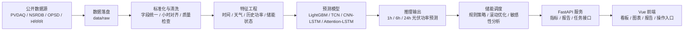

# New Energy Storage Dispatch System

## 当前阅读入口

建议先阅读：

1. `docs/current/START_HERE.md`
2. `docs/current/CURRENT_EVIDENCE.md`
3. `docs/current/CODE_READING_MAP.md`

历史报告和旧实验材料已归档到 `reports/archive/` 与 `docs/archive/`。

面向“光伏功率预测 + 储能优化调度 + 可视化展示”的新能源侧原型系统。项目以公开数据和仿真数据为基础，构建从数据采集、清洗、特征工程、机器学习预测、深度学习对比、储能调度仿真到前后端展示的完整闭环。

当前代码已经覆盖后端数据流水线、预测模型训练与推理、储能策略评估、治理分析接口，以及 Vue 3 前端展示界面。项目定位不是单一模型脚本，而是一套可复现、可扩展、可演示的毕业设计/工程原型。

## 核心能力

| 模块 | 已实现内容 | 主要入口 |
|---|---|---|
| 数据采集 | PVDAQ、NSRDB、OPSD、Open-Meteo、HRRR 等公开数据链路配置与准备 | `new_energy_sys.cli.bootstrap_data` |
| 数据治理 | 字段标准化、小时级对齐、缺失值处理、异常值检查、质量报告 | `clean_data.py`、`standardize.py` |
| 特征工程 | 时间特征、天气特征、历史功率特征、储能调度特征、多步预测标签 | `build_features.py`、`features.py` |
| 预测模型 | LightGBM、XGBoost、CatBoost、TCN、CNN-LSTM、Attention-LSTM 对比 | `train_baseline.py`、`train_tcn.py`、`run_stage14_deep_learning.py` |
| 推理链路 | 主模型批量推理、预测结果导出、物理边界裁剪 | `run_stage9_inference.py` |
| 储能调度 | 单次调度、策略敏感性、滚动优化、配置敏感性分析 | `run_stage10_dispatch.py` 至 `run_stage15_sensitivity.py` |
| API 服务 | 鉴权、模型指标、预测结果、调度指标、报告读取、任务触发 | `backend/app/main.py` |
| 前端界面 | 总览大屏、模型对比、调度仿真、数据探索、报告查看、登录鉴权 | `frontend/` |

## 系统架构



Pitfall：公开数据源的时间戳、时区和预测可用时间不同，不能把实测天气、事后天气和日前预测天气混用，否则会产生时间泄漏。

## 技术栈

| 层级 | 技术 |
|---|---|
| 后端语言 | Python 3.11+ |
| 数据处理 | pandas、numpy、pyarrow |
| 机器学习 | LightGBM、scikit-learn、XGBoost、CatBoost |
| 深度学习 | PyTorch |
| API | FastAPI |
| 前端 | Vue 3、Vite、Element Plus、ECharts、Playwright |
| 数据格式 | JSON、CSV、Parquet、Markdown 报告 |

Pitfall: `requirements.txt` now includes the FastAPI runtime and database display dependencies. Use `requirements-dev.txt` only for local validation tools such as pytest and httpx; frontend dependencies remain under `frontend/package.json`.

## 目录结构

| 路径 | 说明 |
|---|---|
| `configs/` | 数据源、站点、天气、储能参数和实验配置 |
| `backend/` | FastAPI 后端服务层，包含鉴权、接口编排、数据读取和任务触发 |
| `src/new_energy_sys/` | 后端核心包，包含数据处理、建模、调度和 CLI |
| `src/new_energy_sys/cli/` | 各阶段命令行入口 |
| `src/new_energy_sys/api/` | 旧 API 兼容导入层，新代码应使用 `backend/` |
| `frontend/` | Vue 3 前端工程 |
| `reports/` | 阶段报告、图表和实验输出索引 |
| `docs/` | 项目计划、前端交接文档、参考论文和报告索引 |
| `scripts/` | 报告生成、API smoke 测试等辅助脚本 |
| `data/raw/` | 原始数据缓存目录，不纳入 Git |
| `data/processed/` | 处理后数据、模型和实验产物，不纳入 Git |

Pitfall：`data/raw/` 和 `data/processed/` 默认被 `.gitignore` 排除；克隆仓库后需要重新运行数据流水线生成本地实验产物。

## 快速开始

### 1. 后端环境

```powershell
python -m venv .venv
.\.venv\Scripts\Activate.ps1
python -m pip install --upgrade pip
pip install -r requirements.txt
pip install -e .

# Optional: install validation dependencies for API smoke tests and DB repository tests.
pip install -r requirements-dev.txt
```

Pitfall：Windows PowerShell 如果禁止激活虚拟环境，需要先调整执行策略，或直接使用 `.venv\Scripts\python.exe -m ...` 执行命令。

### 2. 前端环境

```powershell
cd frontend
npm install
npm run build
```

本地开发：

```powershell
npm run dev
```

默认访问地址为 `http://127.0.0.1:3060`。不要使用 `http://localhost:3060`，Windows 环境下 `localhost` 可能解析到 IPv6 `::1`，导致 Vite 已启动但浏览器仍报 `ERR_CONNECTION_REFUSED`。如启动失败，先查看 `docs/startup_troubleshooting.md`。

Pitfall：前端默认访问 `/api`，开发时需要同时启动后端；本机 Windows 可能保留 `3000` 端口，直接绑定会报 `listen EACCES`。

## 数据与建模流水线

推荐使用 PVDAQ + NSRDB 主实验配置：

```powershell
$env:NREL_API_KEY="your_nrel_api_key"
$env:NREL_API_EMAIL="your_email@example.com"
$env:PYTHONPATH="src;."

python -m new_energy_sys.cli.bootstrap_data --config configs/data_sources.pvdaq_nsrdb_2020_2022.json
python -m new_energy_sys.cli.clean_data --config configs/data_sources.pvdaq_nsrdb_2020_2022.json --input data/processed/pvdaq_nsrdb_2020_2022/hourly_training_with_storage.parquet
python -m new_energy_sys.cli.build_features --config configs/data_sources.pvdaq_nsrdb_2020_2022.json --input data/processed/pvdaq_nsrdb_2020_2022/stage2_cleaned_hourly_dataset.parquet
```

训练 LightGBM 基线：

```powershell
python -m new_energy_sys.cli.train_baseline --config configs/data_sources.pvdaq_nsrdb_2020_2022.json --input data/processed/pvdaq_nsrdb_2020_2022/stage3_feature_dataset.parquet
```

运行主模型推理：

```powershell
python -m new_energy_sys.cli.run_stage9_inference --config configs/data_sources.pvdaq_nsrdb_2020_2022.json --input data/processed/pvdaq_nsrdb_2020_2022/stage3_feature_dataset.parquet
```

运行储能调度与后续分析：

```powershell
python -m new_energy_sys.cli.run_stage10_dispatch --config configs/data_sources.pvdaq_nsrdb_2020_2022.json --predictions data/processed/pvdaq_nsrdb_2020_2022/stage9_main_model_predictions.csv --feature-input data/processed/pvdaq_nsrdb_2020_2022/stage3_feature_dataset.parquet
python -m new_energy_sys.cli.run_stage12_rolling --config configs/data_sources.pvdaq_nsrdb_2020_2022.json --predictions data/processed/pvdaq_nsrdb_2020_2022/stage9_main_model_predictions.csv --feature-input data/processed/pvdaq_nsrdb_2020_2022/stage3_feature_dataset.parquet
python -m new_energy_sys.cli.run_stage13_governance --config configs/data_sources.pvdaq_nsrdb_2020_2022.json --dispatch-input data/processed/pvdaq_nsrdb_2020_2022/stage12_rolling_dispatch.csv --metrics-input data/processed/pvdaq_nsrdb_2020_2022/stage12_rolling_metrics.json
```

Pitfall：训练、推理和调度阶段依赖前一阶段输出文件；如果路径或配置的 `dataset_id` 不一致，会导致 API 和前端读取不到最新结果。

## API 服务

开发环境启动：

```powershell
$env:PYTHONPATH="src"
uvicorn backend.app.main:app --reload --host 127.0.0.1 --port 8000
```

主要接口：

| 接口 | 说明 |
|---|---|
| `POST /api/auth/login` | 登录并获取 JWT |
| `GET /api/config` | 读取前端配置摘要 |
| `GET /api/models/main` | 主模型指标 |
| `GET /api/predictions/main` | 主模型预测结果 |
| `GET /api/dispatch/metrics/{stage}` | 储能调度阶段指标 |
| `GET /api/governance/scorecard` | 治理评分卡 |
| `GET /api/sensitivity/metrics` | 储能配置敏感性指标 |
| `GET /api/reports/list` | 可读报告列表 |
| `POST /api/tasks/submit` | 提交后端任务 |

生产环境必须显式配置安全变量：

```powershell
$env:NES_APP_ENV="production"
$env:NES_JWT_SECRET="replace-with-a-strong-secret"
$env:NES_CORS_ORIGINS="https://your-frontend-domain.example"
$env:NES_USERS_JSON='{"admin":{"password_hash":"<sha256>","role":"admin"}}'
```

Pitfall：生产环境不能使用默认 JWT secret、默认用户或宽松 CORS，否则后端会拒绝启动或产生安全风险。

## 前端界面

前端位于 `frontend/`，包含以下页面：

| 页面 | 内容 |
|---|---|
| OverviewDashboard | 核心指标、预测曲线、运行概览 |
| ModelComparison | 表格模型和深度模型对比 |
| DispatchSimulation | 储能充放电、收益和约束表现 |
| GovernanceAnalysis | 策略治理、风险门槛和敏感性 |
| DataExplorer | 数据质量、特征字段、后端任务入口 |
| ReportViewer | 阶段报告 Markdown 查看 |
| Login | JWT 登录 |

常用命令：

```powershell
cd frontend
npm run dev
npm run build
npm run test
npm run test:e2e
```

Pitfall：E2E 测试依赖后端 API 和 Playwright 浏览器环境；只运行 `npm run test` 时执行的是静态检查，不等价于完整端到端验证。启动端口和常见故障见 `docs/startup_troubleshooting.md`。

## 配置说明

| 配置文件 | 用途 |
|---|---|
| `configs/data_sources.example.json` | 通用模板 |
| `configs/data_sources.pvdaq_nsrdb_2020_2022.json` | PVDAQ + NSRDB 主实验链路 |
| `configs/data_sources.pvdaq_nsrdb_2022_2023.json` | 后续年份扩展实验 |
| `configs/data_sources.nrel_opsd_weather.json` | NREL + OPSD + 天气特征实验 |
| `configs/data_sources.pvdaq_openmeteo_forecast.json` | Open-Meteo 预测天气实验 |
| `configs/data_sources.pvdaq_hrrr_strict_2022_01_f24.json` | HRRR 严格预测天气样例 |

Pitfall：配置文件中的 `api_key_env` 和 `email_env` 是环境变量名，不应把真实密钥写入 JSON 并提交到 Git。

## 文档与报告

| 路径 | 说明 |
|---|---|
| `PROGRESS.md` | 项目阶段进度和交接锚点 |
| `docs/project_plan.md` | 项目计划书 |
| `docs/frontend_production_handover.md` | 前端生产化整改记录 |
| `docs/reports_index.md` | 报告索引 |
| `reports/*.md` | 阶段实验报告 |
| `reports/figures/` | 实验图表 |

Pitfall：部分历史文档可能存在编码不一致问题，根 README 以当前代码结构和可执行入口为准。

## 当前阶段进度

- 已完成：数据采集、清洗、特征工程、LightGBM 基线、表格模型对比、深度学习对比、主模型推理、储能调度、滚动优化、治理分析、敏感性分析。
- 已完成：FastAPI 服务和 Vue 3 前端展示框架。
- 已完成：前端生产化基础整改，包括 API 错误归一化、JWT secret 生产校验、CORS 白名单、Markdown 清洗和静态检查。
- 下一阶段建议：统一修复历史文档编码，补充 API/前端一键启动脚本，完善 CI，固化最小可复现实验数据样例。

Pitfall：项目已经超过单脚本阶段，后续改动应优先保持“配置 -> 数据 -> 模型 -> 推理 -> 调度 -> API -> 前端”的链路一致性，避免只改某一层导致展示端失真。
