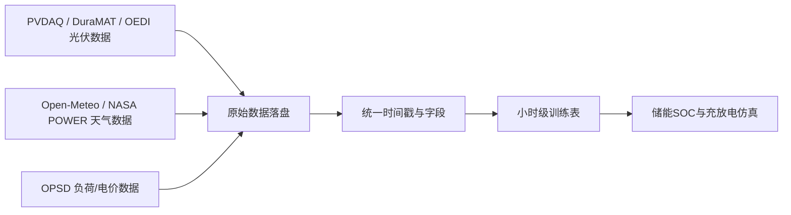

# New Energy Storage Dispatch System

## Documentation

| Path | Purpose |
|---|---|
| `PROGRESS.md` | 全局进度锚点和下一步任务 |
| `docs/project_plan.md` | 项目计划书 |
| `docs/reports_index.md` | 报告索引 |
| `docs/references/papers/` | 参考论文 |

## 第三阶段输出

含天气特征的主实验配置：

```powershell
python -m new_energy_sys.cli.bootstrap_data --config configs/data_sources.nrel_opsd_weather.json
python -m new_energy_sys.cli.clean_data --config configs/data_sources.nrel_opsd_weather.json --input data/processed/nrel_opsd_weather/hourly_training_with_storage.parquet
python -m new_energy_sys.cli.build_features --config configs/data_sources.nrel_opsd_weather.json --input data/processed/nrel_opsd_weather/stage2_cleaned_hourly_dataset.parquet
```

仅 DA/HA4 天气代理的旧配置仍可作为消融对照：

```powershell
python -m new_energy_sys.cli.build_features --config configs/data_sources.nrel_opsd.json --input data/processed/nrel_opsd/stage2_cleaned_hourly_dataset.parquet
```

生成文件：

| 文件 | 作用 |
|---|---|
| `data/processed/nrel_opsd/stage3_feature_dataset.parquet` | 第三阶段模型特征数据集 |
| `data/processed/nrel_opsd/stage3_feature_dataset_preview.csv` | 前 200 行预览 |
| `data/processed/nrel_opsd/stage3_feature_report.md` | 特征工程质量报告 |
| `data/processed/nrel_opsd/stage3_feature_report.json` | 机器可读质量指标 |

当前第三阶段输出样本数为 `8560`，总字段数为 `92`，其中派生特征 `76` 个。特征覆盖时间周期、天气代理、历史功率、储能调度四类，并额外生成 `1h`、`6h`、`24h` 多步预测标签。

含天气特征的主实验输出样本数为 `8560`，总字段数为 `145`，其中派生特征 `112` 个。天气字段包含 GHI、DNI、DHI、温度、湿度、露点、云量、风速、阵风、气压、降水和大气顶辐射等。

Pitfall：当前天气数据是按站点坐标和 UTC 时间对齐的外部气象补充数据，不能写成电站实测气象。

## 第四阶段输出

运行 LightGBM 基线训练命令：

```powershell
python -m new_energy_sys.cli.train_baseline --config configs/data_sources.nrel_opsd_weather.json --input data/processed/nrel_opsd_weather/stage3_feature_dataset.parquet
```

生成文件：

| 文件 | 作用 |
|---|---|
| `data/processed/nrel_opsd_weather/stage4_lightgbm_metrics.csv` | 验证集/测试集误差指标 |
| `data/processed/nrel_opsd_weather/stage4_lightgbm_predictions.csv` | 验证集/测试集预测结果 |
| `data/processed/nrel_opsd_weather/stage4_lightgbm_feature_importance.csv` | LightGBM 特征重要性 |
| `data/processed/nrel_opsd_weather/stage4_lightgbm_report.md` | 第四阶段建模报告 |
| `data/processed/nrel_opsd_weather/models/` | 9 个 LightGBM 模型包 |

当前训练 `3` 个预测 horizon（`1h`、`6h`、`24h`）和 `3` 个特征组（`forecast_time`、`weather_enhanced`、`full_features`），共 `9` 个模型。最佳测试结果：`1h` nRMSE `0.0480`，`6h` nRMSE `0.0954`，`24h` nRMSE `0.1076`。

Pitfall：LightGBM 是无约束回归器，单独加载模型推理时必须使用 `predict_with_bundle` 统一裁剪到物理边界，不能直接使用裸模型输出。

面向“光伏功率预测 + 储能调度仿真”的最小可运行工程骨架。

## 当前阶段

已进入第一阶段：数据采集、字段标准化、小时级对齐、储能仿真标签生成。



## 快速开始

```powershell
python -m venv .venv
.\.venv\Scripts\Activate.ps1
pip install -r requirements.txt
python -m new_energy_sys.cli.bootstrap_data --config configs/data_sources.nrel_opsd.json
python -m new_energy_sys.cli.clean_data --config configs/data_sources.nrel_opsd.json --input data/processed/nrel_opsd/hourly_training_with_storage.parquet
```

## 目录说明

| 路径 | 作用 |
|---|---|
| `configs/data_sources.example.json` | 数据源、站点、储能参数配置 |
| `configs/data_sources.nrel_opsd.json` | NREL太阳能集成数据 + OPSD主实验配置 |
| `src/new_energy_sys/data_sources.py` | 公开数据源下载器 |
| `src/new_energy_sys/standardize.py` | 字段标准化与时间对齐 |
| `src/new_energy_sys/cleaning.py` | 第二阶段数据清洗、异常处理、质量报告 |
| `src/new_energy_sys/storage.py` | 储能规则仿真 |
| `src/new_energy_sys/cli/bootstrap_data.py` | 第一阶段入口脚本 |
| `src/new_energy_sys/cli/clean_data.py` | 第二阶段清洗入口脚本 |
| `data/raw` | 原始数据缓存目录 |
| `data/processed` | 标准化输出目录 |

## 数据策略

主实验版不依赖人工下载。

- 光伏功率：当前主链路使用 NREL Solar Power Data for Integration Studies。
- PV预测特征：使用 NREL ZIP 内置 `DA` 与 `HA4` 功率预测文件。
- 负荷/电价：使用 OPSD 负荷/电价数据生成星期-小时画像，并映射到 NREL 2006 时间轴。
- 储能：使用规则仿真生成 SOC、充电、放电、收益字段。

Pitfall：PVDAQ 文件体积可能超过 100MB，首次下载慢；若网络环境不稳定，建议先改用较小样例数据跑通链路。

## 第二阶段输出

运行清洗命令后生成：

| 文件 | 作用 |
|---|---|
| `data/processed/stage2_cleaned_hourly_dataset.parquet` | 清洗后的小时级数据 |
| `data/processed/stage2_cleaned_hourly_dataset_preview.csv` | 前200行预览 |
| `data/processed/stage2_standardized_feature_dataset.parquet` | 带 `*_z` 标准化特征的数据 |
| `data/processed/stage2_quality_report.md` | 阶段质量报告 |
| `data/processed/stage2_quality_report.json` | 机器可读质量指标 |

当前主实验配置 `configs/data_sources.nrel_opsd.json` 清洗后样本数为 `8752`，目标小时覆盖率约为 `99.9%`，可作为后续特征工程和基线建模入口。
