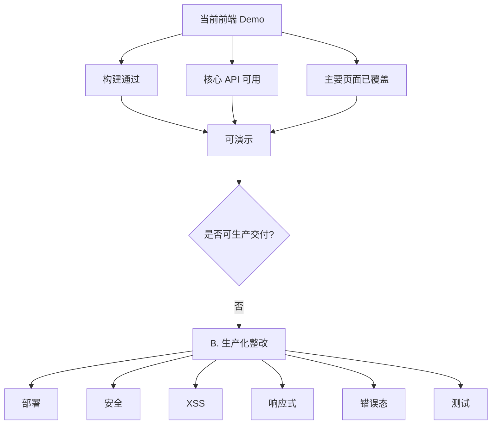
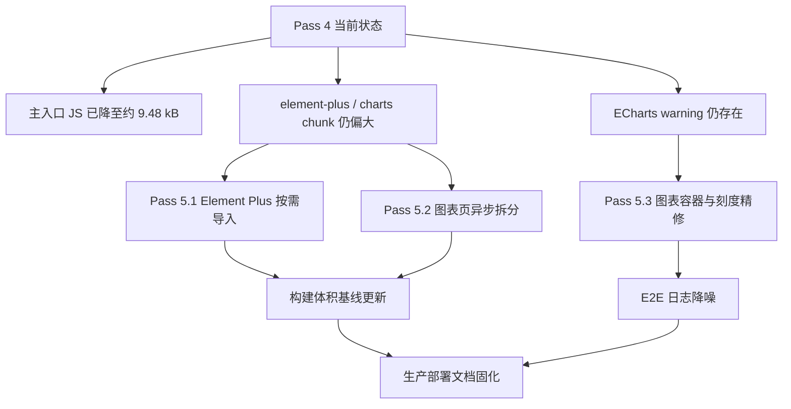

# 前端生产化整改交接锚点

## 阶段结论

当前 `frontend/` 已完成可演示的 Vue 3 + Vite 可视化平台，覆盖登录、系统总览、模型对比、调度仿真、策略治理、数据探索和报告浏览。验证结果如下：

- 前端构建：`npm run build` 通过，成功生成 `frontend/dist/`。
- 后端契约：登录、配置、模型、预测、治理、敏感性、特征、数据质量、任务、报告列表等 12 个关键接口返回 `200`。
- 阶段定位：满足桌面端 Demo 和答辩演示的基础要求，不满足生产可交付要求。

## 路线选择

| 方案 | 内容 | 优点 | 缺点 | 推荐 |
|---|---|---|---|---|
| A. Demo 固化 | 只修启动说明、API 地址和少量文案 | 成本最低，适合短期展示 | 安全、XSS、测试债务仍在 | 不推荐 |
| B. 生产化整改 | 修部署、安全、XSS、响应式、错误态、测试 | 交付风险最低，后续扩展基础稳定 | 需要集中处理工程质量 | 推荐 |
| C. 继续堆功能 | 新增图表、筛选、导出、更多页面 | 视觉内容更丰富 | 会放大已有架构和安全问题 | 不推荐 |

Pitfall: 如果跳过 B 直接做 C，部署和安全问题会在演示环境、答辩环境或服务器部署时集中暴露，修复成本高于现在。

## B. 生产化整改详细计划

### 1. 部署配置

- 将 `frontend/src/utils/api.js` 的默认 `baseURL` 从 `http://localhost:8000` 调整为相对路径 `/api`。
- 保留 `VITE_API_BASE` 覆盖能力，但仅作为显式部署配置使用。
- 补充 `frontend/.env.example`，至少包含：
  - `VITE_API_BASE=/api`
  - `VITE_APP_ENV=development`
- 检查 `frontend/vite.config.js`，确保开发环境 `/api` 代理仍指向 `http://localhost:8000`。
- 验证两种模式：
  - 开发：`npm run dev` 访问 `http://localhost:3000`，请求走 Vite proxy。
  - 生产：FastAPI 挂载 `frontend/dist/`，浏览器请求同源 `/api`。

Pitfall: 不能让生产包继续内置 `http://localhost:8000`，否则部署到服务器后会访问终端用户本机。

### 2. 安全

- 后端 `backend/app/auth.py`：
  - 生产环境必须设置 `NES_JWT_SECRET`，禁止继续使用默认 demo secret。
  - 将 demo 账号策略显式标记为开发/演示模式；生产模式下从环境变量或受控配置读取账号。
- 后端 `backend/app/main.py`：
  - 将 CORS `allow_origins=["*"]` 改为从环境变量读取白名单，例如 `NES_CORS_ORIGINS`。
  - 生产环境禁止 `allow_credentials=True` 与通配 origin 同时存在。
- 前端 `Login.vue`：
  - 移除页面明文显示 `admin/admin123`、`guest/guest123`。
  - 登录失败时显示统一错误，不暴露后端内部细节。
- 文档补充 demo 与 production 启动差异。

Pitfall: 只改前端隐藏账号不等于安全；默认 secret、默认用户和宽 CORS 必须一起收敛。

### 3. Markdown XSS

- 为报告渲染引入 HTML 清洗库，推荐 `dompurify`。
- `ReportViewer.vue` 中将 `marked(mdContent)` 的结果先经过 sanitize，再传给 `v-html`。
- 默认禁止危险标签和属性：
  - 禁止 `script`、`iframe`、`object`、`embed`。
  - 禁止 `on*` 事件属性。
  - 限制 `href/src` 协议为安全协议。
- 增加最小回归用例，覆盖：
  - `` 不执行且不渲染。
  - `` 事件属性被移除。
  - 普通标题、表格、代码块、引用正常渲染。

Pitfall: `marked` 负责 Markdown 转 HTML，不负责安全清洗；只靠“报告来自本地文件”不能作为长期安全边界。

### 4. 响应式

- 为全局布局增加断点：
  - `>= 1200px`：保持当前桌面大屏布局。
  - `768px - 1199px`：侧边栏压缩，图表从两列变一列。
  - `< 768px`：侧边栏改为顶部/抽屉式导航，KPI 卡片单列或双列。
- 重点修复页面：
  - `App.vue`：侧边栏、Header、内容区间距。
  - `OverviewDashboard.vue`：KPI 四列、主图 + 侧栏布局。
  - `ModelComparison.vue` / `DispatchSimulation.vue` / `GovernanceAnalysis.vue`：图表两列布局。
  - `DataExplorer.vue`：质量卡片四列与任务卡片。
  - `ReportViewer.vue`：左侧阶段列表和报告正文。
  - `Login.vue`：登录卡片宽度、边距和小屏高度。
- 图表容器使用稳定高度和 `min-width: 0`，避免 ECharts 在 grid/flex 下溢出。

Pitfall: 只加 `overflow-x: auto` 是兜底，不是响应式；核心信息布局必须在窄屏下重新编排。

### 5. 错误态与用户反馈

- 在 `frontend/src/utils/api.js` 增加统一错误归一化函数，输出稳定结构：
  - `status`
  - `message`
  - `requestId` 可选
  - `isAuthError`
- 各页面补齐 4 种状态：
  - `loading`
  - `error`
  - `empty`
  - `ready`
- 页面级错误展示要求：
  - 数据加载失败显示可读原因和“重试”按钮。
  - 空数据明确说明当前模块没有可展示数据。
  - 任务提交失败显示权限或命令错误，不只写 `console.error`。
- 401 继续清理 token 并跳转登录页；403 显示权限不足，不应表现为通用失败。

Pitfall: 只在 Axios interceptor 中统一弹窗会导致页面状态混乱；页面仍需要持有自己的 loading/error/empty 状态。

### 6. 测试与验收

- `frontend/package.json` 增加脚本：
  - `lint`
  - `test`
  - `test:e2e`
  - `check`
- 推荐测试组合：
  - ESLint：基础静态检查。
  - Vitest：工具函数、Markdown sanitize、API 错误归一化。
  - Playwright：登录、路由跳转、关键图表可见、报告页渲染、移动端布局 smoke。
- 后端增加 API smoke 脚本或测试：
  - 登录成功。
  - 未授权访问返回 401。
  - 关键只读接口返回非空或合理空值。
  - guest 提交任务返回 403。
- 验收命令：
  - `npm run build`
  - `npm run check`
  - `$env:PYTHONPATH='src;.'; python -m py_compile backend\app\main.py backend\app\auth.py backend\app\data_loader.py backend\app\tasks.py`

Pitfall: 当前只有构建验证，无法覆盖 XSS、权限、移动端和接口错误；没有测试就不能判断整改是否回归。

## 交接验收标准

- 生产构建中不再出现硬编码 `http://localhost:8000`。
- 生产模式缺少 `NES_JWT_SECRET` 时后端启动失败或明确拒绝使用默认 secret。
- CORS origin 可配置，生产模式不使用 `*`。
- Markdown 报告渲染经过 sanitize，并有 XSS 回归测试。
- 主要页面在桌面、平板、手机宽度下无关键内容遮挡或横向溢出。
- API 失败时页面显示错误态和重试入口。
- `npm run build`、前端检查脚本、后端 API smoke 均通过。

Pitfall: 验收必须同时看代码、构建、运行态和浏览器截图；只看 `npm run build` 通过不足以判定生产化完成。

## Frontend-B 推进记录 - 2026-04-26

### 已完成

- 部署配置：
  - `frontend/src/utils/api.js` 默认 `baseURL` 已改为 `/api`，保留 `VITE_API_BASE` 显式覆盖能力。
  - 新增 `frontend/.env.example`，包含 `VITE_API_BASE=/api` 和 `VITE_APP_ENV=development`。
  - API 客户端兼容既有 `/api/...` 调用，避免生产请求生成双重 API 路径。
- 安全：
  - `backend/app/auth.py` 在生产环境强制要求非默认 `NES_JWT_SECRET`。
  - 生产环境强制要求 `NES_USERS_JSON`，开发/答辩模式才允许 demo 用户。
  - `backend/app/main.py` 从 `NES_CORS_ORIGINS` 读取 CORS 白名单，生产环境禁止 `*`。
  - `Login.vue` 移除页面明文账号密码提示，并将登录失败归一为稳定错误文案。
- Markdown XSS：
  - 新增 `frontend/src/utils/markdown.js`，执行 `marked.parse()` 后通过 `DOMPurify.sanitize()` 清洗再进入 `v-html`。
  - 禁止 `script/iframe/object/embed` 等危险标签，并限制危险属性。
- 响应式：
  - `App.vue`、`Login.vue`、`OverviewDashboard.vue`、`ModelComparison.vue`、`DispatchSimulation.vue`、`GovernanceAnalysis.vue`、`DataExplorer.vue`、`ReportViewer.vue` 已补充 tablet/mobile 断点。
- 检查与 smoke：
  - 新增 `frontend/scripts/static-check.mjs`，覆盖硬编码 localhost、Markdown sanitize、API 错误归一化等静态门禁。
  - 新增 `scripts/api_smoke_frontend_contract.py`，覆盖未授权 401、登录成功、关键接口 200、guest 提交任务 403。

### 已验证

- `cd frontend; npm run lint`
- `cd frontend; npm run check`
- `cd frontend; npm run build`
- `$env:PYTHONPATH='src;.'; python -m py_compile backend\app\main.py backend\app\auth.py backend\app\data_loader.py backend\app\tasks.py`
- `$env:PYTHONPATH='src'; python scripts\api_smoke_frontend_contract.py`
- 生产环境负向验证：
  - 缺少非默认 `NES_JWT_SECRET` 时，`backend.app.auth` 拒绝导入。
  - 缺少 `NES_USERS_JSON` 时，生产认证模块拒绝导入。
  - `NES_CORS_ORIGINS='*'` 时，生产 API 入口拒绝导入。
- 生产构建与源码检查未发现 `http://localhost:8000` 或双重 API 路径。

### 剩余项

- 尚未接入真实浏览器截图验收；移动端布局目前为 CSS 断点级整改，仍需浏览器运行态 smoke。
- 页面级 loading/error/empty/retry 只完成 API 客户端归一化、登录页和报告页重点整改，其他图表页仍需补齐完整错误态。
- Playwright E2E 未配置，不能把当前检查视为完整端到端测试。

Pitfall: 本轮已处理最高风险安全边界，但“可生产交付”仍需要浏览器截图、移动端交互和页面级错误态闭环；不要仅凭构建通过宣布 Frontend-B 全部完成。

## Frontend-B Pass 2 推进记录 - 2026-04-26

### 已完成

- 页面级状态：
  - 新增 `frontend/src/components/PageState.vue`，统一承载 `loading/error/empty/retry`。
  - `OverviewDashboard.vue`、`ModelComparison.vue`、`DispatchSimulation.vue`、`GovernanceAnalysis.vue`、`DataExplorer.vue` 已接入可见错误态、空态和重试入口。
  - `DataExplorer.vue` 的任务提交失败从 `console.error` 改为页面可见错误提示，能区分 403 等权限失败。
- 静态门禁：
  - `frontend/scripts/static-check.mjs` 新增核心图表页 `PageState` 和 `@retry` 检查，防止后续回退到只写控制台错误。
- 运行态验收：
  - 使用 in-app browser 访问 `http://localhost:3000`，完成登录、总览、模型对比、调度仿真、策略治理、数据探索、报告浏览路由 smoke。
  - 当前浏览器视口触发 `< 768px` 移动端断点；核心路由均可见，控制台无 error。
  - 报告页移动端左侧阶段列表长文本已改为省略，不再撑出阶段列表横向滚动。

### 已验证

- `cd frontend; npm run lint`
- `cd frontend; npm run build`
- `$env:PYTHONPATH='src'; python scripts\api_smoke_frontend_contract.py`
- 浏览器 smoke：
  - `#/` 可见 `PV 功率预测 vs 实际`
  - `#/models` 可见 `模型排行榜 Model Leaderboard`
  - `#/dispatch` 可见 `策略评分对比`
  - `#/governance` 可见 `储能配置 Pareto 分析`
  - `#/data` 可见 `特征重要性 Top 20`
  - `#/reports` 可见 `实验阶段 Stages`
  - 控制台 error 数量为 `0`

### 剩余项

- 尚未沉淀 Playwright E2E 脚本；当前浏览器 smoke 是人工/工具执行结果，不是 CI 可复用产物。
- 构建仍提示大 chunk warning，主要来自 ECharts/Element Plus；不阻塞生产化安全边界，但后续可做路由级 code-splitting 优化。
- 报告正文中的超长代码块和表格仍保留局部横向滚动，这是技术报告内容的合理兜底，不再让整页布局横向溢出。

Pitfall: 页面状态已闭环到主要图表页，但 E2E 尚未自动化；后续若进入交付验收，应优先把本轮浏览器 smoke 固化为 Playwright，而不是继续靠人工截图。

## Frontend-B Pass 3 推进记录 - 2026-04-26

### 已完成
- E2E 自动化：
  - 新增 `frontend/playwright.config.js`，统一管理本地后端 `uvicorn` 与 Vite dev server 启动。
  - 新增 `frontend/tests/e2e/frontend.spec.js`，覆盖登录、核心路由、移动端横向溢出、Markdown 报告 XSS 净化、guest 提交任务 403 可见错误。
  - `frontend/package.json` 新增 `test:e2e` 脚本，`@playwright/test` 已加入 devDependencies。
- 本机浏览器复用：
  - 配置优先读取 `NES_E2E_BROWSER_PATH`。
  - 未设置环境变量时自动使用系统 Chrome/Edge，例如 `C:\Program Files\Google\Chrome\Application\chrome.exe`。
  - 避免强制下载 Playwright-managed Chromium，适配当前 Windows 本地环境。
- 静态门禁：
  - `frontend/scripts/static-check.mjs` 新增 `test:e2e`、Playwright webServer、XSS Probe、guest 权限失败覆盖检查。
  - `.gitignore` 新增 `playwright-report` 与 `test-results`，避免测试产物污染仓库。

### 已验证
- `cd frontend; npm run lint`
- `cd frontend; npm run build`
- `cd frontend; npm run test:e2e`
- E2E 结果：`4 passed`，项目名 `system-chromium`，使用本机 Chrome。

### 剩余项
- `npm run build` 仍提示大 chunk warning，主要来自 ECharts/Element Plus；这是性能优化项，不阻塞当前 Frontend-B 生产硬化验收。
- `npm run check` 仍保持为静态门禁；当前 Windows 沙箱下把 Vite build 串进 `check` 曾触发 `spawn EPERM`，构建验收继续单独执行 `npm run build`。

Pitfall: E2E 已完成主链路自动化，但本机默认依赖已安装的 Chrome/Edge；如果迁移到 CI 或新机器，必须安装浏览器或设置 `NES_E2E_BROWSER_PATH`，否则会回到浏览器二进制缺失问题。

## Frontend-B Pass 4 推进记录 - 2026-04-26

### 已完成
- 性能拆包：
  - `frontend/vite.config.js` 新增生产 `manualChunks`，将 `vue-vendor`、`element-plus`、`charts`、`markdown`、`vendor` 从应用入口拆出。
  - `frontend/src/main.js` 移除全量 `@element-plus/icons-vue` 注册，改为显式图标白名单，避免后续无意引入全部图标。
  - `npm run build` 串接 `frontend/scripts/check-build-artifacts.mjs`，构建后检查独立 chunk 和主入口体积上限。
- UI 与代码结构：
  - 新增 `MetricCard`、`MetricGrid`、`ChartCard`、`PageSection`，收敛 KPI、图表卡片和内容区重复 CSS。
  - 系统总览、模型评估、策略收益、配置治理、任务运维页面已切到共享组件。
- 数据与图表层：
  - 新增页面级 service：`overviewService`、`modelService`、`dispatchService`、`governanceService`、`dataExplorerService`、`reportService`。
  - 新增图表 option 纯函数模块：`overviewCharts`、`modelCharts`、`dispatchCharts`、`governanceCharts`、`dataExplorerCharts`，页面只负责状态和交互。
  - `DataExplorer.vue` 的任务轮询增加卸载清理，避免离开页面后 interval 残留。
- 产品信息架构：
  - 导航从偏技术阶段的“系统总览/模型对比/调度仿真/策略治理/数据探索/实验报告”调整为更接近用户工作流的“预测监控/模型评估/策略收益/配置治理/任务运维/报告归档”。

### 已验证
- `cd frontend; npm run lint`
- `cd frontend; npm run build`
  - 主入口 JS 从上一轮约 `1,388.76 kB` 降至约 `9.48 kB`。
  - `charts` chunk 约 `697.56 kB`，`element-plus` chunk 约 `889.56 kB`，`markdown` chunk 约 `63.70 kB`，`vue-vendor` chunk 约 `24.85 kB`。
  - 构建后包体门禁通过：`frontend build artifact checks passed`。
- `cd frontend; npm run test:e2e`
  - Playwright `4 passed`，继续使用本机 Chrome/Edge，不下载 Playwright-managed Chromium。
- `$env:PYTHONPATH='src'; python scripts\api_smoke_frontend_contract.py`

### 剩余项
- E2E 运行日志仍出现 ECharts warning：
  - ticks 可读性 warning，来自雷达图固定最大值范围。
  - DOM width/height warning，通常出现在路由切换和图表销毁/重建边界。
- Element Plus CSS 仍较大，属于组件库基础样式成本；若继续压缩，需要进入按需组件导入或局部样式引入，但改动面明显大于本轮。

Pitfall: 本轮已解决首屏 JS 主包过大的核心问题，但 `element-plus` 和 `charts` 独立 chunk 仍然很重；后续不要简单提高阈值掩盖体积问题，若要继续优化，应改为 Element Plus 组件按需导入和图表页更细粒度异步加载。

## Frontend-B Pass 5 下一步优化计划 - 2026-04-26

### 阶段目标

Pass 5 不新增业务页面，不更换前端技术栈，目标是把 Pass 4 遗留的性能和运行时稳定性问题收敛到可验收状态：

- 降低 `element-plus` 与 `charts` 独立 chunk 的长期维护风险。
- 清理 E2E 日志中的 ECharts warning，避免把真实图表故障淹没在已知噪声里。
- 固化前端生产部署说明，确保新机器、CI 或服务器部署时能复现当前验收链路。

### 优先级 1：Element Plus 按需组件导入

- 目标：从全量 `app.use(ElementPlus)` 逐步改为显式注册项目实际使用的组件与服务，减少 JS/CSS 基础成本。
- 建议做法：
  - 先用 `rg "El[A-Z]|<el-" frontend/src` 统计实际使用组件。
  - 建立 Element Plus 组件白名单模块，集中注册 `ElButton`、`ElTable`、`ElSelect`、`ElForm`、`ElMessage` 等实际依赖。
  - 样式按 Element Plus 推荐方式引入，优先保证样式完整，再逐步压缩。
  - 静态检查增加“禁止重新引入全量 Element Plus”的门禁。
- 验收标准：
  - 登录、导航、表格、选择器、表单、消息提示、任务提交错误提示样式不退化。
  - `element-plus` chunk 或 CSS 体积相对 Pass 4 基线有明确下降，或文档说明无法下降的具体原因。

Pitfall: Element Plus 按需导入最容易漏掉服务型 API 或样式依赖，例如 `ElMessage`、弹窗层、表格空态样式；不能只看页面首屏，要跑完整 E2E。

### 优先级 2：图表页更细粒度异步加载

- 目标：把 ECharts 重依赖限制在实际访问图表页面时加载，避免所有页面共享同一个过重 `charts` chunk。
- 建议做法：
  - 保留现有 `charts/*Charts.js` 纯函数结构，不把 option 逻辑重新塞回 view。
  - 对图表重页面使用路由级懒加载或页面内异步图表组件。
  - 评估 `vue-echarts` 是否能在 `ChartCard` 或单独 `AsyncChart` 组件中延迟加载。
  - 构建产物继续保留 `charts` 独立拆包门禁，但允许进一步拆成多个图表业务 chunk。
- 验收标准：
  - 主入口 JS 不回升。
  - `charts` 总体加载成本可解释，首屏不主动拉取无关图表页代码。
  - 访问预测监控、模型评估、策略收益、配置治理、任务运维页面时图表渲染正常。

Pitfall: 图表异步加载如果只做 `defineAsyncComponent`，但上层仍静态导入 ECharts option 或 `vue-echarts`，实际包体不会下降；必须检查构建产物确认拆分生效。

### 优先级 3：ECharts warning 精修

- 目标：消除或显著减少 E2E 日志中的已知 ECharts warning。
- 处理点：
  - 雷达图刻度 warning：调整固定 `max`、`splitNumber`、`axisLabel` 或指标归一化策略，避免 `0 - 1.5` 范围下刻度不可读。
  - 容器尺寸 warning：给图表容器稳定高度、`min-width: 0` 和可见后初始化机制，避免路由切换时在 `0 x 0` 容器内初始化。
  - 生命周期边界：路由离开、条件渲染和数据刷新时明确处理 resize/dispose 时机。
- 验收标准：
  - `npm run test:e2e` 通过。
  - E2E 控制台日志中 ECharts warning 明显减少；若仍有保留项，必须写明触发页面、原因和后续处理方式。

Pitfall: 不能为了消除 warning 直接隐藏 console 输出；warning 是图表运行质量信号，必须从 option、容器尺寸或生命周期上修复。

### 优先级 4：生产部署文档固化

- 目标：把当前前端生产化运行方式写成可复现部署说明。
- 文档内容：
  - `VITE_API_BASE=/api` 与后端同源部署约定。
  - `NES_JWT_SECRET`、`NES_USERS_JSON`、`NES_CORS_ORIGINS` 的生产要求。
  - 反向代理示例边界：静态资源交给前端构建产物，`/api` 转发给 FastAPI。
  - E2E 运行要求：优先设置 `NES_E2E_BROWSER_PATH`，使用系统 Chrome/Edge，不执行 `npx playwright install chromium`。
  - 回滚检查：若包体优化导致样式缺失，先回退按需导入，不回退安全、XSS、CORS、JWT 门禁。
- 验收标准：
  - 新机器按文档能完成 `npm run build`、`npm run test:e2e` 和 API smoke。
  - 文档明确开发、生产、E2E 三类环境差异。

Pitfall: 部署文档不能只写命令，还要写失败时检查顺序；否则浏览器路径、CORS、JWT secret 和反向代理路径问题会被误判为前端代码故障。

### Pass 5 验收命令

- `cd frontend; npm run lint`
- `cd frontend; npm run build`
- `cd frontend; npm run test:e2e`
- `$env:PYTHONPATH='src'; python scripts\api_smoke_frontend_contract.py`

验收记录必须包含：

- `index-*.js`、`element-plus-*`、`charts-*` 的新体积，并与 Pass 4 基线对比。
- ECharts warning 是否消失或减少。
- 是否继续使用系统 Chrome/Edge，确认未安装 Playwright-managed Chromium。

Pitfall: Pass 5 的目标是“可维护地减包和降噪”，不是追求单次构建数字好看；任何为了减包导致 UI 组件行为退化的改动都不应进入交付。
