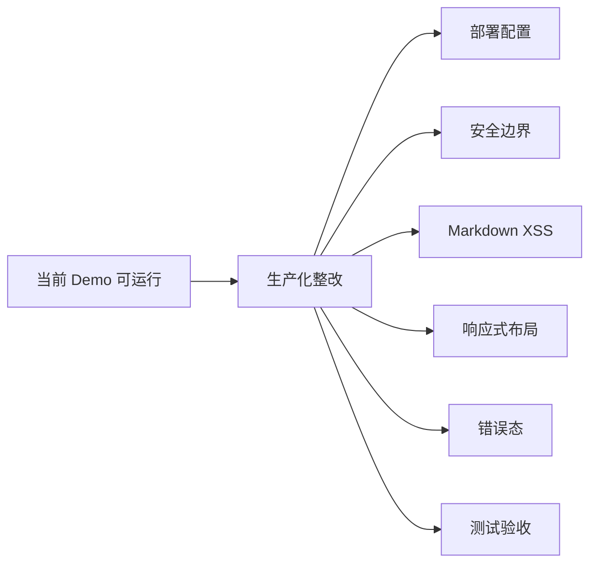

# 新能源储能调度可视化平台 — 完成报告

## 构建概要

从零为 `C:\Project\New_Energy_Sys` 纯 Python/CLI 算法研究项目构建了一个完整的可视化前端平台。

### 技术栈
| 层 | 技术 |
|---|---|
| 后端 API | FastAPI + uvicorn |
| 前端 | Vite + Vue 3 + Composition API |
| UI 组件 | 自定义 CSS + Element Plus |
| 图表 | ECharts 5 + vue-echarts |
| 认证 | JWT (HMAC-SHA256) |
| 设计语言 | 深色科技风 + Glassmorphism |

---

## 截图展示

### 登录页


### 系统总览大屏


### 调度仿真 / 策略治理


---

## 新增文件

### 后端 (4 files)
| File | Purpose |
|---|---|
| [\_\_init\_\_.py](file:///c:/Project/New_Energy_Sys/src/new_energy_sys/api/__init__.py) | API 包入口 |
| [data_loader.py](file:///c:/Project/New_Energy_Sys/src/new_energy_sys/api/data_loader.py) | CSV/JSON/Parquet 只读数据加载器 + 缓存 |
| [auth.py](file:///c:/Project/New_Energy_Sys/src/new_energy_sys/api/auth.py) | JWT 认证 (admin / guest) |
| [tasks.py](file:///c:/Project/New_Energy_Sys/src/new_energy_sys/api/tasks.py) | CLI 命令异步任务触发器 |
| [main.py](file:///c:/Project/New_Energy_Sys/backend/app/main.py) | FastAPI 入口 + 所有 API 端点 |

### 前端 (15 files)
| File | Purpose |
|---|---|
| [variables.css](file:///c:/Project/New_Energy_Sys/frontend/src/styles/variables.css) | 设计系统 CSS Token |
| [global.css](file:///c:/Project/New_Energy_Sys/frontend/src/styles/global.css) | 全局样式 + 动画 + Element Plus 深色覆写 |
| [echarts-theme.js](file:///c:/Project/New_Energy_Sys/frontend/src/utils/echarts-theme.js) | ECharts 暗色科技风主题 |
| [api.js](file:///c:/Project/New_Energy_Sys/frontend/src/utils/api.js) | Axios 封装 + JWT 拦截器 |
| [router/index.js](file:///c:/Project/New_Energy_Sys/frontend/src/router/index.js) | Vue Router + 路由守卫 |
| [main.js](file:///c:/Project/New_Energy_Sys/frontend/src/main.js) | 应用入口 |
| [App.vue](file:///c:/Project/New_Energy_Sys/frontend/src/App.vue) | 主布局 (侧边栏 + Header) |
| [Login.vue](file:///c:/Project/New_Energy_Sys/frontend/src/views/Login.vue) | 登录页 |
| [OverviewDashboard.vue](file:///c:/Project/New_Energy_Sys/frontend/src/views/OverviewDashboard.vue) | 系统总览大屏 |
| [ModelComparison.vue](file:///c:/Project/New_Energy_Sys/frontend/src/views/ModelComparison.vue) | 模型对比 (排行榜 + 雷达 + 柱状图) |
| [DispatchSimulation.vue](file:///c:/Project/New_Energy_Sys/frontend/src/views/DispatchSimulation.vue) | 调度仿真 (策略卡片 + 评分) |
| [GovernanceAnalysis.vue](file:///c:/Project/New_Energy_Sys/frontend/src/views/GovernanceAnalysis.vue) | 敏感性分析 (Pareto + 热力图) |
| [DataExplorer.vue](file:///c:/Project/New_Energy_Sys/frontend/src/views/DataExplorer.vue) | 数据探索 + 任务触发器 |
| [ReportViewer.vue](file:///c:/Project/New_Energy_Sys/frontend/src/views/ReportViewer.vue) | 实验报告浏览器 |

---

## API 验证结果

All 7 core endpoints tested and returning correct data:

| Endpoint | Status | Items |
|---|---|---|
| `/api/config` | ✅ 200 | 5 keys |
| `/api/models/tabular` | ✅ 200 | 28 metrics |
| `/api/models/deep-learning` | ✅ 200 | 18 metrics |
| `/api/governance/scorecard` | ✅ 200 | 4 strategies |
| `/api/sensitivity/metrics` | ✅ 200 | 27 configs |
| `/api/features/importance` | ✅ 200 | 30 features |
| `/api/reports/list` | ✅ 200 | 15 stages |

---

## 启动方式

```powershell
# 终端 1: 启动后端
cd C:\Project\New_Energy_Sys
$env:PYTHONPATH = "C:\Project\New_Energy_Sys\src;C:\Project\New_Energy_Sys"
python -m uvicorn backend.app.main:app --port 8000

# 终端 2: 启动前端
cd C:\Project\New_Energy_Sys\frontend
npm run dev
```

然后访问 http://localhost:3000，使用 admin / admin123 登录。
## 阶段复盘与下一阶段交接

### 完成情况

本阶段前端已经达到可演示状态：`frontend/` 提供 Vue 3 + Vite 应用，覆盖登录、总览、模型对比、调度仿真、策略治理、数据探索和报告浏览；`npm run build` 已通过；后端登录与 12 个关键 API 契约抽检通过。

阶段完成度评判：Demo 目标完成，生产交付目标未完成。当前主要风险不是功能覆盖，而是部署、安全、XSS、响应式、错误态和测试体系。

### 下一阶段路线

推荐路线：`B. 生产化整改`。详细交接锚点见 `docs/frontend_production_handover.md`。

| 路线 | 目标 | 结论 |
|---|---|---|
| A. Demo 固化 | 少量修补启动和说明 | 只能服务短期演示 |
| B. 生产化整改 | 修部署、安全、XSS、响应式、错误态、测试 | 推荐作为下一阶段 |
| C. 继续堆功能 | 增加更多图表和交互 | 暂缓，风险会放大 |



Pitfall: 不能把“构建通过”误判为“生产可交付”；当前生产化阻塞点集中在运行环境和安全边界。
