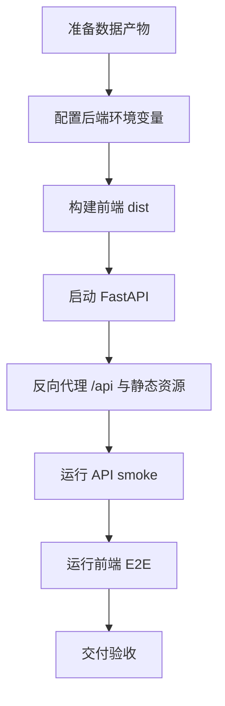

# 生产部署与验收指南

## 1. 文档目标

本文用于把当前系统从本地 Demo 固化为可部署、可验收、可排障的原型系统。覆盖内容包括 Python 后端、Vue 前端、安全环境变量、反向代理、E2E 测试和常见故障排查。



Pitfall: 部署文档不能只写启动命令，必须同时写安全变量、验证命令和失败时的检查顺序。

## 2. 部署前置条件

| 项目 | 要求 |
|---|---|
| 操作系统 | Windows 本地可运行；服务器建议 Linux 或 Windows Server |
| Python | 项目要求 Python `>=3.11`；当前可用解释器建议显式使用 `C:\Users\86155\anaconda3\python.exe` |
| Node.js | 需要支持当前 Vite 8 / Vue 3 前端依赖 |
| 浏览器 | E2E 默认使用系统 Chrome 或 Edge，也可通过 `NES_E2E_BROWSER_PATH` 指定 |
| 数据产物 | 至少需要 `data/processed/pvdaq_nsrdb_2020_2022/` 下 Stage3、Stage9、Stage13、Stage15 等产物 |

推荐先确认核心文件存在：

```powershell
Test-Path data\processed\pvdaq_nsrdb_2020_2022\stage3_feature_dataset.parquet
Test-Path data\processed\pvdaq_nsrdb_2020_2022\stage9_main_model_predictions.csv
Test-Path data\processed\pvdaq_nsrdb_2020_2022\stage15_storage_configuration_sensitivity_metrics.csv
```

Pitfall: 新机器克隆仓库后通常没有完整 `data/processed` 产物，必须先复现实验或拷贝受控产物目录。

## 3. 后端环境变量

开发模式允许使用 demo 用户，但仍建议显式设置环境变量：

```powershell
$env:PYTHONPATH="src"
$env:NES_APP_ENV="development"
```

生产模式必须设置以下变量：

```powershell
$env:PYTHONPATH="src"
$env:NES_APP_ENV="production"
$env:NES_JWT_SECRET="replace-with-a-long-random-secret"
$env:NES_CORS_ORIGINS="https://your-frontend.example.com"
$env:NES_USERS_JSON='{"admin":{"password_hash":"<sha256-password-hash>","role":"admin"}}'
```

| 变量 | 作用 | 生产要求 |
|---|---|---|
| `NES_APP_ENV` | 运行环境 | 生产必须为 `production` |
| `NES_JWT_SECRET` | JWT 签名密钥 | 必须使用高强度随机值 |
| `NES_CORS_ORIGINS` | 允许访问 API 的前端域名 | 生产不能使用 `*` |
| `NES_USERS_JSON` | 用户与角色配置 | 生产必须显式提供 |
| `PYTHONPATH` | Python 包查找路径 | 本项目本地运行需要设为 `src` |

Pitfall: 只隐藏前端登录提示不等于安全，默认用户、默认 JWT secret 和宽松 CORS 必须同时收敛。

## 4. 后端启动

开发模式：

```powershell
$env:PYTHONPATH="src"
uvicorn new_energy_sys.api.main:app --reload --host 127.0.0.1 --port 8000
```

生产模式建议：

```powershell
$env:PYTHONPATH="src"
$env:NES_APP_ENV="production"
uvicorn new_energy_sys.api.main:app --host 127.0.0.1 --port 8000
```

验收后端导入：

```powershell
$env:PYTHONPATH="src"
python -m py_compile src\new_energy_sys\api\main.py src\new_energy_sys\api\auth.py src\new_energy_sys\api\data_loader.py src\new_energy_sys\api\tasks.py
```

运行 API smoke：

```powershell
$env:PYTHONPATH="src"
python scripts\api_smoke_frontend_contract.py
```

Pitfall: API smoke 通过依赖本地数据产物，如果接口返回空数据，优先检查 `data/processed/pvdaq_nsrdb_2020_2022/` 是否完整。

## 5. 前端构建与运行

安装依赖：

```powershell
cd frontend
npm install
```

开发模式：

```powershell
cd frontend
npm run dev
```

生产构建：

```powershell
cd frontend
npm run build
```

构建命令会执行 Vite build，并运行 `scripts/check-build-artifacts.mjs` 检查主入口 chunk 是否退化。

前端环境变量示例：

```text
VITE_API_BASE=/api
VITE_APP_ENV=development
```

开发环境中，Vite 通过代理把 `/api` 转发到后端 `http://localhost:8000`。生产环境中，前端默认请求同源 `/api`，由反向代理转发到 FastAPI。

Pitfall: 生产包不能硬编码 `http://localhost:8000`，否则部署到服务器后会访问终端用户本机。

## 6. 反向代理建议

生产部署推荐同源访问：

```text
https://your-domain.example/       -> frontend/dist 静态资源
https://your-domain.example/api/*  -> FastAPI 127.0.0.1:8000
```

Nginx 逻辑示例：

```nginx
server {
    listen 80;
    server_name your-domain.example;

    root /path/to/New_Energy_Sys/frontend/dist;
    index index.html;

    location /api/ {
        proxy_pass http://127.0.0.1:8000/api/;
        proxy_set_header Host $host;
        proxy_set_header X-Real-IP $remote_addr;
        proxy_set_header X-Forwarded-For $proxy_add_x_forwarded_for;
        proxy_set_header X-Forwarded-Proto $scheme;
    }

    location / {
        try_files $uri $uri/ /index.html;
    }
}
```

Pitfall: Vue 使用 hash 路由时静态资源容错较好，但仍建议保留 `try_files ... /index.html`，避免刷新页面时路由解析失败。

## 7. 验收命令

推荐按以下顺序验收：

```powershell
$env:PYTHONPATH="src"
python -m py_compile src\new_energy_sys\api\main.py src\new_energy_sys\api\auth.py src\new_energy_sys\api\data_loader.py src\new_energy_sys\api\tasks.py

$env:PYTHONPATH="src"
python scripts\api_smoke_frontend_contract.py

cd frontend
npm run lint
npm run build
npm run test:e2e
```

| 项目 | 标准 |
|---|---|
| 后端编译 | API 相关模块无语法错误 |
| API smoke | 登录、未授权、关键只读接口、guest 权限失败均符合预期 |
| 前端静态检查 | 无硬编码 localhost、无未清洗 Markdown、核心页面状态门禁通过 |
| 前端构建 | 生成 `dist/`，主入口 chunk 不明显退化 |
| E2E | 登录、核心路由、移动端、报告 XSS、guest 权限失败用例通过 |

Pitfall: `npm run check` 当前是静态门禁，不等于完整构建和 E2E；交付验收必须单独运行 `npm run build` 和 `npm run test:e2e`。

## 8. 常见故障排查

| 现象 | 优先检查 |
|---|---|
| 后端生产模式启动失败 | 是否设置非默认 `NES_JWT_SECRET`、`NES_USERS_JSON`、非 `*` 的 `NES_CORS_ORIGINS` |
| 前端登录失败 | 后端是否启动、`/api/auth/login` 是否可访问、用户配置是否正确 |
| 浏览器跨域错误 | `NES_CORS_ORIGINS` 是否包含当前前端域名，反向代理是否同源转发 |
| 页面显示空数据 | `data/processed/pvdaq_nsrdb_2020_2022/` 是否存在核心 CSV/JSON/Parquet |
| E2E 找不到浏览器 | 安装 Chrome/Edge，或设置 `NES_E2E_BROWSER_PATH` |
| 构建提示 chunk 偏大 | 检查 manual chunks 是否生效，后续可做 Element Plus 按需导入和图表异步拆分 |
| 报告页 XSS 检查失败 | 检查 `frontend/src/utils/markdown.js` 是否仍使用 DOMPurify |

Pitfall: 不要把所有问题都归因于前端代码；部署失败常见根因是环境变量、数据产物、浏览器路径或反向代理路径。

## 9. 交付边界

| 能力 | 当前状态 |
|---|---|
| 离线数据实验 | 已闭环 |
| 主模型推理 | 已固化 |
| 储能调度回放 | 已闭环 |
| 前端展示 | 已可演示 |
| 权限与基础安全 | 已加固 |
| 生产部署 | 已具备指南，仍需按目标服务器实测 |
| 真实市场收益 | 尚未完成，仅有 S15A 可行性验证 |
| 真实 forecast-cycle 天气上线 | 尚未完成，Stage7 已给出风险验证 |

Pitfall: 对外展示时应说“生产化原型”或“可部署原型”，不要说成已经完成真实电站生产上线。

## 10. 下一阶段建议

| 优先级 | 任务 | 验收 |
|---:|---|---|
| 1 | 在目标机器按本文档完整部署一次 | API smoke、build、E2E 全通过 |
| 2 | 固化论文/答辩材料 | 使用 Stage16 总报告生成论文章节 |
| 3 | Frontend-B Pass 5 | Element Plus 按需导入、图表异步拆分、ECharts warning 减少 |
| 4 | S15B 市场扩展 | 使用 2023-04-01 后 WEIS RTBM LMP，不替换主实验 |

阶段总结：本文档完成了系统从本地 Demo 到可部署原型的操作闭环。下一阶段可行性高，关键在于选择一个实际目标环境执行完整验收，而不是继续只在开发机上验证。

Pitfall: 部署验收必须记录具体机器、命令、环境变量和结果；否则无法判断问题是代码、环境还是数据产物导致。
