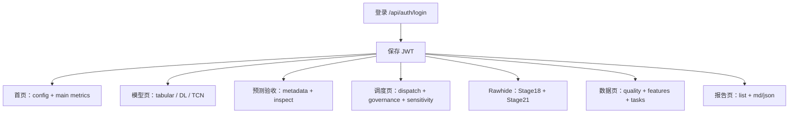
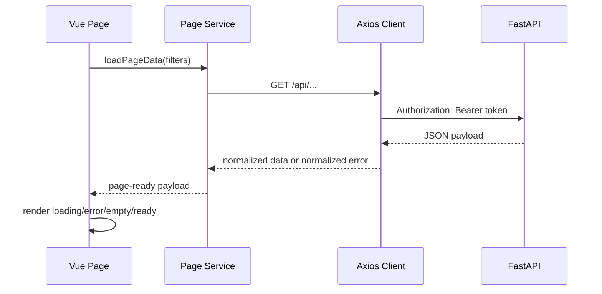

# 前端重设计 API 使用说明与界面开发指南

更新日期：2026-05-06

## 1. 文档目标

本文档用于指导 `frontend/` 重新设计界面时对接后端 API。范围包括：

- 项目业务背景和当前实验边界。
- FastAPI 后端的统一认证、请求方式、错误状态和本地启动方式。
- 当前全部 `/api` 接口清单、参数、返回数据结构和推荐前端页面归属。
- 面向新界面的信息架构、交互设计、数据可视化和风险边界。

Pitfall: 不要把本文档理解为新接口设计稿；它整理的是当前后端已经暴露的真实接口，前端重设计应先复用这些契约，再决定是否新增后端能力。

## 2. 项目背景

`New_Energy_Sys` 是新能源光伏预测与储能优化调度系统，当前形成了可复现实验链路：


当前稳定主线：

| 模块 | 当前定位 | 前端展示建议 |
|---|---|---|
| PV 预测 | Stage9 LightGBM 是稳定主预测模型；深度学习模型用于对比和补充实验。 | 首页展示主模型指标；模型页展示 LightGBM、TCN、深度学习对比。 |
| 储能调度 | Stage12 滚动优化是主要物理约束基线；Stage20B 是最新神经策略蒸馏结果。 | 调度页突出收益、约束是否通过、SOC、充放电行为。 |
| Rawhide | 使用公开容量参数和 PVDAQ 等比例放大，不是 Rawhide 实测出力。 | Rawhide 相关图表必须显示“参考仿真/非实测”边界。 |
| Stage21 | 天气驱动 Rawhide PV 预测与可配置价格场景可行；价格场景不是真实结算电价。 | 可做独立 Rawhide 场景区，强调天气来源、价格来源和质量门禁。 |
| 报告归档 | 每个实验阶段有 Markdown/JSON/CSV 产物。 | 报告页应支持阶段检索、状态解释和 Markdown 安全渲染。 |

Pitfall: 论文/展示中不能写成“深度学习全面优于 LightGBM”或“Rawhide 收益为真实结算结果”；前端文案也必须保留这些边界。

## 3. 前端重设计路线选择

| 方案 | 内容 | 优点 | 缺点 | 推荐结论 | Pitfall |
|---|---|---|---|---|---|
| A. 只换视觉皮肤 | 保留现有页面结构，仅改配色、间距、卡片和图表样式。 | 改动最小，风险低。 | 无法解决信息架构混乱、Rawhide/Stage21 内容承载不足的问题。 | 不推荐作为最终方案。 | 容易把旧页面的信息优先级问题伪装成“视觉已升级”。 |
| B. 按业务工作流重构页面 | 围绕“预测监控 -> 模型评估 -> 调度收益 -> 场站场景 -> 数据/任务 -> 报告”重组页面。 | 最符合当前 API 形态和项目答辩/演示逻辑。 | 需要重构路由、组件和图表分组。 | 推荐。 | 必须先定义页面数据依赖，否则容易出现一个页面并发拉取过多接口。 |
| C. 重新设计前后端契约 | 同时新增聚合 API、分页 API、图表专用 API 和权限模型。 | 长期可扩展性最好。 | 后端改动大，会打断当前可演示状态。 | 暂缓，作为 B 完成后的第二阶段。 | 未先稳定 UI 信息架构就改接口，会反复返工。 |

推荐路线：先执行 B。当前后端已经能支撑一版专业工作台式前端，短期不应先做大规模 API 重写。

## 4. 运行与认证约定

### 4.1 本地启动

后端：

```powershell
# 让 Python 同时找到 src/ 与 backend/ 包。
$env:PYTHONPATH="src;."

# FastAPI 服务默认使用 8000 端口。
python -m uvicorn backend.app.main:app --reload --host 127.0.0.1 --port 8000
```

前端：

```powershell
cd frontend
npm run dev -- --host 127.0.0.1 --port 3002
```

Vite 代理和生产同源模式都以 `/api` 为接口前缀。当前 `frontend/src/utils/api.js` 的默认 `baseURL` 是 `/api`，并兼容旧代码里传入 `/api/...` 的重复前缀。

Pitfall: 如果前端请求写死 `http://localhost:8000`，生产部署后会请求用户本机而不是服务器。

### 4.2 登录与 Token

登录接口：

```http
POST /api/auth/login
Content-Type: application/json

{
  "username": "admin",
  "password": "admin123"
}
```

成功返回：

```json
{
  "token": "<jwt>",
  "user": {
    "username": "admin",
    "role": "admin",
    "display_name": "System Admin"
  }
}
```

后续请求统一加请求头：

```http
Authorization: Bearer <jwt>
```

前端封装建议：

```js
// 统一 API 客户端建议继续放在 frontend/src/utils/api.js。
// 这层只负责“传输契约”：baseURL、Authorization、超时、401 跳转。
// 页面级 loading/error/empty/retry 不应塞进拦截器，否则不同页面无法表达自己的业务状态。
api.interceptors.request.use(config => {
  const token = getAuthToken()

  // 后端认证依赖标准 Bearer Token。
  // 缺失或过期时后端返回 401，前端应清理本地登录态并回到登录页。
  if (token) {
    config.headers.Authorization = `Bearer ${token}`
  }

  return config
})
```

Pitfall: `Authorization` 在 OpenAPI 中显示为可选 Header，但后端依赖会在缺失时返回 401；前端不要把它当成可选。

### 4.3 统一错误状态

| 状态码 | 典型原因 | 前端处理 |
|---|---|---|
| 200 | 请求成功。 | 渲染数据；空数组/空对象仍需进入 empty 状态。 |
| 400 | 任务命令不存在等客户端参数错误。 | 显示参数/命令错误。 |
| 401 | 未登录、Token 缺失、Token 过期或签名无效。 | 清理登录态，跳转登录页。 |
| 403 | 非管理员提交任务。 | 保留当前页，显示权限不足。 |
| 404 | 指定报告、任务、Stage21 产物不存在。 | 显示“该阶段产物缺失”，不要吞成空图。 |
| 422 | FastAPI 参数校验失败。 | 显示筛选条件错误，辅助用户修正。 |
| 503 | 数据库模式下 MySQL 尚未导入所需展示数据。 | 显示数据未就绪，并提示检查导入流程。 |

Pitfall: 404 和空数组语义不同；空数组代表接口可用但当前没有数据，404 代表指定产物不存在。

## 5. API 总览

| 分组 | 接口数量 | 页面建议 | 说明 |
|---|---:|---|---|
| 认证 | 2 | 登录、用户菜单 | 登录和当前用户信息。 |
| 系统概览/模型 | 6 | 首页、模型评估 | 配置、主模型、表格模型、TCN、深度学习、主预测序列。 |
| 预测验收 | 2 | 预测监控/误差分析 | 时间范围、实验、预测 horizon 筛选。 |
| 调度与治理 | 3 | 调度收益、配置治理 | Stage10/11/12、治理评分、配置敏感性。 |
| Rawhide Stage18 | 4 | Rawhide 参考仿真 | 参考场站仿真、调度、敏感性、退化。 |
| Stage21 | 5 | Rawhide 天气/价格场景 | 天气驱动预测、价格场景、调度结果和指标。 |
| 数据与报告 | 6 | 数据资产、报告归档 | 数据质量、特征、报告列表、报告内容。 |
| 任务 | 4 | 任务运维 | 列命令、提交任务、查任务、任务列表。 |



Pitfall: 首页不要一次性请求全部接口；按路由懒加载数据，能显著降低首屏等待和错误面。

## 6. 接口明细

### 6.1 认证接口

| Method | Path | 参数/Body | 返回 | 页面用途 |
|---|---|---|---|---|
| POST | `/api/auth/login` | Body: `username`, `password` | `{token, user}` | 登录页。 |
| GET | `/api/auth/me` | Header: `Authorization` | `{username, role, display_name}` | 刷新用户信息、导航栏用户菜单。 |

Pitfall: 开发模式存在 demo 用户；生产模式必须通过 `NES_USERS_JSON` 或数据库配置真实用户，不要在前端展示默认账号密码。

### 6.2 系统配置与模型接口

| Method | Path | 参数 | 返回字段/结构 | 页面用途 |
|---|---|---|---|---|
| GET | `/api/config` | 无 | `project`, `site`, `date_range`, `sources`, `storage`, `battery_degradation` | 首页站点信息、数据来源、储能配置。 |
| GET | `/api/models/main` | 无 | `split`, `target`, `sample_count`, `mae_kw`, `rmse_kw`, `nrmse_capacity`, `bias_kw`, `daytime_*` | 首页 KPI、主模型指标卡。 |
| GET | `/api/models/tabular` | 无 | `model`, `target`, `feature_set`, `split`, `feature_count`, `model_path`, `mae_kw`, `rmse_kw`, `nrmse_capacity`, `bias_kw`, `daytime_*` | 模型评估页表格模型对比。 |
| GET | `/api/models/deep-learning` | 无 | `model`, `target`, `window_size`, `split`, `feature_set`, `feature_count`, `mae_kw`, `rmse_kw`, `nrmse_capacity`, `bias_kw`, `daytime_*` | 模型评估页深度学习对比。 |
| GET | `/api/models/tcn` | 无 | `model`, `config_name`, `target`, `window_size`, `feature_set`, `mae_kw`, `rmse_kw`, `nrmse_capacity`, `daytime_*` | TCN 历史对比，可折叠为“序列模型”。 |
| GET | `/api/predictions/main` | `limit` 默认 `2000`; `offset` 默认 `0` | `timestamp`, `target`, `model_name`, `feature_set`, `prediction_kw`, `actual_kw`, `error_kw`, `prediction_lower_bound_kw`, `prediction_upper_bound_kw` | 首页预测曲线、分页加载历史序列。 |

设计建议：

- 首页只展示 `/api/config`、`/api/models/main`、`/api/predictions/main?limit=336`，覆盖最近两周小时级曲线即可。
- 模型页再并行加载 tabular、deep-learning、tcn，避免首页负载过重。
- `daytime_nrmse_capacity` 比全天指标更适合解释光伏白天预测质量。

Pitfall: `/api/predictions/main` 默认返回 2000 行，图表首屏不应无脑拉满；建议按时间窗口或 `limit` 控制。

### 6.3 预测验收接口

| Method | Path | 参数 | 返回字段/结构 | 页面用途 |
|---|---|---|---|---|
| GET | `/api/predictions/metadata` | 无 | `date_min`, `date_max`, `horizons`, `experiments`, `scenarios`, `capacity_kw`, `baselines` | 日期选择器、实验筛选、horizon 筛选初始化。 |
| GET | `/api/predictions/inspect` | `start` 必填；`end` 必填；`horizons` 逗号分隔；`experiments` 逗号分隔；`granularity=hour|day` | `{data, daily_summary}` | 误差曲线、日汇总、场景标签、实验对比。 |

`/api/predictions/inspect` 查询示例：

```http
GET /api/predictions/inspect?start=2022-09-01&end=2022-09-08&horizons=1,6,24&granularity=hour
```

小时级 `data` 关键字段：

| 字段 | 含义 |
|---|---|
| `origin_time` | 预测发起时间。 |
| `valid_time` | 预测对应的实际时间。 |
| `horizon_hours` | 预测提前量。 |
| `experiment` | 实验 ID。 |
| `model_name`, `model_version` | 模型描述。 |
| `prediction_kw`, `actual_kw` | 预测功率与实际功率。 |
| `persistence_origin_kw`, `persistence_same_hour_yesterday_kw` | 持续性基线。 |
| `error_kw`, `abs_error_kw` | 误差。 |
| `ghi_wm2`, `clearsky_ghi_wm2`, `solar_elevation_deg`, `cloud_cover_pct` | 天气/太阳位置解释变量。 |
| `scenario` | `night`、晴天、混合、阴天等场景标签。 |

设计建议：

- 日期选择器必须由 `date_min/date_max` 控制，不能硬编码年份。
- `end` 是半开区间上界；如果用户选择 9 月 1 日到 9 月 7 日，前端应提交 `end=2022-09-08`。
- 大范围查询建议默认 `granularity=day`，用户钻取某几天后再切到 `hour`。

Pitfall: 后端会按 UTC 解析日期；前端展示中文日期时要明确这是数据有效时间，不要把时区转换造成日期错位。

### 6.4 调度、治理与配置敏感性接口

| Method | Path | 参数 | 返回字段/结构 | 页面用途 |
|---|---|---|---|---|
| GET | `/api/dispatch/metrics/{stage}` | `stage=stage10|stage11|stage12` | `scenario`, `sample_count`, `total_storage_revenue_eur`, `total_no_storage_revenue_eur`, `incremental_revenue_eur`, `total_charge_kwh`, `total_discharge_kwh`, `cycle_equivalent_count`, `mean_soc`, `min_soc`, `max_soc`, `*_within_limit`, `pareto_front` 等 | 调度收益页。 |
| GET | `/api/governance/scorecard` | 无 | `scenario_id`, `strategy_type`, `governance_decision`, `governance_score`, `economic_score`, `constraint_score`, `risk_score`, `risk_flags`, `decision_reason` | 策略治理评分。 |
| GET | `/api/sensitivity/metrics` | 无 | `config_id`, `capacity_multiplier`, `power_multiplier`, `objective_preset`, `capacity_kwh`, `incremental_revenue_eur`, `soc_edge_touch_ratio`, `pareto_front` 等 | 储能配置敏感性、Pareto 图。 |

设计建议：

- 调度页默认比较 Stage10、Stage11、Stage12，但视觉优先级应给 Stage12。
- 约束字段适合做“质量门禁”组件：SOC 边界、充放电功率、禁止同时充放电、能量平衡。
- `incremental_revenue_eur` 是最直观收益指标；`total_storage_revenue_eur` 需要和无储能收益一起解释。

Pitfall: 不同 stage 的返回字段不完全一致，例如 Stage10 没有 `strategy_id`，Stage12 不一定有所有策略阈值字段；表格列要按字段存在性动态渲染。

### 6.5 Rawhide Stage18 接口

| Method | Path | 参数 | 返回字段/结构 | 页面用途 |
|---|---|---|---|---|
| GET | `/api/rawhide/report` | 无 | `stage`, `reference_site`, `scaling`, `storage_config`, `quality_gates`, `dispatch_summary`, `best_sensitivity_config`, `recommended_pareto_config`, `market_boundary` | Rawhide 概览、边界说明、质量门禁。 |
| GET | `/api/rawhide/dispatch-metrics` | 无 | Stage12 类似调度指标，额外包含 `source_scale_factor`, `reference_site_name`, `is_measured_rawhide_generation` | Rawhide 调度收益图。 |
| GET | `/api/rawhide/sensitivity-metrics` | 无 | Stage15 类似配置扫描指标，额外包含 Rawhide 边界字段。 | Rawhide 配置敏感性。 |
| GET | `/api/rawhide/degradation-metrics` | 无 | `gross_revenue_eur`, `degradation_cost_eur`, `net_revenue_eur`, `soh_start`, `soh_end`, `capacity_fade_percent`, `equivalent_full_cycles`, `replacement_flag` | 电池退化与净收益。 |

Rawhide 前端必须固定展示以下边界：

```text
Rawhide 数据为公开参数参考仿真，PV 出力来自 PVDAQ 按容量比例放大。
is_measured_rawhide_generation=false 表示不是 Rawhide 历史实测出力。
```

Pitfall: 如果只显示场站名 “Rawhide Prairie Solar” 而不显示 `is_measured_rawhide_generation=false`，用户会误解为真实场站历史运行复盘。

### 6.6 Stage21 天气与价格场景接口

| Method | Path | 参数 | 返回字段/结构 | 页面用途 |
|---|---|---|---|---|
| GET | `/api/stage21/report` | 无 | `stage`, `reference_site`, `weather_source_kind`, `pv_estimation`, `price_scenarios`, `quality_gates`, `scenario_reports` | Stage21 总览。 |
| GET | `/api/stage21/weather-predictions` | 无 | `timestamp`, `weather_valid_time`, `prediction_kw`, `weather_estimated_pv_kw`, `ghi_wm2`, `temperature_c`, `cloud_cover_pct`, `weather_provider`, `is_measured_rawhide_generation`, `actual_kw_is_measured` | 天气驱动 PV 预测曲线。 |
| GET | `/api/stage21/price-scenarios` | 无 | `timestamp`, `price_scenario_id`, `price_scenario_label`, `price_source_type`, `is_real_settlement_price`, `price_eur_mwh`, `load_mw` | 价格场景曲线。 |
| GET | `/api/stage21/dispatch-results` | 无 | `scenario`, `forecast_timestamp`, `dispatch_timestamp`, `forecast_pv_kw`, `actual_pv_kw`, `soc_start`, `soc_end`, `actual_charge_kw`, `actual_discharge_kw`, `storage_revenue_eur`, `incremental_revenue_eur`, `price_scenario_*`, `is_real_settlement_price` | 小时级调度回放。 |
| GET | `/api/stage21/dispatch-metrics` | 无 | 调度聚合指标 + `price_scenario_id`, `price_scenario_label`, `price_source_type`, `is_real_settlement_price`, `is_measured_rawhide_generation` | 场景排行与收益对比。 |

设计建议：

- Stage21 适合做 Rawhide 页面内的二级 Tab：`参考仿真 Stage18`、`天气/价格场景 Stage21`。
- 价格曲线和调度收益必须展示 `is_real_settlement_price=false` 或价格来源标签。
- 小时级 `dispatch-results` 当前约 720 行，可直接前端渲染；后续扩大时间范围时应补分页或后端聚合。

Pitfall: Stage21 的价格场景是 synthetic/project-proxy，不是 Rawhide 本地真实结算电价；图表标题不能写“真实电价收益”。

### 6.7 数据资产与报告接口

| Method | Path | 参数 | 返回字段/结构 | 页面用途 |
|---|---|---|---|---|
| GET | `/api/features/importance` | `top_n` 默认 `30` | `target`, `feature_set`, `feature`, `importance_gain`, `importance_split` | 特征重要性 Top N。 |
| GET | `/api/data/quality` | 无 | `stage`, `date_range`, `rows`, `time_alignment`, `missing_values`, `quality_gates`, `time_axis_diagnostics` | 数据质量总览。 |
| GET | `/api/data/features` | 无 | `input_rows`, `output_rows`, `engineered_feature_count`, `target_columns`, `feature_groups`, `chronological_split`, `quality_gates` | 特征工程说明。 |
| GET | `/api/reports/list` | 无 | `stage_id`, `name`, `has_json`, `has_md` | 报告目录。 |
| GET | `/api/reports/{stage}/json` | `stage`, 如 `stage9` | 任意 JSON 报告对象；缺失返回 404。 | 结构化报告详情。 |
| GET | `/api/reports/{stage}/md` | `stage`, 如 `stage9` | `{content: "<markdown>"}`；缺失返回 404。 | Markdown 报告阅读器。 |

Markdown 渲染建议：

```js
// 报告内容来自本地实验产物，但仍应按不可信 HTML 处理。
// marked 只负责 Markdown -> HTML，不能承担 XSS 清洗。
// 继续使用 DOMPurify 或等价白名单清洗后再传给 v-html。
const html = DOMPurify.sanitize(marked.parse(markdownContent))
```

Pitfall: 报告 Markdown 可能包含长表格和长代码块；移动端应允许报告正文局部横向滚动，不能让整个页面横向溢出。

### 6.8 任务接口

| Method | Path | 参数/Body | 返回字段/结构 | 页面用途 |
|---|---|---|---|---|
| GET | `/api/tasks/commands` | 无 | `command_id`, `label` | 可执行命令列表。 |
| POST | `/api/tasks/submit` | Body: `command_id` | `task_id`, `command`, `status`, `created_at`, `started_at`, `finished_at`, `return_code`, `stdout_tail`, `stderr_tail` | 管理员提交后台任务。 |
| GET | `/api/tasks/{task_id}` | `task_id` | 单个任务记录。 | 任务状态轮询。 |
| GET | `/api/tasks` | `limit` 默认 `20` | 任务记录数组。 | 任务历史。 |

可提交命令 ID：

| command_id | 含义 |
|---|---|
| `train_baseline` | Stage4 LightGBM 基线训练。 |
| `compare_tabular` | Stage8 表格模型横向对比。 |
| `run_inference` | Stage9 主模型推理。 |
| `run_dispatch` | Stage10 储能调度仿真。 |
| `run_strategy` | Stage11 策略敏感性。 |
| `run_rolling` | Stage12 滚动优化调度。 |
| `run_governance` | Stage13 策略治理报告。 |
| `run_sensitivity` | Stage15 储能配置敏感性。 |

权限规则：

- `admin` 可提交任务。
- `viewer/guest` 可查看多数只读数据，但提交任务返回 403。

Pitfall: 后端任务运行在 API 进程内的后台线程中，适合演示和轻量触发，不适合作为生产级任务队列；前端应展示超时和失败日志尾部。

## 7. 推荐前端信息架构

| 页面 | 核心问题 | 主要接口 | 关键组件 |
|---|---|---|---|
| 登录 | 用户是谁，是否有权限进入系统？ | `/api/auth/login`, `/api/auth/me` | 登录表单、错误提示、会话恢复。 |
| 预测监控 | 当前主预测模型表现如何？ | `/api/config`, `/api/models/main`, `/api/predictions/main` | KPI、预测 vs 实际曲线、误差摘要。 |
| 模型评估 | 哪些模型表现更好，深度学习处于什么位置？ | `/api/models/tabular`, `/api/models/deep-learning`, `/api/models/tcn` | 排行表、指标雷达、分组柱状图。 |
| 预测验收 | 某时间段、某 horizon、某实验的误差在哪里？ | `/api/predictions/metadata`, `/api/predictions/inspect` | 日期筛选、horizon 多选、误差曲线、日汇总。 |
| 调度收益 | 储能调度带来多少增量收益，约束是否通过？ | `/api/dispatch/metrics/{stage}`, `/api/governance/scorecard`, `/api/sensitivity/metrics` | 收益卡、约束门禁、Pareto 图。 |
| Rawhide 场景 | 参考场站仿真和天气价格扩展结果是什么？ | `/api/rawhide/*`, `/api/stage21/*` | 场站摘要、边界标签、天气/价格/调度 Tabs。 |
| 数据与任务 | 数据质量如何，是否需要重跑实验？ | `/api/data/quality`, `/api/data/features`, `/api/features/importance`, `/api/tasks/*` | 数据质量卡、特征 TopN、任务列表。 |
| 报告归档 | 实验报告如何追溯？ | `/api/reports/list`, `/api/reports/{stage}/md` | 阶段列表、Markdown 阅读器、搜索/筛选。 |

Pitfall: “治理”和“调度”在业务上关联紧密，不建议拆成两个顶级入口；可在调度收益页面内用 Tab 或二级区域承载治理评分。

## 8. 组件与数据加载规范

推荐数据流：



实现规则：

- 每个页面保留一个 `services/<page>Service.js`，统一并发请求和数据整形。
- 图表 option 放在 `charts/*Charts.js`，保持纯函数，输入为 API 数据，输出为 ECharts 配置。
- 页面组件只管理筛选条件、状态机和布局，不直接拼接复杂图表数据。
- 所有接口都必须有 `loading`、`error`、`empty`、`ready` 四态。
- 大数组接口优先在 service 层裁剪、排序、分组，避免模板里堆业务逻辑。

Pitfall: 不要让 ECharts option 在 Vue 模板中临时构造；这会导致渲染抖动、难以测试，也会让页面组件不可维护。

## 9. 数据展示边界与文案要求

| 场景 | 必须显示的边界文案/标签 |
|---|---|
| Rawhide Stage18 | `参考仿真，不是 Rawhide 实测历史出力` |
| Rawhide Stage21 | `天气驱动 PV 估计 + 可配置价格场景` |
| Stage21 价格 | `非真实结算电价`，除非 `is_real_settlement_price=true` |
| Stage20/Stage20B 神经策略 | `策略蒸馏/模仿滚动优化首步动作`，不能写成严格优于优化器 |
| 深度学习预测 | `对比/补充实验`，不能写成已替代主预测链 |
| 报告 Markdown | `实验报告归档`，不要把历史报告当作当前结论 |

Pitfall: 前端标题比正文更容易造成误解；边界标签应放在卡片标题区或图例附近，而不是藏在页面底部说明里。

## 10. 验收清单

| 类别 | 验收项 |
|---|---|
| API 契约 | 32 个 `/api` 路由均已登记；页面只调用文档内接口。 |
| 认证 | 未登录访问数据页会跳登录；Token 过期后自动清理会话。 |
| 数据状态 | 所有页面具备 loading/error/empty/ready。 |
| Rawhide 边界 | `is_measured_rawhide_generation=false` 被清晰展示。 |
| Stage21 边界 | `is_real_settlement_price=false` 被清晰展示。 |
| 性能 | 首页不加载全部 Stage21/Rawhide/报告内容；按路由懒加载。 |
| 可视化 | 图表容器有稳定高度和 `min-width: 0`，移动端不整体横向溢出。 |
| 报告安全 | Markdown 渲染经过 HTML 清洗。 |
| 任务权限 | guest 提交任务显示 403 权限不足；admin 可提交并轮询状态。 |

Pitfall: 验收不能只看 `npm run build`；必须用真实浏览器验证登录、路由、图表、空态、错误态和移动端布局。

## 11. 阶段总结

本阶段完成内容：

- 已确认后端 API 来源为 `backend/app/main.py`。
- 已按实际路由整理 32 个 `/api` 接口。
- 已按实际数据加载层整理主要返回字段。
- 已给出前端重设计推荐路线、页面信息架构、组件拆分规范和验收清单。

目标完成情况：已完成“后端接口 API 使用说明”和“项目背景 + 前端设计开发指导”的文档化目标。

下一阶段可行性：建议直接进入前端重设计方案 B。当前后端接口足以支撑新版工作台，不需要先重写 API；但如果新版 UI 需要长时间范围分页、服务端聚合、报告全文搜索，再进入后端契约升级。

Pitfall: 如果前端重设计开始后同时大改后端，问题定位会变复杂；建议先基于当前 API 做新版页面原型，再列出明确的后端增量需求。
