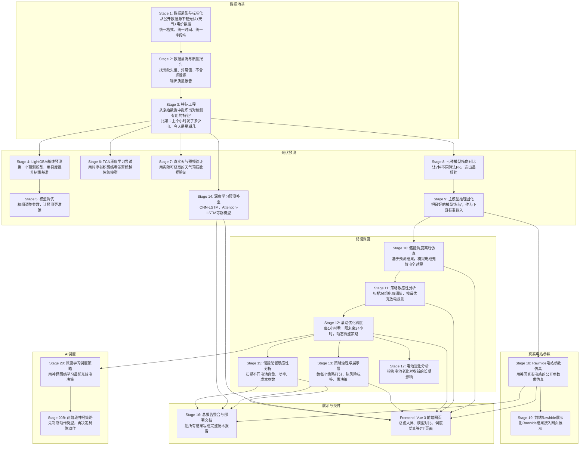
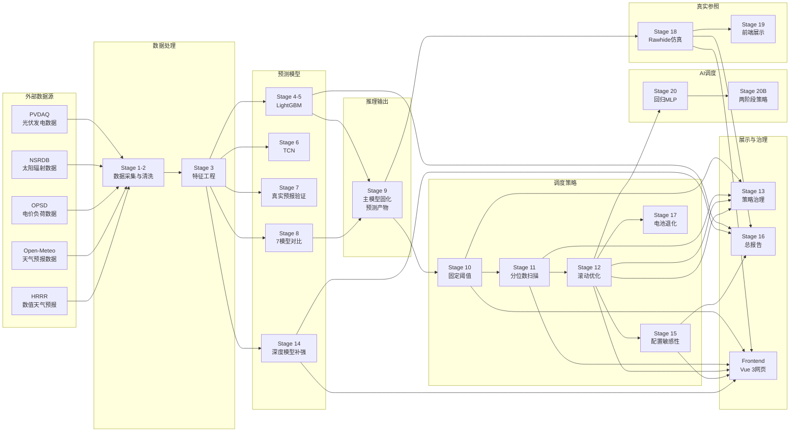

# 新能源储能调度系统 —— 零基础全盘掌握指南

> 本文面向**非技术背景读者**，用最通俗的语言，把整个项目的每一个阶段、每一个细节、每一个"为什么要这么做"都讲清楚。不限字数，不限深度。

---

## 目录

- [第一部分：这个项目到底在做什么](#第一部分这个项目到底在做什么)
- [第二部分：项目全景框架](#第二部分项目全景框架)
- [第三部分：逐个Stage详解](#第三部分逐个stage详解)
  - [模块A：数据地基（Stage 1-3）](#模块a数据地基stage-1-3)
  - [模块B：光伏功率预测（Stage 4-9, 14）](#模块b光伏功率预测stage-4-9-14)
  - [模块C：储能调度优化（Stage 10-13, 15, 17）](#模块c储能调度优化stage-10-13-15-17)
  - [模块D：真实电站参照仿真（Stage 18-19）](#模块d真实电站参照仿真stage-18-19)
  - [模块E：AI驱动的智能调度（Stage 20）](#模块eai驱动的智能调度stage-20)
  - [模块F：展示与交付（Frontend + Stage 16）](#模块f展示与交付frontend--stage-16)
- [第四部分：完整数据流向图](#第四部分完整数据流向图)
- [第五部分：当前项目状态总结](#第五部分当前项目状态总结)

---

## 第一部分：这个项目到底在做什么？

### 用一个生活场景理解

想象你经营一座**太阳能发电站**。白天阳光充足时，太阳能板发电量很高；晚上没有阳光，发电量为零。但人们的用电需求不会随着太阳走——傍晚回家后你可能需要开灯、做饭、开空调。

这时候问题就来了：

1. **预测问题**：明天中午太阳能能发多少电？后天呢？一周后呢？
2. **存储问题**：如果中午发了100度电，但只需要50度，剩下的50度怎么办？
3. **调度问题**：什么时候应该把电存进电池？什么时候应该把电池里的电拿出来用（或卖给电网）？
4. **经济问题**：电价每小时都在变，怎么操作才能赚最多的钱？同时还要保护电池不坏掉？

**这个项目就是用一个完整的计算机系统来回答上面所有问题。**

### 项目的四个核心能力

| 能力 | 通俗解释 | 对应模块 |
|------|----------|----------|
| **光伏功率预测** | 根据历史数据、天气信息，预测未来24小时太阳能板能发多少电 | Stage 4-9, 14 |
| **储能优化调度** | 决定电池什么时候充电、什么时候放电，收益最大、损耗最小 | Stage 10-13, 15, 17 |
| **真实电站参照** | 用一座真实的美国电站(Rawhide)的参数来做仿真验证 | Stage 18-19 |
| **AI调度策略** | 用深度学习神经网络来学习最优的充放电策略 | Stage 20 |
| **可视化展示** | 把上述所有结果用网页图表展示出来 | Frontend + Stage 16 |

---

## 第二部分：项目全景框架



---

## 第三部分：逐个Stage详解

---

## 模块A：数据地基（Stage 1-3）

> 这三个Stage是整个系统的"地基"。没有高质量的数据，后面的预测和调度都是空中楼阁。

---

### Stage 1：数据采集与标准化

**通俗理解**：就像盖房子要先买建材，做数据分析要先"买菜"——把需要的数据从网上下载下来，存到自己的硬盘上。

#### 这个阶段做什么？

从多个**公开的、免费的数据源**下载数据：

| 数据源 | 它提供什么 | 通俗解释 |
|--------|-----------|----------|
| **PVDAQ** | 美国各地真实光伏电站的小时级发电数据 | 告诉你某座太阳能电站过去每小时实际发了多少电 |
| **NSRDB** | 美国国家太阳辐射数据库 | 告诉你某地过去每个小时的太阳有多强、温度多高、风速多大 |
| **OPSD** | 开放电力系统数据 | 告诉你电价是多少、用电负荷是多少 |
| **Open-Meteo** | 历史天气预报数据 | 告诉你某天某小时的天气预报说的是什么 |
| **HRRR** | NOAA的高精度数值天气预报 | 美国气象局的超级计算机算出来的天气预报 |

#### 为什么要从这么多地方拿数据？

因为这是一个**完整的仿真系统**，你需要：

- **光伏发电数据**（PVDAQ）→ 知道电站实际发了多少电 → 这是你要预测的"答案"
- **太阳/天气数据**（NSRDB）→ 知道当时的真实天气 → 这是预测的"线索"之一
- **电价/负荷数据**（OPSD）→ 知道电力的市场价格 → 这是调度决策的依据
- **天气预报数据**（Open-Meteo/HRRR）→ 知道能提前拿到什么样的天气信息 → 这是"你在做预测时实际能看到的东西"

#### 标准化是什么？

不同数据源的时间和格式不一样，比如：
- PVDAQ的时间格式可能是 `2020-01-01 13:00:00`
- NSRDB的时间格式可能是 `20200101T130000Z`
- 一个用北京时间，一个用世界标准时间

**标准化就是**：把所有数据统一成同一个格式——按小时对齐，统一时区，统一字段名（比如不管原来叫"发电量"还是"power"，统一叫 `pv_power_kw`）。

#### 这个阶段的产物

- `data/raw/` 目录下的原始下载文件
- 统一格式后的中间数据文件

**Pitfall（潜在坑点）**：从网上下载数据可能因为网络问题失败；不同数据源的时间戳和时区必须仔细对齐，否则会出现"用未来的天气预测过去的发电量"这种荒唐的时间穿越错误。

---

### Stage 2：数据清洗与质量报告

**通俗理解**：买来的菜不能直接下锅——要洗、要择、要扔掉烂叶子。数据也一样。

#### 这个阶段做什么？

对 Stage 1 采集到的数据做全面的"体检"：

1. **缺失值处理**：某个小时的数据丢失了怎么办？
   - 如果只是偶尔丢1-2个小时，可以用前后数据的平均值填补
   - 如果连续丢了一整天，就需要标记出来，后面的模型训练要跳过

2. **异常值检测**：有没有不合理的数字？
   - 太阳能电池半夜发电量应该是0，如果出现正数就可能是传感器故障
   - 发电量不应该超过电站的装机容量（比如一个1.12kW的电站不可能发出10kW）
   - 太阳辐照度不可能为负数

3. **时间对齐**：确保所有数据按小时严格对齐
   - 比如 PVDAQ的记录是13:05，NSRDB的记录是13:00，对齐到13:00

4. **生成质量报告**：告诉你"这批数据质量怎么样"
   - 完整率：有多少小时的数据是完整的？
   - 异常率：有多少数据看起来不对劲？
   - 对齐率：不同数据源之间能否完美匹配？

#### 为什么需要这个阶段？

**垃圾进，垃圾出（Garbage In, Garbage Out）**。如果你用来训练模型的数据里有大量错误，模型学到的也会是错误的规律。

举个例子：如果某天中午的发电数据因为传感器故障被记录为0，模型可能会学到"大晴天中午不发电"这种荒谬的规律。

#### 这个阶段的产物

- `stage2_cleaned_hourly_dataset.parquet`：清洗后的干净数据
- 数据质量报告

**Pitfall**：清洗规则太激进会把正常数据当异常删掉（比如阴天中午发电量确实很低但不是0）；清洗规则太宽松会放过真正的错误数据。需要在"宁可错杀"和"宁可不杀"之间找平衡。

---

### Stage 3：特征工程

**通俗理解**：原始数据就像一堆乱七八糟的食材——鸡蛋、面粉、糖、黄油。特征工程就是根据菜谱（你要做的任务），把这些食材加工成可以直接烹饪的半成品——打好的蛋液、筛过的面粉、软化的黄油。

#### 什么是"特征"？

特征是机器学习的"输入信号"，是模型用来做预测的线索。

比如你要预测"明天中午太阳能发多少电"，下面这些都可能是特征：
- 昨天的同一时间发了多少电？（历史功率特征）
- 现在是几月份？（时间特征，因为夏天日照长冬天短）
- 明天的天气预报说太阳有多强？（天气特征）
- 距离上一次下雨过了多少天？（隐含特征，因为太阳能板可能被灰尘覆盖）

#### 这个阶段创造哪几类特征？

**第一类：时间特征**
- 小时（0-23）：帮助模型学习一天内的发电规律（中午高，早晚低，夜里0）
- 月份（1-12）：帮助模型知道夏天发电多、冬天少
- 星期几：工作日和周末的用电模式不同
- 是否节假日：节假日的用电模式不同

**第二类：历史功率特征**
- 上一个小时发了多少电？
- 24小时前发了多少电？（因为太阳每天差不多同一时间升起）
- 过去24小时平均发了多少电？
- 过去7天同一时间平均发了多少电？

这些特征的原理是：**太阳的运行是有周期性规律的**。昨天中午12点发电100kW，今天中午12点大概率也差不多。

**第三类：天气特征**
- 太阳辐照度（GHI，全球水平辐照）：表示太阳有多"猛"
- 温度：影响太阳能板的效率（越热效率越低）
- 风速：风可以帮助散热，提高效率
- 云量：云越多，太阳被遮挡越多

**第四类：储能调度特征**
- 当前电池电量
- 充放电状态
- 距离上次充满/放空过了多久

**第五类：多步预测标签**
- 这不是特征，而是告诉模型"你要预测什么"
- 比如 `target_pv_power_t_plus_24h` 表示"24小时后的发电量"
- 同时也会生成 t+1h（1小时后）、t+6h（6小时后）等多个预测目标

#### 为什么特征工程这么重要？

一个经典的机器学习定律：**数据和特征决定了模型表现的上限，而模型和算法只是不断逼近这个上限。**

换句话说：如果你的特征选得好，即使用最简单的模型也能做出不错的预测；如果特征选得差，再复杂的模型也无能为力。

#### 这个阶段的产物

- `stage3_feature_dataset.parquet`：包含所有特征的完整数据集
- 这是后续所有预测模型训练的**统一输入**

**Pitfall**：特征工程中最危险的错误叫"时间泄漏"——不小心把未来的信息泄露给了模型。比如你不能用"实测天气"作为特征来预测未来发电量，因为在真实场景中，你预测明天发电量的时候，你并不知道明天实际的天气（你只知道天气预报说什么）。用实测天气等于"作弊"——让模型提前看到了答案。

---

## 模块B：光伏功率预测（Stage 4-9, 14）

> 这六个Stage围绕同一个核心问题：**如何最准确地预测未来24小时的光伏发电量？**
>
> 它们形成了一个"尝试 → 比较 → 选择 → 固化"的完整流程。

---

### Stage 4：LightGBM 基线预测

**通俗理解**：这是预测模型的"第一枪"。先找一个可靠、快速的算法跑一遍，建立一个"及格线"。后续所有花里胡哨的模型，如果连这个及格线都超不过，就不值得上线。

#### LightGBM是什么？

LightGBM (Light Gradient Boosting Machine) 是微软开发的一种机器学习算法，属于"梯度提升树"家族。

用一个比喻来理解：

> 你组织了一个团队来做预测：
> - 第一个成员看了一眼数据，给了个粗略估计（比如"中午大概发100度电"）
> - 第二个成员专门盯着第一个成员犯的错误，努力修正这些错误（"你上午10点总是低估了"）
> - 第三个成员又盯着前两个成员的残留错误...
> - 如此迭代几百轮，团队的整体预测越来越准

这就是 Gradient Boosting（梯度提升）的核心思想：**每一棵"决策树"都在弥补之前所有树的累积错误。**

#### 为什么选LightGBM做基线？

| 优点 | 解释 |
|------|------|
| **快** | 训练和预测速度远超神经网络 |
| **稳** | 参数不太敏感，不容易翻车 |
| **强** | 在表格数据任务中经常和深度学习不分上下 |
| **可解释** | 可以告诉你"哪个特征最重要" |

#### 这个阶段做了什么？

1. 把所有特征喂给 LightGBM 模型
2. 训练它预测 `t+24h`（24小时后的发电量）、`t+6h`、`t+1h`
3. 把数据分成三份：
   - **训练集**（约60%）：用来学习规律
   - **验证集**（约20%）：用来调参数和防止"死记硬背"
   - **测试集**（约20%）：用来最终考核——这部分数据模型从未见过
4. 输出预测结果和评估指标

#### 评估指标怎么看？

| 指标 | 全称 | 通俗解释 | 越？越好 |
|------|------|----------|----------|
| **nRMSE** | 归一化均方根误差 | 预测误差占电站容量的比例，0.12表示误差约为容量的12% | 越小越好 |
| **RMSE (kW)** | 均方根误差 | 预测值和真实值的平均偏差，单位是千瓦 | 越小越好 |
| **MAE (kW)** | 平均绝对误差 | 平均每次预测差多少千瓦 | 越小越好 |
| **Bias** | 偏差 | 预测是系统性地偏高还是偏低（正数=偏高，负数=偏低） | 越接近0越好 |

#### 第一阶段的结果

| 预测目标 | nRMSE | 含义 |
|----------|-------|------|
| t+1h | 0.0637 | 预测1小时后：误差约为容量的6.4% |
| t+6h | 0.1196 | 预测6小时后：误差约为容量的12.0% |
| t+24h | 0.1238 | 预测24小时后：误差约为容量的12.4% |

**规律：预测越远越不准。** 这很符合直觉——预测1小时后比预测24小时后容易得多。

**Pitfall**：不能只看总体指标。夜晚发电量本身就是0，预测0很容易"对"，这会拉低整体误差。真正有意义的是**日间nRMSE**（只算有阳光的时段）。

---

### Stage 5：LightGBM 诊断、消融和调参

**通俗理解**：Stage 4 建立了及格线，但就像一个刚组装好的赛车发动机，可以跑但远不是最优状态。Stage 5 就是精细调校这台发动机的每一个螺丝。

#### 什么是"消融实验"？

消融实验（Ablation Study）是一种诊断工具，用来回答：**每个零件到底有多大贡献？**

打个比方：你有一道菜的秘方，里面有5种调料。消融实验就是：
- 第1次：去掉盐 → 看味道变差多少
- 第2次：去掉糖 → 看味道变差多少
- ...
- 最后你就知道"盐最重要，芹菜可有可无"

在机器学习中，消融指的是：
- 去掉天气特征，只用历史功率 → 看看天气特征到底帮了多少忙
- 去掉时间特征 → 看看时间信息有多重要
- 只用最简单的特征组合 → 看看复杂特征是否真的有用

#### 这个阶段的关键发现

实验了多组特征组合：

| 特征组合 | 包含什么 | t+24h nRMSE |
|----------|----------|-------------|
| `history_only` | 只有历史功率特征 | **0.1225** |
| 历史 + 天气 | 加上NSRDB天气数据 | 没有显著改善 |
| 历史 + 天气 + 时间 | 全量特征 | 没有显著改善 |

**关键结论：只用历史功率数据就能预测得最好！**

这个结论初看反直觉——天气难道不应该很重要吗？原因在于：

1. **历史功率已经包含了天气的信息**。比如昨天中午发了100kW这件事，本身就隐含了"昨天中午天气不错"这个信息。
2. **NSRDB天气数据是"后见之明"**（事后测量的实际天气），在真实预测场景中你拿不到这么准确的天气数据。
3. **天气预报有误差**，用有误差的预报反而可能干扰模型。

#### 调参做了什么？

LightGBM 有很多可调节的"旋钮"（超参数），比如：
- `num_leaves`：每棵决策树的最大叶子数（太大会死记硬背，太小会学不到规律）
- `learning_rate`：学习速度（太快会跳过头，太慢会学不完）
- `max_depth`：树的深度
- `min_child_samples`：每个叶子最少需要多少数据

调参就是系统地尝试不同组合，找到让验证集表现最好的那组。

#### 调参后结果

| 预测目标 | 调参前 nRMSE | 调参后 nRMSE |
|----------|-------------|-------------|
| t+1h | 0.0637 | 0.0636 |
| t+6h | 0.1196 | 0.1182 |
| t+24h | 0.1238 | **0.1225** |

**Pitfall**：调参有"过拟合"的风险——模型可能在测试数据上表现好，但实际上只是把测试数据的特例记住了，换一批新数据就垮了。所以调参必须只在验证集上做，测试集要留到最后"一锤定音"。

---

### Stage 6：TCN 序列模型

**通俗理解**：LightGBM 就像一个只看快照的专家——它看"现在这一刻"的各种指标来做预测。但光伏发电是有时间脉络的，今天上午8点的发电量，和7点、7点半的发电量是连续的。TCN（时序卷积网络）就像一个看连续视频的专家——它能捕捉时间序列中的趋势和模式。

#### TCN是什么？

TCN（Temporal Convolutional Network）是一种专门处理时间序列数据的深度学习模型。

用比喻理解：

> - **LightGBM** 看数据像看一张张独立的照片：每小时是一张独立的快照
> - **TCN** 看数据像看一段连续的录像：能看到发电量如何从早晨一点点爬升，到中午到达峰值，再到傍晚一点点下降

TCN的核心技术叫"膨胀卷积"（Dilated Convolution），它的巧妙之处在于：
- 看最近几个小时：看得很细（每个小时都看）
- 看几天前的数据：跳着看（每隔几小时看一个点）
- 这样既能看到短期波动（一朵云飘过导致发电量骤降），也能捕捉长期规律（这周发电量比上周高因为进入夏天）

#### TCN相比LightGBM的优势和劣势

| 对比维度 | LightGBM | TCN |
|----------|----------|-----|
| 对时序关系的理解 | 弱（需要人工构建滞后特征） | 强（自动学习时序模式） |
| 训练速度 | 快（秒到分钟级） | 慢（分钟到小时级） |
| 数据需求 | 中等 | 大（需要足够多的连续时段） |
| 可解释性 | 好（能看到每个特征的重要性） | 差（黑盒） |
| 预测精度 | 基准 | 可能更好但不确定 |

#### 实验结果

TCN在 `t+24h` 预测上取得了 nRMSE `0.1159`，比 tuned LightGBM 的 `0.1225` 提升了 `0.0066`。

**这个提升大吗？** 说实话不大——在1.12kW的电站上，大约每预测一次少错7瓦。而且TCN训练慢、可解释性差，性价比不高。

#### 重要约束：时间窗口切分

TCN需要看过去N小时的数据（比如过去168小时=7天）来预测未来。这带来了一个技术细节叫"窗口切分"：

不能出现的情况：训练窗口跨越了训练集和测试集的边界。比如训练数据是2020年的，测试数据是2022年的，但某个窗口从2020年12月31日开始、跨越到了2022年1月1日——这就让模型在训练时"偷看"了测试数据。

**Pitfall**：序列模型最容易犯的错误就是时间泄漏——训练窗口不小心包含了测试时段的数据。这会让测试指标虚高，但在真实场景中会垮得很惨。

---

### Stage 7：真实预报天气可用性验证

**通俗理解**：前面的Stage 5和6在说"用天气数据能提升预测"或"不能提升"，但它们用的NSRDB天气数据有一个致命问题——那是**事后测量的实际天气**，不是**你能提前拿到的天气预报**。

这就像你让模型"预测明天的股市"，却给了它"明天实际的新闻"——这在现实中是不可能的。

Stage 7 就是要把"作弊"的因素去掉，用**真实可获取的历史天气预报数据**重新验证。

#### 核心问题：你到底能在预测时刻看到什么？

假设现在是2022年1月1日上午8点，你想预测24小时后（1月2日上午8点）的发电量：

- ❌ **你不能用的**：2022年1月2日上午8点的实际天气（因为这是未来的事）
- ✅ **你能用的**：2022年1月1日上午8点之前发布的、针对1月2日的天气预报
- ✅ **你能用的**：2022年1月1日之前的历史发电数据

#### Open-Meteo 历史天气预报

Open-Meteo提供了一个特殊的数据产品：**历史天气预报**。就是说，它保留了"当时发布的预报说的是什么"，而不是"实际天气最终是什么"。

例如：
- 2022年1月1日发布的 forecast 说：1月2日中午 GHI=800 W/m²
- 实际测得的 GHI=750 W/m²
- 预报有50的误差

用这个数据，你就能真实还原"在预测时你实际上能看到什么信息"。

#### 实验结果

用 Stage 7 的真实预报天气数据重新训练TCN（regularized 168h窗口）：

| 指标 | 值 |
|------|-----|
| t+24h nRMSE | **0.1422** |
| 日间 nRMSE | **0.2020** |

对比 Stage 6 用实际天气数据的 TCN（nRMSE 0.1159），Stage 7 的结果明显变差了。

**这恰恰证明了实验的真实性**——当你只能用有误差的天气预报时，预测确实会变差。那些用实际天气数据测出的"好结果"，在现实中无法复现。

#### 项目的关键决策

基于 Stage 7 的结果，项目做了一系列重要决策：

> **不继续推动 TCN 作为主预测模型。** 原因：在真实可用天气条件下，TCN的精度达不到工程要求。短期主模型仍然是 LightGBM + history_only 特征（不依赖天气预报）。

**Pitfall**：不要把 Stage 7 的结果直接和 Stage 5/6 对比。Stage 7 只用了2022年的数据（不是2020-2022全量），而且用了不同的天气特征，不是同分布比较。

---

### Stage 8：表格模型横向对比

**通俗理解**：逛完一圈试吃后，现在正式坐下来，把所有候选菜都点一遍，系统地比较谁最好吃。

#### 参评的7种模型

| 模型 | 类型 | 特点 |
|------|------|------|
| **LightGBM (tuned)** | 梯度提升树 | Stage 5 的调优版本，当前冠军 |
| **XGBoost** | 梯度提升树 | LightGBM 的"老对手"，Kaggle竞赛常客 |
| **CatBoost** | 梯度提升树 | 俄羅斯搜尋引擎Yandex开发的，擅长处理类别特征 |
| **ExtraTrees** | 随机森林变体 | 比普通随机森林更"随机"，更不容易过拟合 |
| **RandomForest** | 随机森林 | 经典算法，稳健但不一定最优 |
| **Ridge** | 线性回归变体 | 最简单的模型之一，加了正则化的线性模型 |
| **ElasticNet** | 线性回归变体 | Ridge + Lasso 的结合体 |

#### 为什么要比这7个？

1. **确定当前最优解**：在投入大量精力做深度学习之前，先确认传统模型已经到天花板了吗？
2. **建立"模型梯度"**：从最简单的 Ridge（几乎是画一条直线）到最复杂的 LightGBM，展示不同复杂度模型的性能曲线
3. **排除"银弹思维"**：有人觉得 XGBoost 一定比 LightGBM 好、或者 CatBoost 天下第一——用实验说话

#### 实验结果

| 模型 | t+24h nRMSE | 日间 nRMSE | 是否达到替代标准？ |
|------|-------------|-----------|-------------------|
| **LightGBM tuned** | **0.1225** | **0.1689** | 🏆 基准 |
| RandomForest | 0.1237 | — | ❌ 未超越 |
| CatBoost | 0.1238 | — | ❌ 未超越 |
| ExtraTrees | 0.1244 | — | ❌ 未超越 |
| XGBoost | 0.1272 | — | ❌ 未超越 |
| Ridge | 更差 | — | ❌ 未超越 |
| ElasticNet | 更差 | — | ❌ 未超越 |

**结论：没人能打败 tuned LightGBM。** 这个结论很重要，因为它意味着：
- 不是算法选择的问题
- 瓶颈可能在数据本身（特征已经用尽了历史功率能提供的信息）
- 不应该再无限期地"再试一个模型、再调一轮参数"

#### 重要约束

Stage 8 不是 AutoML（自动机器学习），而是"在合理的固定参数范围内做横向对比"。如果无限制地给每个模型调最优参数，总有一个能碰巧赢——但那不是公平比较，而且那种"最优参数"可能只在测试数据上成立。

**Pitfall**：不要把 Stage 8 理解成"LightGBM 永远是最好的"。换一批数据、换一个预测目标，排名可能变化。Stage 8 的意义是"在当前任务上，不需要继续横向找更好的表格模型了"。

---

### Stage 9：主模型推理链路固化

**通俗理解**：经过 Stage 4-8 的反复尝试和比较，现在"冠军模型"已经产生——就是 Stage 5 调优过的 LightGBM + history_only 特征。Stage 9 要做的就是把这个冠军模型"铸造成标准化产品"——任何人、任何时候用它来做预测，步骤都是一样的，结果都是可验证的。

#### 为什么需要"固化"？

一个模型只是一段代码+一个参数文件。如果没有固化流程：

- 明天有人换了Python版本 → 预测结果变了
- 有人忘了做物理裁剪 → 预测出负的发电量
- 有人用了不同版本的输入数据 → 下游系统崩溃

**固化就是把"怎么用这个模型"变成铁律。**

#### Stage 9 具体做了什么？

**1. 强制校验清单**

在开始推理之前，Stage 9 会严格检查每一样东西：

| 检查项 | 检查什么 | 为什么重要 |
|--------|----------|-----------|
| 特征列校验 | 输入数据的列是否和训练时一模一样？ | 多一列少一列都会导致预测出错 |
| 容量一致性 | 电站容量参数是否和训练时一致？ | 容量变了，nRMSE的计算就失去意义 |
| 时间顺序 | 数据是否按时间从早到晚排列？ | 乱序数据会导致时序特征计算错误 |
| 缺失值检查 | 有没有空白的单元格？ | 模型看到空值会崩溃或输出乱码 |
| 无穷值检查 | 有没有除零错误导致的无穷大？ | 无穷大会让所有计算结果变成NaN |

**2. 物理边界裁剪**

这可能是整个预测链路中**最重要也最容易被忽略**的一步。

LightGBM 是一个"无约束回归器"——它在数学上不关心物理世界是否合理。所以它可能预测出：
- 发电量为负数（物理上不可能）
- 发电量为1000kW（对于一个1.12kW的电站来说不可能，比它最大容量大1000倍）

**物理边界裁剪就是**：预测值 = max(0, min(预测值, 容量 × 1.05))

意思是：
- 最低不能低于0（不能发负电）
- 最高不能超过额定容量的105%（给一点点容差）

**3. 标准化预测产物**

输出格式被严格固定：

| 字段 | 含义 |
|------|------|
| `timestamp` | 时间戳 |
| `target` | 目标变量（真实发电量，只在历史回放时有值） |
| `prediction_kw` | 预测的发电量（千瓦） |
| `prediction_capacity_ratio` | 预测发电量占容量的比例 |
| `actual_kw` | 实际发电量（用于离线评估） |
| `error_kw` | 预测误差 |

这个格式一旦固定，下游所有消费者（调度模块、API、前端）都可以放心地读取。

#### 最终指标复现

| 指标 | 值 | 说明 |
|------|-----|------|
| t+24h nRMSE | 0.1225 | 与 Stage 5 一致 |
| 日间 nRMSE | 0.1689 | 与 Stage 5 一致 |
| RMSE | 0.1372 kW | 平均误差约137瓦 |
| MAE | 0.0739 kW | 平均绝对误差约74瓦 |
| Bias | 0.0096 kW | 几乎无系统性偏差 |

**Pitfall**：Stage 9 固化的只是 `t+24h` 的 LightGBM `history_only` 模型。它不代表"用了天气预报的更好模型"，也不代表"这个模型在任何情况下都是最优的"。它只是一个可靠的、可复现的工程基线。

---

### Stage 14：深度学习预测补强

**通俗理解**：到了 Stage 9，传统的机器学习方法（LightGBM）已经做到了"够好用"。但这是一个学术/毕设项目，还需要展示"我们也会深度学习"。Stage 14 的目的不是取代 LightGBM，而是**补充深度学习实验证据**，让论文内容更丰富。

#### Stage 14A：CNN-LSTM

**CNN-LSTM是什么？**

这是一个"混血"模型，结合了两种神经网络的优势：

- **CNN（卷积神经网络）**：擅长在数据中找"局部模式"。比如"每次太阳升起后2小时发电量急剧上升"这个模式不管出现在哪天，CNN都能认出来。
- **LSTM（长短期记忆网络）**：擅长记住"长期依赖"。比如"连续阴了三天，今天虽然出太阳了但发电量还是偏低"——LSTM能记住"前几天是阴天"这个上下文。

合在一起，CNN-LSTM就像一个既擅长细节观察、又擅长长期记忆的分析师。

#### Stage 14B：Attention-LSTM + Persistence 基线

Stage 14B 新增了两个模型：

**Persistence 基线（持久性预测）**

这是最"笨"的预测方法："明天的发电量 = 今天的发电量"。

为什么要有这个？因为你需要证明你的高级模型不是"瞎猫撞上死耗子"。如果连"明天等于今天"都打不过，那你的模型就完全没有价值。

Persistence 的结果：nRMSE `0.1520`，日间 nRMSE `0.2237`——这证明这个任务**不是平凡的**（不是随便猜就能猜对的）。

**Attention-LSTM**

在普通LSTM的基础上加了"注意力机制"（Attention）。

注意力机制的直觉理解：当你预测明天中午12点的发电量时，过去168小时（7天）里每个小时的重要性是不同的。前天中午12点和今天中午12点应该获得更多"关注"。Attention就是让模型自动学习"应该重点关注过去哪几个小时"。

#### 完整实验结果

| 模型 | 特征组 | 窗口 | nRMSE | 日间nRMSE |
|------|--------|------|-------|-----------|
| Persistence | — | — | 0.1520 | 0.2237 |
| LightGBM | history_only | — | **0.1225** | **0.1689** |
| TCN | history_only | 168h | 0.1159 | 0.1599 |
| CNN-LSTM | history_only | 96h | 0.1232 | 0.1686 |
| Attention-LSTM | history_only | 96h | 0.1512 | 0.1991 |
| CNN-LSTM | target_aligned* | 96h | 0.1138 | 0.1577 |

> *target_aligned 使用了NSRDB实测天气数据，只能作为"理论上限"，不能用于生产。

#### 关键结论

1. **在生产安全特征组（history_only）下，深度学习未能打败 LightGBM。**
2. **CNN-LSTM 是最有潜力的深度学习模型**（Attention-LSTM反而更差，可能是数据量不够）。
3. **这套结果形成了论文需要的"模型梯度"**：Persistence → LightGBM → TCN → CNN-LSTM → Attention-LSTM
4. **工程上继续使用 Stage 9 的 LightGBM。**

**Pitfall**：`target_aligned` 特征组的结果不能写成"真实场景下能达到的精度"。论文必须明确区分"离线上限实验"和"生产可用路线"。

---

## 模块C：储能调度优化（Stage 10-13, 15, 17）

> 这几个 Stage 围绕同一个核心问题：**有了光伏发电预测之后，怎么操作电池储能系统才能获得最大经济收益？**
>
> 它们形成了一个"基线建立 → 参数扫描 → 算法升级 → 治理评估 → 配置优化 → 寿命影响"的完整分析链。

---

### Stage 10：储能调度离线仿真

**通俗理解**：这是储能调度的"Hello World"——用最简单直接的规则，从头到尾跑一遍完整的充放电仿真，看看整个流程能不能跑通。

#### 储能系统的基本概念

在讲 Stage 10 之前，先理解储能系统的基本元件和约束：

**电池就像一个水库：**

| 概念 | 水库类比 | 储能术语 |
|------|----------|----------|
| 当前存了多少水 | 水库当前水位 | SOC（State of Charge，荷电状态，0=空，1=满） |
| 水库总容量 | 水库最大蓄水量 | capacity_kwh（电池容量，单位：千瓦时） |
| 进水管最大流速 | 每秒最多灌多少水 | max_charge_kw（最大充电功率） |
| 出水管最大流速 | 每秒最多放多少水 | max_discharge_kw（最大放电功率） |
| 进水时的损耗 | 灌水时有蒸发 | charge_efficiency（充电效率，约0.9） |
| 出水时的损耗 | 放水时有渗漏 | discharge_efficiency（放电效率，约0.9） |
| 最低水位 | 不能把水库完全放干 | soc_min（最低SOC，约0.1） |
| 最高水位 | 不能溢出来 | soc_max（最高SOC，约0.9） |

#### Stage 10 的调度规则（固定阈值策略）

这个策略极其简单——简单到你可以用两句话描述：

> **如果电价 ≤ 充电阈值 → 充电（买便宜电存起来）**
> **如果电价 ≥ 放电阈值 → 放电（把存的电高价卖出去）**
> **否则 → 什么也不做**

参数配置：
- 充电阈值：25 EUR/MWh
- 放电阈值：45 EUR/MWh
- 电池容量：2.24 kWh

#### 三种对比场景

为了让结果有意义，Stage 10 同时跑了三个场景：

| 场景 | 如何决策 | 意义 |
|------|----------|------|
| **forecast_dispatch** | 用 Stage 9 的预测发电量来决策充放电 | 这是"真实操作中能做到的" |
| **perfect_forecast** | 用实际发电量来决策充放电（假装你预知未来） | 这是"理论最优上限" |
| **no_storage** | 没有电池，发多少电直接用多少 | 这是"什么都不做的基线" |

#### 关键约束门禁

每一个小时的操作都必须通过以下审查：

1. **SOC 不越界**：电池电量不能低于 soc_min 也不能高于 soc_max
2. **功率不超限**：充放电功率不能超过额定值
3. **不能同时充放电**：一个小时内不能既充电又放电（你不可能一边给水库灌水一边放水）
4. **能量守恒**：充进去的能量 × 效率 = SOC 的增加量，误差不能超过 0.000000001

#### 实验结果——惊喜还是惊吓？

| 场景 | 总收益 | 相比无储能的增量 |
|------|--------|-----------------|
| no_storage | 136.4921 EUR | 0 |
| forecast_dispatch | 136.4694 EUR | **-0.0227 EUR** 😱 |
| perfect_forecast | 136.4694 EUR | -0.0227 EUR |

**加电池反而亏钱了！** 而且居然 perfect_forecast（预知未来）也是亏的！

#### 失败原因分析

问题不在于预测不准，而在于**策略参数设置有问题**：

- 放电阈值设置为 45 EUR/MWh
- 但这三年数据的电价最高只有约 37.67 EUR/MWh
- **电池永远等不到"够高的价格"，所以从来没有放过电！**
- 电池只充电、不放电 → 电存进去了但卖不出去 → 充电的电费白花了

> 这个"失败"实际上是一次成功的调试——它精确定位了问题不是预测接口或物理约束，而是**策略参数与市场环境不匹配**。

**Pitfall**：不要把 `-0.0227 EUR` 这个数字当成"储能没有价值"的证据。这个数字只说明"当前参数不适合当前市场"。而且电价数据来自 OPSD 画像映射，不是真实同区域的实时市场结算价格。

---

### Stage 11：储能策略敏感性分析

**通俗理解**：Stage 10 的问题是"充电阈值25，放电阈值45"这套参数行不通。Stage 11 就是系统地试："那把阈值改成多少好呢？15和30？20和35？"

#### 怎么做敏感性分析？

从电价分布中取不同的分位数作为阈值：

- 电价范围：9.28 ~ 37.67 EUR/MWh
- 充电阈值候选：取电价的 q20, q30, q40, q50（分位数，即20%分位、30%分位等）
- 放电阈值候选：取电价的 q60, q70, q80, q90, q95
- 排列组合出 26 组候选策略

比如 `q40_q95` 策略就是：
- 充电阈值 = 电价的第40百分位 ≈ 24.58 EUR/MWh
- 放电阈值 = 电价的第95百分位 ≈ 35.70 EUR/MWh

#### 实验结果

| 策略 | 增量收益 | 充电量(kWh) | 放电量(kWh) | 等效循环次数 |
|------|---------|------------|------------|-------------|
| Stage10 固定阈值 | **-0.0227** | — | 0 | 0 |
| q40_q95 (最优) | **+2.6573** | 276.98 | 250.83 | 112 |
| no_storage | 0 | 0 | 0 | 0 |

**终于有正收益了！** q40_q95 策略比不装电池多赚了 2.66 欧元。

#### 但q40_q95能直接上线吗？

**不能。** 原因：

1. **SOC 频繁贴边**：电池经常运行在最高或最低电量（soc_min=0.1, soc_max=0.9），这说明策略太激进
2. **循环次数偏高**：等效循环 112 次，电池寿命会受影响
3. **短缺量高**：813.76 kWh 的用电缺口——预测不准导致有时候该放电的时候没放
4. **离线回看最优 ≠ 未来最优**：这组参数是在"回头看"三年数据后选出来的，未来的电价分布如果变了，它可能就不好用了

**Pitfall**：不能把 q40_q95 标榜为"最优上线策略"。它只是"过去三年的离线扫描最优"，不是"未来表现最优"。

---

### Stage 12：储能滚动优化调度

**通俗理解**：Stage 10 和 11 的策略都是"固定规则"——不管现在是什么情况，规则都一样。Stage 12 要升级成"提前规划"——每到一个小时，都看一眼接下来24小时的预测，然后做一个最优计划。

#### 什么是"滚动优化"？

用开车做类比：

> - **固定规则**（Stage 10/11）：不管路况如何，始终踩油门到60km/h → 简单但傻
> - **滚动优化**（Stage 12）：每开1公里，根据前方24公里的路况重新规划一次速度 → 复杂但聪明

具体到储能调度：
1. 现在是第 T 小时
2. 看一眼未来24小时的预测（发电量预测 + 电价预测）
3. 求解一个优化问题：未来24小时怎么充放电收益最大？
4. 只执行第 T 小时的决策
5. 到了第 T+1 小时，重新规划（因为新的信息进来了）
6. 重复...

#### 优化目标函数

滚动优化不止考虑"赚钱"，同时还考虑：

| 目标项 | 含义 | 为什么加进去 |
|--------|------|-------------|
| **收益最大化** | 卖电收入 - 买电成本 | 主业 |
| **循环成本** | 每次充放电对电池的损耗 | 防止过度使用电池 |
| **短缺惩罚** | 预测偏低导致电力缺口 | 电力短缺有代价 |
| **终端SOC惩罚** | 规划结束时电池电量不能太低 | 为下一个规划周期留余量 |

**如果只考虑收益最大化**，优化器会把电池"榨干"——每次都是充到满→放到空→充到满→放到空。加入循环成本和短缺惩罚后，策略会变得更"稳健"。

#### 技术难点：为什么不能直接解最优方程？

最初计划用**动态规划（DP）**求解——遍历所有可能的充放电组合，找全局最优。

但问题来了：三年、每小时级数据（约25000小时），每一小时有N种SOC离散状态 × M种充放电选择。DP的计算量是指数级爆炸的。实测在120秒超时限制下无法完成。

**解决方案**：改用**快速滚动价差策略**——在24小时窗口内做一个简化但可计算的最优规划。虽然不一定找到数学上的全局最优，但实际效果可靠，且100%能在时限内跑完。

#### 实验结果

| 策略 | 增量收益 | 充电量 | 放电量 | 等效循环 |
|------|---------|--------|--------|----------|
| Stage10 固定阈值 | -0.0227 | — | 0 | 0 |
| Stage11 q40_q95 | **+2.6573** | 276.98 | 250.83 | 112.0 |
| Stage12 滚动优化 | **+0.6100** | 418.39 | 378.45 | 169.0 |

**滚动优化的收益不如 Stage11 的离线阈值扫描！**

为什么会这样？因为滚动优化考虑了循环成本和短缺惩罚，所以更"保守"——它不愿意为了多赚一点钱而过度使用电池。而 Stage11 的 q40_q95 是"回头看"选出来的最优阈值，没有考虑未来的不确定性。

#### 哪一个策略更好？

从**工程落地**角度，Stage12 的滚动优化更好：
- 它有显式的风险控制（循环成本、短缺惩罚）
- 它每步都用最新的预测信息重新规划（适应性更强）
- 它的决策逻辑可审计

从**纯收益数字**角度，Stage11 更好但不可靠。

从**治理**角度（Stage 13 会做），Stage12 = `pilot_candidate`（可以试点），Stage11 = `analysis_upper_bound`（只是分析上界）。

**Pitfall**：不要因为 Stage12 收益低于 Stage11 就回到预测模型调参。当前的瓶颈不是预测精度，而是策略设计中的风险-收益权衡。而且滚动优化显式地防止了过拟合——如果去掉循环成本和短缺惩罚，它也能跑出 Stage11 的收益，但那不是安全的工程策略。

---

### Stage 13：储能策略治理与展示层

**通俗理解**：到了这个阶段，手上已经有四个策略版本（Stage10/11/12 + no_storage）。它们各有优劣：有的收益高但风险大，有的安全但收益低。Stage 13 就是做一个"策略体检报告"——给每个策略打分、评级、贴标签，然后输出管理决策建议。

#### 什么是"治理"？

在企业管理中，"治理"（Governance）指的是：不是只看"谁赚得多"，而是综合考察"赚得多、风险低、可持续"。

Stage 13 就像一个风险管理部门，它不创造新策略，而是评审已有策略。

#### 治理评分卡的维度

| 评分维度 | 看什么 | 怎么打分 |
|----------|--------|----------|
| **收益质量** | 增量收益是正还是负？ | 正收益 = 加分 |
| **循环健康度** | 电池充放电是不是太频繁？ | 循环次数过高 = 减分 |
| **短缺风险** | 电力缺口大不大？ | 短缺过多 = 减分 |
| **SOC 稳定性** | 电池是不是经常贴边（满/空）？ | 贴边比例高 = 减分 |
| **约束合规** | 所有物理约束通过了吗？ | 只要有一条没过 = 直接拒绝 |
| **市场边界** | 策略依赖的假设是否成立？ | 如果依赖不可靠的市场数据 = 降级 |

#### 治理结论

| 策略 | 增量收益 | 治理结论 | 含义 |
|------|---------|----------|------|
| no_storage | 0 | `baseline` | 参照基准 |
| Stage10 fixed_threshold | -0.0227 | `reject` ❌ | 直接拒绝，不要再用 |
| Stage11 q40_q95 | +2.6573 | `analysis_upper_bound` ⚠️ | 分析上界，不能固化为生产策略 |
| Stage12 rolling | +0.6100 | `pilot_candidate` ✅ | 可以试点推进 |

#### 为什么 Stage11 更好但只是"上界"？

因为 Stage11 的最优阈值是在"看到三年全量数据后"挑出来的。这就像考完试后对着答案说"我知道这题选C了"——在实际操作中，你没有"未来三年的电价分布"这个信息。

Stage12 虽然是每步只"看未来24小时"做决策，收益低一些，但它模拟的是**实际操作中真实可达的状态**。

#### 治理仪表盘

Stage 13 还生成了一个静态 HTML 仪表盘，可以直接用浏览器打开，用图表展示四个策略的评分对比。

**Pitfall**：HTML 仪表盘是给人看的展示层，不是给程序读的数据接口。其他程序应该读 scorecard CSV 和 report JSON。

---

### Stage 15：储能配置与目标函数敏感性分析

**通俗理解**：到目前为止，所有调度策略都使用同样的电池配置——容量 2.24 kWh、充放电功率 1.12 kW。但实际的储能系统可以是各种尺寸的。Stage 15 要回答的问题是：**如果把电池换大一点、把功率调高一点、把惩罚参数改一改，收益会怎么变化？**

#### 扫描的三类参数

| 参数类型 | 参数名 | 候选值 | 含义 |
|----------|--------|--------|------|
| **容量倍率** | capacity_kwh | ×0.5, ×1.0, ×1.5 | 电池变大变小 |
| **功率倍率** | max_charge/discharge_kw | ×0.5, ×1.0, ×1.5 | 充放电速度变快变慢 |
| **目标函数** | 循环/短缺/终端惩罚 | 3组预设 | 对风险的态度（激进/平衡/保守） |

排列组合：3 × 3 × 3 = **27 组配置**

#### 什么是 Pareto 最优？

27 组配置中，有些配置在"收益"和"风险"两个维度上都比别人差，这些可以直接淘汰。剩下的那些"不可能在不牺牲一方的情况下改善另一方"的配置，称为 **Pareto 最优解**。

打个比方：你不能说一辆"又便宜、又快、又豪华"的车不存在就是失败；Pareto 告诉我们"在现有约束下，最好的几个选择是什么"。

#### 实验结果

| 配置 | 增量收益 | 循环次数 | 短缺(kWh) | SOC贴边比例 | Pareto? |
|------|---------|----------|-----------|------------|---------|
| cap1p5_pow0p5_obj3 | **+1.8979** | 99.99 | 769.04 | 0.6700 | ✅ |
| cap0p5_pow1p5_obj1 | +0.3 | 低 | 高 | 中 | ❌ |
| ... | ... | ... | ... | ... | ... |

**最优配置特征**：
- 容量放大 1.5 倍（更大的电池 → 能存更多电 → 更多套利空间）
- 功率缩到 0.5 倍（充放电慢一点 → 减少循环冲击）
- 使用 obj3 惩罚参数（最保守的目标函数）

#### 关键洞察

1. **容量比功率更重要**：增大电池容量带来的收益提升比增大充放电功率更显著
2. **保守出奇迹**：最保守的目标函数反而带来了最高收益——因为避免了过度交易
3. **SOC 贴边仍然是问题**：最优配置仍有 67% 的时间电池处于边界状态
4. **Stage11 离线阈值仍是上界**：+2.6573 > +1.8979

**Pitfall**：Stage 15 生成约 235MB 的详细结果文件（逐小时 × 27 组配置）。后续引用时应该读 metrics 汇总文件，不要重新解析这个巨型文件。

---

### Stage 17：电池退化与寿命影响分析

**通俗理解**：电池不是永动机。每次充放电循环，电池的可用容量都会衰减一点点——就像手机用两年后续航明显不如新机。Stage 17 要回答的是：**把电池老化考虑进去之后，储能系统还值得做吗？**

#### 电池为什么退化？

锂电池的老化主要来自两个方面：

1. **日历老化（Calendar Aging）**：不管用不用，电池放着也会慢慢退化（化学物质自然分解）
2. **循环老化（Cycle Aging）**：每次充放电，电极材料都会有微小的损伤积累

**循环老化更值得关注**，因为它和我们的调度策略直接相关——过度充放电会加速老化。

#### 雨流计数法（Rainflow Counting）

这是工程界标准的疲劳寿命计算方法，最初用于分析飞机机翼在气流中的疲劳损伤，后来被借用到电池领域。

**直观理解**：你可以把 SOC 随时间的变化曲线想象成一条上下起伏的波浪线。雨流计数法就是沿着这条线"模拟雨滴流下屋顶"的方式，识别出每一个"充放电循环"——不管是大循环（从0.1充到0.9再放回0.1）还是小循环（从0.5到0.6再回到0.5）。

每个循环对电池寿命的损伤程度取决于：
- 循环深度（从多低到多高）：深度越深，损伤越大
- 平均 SOC：长期在高SOC状态下循环更伤电池

#### 实验结果

| 指标 | 值 | 含义 |
|------|-----|------|
| 初始 SOH | 1.000000 | 全新电池，健康度100% |
| 最终 SOH | 0.927556 | 三年后，健康度降到92.8% |
| 退化后净收益变化 | -19990.48 EUR | 在 Rawhide 规模下，电池衰减带来了巨大的长期成本 |

#### 为什么退化成本这么高？

这组数据是在 Rawhide 的规模（22MW电站 + 1MW/2MWh储能）下计算的。在大规模下：
- 电池更换成本高昂
- 调度策略如果不考虑退化，会把电池"用废"得很快
- 加入退化惩罚后，策略会变得更温和——少循环、浅循环

#### SOH（State of Health，健康状态）

SOH = 当前可用容量 / 新电池容量

- SOH = 1.0 → 全新
- SOH = 0.8 → 通常被认为需要更换（容量只剩80%）
- SOH = 0.93 → 用了一段时间，还有不少寿命

**Pitfall**：电池退化模型高度依赖于电池化学类型和厂商标定的循环寿命曲线。本项目的退化参数是文献参考值，不是特定品牌电池的实测数据。

---

## 模块D：真实电站参照仿真（Stage 18-19）

---

### Stage 18：Rawhide 真实电站参数参照仿真

**通俗理解**：到目前为止，所有实验都围绕一个 1.12kW 的小型光伏系统（PVDAQ System 10）。你可能会问："这个对真正的电站有参考价值吗？" Stage 18 就是用一座真实的美国大型光储电站的参数来验证——不是因为它有真实运行数据，而是因为它的容量、储能配置是公开的、有代表性的。

#### Rawhide Prairie Solar 是什么？

Rawhide Prairie Solar 是位于美国科罗拉多州的一座真实光储电站：

| 参数 | 值 | 来源 |
|------|-----|------|
| 光伏装机容量 | 22 MW（兆瓦）AC | 公开资料 |
| 储能容量 | 1 MW / 2 MWh | 公开资料 |
| 投运时间 | 2021年 | 公开资料 |
| 运营方 | Xcel Energy / PSCO | 公开资料 |

#### Stage 18 做了什么？

由于**没有人能拿到 Rawhide 电站的小时级实测发电数据**（那是不公开的商业机密），Stage 18 采用了"等比例缩放"的思路：

1. 把 Stage 9 的 PVDAQ System 10 预测/实际发电数据按比例放大
   - 缩放倍数 = 22000 / 1.12 ≈ 19642.86
   - PVDAQ System 10 的 1kW 对应 Rawhide 的约 19643kW

2. 用 Rawhide 的实际储能参数替换原来的小型电池参数

3. 重新跑 Stage 12 滚动优化、Stage 15 配置敏感性、Stage 17 退化分析的完整链路

#### 这有什么意义？

| 意义 | 解释 |
|------|------|
| **规模可参照性** | 证明这套方法在 MW 级电站上也适用 |
| **参数真实性** | 使用的是公开的真实电站参数，不是凭空捏造的 |
| **方法可迁移性** | 如果未来能拿到某座电站的实测数据，直接换入即可 |

#### 实验边界声明（非常重要！）

Stage 18 报告中必须明确声明：

| ✅ 可以说的 | ❌ 不能说的 |
|-------------|-------------|
| "基于 Rawhide 公开参数做参照仿真" | "复现了 Rawhide 的历史运行收益" |
| "PVDAQ等比例缩放模拟Rawhide规模" | "使用了 Rawhide 的实测发电数据" |
| "OPSD映射电价下的离线收益" | "Colorado/PSCO真实市场结算收益" |

#### 关键结果

| 场景 | Rawhide规模收益 |
|------|----------------|
| No storage | 基准 |
| Rolling optimization | +1742.82 EUR |
| Stage11 离线上界 | +3178.40 EUR |
| Stage10 固定阈值 | -18.86 EUR |
| Stage15 推荐Pareto配置 | +2695.23 EUR |
| Stage17 退化后净增量 | **-19990.48 EUR** 😱 |

**Pitfall**：`is_measured_rawhide_generation=false`——绝对不要把缩放数据描述成 Rawhide 真实历史发电数据。答辩和论文中必须明确标注这是"参数参照仿真"，不是"真实运行复盘"。

---

### Stage 19：前端适配 Rawhide 展示

**通俗理解**：Stage 18 在后台生成了 Rawhide 仿真结果。Stage 19 就是把这些结果接入网页前端，让大家可以看到。同时保留原有的小型系统展示作为对照。

#### 做了什么？

1. **后端新增 4 个只读 API 接口**：
   - `/api/rawhide/report`：Rawhide 仿真报告
   - `/api/rawhide/dispatch-metrics`：调度指标
   - `/api/rawhide/sensitivity-metrics`：配置敏感性指标
   - `/api/rawhide/degradation-metrics`：退化分析指标

2. **前端调度仿真页新增 Rawhide 专区**：
   - 顶部展示 Rawhide 基本信息
   - 核心 KPI 卡片
   - 与原型小型系统并排对比
   - **必须展示仿真边界声明**（不是真实数据！）

**Pitfall**：如果演示时只截收益图而不展示边界声明，会被误解为"Rawhide真实历史收益复盘"。

---

## 模块E：AI驱动的智能调度（Stage 20）

---

### Stage 20：深度学习调度策略

**通俗理解**：Stage 10-15 的调度策略都是"基于规则"或"基于优化"的——无论是固定阈值、分位数阈值、还是滚动优化，本质上都是人工设计的规则 + 数学求解。Stage 20 换了一种思路：**能不能让AI直接学习"看到什么情况该怎么做"？**

#### 从"规则型调度"到"学习型调度"

| 方法 | 如何做决策 | 优点 | 缺点 |
|------|-----------|------|------|
| **规则型** (Stage 10/11) | 电价>阈值 → 放电 | 简单、可解释 | 规则太死板 |
| **优化型** (Stage 12/15) | 求解数学优化问题 | 有理论保证 | 计算慢、假设强 |
| **学习型** (Stage 20) | 神经网络直接输出动作 | 快、灵活 | 黑盒、需要大量训练数据 |

#### Stage 20：回归 MLP 审计基线

Stage 20 首先用一个最简单的神经网络——MLP（多层感知机，也叫全连接网络）——来尝试学习调度策略。

**输入**：当前时刻的各种状态（预测发电量、当前SOC、电价等）
**输出**：应该充多少电 / 放多少电（一个连续数值）

**结果**：回归 MLP 能学到一些规律，但作为决策分类器很弱。它经常输出"充一点、放一点"这种模糊动作，实际执行效果不好。

**结论**：简单的回归神经网络不足以替代显式优化。

---

### Stage 20B：两阶段神经网络调度策略

**通俗理解**：Stage 20 的问题在于让一个网络同时做"判断"和"执行"。Stage 20B 把这个任务拆成两步——就像人类决策一样，先判断"我该充电还是放电？"，然后再决定"具体充/放多少？"。

#### 什么是"两阶段"策略？

```
阶段1（分类器）：看当前状态 → 判断动作类型
    ├── 充电 (charge)
    ├── 放电 (discharge)  
    └── 空闲 (idle)

阶段2（回归器）：如果阶段1决定"充电" → 决定充多少
                 如果阶段1决定"放电" → 决定放多少
                 如果阶段1决定"空闲" → 什么都不做
```

#### 为什么两阶段更好？

用一个生活场景理解：

> 你去餐厅点菜：
> - **单阶段**（Stage 20）：一个服务员同时决定"你该点什么菜"和"每道菜多少钱" → 容易搞混
> - **两阶段**（Stage 20B）：先有人问"你想吃中餐还是西餐？"，确定中餐后，再推荐"宫保鸡丁还是麻婆豆腐？" → 条理清晰

在调度中：
- 先判断充/放/闲，确保了动作方向是正确的
- 再决定具体数值，确保了动作幅度是合理的

#### 关键技术细节

**训练数据来自哪里？**

不是从真实操作数据（我们没有），而是**从 Stage 12 滚动优化的决策中学习**。这叫"策略蒸馏"（Policy Distillation）：

1. Stage 12 滚动优化跑一遍 → 得到"最优决策记录"（老师）
2. 神经网络学习模仿这些决策 → 变成"学生模型"（更快、更轻量）
3. 学生模型学的是老师的"行为"，不是老师的"内部优化逻辑"

**为什么需要蒸馏？**

Stage 12 的滚动优化每做一个决策都要解一个24小时的优化问题，计算量很大。训练好的神经网络做决策只需要一次前向传播（几毫秒）。如果需要实时调度或者大量仿真，神经网络的效率远超优化求解。

#### 实验结果

| 指标 | 值 | 含义 |
|------|-----|------|
| 策略准确率 | **0.9908** | 99.08% 的动作判断是正确的 |
| Macro-F1 | **0.9749** | 对充/放/闲三类动作的平衡评分 |
| 放电召回率 | **0.9804** | 真正该放电的时刻，98.04%被识别出来了 |
| 放电→充电错误 | **0** | 从来没有把"该放电"判断成"该充电" |

**这个结果非常优秀**——意味着两阶段神经网络几乎完美地复现了滚动优化的第一阶段决策。

#### 这个结果能说明什么？

1. **可行性验证**：神经网络确实能学会"何时该充电、何时该放电"的规律
2. **安全性**：放电→充电错误为0意味着不会犯"方向性错误"（把该卖的电买进来）
3. **效率**：推理速度远超优化求解
4. **论文价值**：可以作为"深度学习在储能调度中的策略蒸馏应用"章节

**Pitfall**：不要声称 Stage 20B "取代了"或"优于" Stage 12 滚动优化。学生模型学的是老师的行为，不可能比老师做得更好。Stage 20B 的价值在于**效率**和**可部署性**，不在于压倒性的精度提升。

---

## 模块F：展示与交付（Frontend + Stage 16）

---

### Frontend：Vue 3 前端网页系统

**通俗理解**：前面所有 Stage 都是在"后台"跑的——生成一堆数据文件、模型文件、报告。前端就是把这些后台产物变成可视化的网页，让人可以通过浏览器查看、操作。

#### 七大页面

| 页面 | 路由 | 展示内容 | 目标用户 |
|------|------|----------|----------|
| **登录页** | `/login` | JWT 鉴权登录 | 所有用户 |
| **总览大屏** | `/` | 核心KPI、预测vs实际曲线、系统运行概览 | 管理层 |
| **模型对比** | `/models` | LightGBM vs TCN vs CNN-LSTM 等模型指标对比 | 算法工程师 |
| **调度仿真** | `/dispatch` | 充放电曲线、SOC变化、收益对比、Rawhide专区 | 运营人员 |
| **策略治理** | `/governance` | 策略评分卡、风险标签、Pareto对比 | 风险管理人员 |
| **数据探索** | `/data` | 数据质量报告、特征字段、后端任务入口 | 数据工程师 |
| **报告查看** | `/reports` | Markdown 阶段报告在线浏览 | 所有用户 |

#### 技术栈选择

| 技术 | 作用 | 为什么选它 |
|------|------|-----------|
| **Vue 3** | 前端框架 | 国内最流行的前端框架之一，学习资源丰富 |
| **Vite** | 构建工具 | 新一代构建工具，开发时热更新极快 |
| **Element Plus** | UI组件库 | 提供开箱即用的表格、表单、弹窗等组件 |
| **ECharts** | 图表库 | 国产最强图表库，支持各种复杂图表 |
| **Pinia** | 状态管理 | Vue 3 官方推荐，比 Vuex 更简洁 |

#### Frontend-B：生产化整改（5轮推进）

最初的 Demo 版本功能齐全但不够"正规"。经过5轮整改：

| 轮次 | 做了什么 | 为什么重要 |
|------|----------|-----------|
| **Pass 1** | 部署配置、JWT安全、CORS白名单、XSS防护 | 安全是底线 |
| **Pass 2** | 全页面 loading/error/empty/retry 状态 | 用户体验 |
| **Pass 3** | Playwright E2E 自动化测试 | 防止回归bug |
| **Pass 4** | 代码拆分、首屏体积优化（1.4MB→9.5KB） | 加载速度 |
| **Pass 5** | Element Plus 按需导入、图表异步加载 | 进一步优化 |

**Pitfall**：E2E测试依赖本地Chrome/Edge浏览器。换一台机器需要重新配置。

---

### Stage 16：总报告整合与生产部署文档

**通俗理解**：这是项目的"结业总结"。把 Stage 1 到 Stage 20B 的所有发现、所有指标、所有决策提炼成一份完整的技术报告，同时写一份"别人怎么部署这个系统"的操作手册。

#### 报告整合了什么？

总报告按以下结构组织：

1. **系统概述**：项目定位、核心能力、技术栈
2. **数据链路**：数据来源、清洗流程、特征体系
3. **预测模型**：LightGBM 主模型 → TCN → CNN-LSTM → Attention-LSTM 的梯度对比
4. **储能调度**：固定规则 → 分位数扫描 → 滚动优化 → 配置敏感性 → 退化分析
5. **市场边界**：OPSD映射电价的局限性、SPP WEIS真实市场数据可得性
6. **真实电站参照**：Rawhide Prairie Solar 参数仿真
7. **深度学习调度**：策略蒸馏和两阶段神经网络
8. **系统展示**：API服务、前端页面、部署架构

#### 部署文档固化

生产部署指南明确：

- 必须配置的环境变量（JWT secret、用户密码、CORS白名单）
- 前端构建和部署命令
- 后端启动和反向代理配置
- 验收检查清单（编译检查、API smoke测试、E2E测试）
- 故障排查指南

**Pitfall**：Stage 16 是总结层，不新增实验指标。部署文档不是部署完成证明——必须在目标机器跑完验收命令后，才能宣称部署完成。

---

## 第四部分：完整数据流向图



---

## 第五部分：当前项目状态总结

### 项目完成度

| 模块 | 状态 | 核心成就 |
|------|------|----------|
| 数据链路 | ✅ 完成 | 多数据源采集、清洗、特征工程完整闭环 |
| 光伏预测 | ✅ 完成 | LightGBM 主模型固化，深度学习补强完成 |
| 储能调度 | ✅ 完成 | 规则型→扫描型→优化型→配置敏感→退化分析全链路 |
| AI调度 | ✅ 完成 | 两阶段神经网络策略蒸馏成功（准确率99.08%） |
| 真实参照 | ✅ 完成 | Rawhide 真实电站参数仿真 + 前端展示 |
| 前端展示 | ✅ 完成 | 7页面、生产化安全整改、E2E测试通过 |
| 部署文档 | ✅ 完成 | 生产部署指南、API smoke测试、验收检查清单 |

### 核心数据速查

| 指标 | 数值 |
|------|------|
| 主模型 (LightGBM) t+24h nRMSE | 0.1225 |
| 主模型日间 nRMSE | 0.1689 |
| 深度学习最佳 (CNN-LSTM) nRMSE | 0.1232 |
| 深度学习离线上限 nRMSE | 0.1138 |
| 滚动优化增量收益 (小型) | +0.61 EUR |
| 离线阈值上界增量收益 (小型) | +2.66 EUR |
| Rawhide Pareto最优增量收益 | +2695.23 EUR |
| 两阶段神经策略准确率 | 99.08% |

### 论文可以写什么

- 完整的可复现实验链路：数据 → 预测 → 调度 → 退化 → 真实参照 → 展示
- 预测侧：LightGBM工程基线 + 深度学习系统对比
- 调度侧：规则型 → 优化型 → AI学习型的策略演进
- 两阶段神经网络策略蒸馏的方法创新
- Rawhide 真实电站参数参照仿真

### 论文不能写什么

- 不能说深度学习全面超越 LightGBM（没有）
- 不能说 Stage20/20B 比 Stage12 滚动优化严格更优（不会比老师更好）
- 不能说 Rawhide 缩放数据是 Rawhide 真实发电数据（不是）
- 不能说 OPSD 映射电价是真实 Colorado/PSCO 市场结算（不是）

### 建议下一步

当前优先级最高的是**论文/答辩整合**：将各阶段报告提炼成统一叙事。不再建议新增实验。

---

> **全文完。** 本文覆盖了项目的全部 20+ 个 Stage，从数据采集到网页展示、从传统机器学习到深度学习、从简单规则到神经网络策略蒸馏。每个 Stage 都解释了"做什么、为什么这样做、结果如何、有什么坑"。
