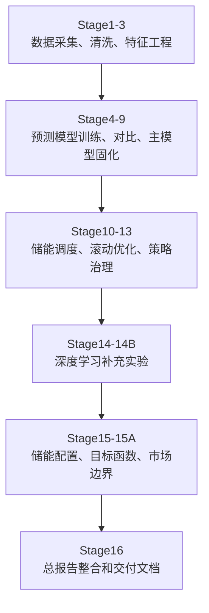
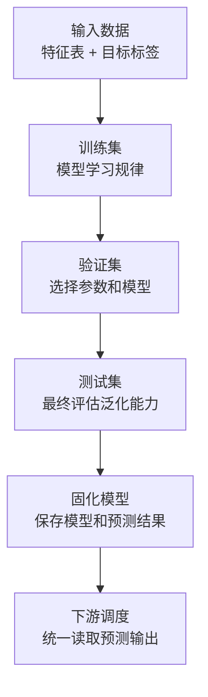
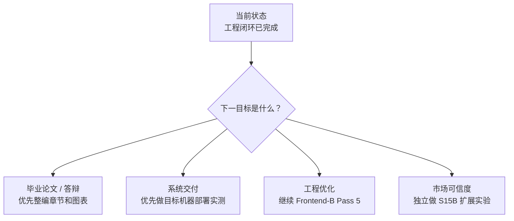

# 新能源储能调度系统项目学习上手指南

## 1. 先理解这个项目在做什么

本项目是一套面向“光伏功率预测 + 储能优化调度 + 可视化展示”的新能源系统原型。它不是单独训练一个模型，也不是单独做一个网页，而是把数据、模型、调度策略、后端接口和前端页面串成一条完整链路。

一句话概括：

> 先用公开数据预测未来光伏发电功率，再根据预测结果决定储能什么时候充电、什么时候放电，最后通过后端 API 和前端页面把结果展示出来。

核心目标可以拆成四件事：

| 目标 | 新手解释 | 项目中的体现 |
|---|---|---|
| 数据闭环 | 数据从哪里来、如何清洗、如何变成模型能用的表 | PVDAQ、NSRDB、OPSD 等公开数据 |
| 预测建模 | 用历史数据预测未来光伏功率 | LightGBM、CNN-LSTM、Attention-LSTM 等模型 |
| 储能调度 | 根据预测结果安排电池充放电 | Stage10 到 Stage15 的调度和敏感性分析 |
| 系统展示 | 把实验结果做成可操作、可演示的系统 | FastAPI 后端 + Vue 3 前端 |


Pitfall：不要把项目理解成“训练一个深度学习模型”。当前最稳的主线是工程闭环，深度学习只是模型对比的一部分。

## 2. 项目目录怎么读

新手看项目时，建议先从目录职责入手，不要一开始就钻进代码细节。

| 路径 | 作用 | 阅读优先级 |
|---|---|---:|
| `configs/` | 数据源、站点、实验参数配置 | 高 |
| `src/new_energy_sys/` | 核心 Python 包，包含数据处理、建模、调度、命令行入口 | 高 |
| `src/new_energy_sys/cli/` | 各阶段脚本入口，例如训练、推理、调度 | 高 |
| `backend/` | FastAPI 后端服务，负责接口、鉴权、数据读取 | 中 |
| `frontend/` | Vue 3 前端页面，负责可视化展示 | 中 |
| `reports/` | 已整理的阶段报告和图表 | 高 |
| `docs/` | 项目计划、交付文档、部署文档、学习指南 | 高 |
| `data/raw/` | 原始数据缓存，通常不提交到 Git | 中 |
| `data/processed/` | 处理后的数据、模型、实验产物，通常不提交到 Git | 高 |
| `scripts/` | 辅助脚本，例如 API smoke 测试 | 中 |

推荐阅读顺序：

1. `docs/reports_index.md`：知道有哪些报告。
2. `data/processed/pvdaq_nsrdb_2020_2022/stage16_final_integration_report.md`：看项目总报告。
3. `docs/production_deployment_guide.md`：看系统如何部署和验收。
4. `src/new_energy_sys/cli/`：看每个阶段如何通过命令执行。
5. `frontend/` 和 `backend/`：最后看系统展示层。

Pitfall：`data/processed/` 默认被 `.gitignore` 排除，换机器后可能没有这些产物，需要重新跑流水线或手动同步。

## 3. 基础术语说明

| 术语 | 全称或解释 | 在本项目中的含义 |
|---|---|---|
| PV | Photovoltaic，光伏 | 太阳能发电功率数据 |
| PVDAQ | Photovoltaic Data Acquisition | NREL 提供的光伏电站数据来源 |
| NSRDB | National Solar Radiation Database | 太阳辐照度和天气数据来源 |
| OPSD | Open Power System Data | 电价、负荷等电力系统数据来源 |
| API | Application Programming Interface，应用程序接口 | 前端从后端读取模型、预测、调度和报告数据的入口 |
| FastAPI | Python Web API 框架 | 本项目后端服务框架 |
| Vue | 前端框架 | 本项目前端页面框架 |
| LightGBM | Light Gradient Boosting Machine | 当前主线预测模型，适合表格数据 |
| CNN | Convolutional Neural Network，卷积神经网络 | 用于提取局部模式的深度学习结构 |
| LSTM | Long Short-Term Memory，长短期记忆网络 | 用于时间序列建模的深度学习结构 |
| TCN | Temporal Convolutional Network，时间卷积网络 | 一种处理时间序列的深度学习模型 |
| RMSE | Root Mean Squared Error，均方根误差 | 预测误差指标，越小越好 |
| MAE | Mean Absolute Error，平均绝对误差 | 预测误差指标，越小越好 |
| nRMSE | Normalized RMSE，归一化均方根误差 | 便于不同规模数据之间比较的误差指标 |
| SOC | State of Charge，电池荷电状态 | 电池当前剩余电量比例 |
| Pareto | 帕累托最优 | 多目标权衡下不能被其他方案全面超过的候选方案 |
| E2E | End-to-End，端到端测试 | 从用户视角验证前端、后端、数据链路是否连通 |
| JWT | JSON Web Token | 登录后用于身份认证的令牌 |
| CORS | Cross-Origin Resource Sharing，跨域资源共享 | 控制前端域名能否访问后端 API |

Pitfall：英文缩写不要只记字面意思，要结合项目中的角色理解。例如 SOC 在这里不是“系统状态”，而是电池剩余电量比例。

## 4. 项目推进主线

整个项目可以理解为 16 个阶段，从数据准备一路推进到总报告和部署文档。



## 5. 阶段一：数据采集与清洗

这一阶段解决“模型吃什么数据”的问题。

主要数据来源：

| 数据源 | 提供内容 | 用途 |
|---|---|---|
| PVDAQ | 光伏电站实际发电功率 | 作为预测目标 |
| NSRDB | 辐照度、温度、风速等天气数据 | 作为预测特征 |
| OPSD | 电价、负荷等电力系统数据 | 用于储能调度收益估算 |

关键处理动作：

1. 统一时间粒度：把不同来源的数据对齐到小时级。
2. 统一字段名称：让后续代码不用适配各种原始字段名。
3. 处理缺失值：删除或填补不完整数据。
4. 做质量检查：检查功率、辐照度、温度是否明显不合理。
5. 按时间顺序切分训练集、验证集、测试集。

新手重点理解：

| 概念 | 解释 |
|---|---|
| 时间对齐 | 不同数据源可能时间戳不同，必须对到同一个小时才能合并 |
| 缺失值 | 某些时刻没有数据，直接训练会导致模型报错或结果失真 |
| 时间泄漏 | 训练时不小心用了未来信息，会让模型指标虚高 |

Pitfall：不要随机打乱时间序列再切分训练集和测试集。预测未来时只能使用过去信息，所以必须按时间顺序切分。

## 6. 阶段二：特征工程

特征工程就是把原始数据加工成模型更容易理解的输入。

常见特征类型：

| 特征类型 | 示例 | 作用 |
|---|---|---|
| 时间特征 | 小时、月份、星期几 | 帮模型理解日周期、季节性 |
| 天气特征 | GHI、温度、风速、云量 | 帮模型理解天气对发电的影响 |
| 历史功率特征 | 前 1 小时、前 24 小时功率 | 帮模型利用历史惯性 |
| 目标标签 | 未来 24 小时光伏功率 | 模型要学习预测的对象 |

项目中最重要的标签是：

```text
target_pv_power_t_plus_24h
```

含义是：当前时刻 `t` 往后 24 小时的光伏功率。

两个容易混淆的特征组：

| 特征组 | 含义 | 是否适合作为真实上线主线 |
|---|---|---|
| `history_only` | 只使用预测时刻之前可获得的历史信息 | 是 |
| `target_plus` 或 `target_aligned` | 使用与未来目标时刻对齐的天气信息 | 只适合离线上限分析 |

Pitfall：`target_aligned` 指标可能更好，但它可能包含真实上线时拿不到的未来信息，不能直接当成生产模型输入。

## 7. 阶段三：预测模型训练

这一阶段解决“如何预测未来光伏功率”的问题。

项目做了两类模型：

| 类型 | 模型 | 特点 | 当前结论 |
|---|---|---|---|
| 表格机器学习 | LightGBM、XGBoost、CatBoost、RandomForest | 适合结构化表格数据，训练快，解释性较好 | LightGBM 最适合作为主模型 |
| 深度学习 | CNN-LSTM、Attention-LSTM、TCN | 适合序列模式，但训练复杂、对数据量敏感 | 已完成对比，但没有替代主模型 |

当前主模型：

```text
lightgbm_tuned history_only
```

关键指标：

| 指标 | 数值 |
|---|---:|
| 测试集 nRMSE | 0.1225 |
| 日间 nRMSE | 0.1689 |
| RMSE | 0.1372 kW |
| MAE | 0.0739 kW |

为什么主模型不是深度学习：

| 对比点 | LightGBM | 深度学习模型 |
|---|---|---|
| 训练稳定性 | 高 | 中 |
| 数据需求 | 较低 | 较高 |
| 工程部署 | 简单 | 更复杂 |
| 当前真实可用输入下表现 | 最稳 | 未形成明显替代优势 |

推荐结论写法：

> 深度学习模型已完成实现和对比，但在真实可获得输入条件下尚未稳定超过 LightGBM，因此系统主线选择 LightGBM，深度学习作为算法验证和性能边界分析。

Pitfall：不要因为“深度学习听起来更高级”就强行把它作为主模型。项目评价看的是真实可用性，不是模型名词复杂度。

## 8. 阶段四：主模型推理固化

训练模型只是第一步，真正工程化还需要“推理固化”。

推理固化的意思是：

1. 确定最终使用哪个模型。
2. 确定输入字段。
3. 确定输出文件。
4. 确定后续调度模块统一读取该输出。

本项目固化后的主输出是：

```text
data/processed/pvdaq_nsrdb_2020_2022/stage9_main_model_predictions.csv
```

它的价值不是再次提升指标，而是让后续储能调度、后端 API、前端展示都基于同一份预测结果，避免每个模块各跑一套逻辑。

Pitfall：如果预测输出文件换了，但调度、API 或前端仍读取旧文件，会出现“模型已更新但页面没变化”的问题。

## 9. 阶段五：储能调度

储能调度解决“预测出来以后怎么用”的问题。

简单理解：

| 场景 | 储能动作 |
|---|---|
| 光伏多、电价低、负荷不高 | 充电 |
| 光伏少、电价高、负荷高 | 放电 |
| 电池满了 | 不能继续充电 |
| 电池空了 | 不能继续放电 |

项目中储能调度经历了三个主要阶段：

| 阶段 | 方法 | 结果定位 |
|---|---|---|
| Stage10 | 固定阈值策略 | 暴露固定电价阈值不适配的问题 |
| Stage11 | 分位数阈值扫描 | 找到离线上限，但不适合直接上线 |
| Stage12 | 24 小时滚动优化 | 更保守、更可控，适合作为试点策略 |

关键结果：

| 策略 | 增量收益 EUR | 结论 |
|---|---:|---|
| Stage10 fixed threshold | -0.0227 | 拒绝 |
| Stage11 q40_q95 | 2.6573 | 离线上限 |
| Stage12 rolling | 0.6100 | 可作为受控试点 |

新手重点理解：

| 概念 | 解释 |
|---|---|
| 固定阈值 | 电价高于某个固定值就放电，低于某个固定值就充电 |
| 分位数 | 按数据分布自动选阈值，例如高于 95% 分位认为电价很高 |
| 滚动优化 | 每个时刻往未来看一段时间做计划，但只执行当前一步 |

Pitfall：Stage11 收益最高，但它是回看历史后的离线扫描结果，不能跳过治理分析直接作为上线策略。

## 10. 阶段六：治理分析与敏感性分析

治理分析解决“哪个策略更可靠”的问题，而不只是看收益最高。

项目评估调度策略时，会看：

| 指标 | 含义 |
|---|---|
| 增量收益 | 相比无储能多赚多少钱 |
| 等效循环 | 电池充放电使用强度 |
| 短缺电量 | 需求未被满足的部分 |
| 弃光量 | 光伏发出来但没用上的部分 |
| SOC 贴边比例 | 电池长期接近满电或空电的比例 |

Stage15 做了储能配置和目标函数敏感性分析。

推荐 Pareto 候选配置：

| 项目 | 数值 |
|---|---:|
| 配置 ID | `cap1p5_pow0p5_obj3` |
| 储能容量 | 3.36 kWh |
| 最大充放电功率 | 0.28 kW |
| 增量收益 | 1.8979 EUR |
| 等效循环 | 99.99 |
| 短缺量 | 769.04 kWh |
| 弃光量 | 0.0036 kWh |
| SOC 贴边比例 | 0.6700 |

Pitfall：Pareto 候选不是“生产最终方案”，而是当前数据、价格代理和目标函数条件下较均衡的候选解。

## 11. 阶段七：市场数据边界

收益分析依赖电价数据，因此必须讲清楚价格边界。

当前项目主实验期是：

```text
2020-01-01 到 2022-12-31
```

当前 Stage10 到 Stage15 的收益更多是基于 OPSD 映射电价做离线敏感性分析，不是真实市场结算收益。

市场数据结论：

| 数据源 | 是否可替代主实验 | 说明 |
|---|---|---|
| OPSD 映射电价 | 已用于主线 | 适合离线敏感性分析 |
| SPP WEIS RTBM LMP | 不可替代 2020-2022 主实验 | 适合 2023-04-01 后扩展 |
| EIA wholesale data | 不适合 | 区域和粒度不匹配 |
| EIA BAA hourly data | 不适合收益结算 | 可做区域运行背景 |

Pitfall：不能用 2023 年后的真实市场价格反向填补 2020-2022 主实验，否则时间范围和市场机制都不一致。

## 12. 阶段八：后端 API

后端负责把实验产物变成前端能读取的数据服务。

项目后端使用 FastAPI。

常见接口类型：

| 接口类型 | 作用 |
|---|---|
| 登录鉴权 | 验证用户身份，返回 JWT |
| 模型指标 | 返回主模型误差、模型对比结果 |
| 预测结果 | 返回光伏功率预测曲线 |
| 调度指标 | 返回储能收益、循环、短缺等结果 |
| 治理分析 | 返回策略评分和风险标签 |
| 报告读取 | 给前端展示 Markdown 报告 |
| 任务触发 | 允许前端提交后端任务 |

开发环境启动示例：

```powershell
$env:PYTHONPATH="src"
uvicorn backend.app.main:app --reload --host 127.0.0.1 --port 8000
```

生产环境必须显式配置：

```powershell
$env:NES_APP_ENV="production"
$env:NES_JWT_SECRET="replace-with-a-strong-secret"
$env:NES_CORS_ORIGINS="https://your-frontend-domain.example"
$env:NES_USERS_JSON='{"admin":{"password_hash":"<sha256>","role":"admin"}}'
```

Pitfall：生产环境不能使用默认 JWT secret、默认用户或宽松 CORS，否则会带来认证绕过和跨域访问风险。

## 13. 阶段九：前端展示

前端负责让项目“看得见、讲得清、能演示”。

主要页面：

| 页面 | 作用 |
|---|---|
| OverviewDashboard | 系统总览、核心指标、预测曲线 |
| ModelComparison | 模型对比 |
| DispatchSimulation | 储能充放电和收益展示 |
| GovernanceAnalysis | 策略治理和风险分析 |
| DataExplorer | 数据质量、字段、任务入口 |
| ReportViewer | 阶段报告展示 |
| Login | 登录鉴权 |

常用命令：

```powershell
cd frontend
npm install
npm run dev
npm run build
npm run test:e2e
```

Pitfall：前端构建通过不等于系统可交付。完整验收还需要后端 API、登录、报告读取、移动端页面和 E2E 测试一起通过。

## 14. 训练过程怎么理解

训练过程可以按“输入、学习、验证、固化”四步理解。



关键点：

1. 训练集用于让模型学习。
2. 验证集用于调参数、选模型。
3. 测试集用于最终报告指标。
4. 测试集不能参与调参，否则结果会虚高。
5. 模型指标不是唯一目标，还要看后续调度是否真正可用。

常见指标解释：

| 指标 | 越大越好还是越小越好 | 含义 |
|---|---|---|
| MAE | 越小越好 | 平均每个点预测差多少 |
| RMSE | 越小越好 | 对大误差更敏感 |
| nRMSE | 越小越好 | 归一化后的 RMSE，便于比较 |
| Daytime nRMSE | 越小越好 | 只看白天发电时段的误差 |

Pitfall：不要只看整体 nRMSE。光伏夜间功率接近 0，白天指标通常更能反映真实预测难度。

## 15. 当前项目完成度

| 模块 | 完成度 | 评价 |
|---|---:|---|
| 数据采集与清洗 | 100% | 主线数据已能支撑完整实验 |
| 特征工程 | 100% | 已形成主线特征表 |
| 表格模型预测 | 100% | LightGBM 主模型已固化 |
| 深度学习对比 | 100% | 已完成补充实验，但未替代主模型 |
| 主模型推理 | 100% | Stage9 输出已成为下游统一入口 |
| 储能调度 | 100% | 已完成固定阈值、分位数、滚动优化 |
| 治理与敏感性 | 100% | 已完成策略治理和 Pareto 配置分析 |
| 市场数据边界 | 60% | 已完成可行性验证，真实 WEIS 扩展尚未执行 |
| 后端 API | 90% | 核心接口完成，生产环境仍需目标机器实测 |
| 前端展示 | 90% | 主页面完成，仍可继续优化包体和图表体验 |
| 总报告与部署文档 | 100% | Stage16 总报告和生产部署指南已完成 |

Pitfall：完成度高不等于没有边界。真实市场结算、真实预测天气闭环、目标服务器部署仍需要单独验证。

## 16. 接下来最值得完善的部分

| 优先级 | 方向 | 为什么值得做 | 推荐程度 |
|---:|---|---|---|
| 1 | 论文正文和答辩材料整编 | 当前实验已经足够，最需要转化为可讲清楚的成果 | 强推荐 |
| 2 | 目标机器生产部署实测 | 部署文档已有，但还需要真实服务器验证 | 强推荐 |
| 3 | Frontend-B Pass 5 | 继续优化包体、图表异步加载、ECharts warning | 推荐 |
| 4 | S15B 真实市场扩展 | 用 2023-04-01 后 WEIS 数据增强市场可信度 | 可选 |
| 5 | 继续预测调参 | 边际收益较低，容易陷入无边界优化 | 不优先 |

推荐下一步路线：



Pitfall：不要把论文整编、前端优化、真实市场扩展混成一个大任务推进。它们的验收标准不同，应拆开做。

## 17. 新手上手建议

按下面顺序学习，认知负荷最低：

1. 先读本指南，理解项目做什么。
2. 再读 Stage16 总报告，理解关键结论。
3. 看 `docs/reports_index.md`，知道报告在哪里。
4. 看 `configs/data_sources.pvdaq_nsrdb_2020_2022.json`，理解主实验配置。
5. 看 `src/new_energy_sys/cli/`，理解各阶段命令怎么串起来。
6. 看 `backend/`，理解后端如何读取结果。
7. 看 `frontend/`，理解前端如何展示结果。
8. 最后再深入模型训练和调度算法细节。

阶段总结：

| 项目 | 结论 |
|---|---|
| 当前进度 | 已完成从数据到预测、调度、治理、前后端展示、总报告和部署文档的主闭环 |
| 工作内容 | 本指南将项目结构、推进流程、训练过程、关键结果、问题边界和后续优化统一整理 |
| 目标完成情况 | 已满足新手从零理解项目的学习入口要求 |
| 下一阶段可行性 | 论文整编和目标机器部署最可行；真实市场扩展可作为增强项；继续盲目调参不优先 |

Pitfall：上手时不要从深度学习代码开始读。先看数据流和阶段报告，再看模型代码，效率更高。
