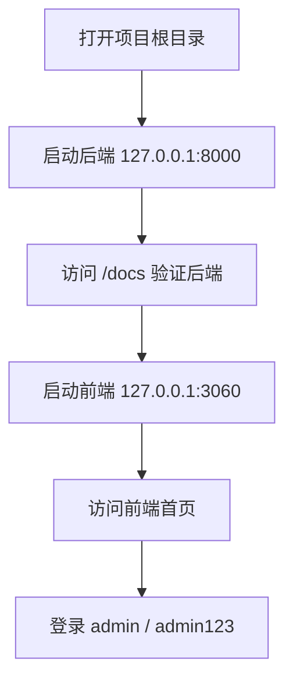

# 启动与排障说明

本文记录本机复测得到的启动问题和固定解决方法，适用于 Windows PowerShell 开发环境。

## 推荐启动流程



### 方案 A：两个终端手动启动（推荐）

终端 1：启动后端。

```powershell
cd C:\Project\New_Energy_Sys
$env:PYTHONPATH = "src;."
python -m uvicorn backend.app.main:app --host 127.0.0.1 --port 8000
```

验证后端：

```powershell
Invoke-WebRequest -Uri http://127.0.0.1:8000/docs -UseBasicParsing
```

终端 2：启动前端。

```powershell
cd C:\Project\New_Energy_Sys\frontend
npm run dev
```

正常输出应包含：

```text
Local:   http://127.0.0.1:3060/
```

默认前端地址：

```text
http://127.0.0.1:3060
```

Pitfall：后端命令会持续占用当前终端，看到 `Uvicorn running on http://127.0.0.1:8000` 后不要关闭窗口。

### 方案 B：临时指定其他前端端口

如果 `3060` 也被占用，可以临时指定端口：

```powershell
cd C:\Project\New_Energy_Sys\frontend
npm run dev -- --host 127.0.0.1 --port 3070
```

Pitfall：如果改用其他端口，浏览器访问地址也要同步改成对应端口；后端仍保持 `8000`。

## 已复现问题：3060 显示启动但浏览器拒绝连接

现象：

```text
Vite 输出 Local: http://localhost:3060/
浏览器访问 localhost:3060 报 ERR_CONNECTION_REFUSED
```

检查命令：

```powershell
netstat -ano | Select-String ':3060'
Resolve-DnsName localhost
```

本机复测结果显示 Vite 只监听在 IPv6 回环地址：

```text
TCP    [::1]:3060    [::]:0    LISTENING
```

同时 `localhost` 会解析出两个地址：

```text
localhost AAAA ::1
localhost A    127.0.0.1
```

这会造成不稳定：Vite 进程看起来已经启动，但浏览器或检查脚本如果走 `127.0.0.1:3060`，就会因为没有 IPv4 监听而被拒绝连接。

固定解决方法：

1. `frontend/vite.config.js` 已显式设置 `server.host = '127.0.0.1'`。
2. `/api` 代理目标已从 `http://localhost:8000` 改为 `http://127.0.0.1:8000`。
3. 修改后必须停止旧的 Vite 进程，再重新运行 `npm run dev`。
4. 浏览器统一访问 `http://127.0.0.1:3060`，不要再用 `http://localhost:3060`。

如果旧进程仍占用端口，先在启动 Vite 的终端按 `Ctrl + C`，再重新启动。也可以用下面命令确认监听地址已经变成 `127.0.0.1:3060`：

```powershell
netstat -ano | Select-String ':3060'
```

Pitfall：看到 Vite 打印 `ready` 不等于浏览器一定能访问；必须确认监听地址和浏览器访问地址属于同一个回环协议族。

## 已复现问题：前端 3000 端口启动失败

复现命令：

```powershell
cd C:\Project\New_Energy_Sys\frontend
npm run dev -- --host 127.0.0.1 --port 3000
```

错误现象：

```text
Error: listen EACCES: permission denied 127.0.0.1:3000
```

本机检查结果：

```powershell
netsh interface ipv4 show excludedportrange protocol=tcp
```

输出中包含：

```text
Start Port    End Port
2956          3055
```

这说明 Windows 已保留 `2956-3055` 端口段，`3000` 和 `3001` 都落在保留范围内。此时即使端口没有被普通进程监听，Vite 也会因为系统端口保留而无法绑定。

解决方法：

1. 项目已将 Vite 默认端口改为 `3060`。
2. 日常启动直接运行 `npm run dev`。
3. 如果仍失败，执行 `netsh interface ipv4 show excludedportrange protocol=tcp`，选择不在保留范围内的端口。

Pitfall：不要只用 `Get-NetTCPConnection` 判断端口是否可用；系统保留端口可能没有监听进程，但仍会导致 `EACCES`。

## 前后端链路检查

后端健康检查：

```powershell
Invoke-WebRequest -Uri http://127.0.0.1:8000/docs -UseBasicParsing
```

前端首页检查：

```powershell
Invoke-WebRequest -Uri http://127.0.0.1:3060 -UseBasicParsing
```

API 代理检查：

```powershell
Invoke-WebRequest -Uri http://127.0.0.1:3060/api/config -UseBasicParsing
```

如果前端首页可访问但 `/api/config` 失败，优先检查后端是否仍在运行。

Pitfall：前端打开成功只代表 Vite 已启动，不代表后端 API 链路正常。

## 本次复测结论

- 后端 `127.0.0.1:8000` 可以正常启动。
- 前端绑定 `127.0.0.1:3000` 失败，错误为 `listen EACCES`。
- 本机 Windows 保留端口范围包含 `2956-3055`，因此 `3000/3001` 不适合作为默认开发端口。
- 前端改用 `3060` 后还需要显式绑定 `127.0.0.1`，避免只监听 `[::1]:3060` 导致浏览器拒绝连接。

Pitfall：历史文档或终端输出中仍可能出现 `localhost`，以后以 `http://127.0.0.1:3060` 和 `frontend/vite.config.js` 为准。
