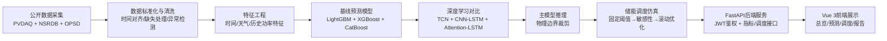

# 本科毕业设计（论文）开题报告

## 课题名称：基于深度学习的新能源储能侧优化调度系统设计与实现

---

## 一、选题依据

### 1.1 选题背景

在"碳达峰、碳中和"战略目标驱动下，全球光伏装机规模持续高速增长。据国际能源署光伏电力系统项目（IEA PVPS）统计，2024年全球新增光伏装机容量已超过500GW，累计装机突破2TW[1]。我国新能源装机占比更已历史性超过火电，新能源正从"补充电源"向"主体电源"转变。然而，光伏发电受太阳辐照度、云量、温湿度等气象因素影响显著，出力具有间歇性、波动性和随机性特征——晴天正午可达额定容量的80%以上，阴雨天和夜间则骤降至极低水平，由此引发的"鸭曲线"（Duck Curve）净负荷剧烈波动问题已在加州等光伏高渗透地区充分显现[2]。

储能系统为解决上述问题提供了关键支撑。锂电池储能具有响应速度快（毫秒级）、充放电双向可调、选址灵活等优势，可在光伏富余时吸收电能、在光伏不足或负荷高峰时释放电能，实现新能源出力的时间平移。Hesse等[3]对固定式锂电池储能系统在电网中的应用进行了全面综述，涵盖系统设计、拓扑结构和应用场景。近年来，锂电池储能成本持续下降，我国新型储能累计投运规模已超过70GW，储能经济性逐步显现。

然而，储能系统的价值释放高度依赖两个核心环节的协同：一是**精准的光伏功率预测**，为调度提供前瞻信息；二是**科学的储能充放电调度策略**，在满足物理约束的前提下最大化经济收益或消纳率。当前多数储能项目仍采用固定阈值或简单时段的规则型调度，未能充分利用天气预报和电价信号，调度收益潜力远未释放。葛磊蛟等[4]指出高比例分布式光伏接入下多类型储能的优化配置和协调控制仍是亟待解决的关键问题；谢丽蓉等[5]的研究表明将预测误差补偿与波动平抑纳入储能控制策略可显著提升系统运行效果。

本课题拟构建"光伏功率预测—储能优化调度—可视化展示"闭环原型系统，以公开数据为基础，利用机器学习和深度学习方法提升短期光伏功率预测精度，在此基础上设计滚动优化调度策略，通过前后端分离的Web系统进行可视化验证。

### 1.2 国内外研究现状

#### （1）光伏功率预测方法

光伏功率预测方法可分为物理方法、统计方法和机器学习方法三大类。物理方法基于太阳辐射传输模型和光伏组件物理模型进行出力估算，不依赖历史功率数据，但对气象参数精度高度敏感。Dolara等[6]系统比较了多种物理模型在光伏功率输出预测中的表现，发现简单模型在特定条件下与复杂模型精度相当，但普适性不足。

机器学习方法近年来取得了显著进展。Ke等[7]提出的LightGBM采用基于直方图的叶子生长策略和梯度单边采样技术，在训练效率和内存占用方面显著优于传统GBDT，已成为结构化表格预测任务的强基线。张沛等[8]对基于深度学习的光伏功率预测方法进行了系统综述，指出CNN-LSTM、Attention等混合架构正成为主流方向。Qing和Niu[9]使用LSTM结合天气预报数据进行小时级日前太阳辐照度预测，验证了深度时序模型较传统方法的优势。Bai等[10]提出的时序卷积网络（TCN）在多种序列建模基准上达到或超越了LSTM性能，同时具备并行训练和灵活感受野的优势。

在混合架构方面，Wang等[11]将LSTM与卷积网络结合用于光伏功率预测，在公共数据集上取得优于单一模型的精度。Qu等[12]提出基于注意力机制的CNN-LSTM网络，嵌入多相关变量和目标变量预测模式，实现了日前小时级光伏功率预测的先进性能。朱峻嬉等[13]进一步将双向LSTM与注意力机制融合，构建CNN-BiLSTM-Attention模型，在四川某光伏电站数据上验证了多维度特征融合的有效性。

现有研究的不足：多数研究缺少在统一数据、统一切分、统一评估口径下的系统性模型对比；部分研究训练/测试集划分未严格按时间顺序，导致前向信息泄漏使指标虚高；不少研究不区分"事后天气再分析数据"和"预测时刻真实可获得的天气预报"，混淆离线上限与真实上线预期。

#### （2）储能调度优化方法

储能调度优化方法可分为三个层级：规则型、优化型和学习型。

规则型调度基于固定充放电阈值或分时电价时段决策，实现简单、可解释，但适应性差，阈值参数对电价分布高度敏感。优化型调度将储能调度建模为数学规划问题，以收益最大化或弃光率最小为目标，在SOC安全区间、充放电功率上限等硬约束下求解最优充放电计划。Li等[15]提出基于功率波动缓解优先级和模型预测控制（MPC）的双时间尺度微电网调度方法，实现了日前和日内两级协调。薄利明等[16]提出考虑源荷储联合调峰的日前-日内两阶段滚动优化调度策略，验证了滚动时域框架在含储能系统中的有效性。Padmanabhan等[17]研究了电池储能系统在能量和备用市场中的联合优化投标策略，揭示了储能参与多市场交易的价值叠加效应。

学习型调度利用深度强化学习（DRL）或模仿学习训练调度策略网络。Cao等[18]将精确锂电池退化模型嵌入深度强化学习储能套利框架，实现了考虑寿命衰减的经济调度。袁丁等[19]基于日前光伏功率预测构建了光伏储能系统协调优化调度策略，验证了预测-调度闭环的工程可行性。

共性瓶颈：大部分调度研究假设完美预测，未接入真实预测误差链；储能容量、功率配置和惩罚项之间的多目标权衡缺乏系统分析；学习型调度在约束满足性和泛化性方面仍需验证。

#### （3）数据源与系统工程

光伏预测与储能调度常用的公开数据源包括：NREL的PVDAQ数据库[21]（提供真实分布式光伏电站的分钟至小时级实测功率）、NSRDB太阳能资源数据库[22]（提供1988年至今的卫星反演GHI、DNI、DHI等小时级辐照数据）、OPSD开放电力系统数据库[23-24]（提供欧洲多国小时级负荷、电价和发电数据）、以及Open-Meteo免费天气API[20]（提供全球历史与实时预报的小时级天气数据）。这些数据源为缺少真实电站运行数据的研究提供了实验基础。在系统工程化方面，Python生态的FastAPI框架、Vue 3前端框架、LightGBM[7]和PyTorch等为快速构建原型系统提供了成熟工具链。

### 1.3 选题目的与意义

本课题的目的是：以公开数据集为基础，构建从数据采集与清洗、特征工程、光伏功率预测、储能调度优化到Web可视化展示的完整技术链路，验证"深度学习预测+滚动优化调度"方案的可行性与效果。具体目标：

1. 在PVDAQ真实光伏电站数据上，系统性对比LightGBM[7]、TCN[10]、CNN-LSTM[12]等模型的短期光伏功率预测性能，建立严格的时序切分和评估规范。
2. 基于日前光伏预测结果，设计考虑电价信号、SOC约束、循环成本和短缺风险的滚动优化储能调度策略[16,19]。
3. 对比固定阈值、分位数敏感和滚动优化三类策略的调度效果，分析储能容量、功率和目标函数权重的多维影响。
4. 搭建FastAPI后端与Vue 3前端，形成可运行、可展示、可验证的原型系统。

本课题的意义：为缺少真实电站数据的学术研究提供一条可复现的"数据—预测—调度—展示"替代实验路线；在统一评估框架下厘清不同预测模型和调度策略的相对优劣与适用边界；形成完整的毕设级工程原型，为光伏配储项目提供方法参考。

---

## 二、研究的主要内容和方法

### 2.1 研究目标

设计并实现一套面向新能源储能侧的优化调度原型系统，在公开光伏、天气和电力市场数据上完成从数据治理、功率预测、储能调度到结果展示的完整闭环。系统以光伏发电为主要场景，以短期/日前功率预测为基础能力，以滚动优化储能调度为核心业务，以Web可视化界面为交付形态。

### 2.2 研究内容

**（1）数据层——多源数据采集与治理**

- 采集PVDAQ光伏实测功率[21]、NSRDB太阳辐照[22]、OPSD负荷与电价[23-24]、Open-Meteo天气[20]等多源数据。
- 建立统一数据标准：时间粒度统一至小时级、时区统一至UTC、字段命名规范统一。
- 数据清洗：缺失值检测与处理（超阈值剔除、低阈值线性插值）、物理合理性异常值检测、重复记录去重。
- 严格按时间顺序切分训练集（前70%）、验证集（中15%）、测试集（后15%），杜绝随机切分引入时间泄漏。

**（2）预测层——短期光伏功率预测建模**

- 构建多维度特征体系：时间特征（小时、日、月、星期）、天气特征（温度、湿度、气压、风速、云量、GHI、DNI、DHI）、历史功率特征（前1h/3h/6h/24h/48h功率值）、以及目标时刻天气预报特征。
- 基线模型：以LightGBM[7]为基线，完成特征消融、超参数调优和多预测时域（t+1h、t+6h、t+24h）对比。同时训练XGBoost、CatBoost、RandomForest等表格模型作为横向参照。
- 深度学习对比：训练TCN[10]、CNN-LSTM[12]和Attention-LSTM等序列模型，在相同数据切分和评估指标（nRMSE、RMSE、MAE）下与基线公平对比；加入Persistence简单基线确认任务非平凡性[8]。
- 推理后处理：固化主模型推理链路，对预测值施加物理边界裁剪（功率∈[0, capacity×1.05]）。

**（3）调度层——储能优化调度策略**

- 构建储能仿真环境：定义储能模型参数（额定容量、充放电功率、效率η、SOC安全区间[0.1, 0.9]）、电价/负荷输入信号、预测功率接口。
- 固定阈值调度：设定基于电价阈值的充放电规则，验证调度链路正确性和物理约束的强制满足（SOC不越界、功率不超限、禁止同时充放电、能量守恒）。
- 策略敏感性分析：按电价分位数生成多组充放电阈值组合，扫描各策略的收益、充放电量、循环次数和约束表现。
- 滚动优化调度：基于24h前瞻窗口构建滚动价差优化模型[16]，每个时刻利用未来24h的预测PV和电价生成充放电计划，仅执行首小时动作；目标函数包含预期收益、循环成本、短缺惩罚和终端SOC惩罚。

**（4）应用层——Web可视化与系统集成**

- 后端API：基于FastAPI构建RESTful服务，提供模型指标、预测结果、调度指标、报告读取等接口；实现JWT鉴权，区分管理员与访客。
- 前端界面：基于Vue 3 + Vite + Element Plus + ECharts构建SPA，包含总览大屏、模型对比、调度仿真、数据探索、报告查看五个页面。
- 系统部署：前后端分离架构，开发环境Vite代理转发至uvicorn；生产环境Nginx反向代理统一服务。

### 2.3 研究方法与技术路线

**研究方法**：采用"数据驱动建模+优化仿真+原型实现"研究范式。预测侧以监督学习为核心，将光伏功率预测建模为结构化表格回归问题；调度侧以滚动时域优化为框架[16]，将充放电决策建模为带约束的前瞻优化问题；工程侧采用前后端分离Web架构完成集成与交付。

**技术路线**：

**关键技术选型**：

| 环节 | 方案A | 方案B | 选择 | 理由 |
|------|-------|-------|------|------|
| 基线模型 | LightGBM[7] | XGBoost | LightGBM | 训练更快、内存更省、leaf-wise生长效率更高 |
| 序列模型 | TCN[10] | LSTM | 两者对比 | TCN并行训练快，LSTM时序记忆强，各有优势 |
| 调度方法 | 规则引擎 | MPC[15] | 渐进升级 | 先用规则验证链路，再升级为滚动优化 |
| 后端框架 | FastAPI | Flask | FastAPI | 异步原生支持、自动OpenAPI文档、类型安全 |
| 前端框架 | Vue 3 | React | Vue 3 | 学习曲线平缓、Element Plus生态成熟 |

**实验方案**：

1. **预测实验**：在PVDAQ System 10（1.12kW分布式光伏）的2020-2022年数据上，按70%/15%/15%时序切分，训练LightGBM[7]、TCN[10]、CNN-LSTM[12]等模型，以nRMSE为主评价指标，对比不同模型和不同特征组（仅历史特征 vs. 历史+目标对齐天气特征）的预测性能。
2. **调度实验**：基于主模型t+24h预测结果，消费OPSD映射电价信号[23-24]，分别运行固定阈值、分位数敏感和24h滚动优化调度，以增量收益（相对无储能基线）、充放电量、等效循环次数、短缺电量和SOC贴边比例为核心评价指标[19]。
3. **敏感性实验**：在滚动优化框架下，扫描储能容量、充放电功率和目标函数惩罚项等配置参数，通过Pareto前沿分析探索收益、循环、短缺的多目标权衡关系。

**质量保障**：时序切分严格按时间顺序；预测值经物理边界裁剪；调度结果经SOC/功率/无冲突/能量守恒约束审计；严格区分"后验天气数据"和"预测时刻真实可获得的天气预报数据"。

---

## 三、中外文参考文献

[1] International Energy Agency Photovoltaic Power Systems Programme. Snapshot of Global PV Markets 2025[R]. Paris: IEA PVPS, 2025.

[2] California Independent System Operator. What the Duck Curve Tells Us About Managing a Green Grid[R/OL]. California: CAISO, 2016. https://www.caiso.com/documents/flexibleresourceshelprenewables_fastfacts.pdf.

[3] Hesse H C, Schimpe M, Kucevic D, et al. Lithium-ion battery storage for the grid: A review of stationary battery storage system design tailored for applications in modern power grids[J]. Energies, 2017, 10(12): 2107.

[4] 葛磊蛟, 郑轶文, 李小平, 等. 高比例分布式光伏接入下配电网多类型储能优化配置技术综述[J]. 浙江电力, 2025, 44(5): 1-11.

[5] 谢丽蓉, 郑浩, 魏成伟, 等. 兼顾补偿预测误差和平抑波动的光伏混合储能协调控制策略[J]. 电力系统自动化, 2021, 45(3): 130-138.

[6] Dolara A, Leva S, Manzolini G. Comparison of different physical models for PV power output prediction[J]. Solar Energy, 2015, 119: 83-99.

[7] Ke G, Meng Q, Finley T, et al. LightGBM: A highly efficient gradient boosting decision tree[C]//Advances in Neural Information Processing Systems 30. Long Beach: Curran Associates, 2017: 3149-3157.

[8] 张沛, 曹泽凯, 付学谦, 等. 基于深度学习的光伏功率预测方法研究综述[J]. 电力信息与通信技术, 2025, 23(12): 78-88.

[9] Qing X, Niu Y. Hourly day-ahead solar irradiance prediction using weather forecasts by LSTM[J]. Energy, 2021, 222: 119932.

[10] Bai S, Kolter J Z, Koltun V. An empirical evaluation of generic convolutional and recurrent networks for sequence modeling[J]. arXiv preprint arXiv:1803.01271, 2018.

[11] Wang K, Qi X, Liu H. Photovoltaic power forecasting based LSTM-convolutional network[J]. Energy, 2019, 189: 116225.

[12] Qu J, Qian Z, Pei Y. Day-ahead hourly photovoltaic power forecasting using attention-based CNN-LSTM neural network embedded with multiple relevant and target variables prediction pattern[J]. Energy, 2021, 232: 120996.

[13] 朱峻嬉, 郑淑娴, 金典, 等. 基于CNN-BiLSTM-Attention的光伏发电功率预测研究[J]. 四川电力技术, 2026, 49(1): 14-21, 95.

[14] 安源, 冯昊彤, 施宗链, 等. 基于光伏区间预测的综合能源系统混合储能双层优化调度[J]. 太阳能学报, 2026, 47(3): 61-71.

[15] Li D, Ren L, Liu F, et al. Two-time scale microgrid scheduling based on power fluctuation mitigation priority and model predictive control[J]. Energy, 2025, 324: 135760.

[16] 薄利明, 邹鹏, 郑惠萍, 等. 考虑源荷储联合调峰的日前-日内两阶段滚动优化调度[J]. 华北电力大学学报（自然科学版）, 2025(1): 34-43.

[17] Padmanabhan N, Ahmed M, Bhattacharya K. Battery energy storage systems in energy and reserve markets[J]. IEEE Transactions on Power Systems, 2021, 36(1): 440-453.

[18] Cao J, Harrold D, Fan Z, et al. Deep reinforcement learning-based energy storage arbitrage with accurate lithium-ion battery degradation model[J]. IEEE Transactions on Smart Grid, 2020, 11(5): 4513-4521.

[19] 袁丁, 顾东健, 李存, 等. 基于日前预测的光伏储能系统协调优化调度策略[J]. 微型电脑应用, 2026, 42(3): 10-14.

[20] Zippenfenig P. Open-Meteo.com Weather API[CP/OL]. Zenodo, 2023. https://doi.org/10.5281/zenodo.7970649.

[21] Deline C, Perry K, Deceglie M, et al. Photovoltaic Data Acquisition (PVDAQ) Public Datasets[DS/OL]. Golden: National Renewable Energy Laboratory, 2021. https://doi.org/10.25984/1846021.

[22] Sengupta M, Xie Y, Lopez A, et al. The National Solar Radiation Database (NSRDB)[J]. Renewable and Sustainable Energy Reviews, 2018, 89: 51-60.

[23] Open Power System Data. Time series data package[DS/OL]. 2020. https://data.open-power-system-data.org/time_series/.

[24] Wiese F, Schlecht I, Bunke W D, et al. Open Power System Data: Frictionless data for electricity system modelling[J]. Applied Energy, 2019, 236: 401-409.

---

## 四、进度安排

| 阶段 | 时间安排 | 工作内容 | 预期产出 |
|------|----------|----------|----------|
| 第一阶段：数据准备与治理 | 第1-4周 | 下载PVDAQ、NSRDB、OPSD数据；完成数据标准化（时区统一、粒度对齐、字段规范）；实现缺失值检测、异常值剔除和时间顺序切分 | 标准化数据集、数据质量报告 |
| 第二阶段：特征工程与基线建模 | 第5-8周 | 构建时间特征、天气特征、历史功率特征体系；训练LightGBM基线模型，完成消融实验和超参数调优；评估t+1h/t+6h/t+24h多时域预测性能 | 特征数据集、LightGBM基线模型、基线实验报告 |
| 第三阶段：深度学习对比实验 | 第9-12周 | 实现TCN和CNN-LSTM序列模型训练管道；在相同数据切分和评估口径下与LightGBM公平对比；加入Persistence基线验证任务难度；物理边界裁剪后处理 | 深度学习模型文件、模型对比报告 |
| 第四阶段：储能调度仿真 | 第13-17周 | 构建储能调度仿真环境；实现固定阈值调度、分位数敏感性分析和24h滚动优化调度；消费主模型预测结果，对比三类策略的收益与风险特征 | 调度结果数据集、调度策略对比报告 |
| 第五阶段：系统集成与展示 | 第18-20周 | 搭建FastAPI后端服务（鉴权、指标查询、调度指标、报告接口）；开发Vue 3前端界面（总览大屏、模型对比、调度仿真、报告浏览）；前后端联调与部署验证 | 可运行的Web原型系统 |
| 第六阶段：论文撰写与答辩 | 第21-24周 | 整理全部实验结果和系统截图；撰写毕业论文各章节；按学校规范完成格式排版；准备答辩演示材料 | 毕业设计论文、答辩PPT |

**进度保障措施**：每阶段结束前进行质量门禁检查（数据链路完整性、时序无泄漏、物理约束通过），不满足门禁条件不进入下一阶段；关键实验过程留存脚本和产物，确保全链路可复现。
