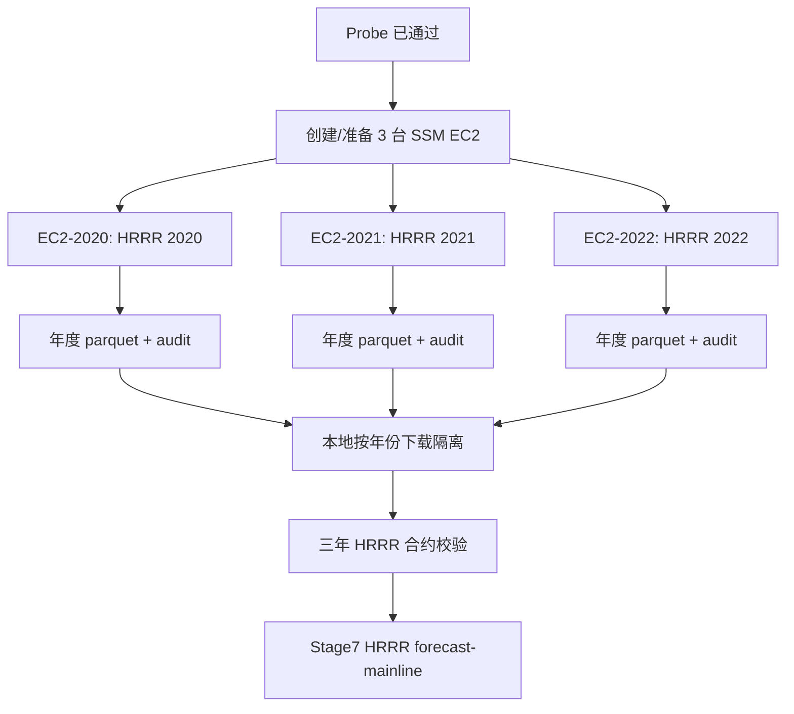

# HRRR 三年并行抽取计划

## Summary
采用 3 台 EC2 并行抓取不同年份：现有实例跑 2022，新增两台同配置实例分别跑 2020、2021。每台只负责一个完整年份，远程月度抽取和年度 merge 在各自实例内完成；本地下载时按年份隔离目录，最后再做三年合并和 Stage7 合约校验。

## Key Changes
| 方案 | 做法 | 推荐 | Pitfall |
|---|---|---:|---|
| A. 三台 EC2 按年份并行 | 2020/2021/2022 各一台，互不共享远程工作目录和结果目录 | 推荐 | 需要隔离 S3 bucket / 下载目录，避免结果覆盖 |
| B. 单台 EC2 内多进程按月份并行 | 一台机器同时跑 12 个月 | 不推荐 | HRRR Zarr/GRIB 读放大明显，容易触发 I/O、内存或限流问题 |
| C. 保持单台串行 | 不改架构，只慢慢跑 | 不推荐 | 时间成本过高，失败重跑周期太长 |

需要先做两处小改造：
- `scripts/aws-hrrr-run-ssm.ps1` 增加年份隔离能力：
  - bucket 默认名加入 `ForecastYear` 和随机短后缀，避免三条命令同秒启动时撞 bucket。
  - `download_after_success` 指向 `hrrr_ssm_results/<year>/`，不要再全部下载到同一个目录。
- 本地验收脚本按年份读取：
  - `hrrr_ssm_results/2020/stage7_hrrr_forecast_weather_2020_f24.parquet`
  - `hrrr_ssm_results/2021/stage7_hrrr_forecast_weather_2021_f24.parquet`
  - `hrrr_ssm_results/2022/stage7_hrrr_forecast_weather_2022_f24.parquet`

## Execution Plan
1. 复制现有 EC2 的启动配置，新建两台同规格实例，并挂同一个 IAM instance profile，确保支持：
   - SSM RunCommand
   - 读 NOAA public HRRR S3
   - 写 `new-energy-hrrr-*` 临时结果桶
2. 分别执行三条 full-run SSM：
   - 现有实例：`-ForecastYear 2022 -AllowFullRun`
   - 新实例 A：`-ForecastYear 2021 -AllowFullRun`
   - 新实例 B：`-ForecastYear 2020 -AllowFullRun`
3. 每台完成后只下载对应年份结果到独立目录。
4. 对每一年单独运行年度 `validate_hrrr_stage7_contract`。
5. 三年都通过后，合并 2020-2022 HRRR forecast weather，作为 Stage7 的 `HRRR forecast-mainline` 输入。
6. Stage7 不覆盖原 NSRDB Stage2/Stage3 主线，只在 Stage7 替换 `target_plus_*` 未来天气特征，保留原历史真实主线作为基线对照。

## Test Plan
- 并发前：
  - `aws-hrrr-run-ssm.ps1 -DryRun` 对 2020/2021/2022 各跑一次，确认 bucket、result URI、download 目录互不冲突。
  - 本地 `compileall` 和 HRRR 单元测试通过。
- 并发中：
  - 每个 command id 独立监控。
  - 任一年失败不影响其他年份。
- 并发后：
  - 每年 parquet 覆盖率 >= 99.5%。
  - GHI 非零率、夏季峰值、DSWRF source trace、降水逐小时差分、物理范围、issue_time 泄漏全部通过。
  - 三年合并后再跑一次整体 contract，才允许 Stage7。

## Assumptions
- 采用方案 A：三台 EC2 按年份并行。
- 三台实例使用同一 region：`us-west-1`。
- HRRR 预测数据作为 Stage7 主线，不替换 Stage2/Stage3 的历史真实基线。
- `target_plus_24h` 使用 HRRR f24 附近预报；后续建议把 `target_plus_6h` 改成 horizon-aware，使用 f6 附近预报，避免 t+6 任务使用过旧 f24 数据。
