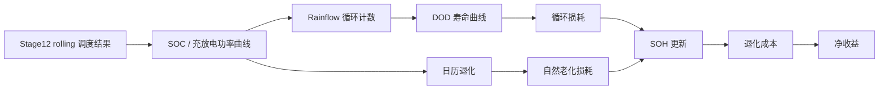

# S17 电池仿真增强方法说明

## 1. 方法定位

S17 用于增强电池侧仿真的真实度。它不替换 Stage12 rolling 调度，也不改写 Stage15 配置敏感性结果，而是在已有调度动作上增加 SOH、循环退化、日历退化和净收益核算。



Pitfall：S17 是工程近似退化模型，不是电芯级电化学模型。当前项目没有电压、电流、温度传感器数据，不应声称厂家级寿命预测。

## 2. 可信依据

| 来源 | 可借鉴内容 | 本项目采用方式 |
|---|---|---|
| NREL SAM Battery Life | 循环退化、日历退化、rainflow cycle counting、DOD 曲线、容量衰减 | 作为 S17 设计主依据 |
| NREL BLAST | 电池寿命受温度、SOC 历史、电流、循环深度、循环频率影响 | 当前保留温度因子接口，默认固定为 1 |
| NREL Battery Lifespan Research | 强调环境、循环、电化学窗口对寿命的影响 | 用于说明边界和后续升级方向 |
| BESS degradation review | 调度不能只看短期收益，还要计入寿命成本 | 用净收益替代单纯毛收益 |

Pitfall：引用 NREL/SAM 的方法思想，不等于完全复现 SAM 的所有内部参数。论文中应表述为 “SAM-style engineering approximation”。

## 3. 状态变量

| 字段 | 含义 |
|---|---|
| `battery_soc` | 电池荷电状态 |
| `battery_soh` | 电池健康状态 |
| `available_capacity_kwh` | 当前可用容量，等于额定容量乘以 SOH |
| `charge_c_rate` | 充电倍率 |
| `discharge_c_rate` | 放电倍率 |
| `cycle_depth_dod` | rainflow 识别出的循环深度 |
| `cycle_damage` | 循环造成的 SOH 损耗 |
| `calendar_damage` | 日历老化造成的 SOH 损耗 |
| `degradation_cost_eur` | 折算后的电池寿命成本 |
| `net_value_after_degradation_eur` | 扣除电池退化成本后的净收益 |

Pitfall：`battery_soh` 只能下降，不能在回放中恢复。若出现 SOH 上升，说明退化核算存在错误。

## 4. 循环退化

S17 使用 SOC 序列做 rainflow 循环计数。每个循环根据 DOD 查询寿命曲线：

| DOD | Cycle life to 80% SOH |
|---:|---:|
| 0.1 | 15000 |
| 0.2 | 10000 |
| 0.4 | 6000 |
| 0.6 | 4000 |
| 0.8 | 3000 |
| 1.0 | 2000 |

循环损耗：

```text
cycle_damage = count * (1 - SOH_EOL) / N_cycles(DOD)
```

Pitfall：不能只用总吞吐量估算寿命。浅循环和深循环对寿命影响不同，DOD 必须进入模型。

## 5. 日历退化

当前没有真实电池温度数据，因此采用简化日历退化：

```text
calendar_damage_per_hour = base_calendar_fade_per_year / 8760
                          * soc_stress_factor
                          * temperature_stress_factor
```

默认：

```text
base_calendar_fade_per_year = 0.015
temperature_stress_factor = 1.0
soc_stress_factor = 1 + 0.5 * max(mean_soc - 0.5, 0)
```

Pitfall：日历退化不能省略。长期高 SOC 静置即使没有循环，也应产生自然老化。

## 6. 输出和命令

推荐命令：

```powershell
$env:PYTHONPATH="src"
python -m new_energy_sys.cli.run_stage17_battery_degradation `
  --config configs\data_sources.pvdaq_nsrdb_2020_2022.json `
  --dispatch-input data\processed\pvdaq_nsrdb_2020_2022\stage12_storage_rolling_optimization_results.csv
```

输出：

| 文件 | 内容 |
|---|---|
| `stage17_battery_degradation_replay.csv` | 小时级 SOH、SOC、退化成本、净收益 |
| `stage17_battery_degradation_metrics.csv` | 场景级指标 |
| `stage17_battery_degradation_sensitivity_metrics.csv` | replacement cost 和寿命曲线敏感性 |
| `stage17_battery_degradation_report.json` | 机器可读报告 |
| `stage17_battery_degradation_report.md` | 中文阶段报告 |

Pitfall：如果 Stage12 结果不存在，应先重新运行 Stage12，而不是用 Stage10 或 Stage15 结果强行替代。

## 7. 阶段总结

| 项目 | 结论 |
|---|---|
| 当前进度 | 已定义 S17 电池退化增强方法 |
| 工作内容 | 引入 rainflow、DOD 寿命曲线、日历退化、SOH 和净收益 |
| 目标完成情况 | 能显著提升电池仿真的可信度 |
| 下一阶段可行性 | 可继续接入 API/前端，或替换为真实厂家寿命曲线 |

Pitfall：S17 得到的是离线调度回放下的寿命成本，不是真实市场收益承诺。
