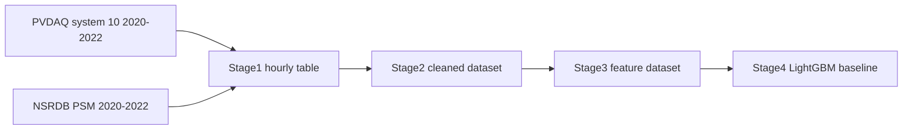

# PVDAQ + NSRDB 2020-2022 三年主线进度报告

生成时间：2026-04-24

## 1. 当前结论

`PVDAQ system 10 + NSRDB PSM` 三年路线已经完成 Stage1 至 Stage4。三年数据链路成立，不需要退到两年方案。

当前主线应从 `2022-2023 partial` 切换为 `2020-2022`。原因很直接：样本规模提升约 1.58 倍，Stage4 的 `t+6h` 和 `t+24h` 指标明显改善，下一阶段训练 TCN 的数据基础显著增强。

Pitfall：当前测试集是严格时间切分后的 `2022-07-25 09:00 UTC` 至 `2022-12-30 23:00 UTC`，不是跨 2023 测试；报告中不能写成“2023 泛化结果”。

## 2. 阶段完成情况

| 阶段 | 目标 | 当前结果 | 完成判断 |
|---|---|---:|---|
| Stage1 数据接入 | 接入 PVDAQ 三年实测功率、NSRDB 气象、OPSD 映射调度数据 | 25557 行 | 完成 |
| Stage2 数据清洗 | 缺失值、异常值、时间对齐、重采样和标准化 | 25557 行 | 完成 |
| Stage3 特征工程 | 时间、天气、历史功率、调度特征构造 | 25365 行 / 125 列 | 完成 |
| Stage4 基线建模 | LightGBM 首个可用预测版本 | 9 个模型全部成功 | 完成 |

## 3. 数据规模与质量

| 指标 | 数值 | 判断 |
|---|---:|---|
| 配置时间范围 | 2020-01-01 至 2022-12-31 | 三年窗口 |
| 实际最早时间 | 2020-01-23 11:00 UTC | 2020 年初存在缺口 |
| 实际最晚时间 | 2022-12-31 23:00 UTC | 覆盖至 2022 年末 |
| 配置期望小时数 | 26304 | 3 年小时数，含 2020 闰年 |
| 观测目标小时数 | 25557 | 可用 |
| 目标小时覆盖率 | 97.16% | 达标 |
| 重复时间戳 | 0 | 达标 |
| Stage2 缺失值 | 0 | 达标 |
| Stage3 删除行数 | 192 | 合理，来自滞后窗口和未来标签 |
| Stage3 质量门禁 | 全部通过 | 达标 |

三年数据相比旧主线：

| 数据版本 | Stage2 样本 | Stage3 样本 | 增幅 |
|---|---:|---:|---:|
| `2022-2023 partial` | 10033 | 9841 | - |
| `2020-2022` | 25557 | 25365 | +157.7% |

数据质量判断：三年路线可用。覆盖率从 98.59% 降到 97.16%，但仍高于 95% 的建模底线。主要代价是 2020 年初有缺口，收益是样本数和季节覆盖显著增加。

Pitfall：`pressure_hpa` 在质量报告里仍有异常计数，主要与站点高海拔有关；不能简单按海平面气压范围判定为错误数据。

## 4. Stage4 基线结果

三年主线 LightGBM full-features 测试集结果：

| 预测目标 | MAE kW | RMSE kW | nRMSE | 日间 nRMSE |
|---|---:|---:|---:|---:|
| `t+1h` | 0.0329 | 0.0714 | 6.37% | 9.63% |
| `t+6h` | 0.0650 | 0.1339 | 11.96% | 16.34% |
| `t+24h` | 0.0737 | 0.1387 | 12.38% | 16.95% |

相对旧 NSRDB 主线：

| 预测目标 | 旧 nRMSE | 三年 nRMSE | 变化 |
|---|---:|---:|---:|
| `t+1h` | 6.82% | 6.37% | 改善 0.45 个百分点 |
| `t+6h` | 13.12% | 11.96% | 改善 1.16 个百分点 |
| `t+24h` | 15.19% | 12.38% | 改善 2.81 个百分点 |

日间误差改善更明显：

| 预测目标 | 旧日间 nRMSE | 三年日间 nRMSE | 判断 |
|---|---:|---:|---|
| `t+1h` | 11.21% | 9.63% | 改善 |
| `t+6h` | 20.25% | 16.34% | 明显改善 |
| `t+24h` | 22.48% | 16.95% | 明显改善 |

结论：三年扩容的收益主要体现在中长期预测，尤其是 `t+24h`。这说明样本规模和季节覆盖是此前中长期误差偏高的重要原因之一。

## 5. 当前目标完成情况

| 目标 | 完成情况 | 判断 |
|---|---|---|
| 从一年级别提升到三年 | 已完成 `2020-2022` | 成功 |
| 三年失败则退到两年 | 未触发 | 三年已达标 |
| 维持 NSRDB-only 天气链路 | 已完成 | 成功 |
| 不使用 Open-Meteo 兜底 | 已完成 | 成功 |
| 重跑 Stage1-4 | 已完成 | 成功 |
| 验证新数据质量 | 已完成 | 成功 |

当前主数据路径：

- 配置：`configs/data_sources.pvdaq_nsrdb_2020_2022.json`
- Stage2：`data/processed/pvdaq_nsrdb_2020_2022/stage2_cleaned_hourly_dataset.parquet`
- Stage3：`data/processed/pvdaq_nsrdb_2020_2022/stage3_feature_dataset.parquet`
- Stage4 指标：`data/processed/pvdaq_nsrdb_2020_2022/stage4_lightgbm_metrics.csv`
- Stage4 报告：`data/processed/pvdaq_nsrdb_2020_2022/stage4_lightgbm_report.md`

## 6. 下一阶段可行性

下一阶段可行，而且比旧主线更稳。

| 下一阶段任务 | 可行性 | 理由 | Pitfall |
|---|---:|---|---|
| 误差分组分析 | 高 | 已有 3805 行测试集，足够按日间、季节、辐照强度、云型分组 | 分组过细会导致局部样本不足 |
| 特征消融实验 | 高 | Stage3 已明确分出时间、天气、历史功率、调度特征组 | 只看整体 nRMSE 会掩盖天气特征在高云量场景的价值 |
| LightGBM 调参 | 高 | 三年样本提升后验证集更稳定 | 调参不能替代消融解释 |
| TCN 序列模型 | 高 | 25365 行足以构造 24h/48h/72h 序列窗口 | 序列切分必须严格按时间，避免窗口穿越 train/val/test 边界 |
| TFT 模型 | 中 | 数据量比之前更合理，但仍是单站点数据 | 容易过拟合，建议作为备选对比，不作为第一主模型 |

推荐执行顺序：

## 7. 最终判断

三年路线已经达到下一阶段要求。后续不建议继续优先换数据源，应把主线固定为 `PVDAQ + NSRDB 2020-2022`，开始做模型解释和深度模型对比。

下一阶段的核心目标不是单纯追求更低误差，而是回答三个问题：

1. 天气特征到底贡献了多少；
2. 历史功率特征是否仍然主导短期预测；
3. TCN 是否能在 `t+6h` 和 `t+24h` 上超过 LightGBM。

Pitfall：NSRDB 仍是历史/观测型气象数据，不是严格 forecast-cycle 天气预报；如果论文强调真实部署预测，还需要把 HRRR 或其他 forecast 数据作为单独验证线，而不是混进当前主线。
