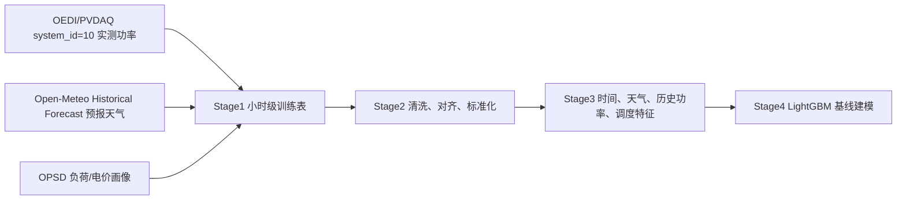
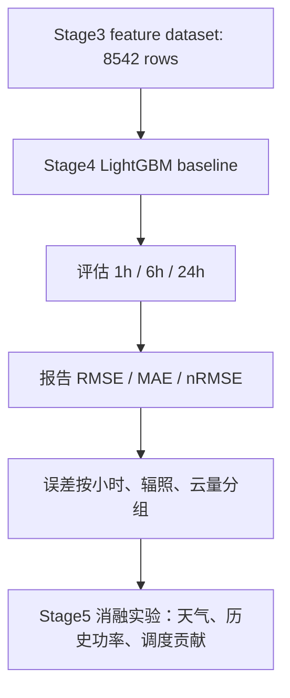

# PVDAQ + Open-Meteo Forecast Stage 1-3 Progress Report

## 1. 本轮任务目标

本轮操作放弃原 `2006 NREL Solar Integration` 主数据源，改用新的实测光伏功率与预报型天气数据链路，重新推进阶段一到阶段三。

核心目标：

- 使用 `OEDI/PVDAQ` 站点级实测功率替代 2006 NREL 模拟光伏数据。
- 使用 `Open-Meteo Historical Forecast` 替代外部再分析或气象补充数据。
- 保留 OPSD 负荷/电价画像映射，用于储能调度特征演示。
- 重新生成 Stage1 小时级训练表、Stage2 清洗数据集、Stage3 模型特征数据集。
- 判断当前数据质量是否足够进入 Stage4 LightGBM 基线建模。

## 2. 数据源变更

| 模块 | 原方案 | 当前方案 | 判断 | Pitfall |
|---|---|---|---|---|
| 光伏功率 | 2006 NREL 模拟 PV | OEDI/PVDAQ `system_id=10` 2022 实测功率 | 已切换 | 系统容量仅 `1.12 kW`，后续误差必须重点看 nRMSE |
| 天气数据 | NSRDB/Open-Meteo Archive 外部天气补充 | Open-Meteo Historical Forecast 预报型天气 | 已切换 | `forecast_issue_time` 是 24h lead time 显式假设，不是完整 NWP cycle |
| 市场/调度 | OPSD 画像映射 | 保持 OPSD 画像映射 | 可用于调度特征演示 | 不能解释为 PVDAQ 所在市场真实同刻电价 |
| HRRR | 未使用 | 作为二级增强路线保留 | 可后续升级 | GRIB/Zarr 处理重，且必须严格按 forecast cycle 对齐 |

当前站点配置：

- 站点名称：`pvdaq_system_10_openmeteo_forecast`
- PVDAQ system_id：`10`
- 坐标：`39.7404, -105.1774`
- 装机容量：`1.12 kW`
- 时间范围：`2022-01-01` 到 `2022-12-31`
- 采样粒度：阶段输出统一为 `1h`

## 3. 阶段一：数据接入与小时级对齐

阶段一已完成。

处理动作：

- 从 OEDI PVDAQ S3 公开路径扫描并下载 `system_id=10` 的 2022 年日级 CSV。
- 使用并发读取方式合并 `364` 个日文件，避免顺序下载超时。
- 识别 `measured_on` 为时间戳字段。
- 识别 `ac_power__423` 为 AC 功率字段。
- 将 PVDAQ 原始 W 单位转换为 `pv_power_kw`。
- 按站点坐标拉取 Open-Meteo Historical Forecast 天气字段。
- 将 PV、天气、OPSD、储能调度结果对齐到小时级表。

阶段一输出：

- 文件：`data/processed/pvdaq_openmeteo_forecast/hourly_training_with_storage.parquet`
- 行数：`8734`
- 列数：`29`
- 时间范围：`2022-01-01 00:00:00+00:00` 到 `2022-12-31 23:00:00+00:00`

Stage1 字段结构：

| 字段组 | 字段 |
|---|---|
| 时间 | `timestamp`, `hour`, `day_of_week`, `month` |
| PV 目标 | `pv_power_kw` |
| 预报天气 | `temperature_c`, `relative_humidity_pct`, `dew_point_c`, `surface_pressure_hpa`, `pressure_hpa`, `precipitation_mm`, `wind_speed_ms`, `wind_direction_deg`, `wind_gusts_ms`, `ghi_wm2`, `dni_wm2`, `dhi_wm2`, `cloud_cover_pct`, `cloud_cover_low_pct`, `cloud_cover_mid_pct`, `cloud_cover_high_pct`, `weather_forecast_lead_time_hour`, `weather_forecast_issue_time_is_assumed` |
| 市场 | `load_mw`, `price_eur_mwh` |
| 储能 | `storage_soc`, `storage_charge_kw`, `storage_discharge_kw`, `storage_revenue_eur` |

## 4. 阶段二：数据清洗与质量验证

阶段二已完成。

处理动作：

- 时间戳转为 UTC。
- 去除非法时间戳与重复时间戳。
- 限定日期范围为 2022 全年。
- 检查小时级覆盖率。
- 对 PV 功率、辐照、温度、湿度、风速、气压、储能 SOC 等字段执行物理边界约束。
- 对特征缺失值执行短窗口前后填充和中位数兜底。
- 生成标准化特征表。

质量指标：

| 指标 | 数值 | 判断 |
|---|---:|---|
| 初始行数 | `8734` | 正常 |
| 清洗后行数 | `8734` | 无目标缺失删除 |
| 预期小时数 | `8760` | 2022 全年小时数 |
| 观测小时数 | `8734` | 缺少 `26` 小时 |
| 小时覆盖率 | `0.997032` | 达标 |
| 缺失目标删除 | `0` | 达标 |
| 重复时间戳 | `0` | 达标 |
| 非法时间戳 | `0` | 达标 |
| 清洗后缺失值 | `0` | 达标 |

异常值处理：

| 字段 | 异常数量 | 处理 |
|---|---:|---|
| `pv_power_kw` | `0` | 无需处理 |
| `dni_wm2` | `11` | 按物理边界裁剪 |
| `surface_pressure_hpa` | `25` | 按物理边界裁剪 |
| 其他主要字段 | `0` | 无需处理 |

质量门禁：

| 门禁 | 结果 |
|---|---|
| `no_missing_values` | `True` |
| `pv_power_within_capacity_bound` | `True` |
| `storage_soc_within_physical_bound` | `True` |
| `monotonic_timestamp` | `True` |

## 5. 阶段三：特征工程

阶段三已完成。

处理动作：

- 构造时间周期特征。
- 构造预报天气特征。
- 构造历史 PV 功率 lag/rolling 特征。
- 构造储能调度状态特征。
- 构造 1h、6h、24h 未来功率预测目标。
- 按时间顺序生成 train/validation/test 切分说明。

阶段三输出：

- 文件：`data/processed/pvdaq_openmeteo_forecast/stage3_feature_dataset.parquet`
- 输入行数：`8734`
- 输出行数：`8542`
- 输出列数：`129`
- 派生特征数：`97`
- 天气特征模式：`forecast_weather_plus_forecast_proxy`

样本减少原因：

| 项目 | 数量 |
|---|---:|
| lag/rolling 与未来目标导致删除行 | `192` |
| 特征工程前缺失单元 | `781` |
| 特征工程后缺失单元 | `0` |

目标列：

- `target_pv_power_t_plus_1h`
- `target_pv_power_t_plus_6h`
- `target_pv_power_t_plus_24h`

时间切分：

| 数据集 | 行数 | 时间范围 |
|---|---:|---|
| train | `5979` | `2022-01-08 00:00:00+00:00` 到 `2022-09-15 02:00:00+00:00` |
| validation | `1281` | `2022-09-15 03:00:00+00:00` 到 `2022-11-07 11:00:00+00:00` |
| test | `1282` | `2022-11-07 12:00:00+00:00` 到 `2022-12-30 23:00:00+00:00` |

质量门禁：

| 门禁 | 结果 |
|---|---|
| `no_duplicate_columns` | `True` |
| `timestamp_monotonic` | `True` |
| `no_missing_engineered_features` | `True` |
| `no_infinite_numeric_features` | `True` |
| `minimum_rows_for_baseline_modeling` | `True` |

## 6. 当前数据指标分析

关键连续变量统计：

| 字段 | 均值 | 标准差 | 最小值 | 中位数 | 最大值 | 解释 |
|---|---:|---:|---:|---:|---:|---|
| `pv_power_kw` | `0.1755` | `0.2723` | `0.0000` | `0.00002` | `1.0045` | 小型 PV 系统输出，夜间样本使中位数接近 0 |
| `ghi_wm2` | `221.6628` | `304.8446` | `0.0000` | `0.0000` | `1084.0000` | GHI 日夜差异明显，数值范围合理 |
| `dni_wm2` | `149.8286` | `250.2130` | `0.0000` | `0.0000` | `986.0000` | DNI 与晴空直射相关，范围合理 |
| `dhi_wm2` | `71.8355` | `122.6957` | `0.0000` | `0.0000` | `801.0000` | DHI 反映散射辐照，范围合理 |
| `temperature_c` | `11.2032` | `11.3382` | `-26.3000` | `11.3000` | `37.5000` | Golden, CO 年内温度范围合理 |
| `cloud_cover_pct` | `39.1694` | `43.7735` | `0.0000` | `11.0000` | `100.0000` | 云量分布跨度大，有助于解释出力波动 |
| `wind_speed_ms` | `2.8518` | `1.7852` | `0.1000` | `2.5000` | `16.2600` | 风速范围合理 |

数据质量结论：

- 样本量 `8542` 已超过当前建模最低要求 `8000`。
- 小时覆盖率 `99.7032%`，足以支撑阶段四基线建模。
- 清洗后无缺失值、无重复字段、无无穷值。
- 天气字段已从“外部补充天气”升级为“预报型天气字段”。
- PV 功率为实测站点级数据，论文说服力高于 2006 NREL 模拟数据。

## 7. 当前问题与风险

| 风险 | 严重度 | 影响 | 处理建议 | Pitfall |
|---|---|---|---|---|
| PV 系统容量较小 | 中 | kW 误差数值很小，绝对误差解释力弱 | Stage4 必须同时报告 nRMSE、MAE、RMSE | 只看 kW 会误判模型效果 |
| Open-Meteo issue time 是假设 | 中 | 不能声称完整 NWP forecast-cycle 实验 | 报告中明确写为 24h lead-time forecast-weather approximation | 若写成严格 forecast cycle，会被质疑数据泄漏 |
| OPSD 电价/负荷为画像映射 | 中 | 储能经济性不能解释为真实市场收益 | 仅把调度字段作为辅助特征和仿真信号 | 不能把经济性结论写成真实收益 |
| 仅一年数据 | 中 | 泛化检验有限 | 后续扩展到 2023/2024 或多系统联合 | 单年测试可能受季节分布影响 |
| 储能 SOC 几乎恒定 | 低到中 | 调度特征贡献可能弱 | Stage5 做调度特征消融 | 固定 SOC 会让调度特征重要性偏低 |

## 8. 下一阶段可行性判断

结论：可以推进 Stage4。

理由：

- Stage3 输出 `8542` 行，满足 LightGBM 基线训练规模。
- 已具备 1h、6h、24h 三个预测目标。
- 时间切分已生成，训练、验证、测试样本均充足。
- 天气字段、历史功率字段、调度字段均已进入特征表。
- 质量门禁全部通过，不存在阻断建模的数据缺陷。

推荐下一阶段执行方式：

Stage4 建议指标：

| 指标 | 必须报告 | 原因 |
|---|---|---|
| RMSE kW | 是 | 衡量大误差敏感度 |
| MAE kW | 是 | 衡量平均绝对偏差 |
| nRMSE | 是 | 当前系统容量小，必须归一化 |
| daytime nRMSE | 是 | 夜间大量零功率会稀释误差 |
| 分小时误差 | 是 | 判断中午高辐照时段是否失控 |
| 分云量误差 | 是 | 判断天气特征是否有效 |

## 9. 阶段性结论

本轮重构后的数据链路已经比原 2006 NREL 方案更适合继续推进：

- 光伏目标从模拟数据变为 PVDAQ 实测数据。
- 天气侧从普通历史天气补充升级为预报型天气。
- 样本量从不可用风险状态恢复到可建模规模。
- Stage1-3 的质量门禁全部通过。
- 当前可以进入 Stage4 LightGBM 基线建模。

当前最大限制不是数据清洗质量，而是预报天气 issue time 的严格性和单站点单年份泛化能力。

下一步优先级：

1. 使用当前 `pvdaq_openmeteo_forecast` 数据集重新训练 Stage4 LightGBM。
2. 对比 1h、6h、24h 的 RMSE、MAE、nRMSE。
3. 进入 Stage5，做天气特征消融和误差分组。
4. 若需要增强论文可信度，再接入 HRRR 或扩展 PVDAQ 多站点/多年数据。

