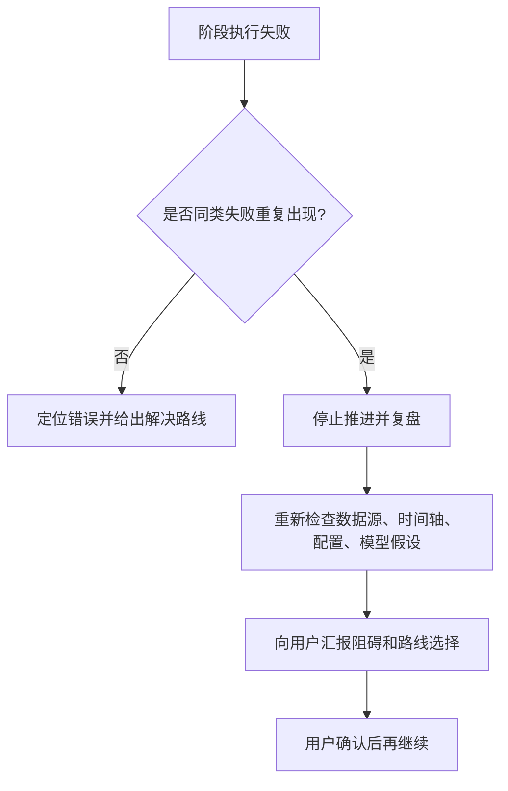
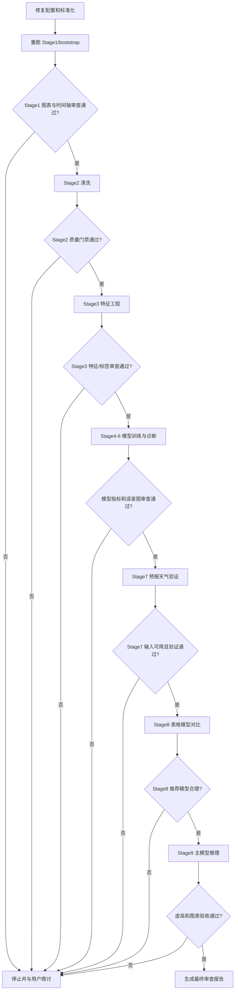

# PVDAQ 时间轴修复与 Stage2-9 严格重跑验收计划

## 1. 需求总结

本次任务目标不是“快速让图表看起来正常”，而是完整修复 PVDAQ 时间轴错误，并重建从数据清洗到模型推理的主链路，确保每个阶段的数据处理、模型训练、误差分布和可视化结果都经过严格审查后，才允许进入下一阶段。

核心需求：

| 需求 | 要求 |
|---|---|
| 根因修复 | 修复 PVDAQ 原始 `measured_on` 无时区却被当作 UTC 解析的问题 |
| 重跑范围 | 必须重跑 Stage1/bootstrap 以及 Stage2-9；仅从 Stage2 开始会继承旧错误 |
| 阶段审查 | 每个需要确认数据或模型的阶段都要检查数据是否正确处理、模型结果是否合理、误差是否异常 |
| 可视化验证 | 每阶段生成关键图表，并读取图表判断是否符合物理规律和业务预期 |
| 阻碍处理 | 遇到阻碍不能绕过、不能自行换方案；必须停止推进，告知问题，列出可选路线，和用户商讨后再决定 |
| 最终目标 | Stage9 预测不再出现原先由时间轴错位导致的系统性虚高，且有完整审查报告链路 |

## 2. 修复方案对比

| 方案 | 做法 | 推荐度 | Pitfall |
|---|---|---:|---|
| 固定 UTC-7 解析 PVDAQ | 在 PVDAQ 配置中声明 `timezone: "Etc/GMT+7"`，无时区 `measured_on` 先按 UTC-7 本地化，再转 UTC | 高 | `Etc/GMT+7` 实际表示 UTC-7，命名反直觉 |
| 使用 `America/Denver` | 按站点地理时区自动处理夏令时 | 中 | 全量审计显示 35/36 个月最优为 `+7h`，夏令时规则可能反而引入夏季错位 |
| 预测后处理修补 | 对 `09:00-14:00Z` 虚高预测做限幅 | 低 | 只修图表，不修训练数据、模型和调度根因 |

推荐采用固定 UTC-7 配置化修复。

## 3. 阻碍处理规则

任何阶段出现以下情况，必须立即停止推进，不能绕过：

| 阻碍类型 | 必须动作 | 禁止动作 |
|---|---|---|
| 数据缺失、字段缺失、文件缺失 | 告知缺失内容、影响范围、可选解决路线 | 不允许临时替换成其他数据源继续跑 |
| 质量门禁失败 | 输出失败指标、失败图表、可能根因 | 不允许放宽阈值继续下一阶段 |
| 模型指标异常 | 停止训练链路推进，分析误差分布 | 不允许只选择另一个模型掩盖问题 |
| 可视化异常 | 展示或描述异常图表，说明不合理处 | 不允许忽略图表只看数值指标 |
| 命令失败或环境缺依赖 | 报告失败命令、错误摘要、修复选项 | 不允许改用未经确认的兜底命令 |
| Stage7 输入不可用 | 明确说明 Stage7 阻塞点，与用户确认是否跳过或先补数据 | 不允许默认跳过 Stage7 |

如果项目推进出现反复失败或长时间没有进展，需要触发复盘：



## 4. 实施变更

### 4.1 配置修复

在 `configs/data_sources.pvdaq_nsrdb_2020_2022.json` 的 `sources.pv_power` 增加：

```json
"timezone": "Etc/GMT+7"
```

该配置只作用于 PVDAQ System 10 当前数据源，不影响其他站点或其他数据源。

Pitfall：不能把 `Etc/GMT+7` 全局写入 `project.timezone`，否则会影响 NSRDB、OPSD 或其他已经使用 UTC 的数据。

### 4.2 标准化修复

修改 `src/new_energy_sys/standardize.py` 的 `normalize_pv_power`：

- 无时区时间且配置有 `timezone`：先 `tz_localize(timezone)`，再 `tz_convert("UTC")`。
- 已带时区时间：直接转 UTC。
- 无时区且无配置：保持当前 UTC 解析兼容逻辑，并在注释中明确这是历史兼容假设。
- 添加详细注释说明 PVDAQ `measured_on`、NSRDB UTC 对齐、以及错误会如何造成虚高。

Pitfall：不能简单对所有 timestamp 加 7 小时；必须由配置驱动，避免污染其他数据源。

### 4.3 Stage2 时间轴质量门禁

在 `src/new_energy_sys/cleaning.py` 的 Stage2 report 增加 `time_axis_diagnostics`：

| 字段 | 含义 |
|---|---|
| `shift_range_hours` | 固定为 `[-10, 10]` |
| `corr_by_shift` | 每个小时平移下 `pv_power_kw` 与 `ghi_wm2` 的相关性 |
| `best_shift_hours` | 相关性最高的平移 |
| `best_corr_power_ghi` | 最佳相关性 |
| `zero_shift_corr_power_ghi` | 当前 0h 对齐相关性 |
| `correlation_lift_from_zero` | 最佳相关性相对 0h 的提升 |

新增质量门禁：

| Gate | 通过标准 |
|---|---|
| `pv_weather_best_shift_is_zero` | `best_shift_hours == 0` |
| `pv_weather_correlation_acceptable` | `zero_shift_corr_power_ghi >= 0.85` |
| `pv_weather_no_large_shift_lift` | 如果最佳平移非 0h，提升不得超过 `0.05` |

Pitfall：阴雨月份可能局部相关性低，因此门禁应基于全量 Stage2 数据，不以单月失败直接判死。

## 5. 重跑与审查流程



## 6. 阶段门禁

### Stage1/bootstrap

命令：

```powershell
python -m new_energy_sys.cli.bootstrap_data --config configs\data_sources.pvdaq_nsrdb_2020_2022.json
```

检查：

- `hourly_training_with_storage.parquet` 时间轴必须重新生成。
- PV 功率、POA、NSRDB GHI 的日曲线应同相。
- PV/GHI 最优平移应从修复前 `+7h` 回到 `0h`。
- 生成图表：PV vs GHI 日曲线、平移相关性柱状图、PV/GHI 散点图。

Pitfall：不能复用旧 `hourly_training_with_storage.parquet`，否则 Stage2-9 全部仍是旧错位链路。

### Stage2 清洗

命令：

```powershell
python -m new_energy_sys.cli.clean_data --config configs\data_sources.pvdaq_nsrdb_2020_2022.json --input data\processed\pvdaq_nsrdb_2020_2022\hourly_training_with_storage.parquet
```

检查：

- 缺失值、异常裁剪、时间覆盖率、单调性全部通过。
- `time_axis_diagnostics.best_shift_hours == 0`。
- `zero_shift_corr_power_ghi >= 0.85`。
- 生成图表：清洗后 PV/GHI 时间序列、缺失值热力图、平移相关性图。

Pitfall：只看 `no_missing_values` 和 `monotonic_timestamp` 不够，旧错误在这两个指标下也会通过。

### Stage3 特征工程

命令：

```powershell
python -m new_energy_sys.cli.build_features --config configs\data_sources.pvdaq_nsrdb_2020_2022.json --input data\processed\pvdaq_nsrdb_2020_2022\stage2_cleaned_hourly_dataset.parquet
```

检查：

- t+1h、t+6h、t+24h 标签与目标时刻一致。
- 滞后特征只来自历史，不允许泄漏未来。
- `target_plus_24h_*` 天气列与 `timestamp + 24h` 对齐。
- 生成图表：标签对齐抽样图、滞后特征对比图、target_plus 天气对齐图。

Pitfall：特征列存在不等于标签对齐正确，必须抽样核验具体时间点。

### Stage4 LightGBM baseline

命令：

```powershell
python -m new_energy_sys.cli.train_baseline --config configs\data_sources.pvdaq_nsrdb_2020_2022.json --input data\processed\pvdaq_nsrdb_2020_2022\stage3_feature_dataset.parquet
```

检查：

- train/validation/test 指标不能出现明显过拟合。
- 特征重要性不能异常集中在单一时间字段。
- 按小时、月份、GHI 分组误差不能出现旧的 `09:00-14:00Z` 系统性虚高。
- 生成图表：预测 vs 实际、误差分布、按小时误差、特征重要性。

Pitfall：总体 nRMSE 正常不代表模型没有系统性时段误差。

### Stage5 LightGBM 优化与分组误差

命令：

```powershell
python -m new_energy_sys.cli.optimize_lightgbm --config configs\data_sources.pvdaq_nsrdb_2020_2022.json --input data\processed\pvdaq_nsrdb_2020_2022\stage3_feature_dataset.parquet
```

检查：

- 调参模型相对 baseline 的提升应同时体现在白天样本和测试集。
- 分组误差中小时、月份、GHI、cloud 分桶不能出现集中异常。
- 生成图表：调参前后指标对比、分组误差热力图、误差箱线图。

Pitfall：如果提升主要来自夜间样本，业务价值有限。

### Stage6 TCN

命令：

```powershell
python -m new_energy_sys.cli.train_tcn --config configs\data_sources.pvdaq_nsrdb_2020_2022.json --input data\processed\pvdaq_nsrdb_2020_2022\stage3_feature_dataset.parquet --baseline-metrics data\processed\pvdaq_nsrdb_2020_2022\stage5_tuned_metrics.csv
```

检查：

- TCN 指标与 LightGBM 对比合理。
- 序列模型不能重新放大历史错位模式。
- 生成图表：TCN 预测 vs 实际、误差按小时分布、模型对比图。

Pitfall：深度模型可能更强地学习历史周期，如果数据还有残余错位，会把问题放大。

### Stage7 预报天气验证

命令：

```powershell
python -m new_energy_sys.cli.run_stage7 --config configs\data_sources.pvdaq_nsrdb_2020_2022.json --stage3-input data\processed\pvdaq_nsrdb_2020_2022\stage3_feature_dataset.parquet --forecast-weather data\processed\pvdaq_nsrdb_2020_2022\stage7_forecast_weather_dataset.parquet
```

检查：

- `stage7_forecast_weather_dataset.parquet` 必须存在且字段完整。
- 预报天气 valid time、issue time、lead time 必须解释清楚。
- 如果 Stage7 输入不可用或质量不达标，必须停止并与用户商讨，不允许默认跳过。
- 生成图表：forecast valid-time 覆盖图、lead time 分布图、Stage7 预测对比图。

Pitfall：不能用历史观测天气伪装真实 forecast-cycle 能力。

### Stage8 表格模型对比

命令：

```powershell
python -m new_energy_sys.cli.compare_tabular_models --config configs\data_sources.pvdaq_nsrdb_2020_2022.json --input data\processed\pvdaq_nsrdb_2020_2022\stage3_feature_dataset.parquet
```

检查：

- 推荐模型、推荐特征集和测试集指标必须合理。
- 如果推荐仍为 `history_only`，必须解释天气增强模型为何没有胜出。
- 生成图表：模型排行、雷达图、特征集对比、测试集预测对比。

Pitfall：模型排名不能只按单一指标做决定，需要结合误差结构。

### Stage9 主模型推理

命令：

```powershell
python -m new_energy_sys.cli.run_stage9_inference --config configs\data_sources.pvdaq_nsrdb_2020_2022.json --input data\processed\pvdaq_nsrdb_2020_2022\stage3_feature_dataset.parquet
```

检查：

- 全量虚高小时数应显著低于当前 `882`。
- `09:00-14:00Z` 虚高集中现象应消失。
- 前 30 天图表中预测与真实峰值时段应一致。
- 生成图表：前 30 天预测对比、全量误差分布、按小时虚高统计、按月份虚高统计。

Pitfall：只检查 `predictions_within_physical_bound` 不够，虚高仍可能在物理上合法但业务上错误。

## 7. 最终验收标准

| 验收项 | 通过标准 |
|---|---|
| 时间轴 | PV/GHI 最优平移从修复前 `+7h` 回到 `0h` |
| 相关性 | 修复后 `0h corr_power_ghi >= 0.85` |
| 虚高 | 全量虚高小时数显著低于当前 `882` |
| 小时分布 | `09:00-14:00Z` 不再是虚高集中区 |
| 图表 | 前 30 天和全量抽样图中预测/真实峰值时段一致 |
| 模型 | 指标、特征重要性、分组误差无明显异常 |
| 审查记录 | 每阶段都有 `stage_review_XX.md`，包含图表路径和读取结论 |

## 8. 输出文件清单

| 类型 | 路径 |
|---|---|
| 本计划 | `reports/pvdaq_time_axis_stage2_9_rebuild_review_plan.md` |
| 阶段审查报告 | `reports/stage_reviews/stage_review_01_bootstrap.md` 到 `stage_review_09_inference.md` |
| 审查图表 | `reports/figures/pvdaq_time_axis_rebuild/` |
| 最终报告 | `reports/pvdaq_time_axis_rebuild_final_review.md` |

## 9. 当前阶段进度

| 项目 | 状态 |
|---|---|
| 前 720 行诊断 | 已完成，确认 43 个虚高小时 |
| 全量诊断 | 已完成，确认全量 882 个虚高小时 |
| 根因判断 | 已确认，PVDAQ 无时区时间被错当 UTC |
| 修复计划 | 当前文件已定义修复、重跑、审查、阻碍处理和验收标准 |
| 下一阶段可行性 | 高，但必须严格按阶段门禁推进，任何阻碍都需要与用户共同决策 |

