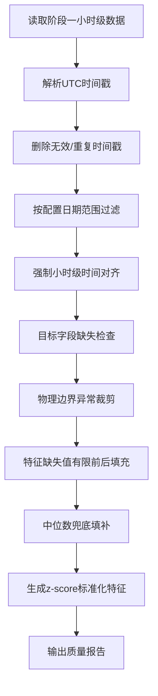

# 第一、第二阶段任务推进与质量评估报告

## 1. 报告结论

第一阶段“数据准备”和第二阶段“数据清洗”已经完成，并形成可复现的数据处理流水线。原始路线中使用 PVDAQ 小样本时仅得到 `119` 条有效小时样本，无法支撑后续建模；已切换为更适合主实验的 `NREL Solar Power Data for Integration Studies + OPSD` 路线。

当前主数据集清洗后样本数为 `8752`，目标小时覆盖率为 `99.9087%`，缺失值为 `0`，时间单调性、功率边界、SOC边界全部通过校验。该数据质量可以支撑第三阶段特征工程和第四阶段 LightGBM 基线建模。

## 2. 阶段一：数据准备推进过程

阶段一目标是完成数据源获取、字段整理、统一格式转换，并形成可进入清洗阶段的小时级训练表。

最初按计划使用公开 PVDAQ/DuraMAT 数据推进。该路线能跑通采集、字段解析、小时级重采样、储能SOC仿真，但在配置窗口内只有 `119` 条有效小时样本，目标小时覆盖率约 `45.1%`。该结果说明 PVDAQ 小样本适合验证流程，不适合作为主实验数据源。

随后执行数据源修正：

| 数据类型 | 原方案 | 当前方案 | 修正原因 |
|---|---|---|---|
| 光伏功率 | PVDAQ/DuraMAT 小样本 | NREL Solar Power Data for Integration Studies | 样本连续性和规模不足，需要全年小时级数据 |
| 预测辅助特征 | 天气字段 | NREL `DA`、`HA4` 预测功率 | NREL ZIP 内置预测文件，字段稳定、时间对齐 |
| 负荷/电价 | OPSD直接同刻合并 | OPSD星期-小时画像映射到NREL时间轴 | OPSD常用数据与NREL 2006年份不重叠 |
| 储能数据 | 无真实储能运行数据 | 规则仿真生成SOC、充放电、收益字段 | 原计划即允许使用仿真储能数据 |

阶段一最终输出：

| 输出文件 | 说明 |
|---|---|
| `data/processed/nrel_opsd/hourly_training_with_storage.parquet` | 阶段一主训练表 |
| `data/processed/nrel_opsd/hourly_training_with_storage_preview.csv` | 阶段一预览表 |
| `configs/data_sources.nrel_opsd.json` | 主实验数据配置 |

阶段一主训练表关键指标：

| 指标 | 数值 |
|---|---:|
| 样本数 | `8758` |
| 字段数 | `13` |
| 缺失值总数 | `0` |
| 起始时间 | `2006-01-01 06:00:00+00:00` |
| 结束时间 | `2007-01-01 05:00:00+00:00` |

## 3. 阶段二：数据清洗推进过程

阶段二目标是完成缺失值处理、异常值处理、时间对齐、重采样和标准化。

已实现独立清洗模块 `src/new_energy_sys/cleaning.py`，并通过命令行入口 `src/new_energy_sys/cli/clean_data.py` 执行。该设计避免把清洗逻辑混在数据采集逻辑中，后续更换数据源时仍可复用。

清洗流程如下：

阶段二最终输出：

| 输出文件 | 说明 |
|---|---|
| `data/processed/nrel_opsd/stage2_cleaned_hourly_dataset.parquet` | 清洗后的小时级数据 |
| `data/processed/nrel_opsd/stage2_cleaned_hourly_dataset_preview.csv` | 清洗数据预览 |
| `data/processed/nrel_opsd/stage2_standardized_feature_dataset.parquet` | 带 `*_z` 标准化特征的数据 |
| `data/processed/nrel_opsd/stage2_quality_report.md` | 人可读质量报告 |
| `data/processed/nrel_opsd/stage2_quality_report.json` | 机器可读质量指标 |

## 4. 当前数据结构说明

清洗后的主数据集包含 `13` 个字段：

| 字段 | 含义 | 类型 |
|---|---|---|
| `timestamp` | UTC小时级时间戳 | datetime |
| `pv_power_kw` | NREL实际PV输出功率，预测目标 | float |
| `pv_forecast_da_kw` | NREL day-ahead预测功率 | float |
| `pv_forecast_ha4_kw` | NREL four-hour-ahead预测功率 | float |
| `load_mw` | OPSD负荷画像映射值 | float |
| `price_eur_mwh` | OPSD日前电价画像映射值 | float |
| `hour` | 小时特征 | int |
| `day_of_week` | 星期特征，周一为0 | int |
| `month` | 月份特征 | int |
| `storage_soc` | 储能荷电状态 | float |
| `storage_charge_kw` | 储能充电功率 | float |
| `storage_discharge_kw` | 储能放电功率 | float |
| `storage_revenue_eur` | 单小时调度收益 | float |

标准化特征表额外生成 `7` 个 `*_z` 字段：

| 标准化字段 | 原始字段 |
|---|---|
| `pv_forecast_da_kw_z` | `pv_forecast_da_kw` |
| `pv_forecast_ha4_kw_z` | `pv_forecast_ha4_kw` |
| `load_mw_z` | `load_mw` |
| `price_eur_mwh_z` | `price_eur_mwh` |
| `storage_soc_z` | `storage_soc` |
| `storage_charge_kw_z` | `storage_charge_kw` |
| `storage_discharge_kw_z` | `storage_discharge_kw` |

## 5. 数据质量指标评估

阶段二质量报告关键指标：

| 指标 | 数值 | 结论 |
|---|---:|---|
| 输入样本数 | `8758` | 达标 |
| 清洗后样本数 | `8752` | 达标 |
| 理论全年小时数 | `8760` | 基准 |
| 目标小时覆盖率 | `99.9087%` | 达标 |
| 无效时间戳 | `0` | 达标 |
| 重复时间戳 | `0` | 达标 |
| 缺失目标行 | `0` | 达标 |
| 清洗后缺失值总数 | `0` | 达标 |
| PV功率越界数 | `0` | 达标 |
| 储能SOC越界 | `0` | 达标 |
| 时间戳单调递增 | `True` | 达标 |

质量门禁：

| 门禁项 | 结果 |
|---|---|
| `no_missing_values` | `True` |
| `pv_power_within_capacity_bound` | `True` |
| `storage_soc_within_physical_bound` | `True` |
| `monotonic_timestamp` | `True` |

结论：当前数据量和质量满足后续建模最低要求，也满足毕业设计原型系统的实验基础要求。

## 6. 数据可视化补充说明

为提高阶段报告的直观性，已基于 `data/processed/nrel_opsd/stage2_cleaned_hourly_dataset.parquet` 生成以下图表。图表脚本位于 `scripts/generate_stage_report_figures.py`，可重复生成。

### 6.1 光伏实际功率与预测特征

下图展示 2006 年 6 月 1 日至 6 月 7 日的实际PV功率、日前预测功率和4小时前预测功率。可以看到实际功率和预测功率在日内周期上基本一致，说明 `DA` 和 `HA4` 字段适合作为后续预测模型的重要输入特征。

### 6.2 预测误差分布

下图展示 `DA` 与 `HA4` 预测功率相对实际功率的误差分布。误差分布用于判断预测辅助特征是否存在系统性偏差，也可为后续模型残差分析提供基线。

### 6.3 OPSD负荷与电价画像

下图展示映射后的平均小时负荷与电价画像。该图说明当前调度模块拥有可用的负荷和价格信号，但这些信号属于OPSD画像映射，不是与NREL 2006年PV数据同年同刻的市场回测数据。

### 6.4 储能SOC与净调度功率

下图展示第一周的储能SOC和净调度功率。正值表示放电，负值表示充电。该图用于验证储能仿真模块是否按SOC约束和功率约束运行。

### 6.5 数据质量摘要

下图汇总清洗后数据的关键质量指标。清洗后观测小时数为 `8752`，接近全年理论小时数 `8760`；缺失值、重复时间戳和PV功率边界违规均为 `0`。

## 7. 当前计划完成情况

原计划第一、第二阶段要求如下：

| 原计划任务 | 当前完成情况 | 状态 |
|---|---|---|
| 数据集下载 | 已完成NREL PV ZIP下载，OPSD画像源固化 | 完成 |
| 数据筛选 | 已从PVDAQ小样本切换为NREL连续主数据 | 完成 |
| 字段整理 | 已统一为小时级预测与调度字段 | 完成 |
| 统一格式转换 | 已输出Parquet和CSV预览 | 完成 |
| 缺失值处理 | 清洗后缺失值为0 | 完成 |
| 异常值处理 | 物理边界校验通过 | 完成 |
| 时间对齐 | UTC小时级对齐 | 完成 |
| 重采样 | Actual 5分钟PV重采样为小时均值 | 完成 |
| 标准化 | 已生成z-score特征表 | 完成 |
| 质量验证 | 已输出Markdown和JSON报告 | 完成 |

当前完成度判断：

| 阶段 | 完成度 | 说明 |
|---|---:|---|
| 第一阶段：数据准备 | `100%` | 主数据链路已经稳定，可复现 |
| 第二阶段：数据清洗 | `100%` | 清洗表、标准化表、质量报告均已生成 |
| 第三阶段：特征工程 | `0%` | 尚未构造滞后、滚动统计、多步预测标签 |
| 第四阶段：LightGBM基线 | `0%` | 尚未训练模型 |

## 8. 偏离原计划的说明

当前存在三项必要偏离：

1. 主数据源从 PVDAQ 小样本切换为 NREL Solar Power Data for Integration Studies。
   原因：PVDAQ 当前窗口仅 `119` 条有效小时样本，不具备建模价值。

2. 当前主链路未使用独立天气字段。
   原因：NREL ZIP 内置 `DA` 和 `HA4` 预测功率，可作为稳定预测特征；天气字段后续可作为增强特征补充。

3. OPSD负荷/电价采用画像映射到NREL 2006时间轴。
   原因：OPSD可用负荷/电价数据与NREL 2006年份不重叠，不能直接按同一时间戳合并。

这些偏离不阻塞后续模型训练和系统原型展示，但会影响经济性实验表述。论文中应明确：储能收益为仿真调度收益，不是真实同年市场回测收益。

## 9. 下一阶段可行性判断

下一阶段为特征工程，当前具备推进条件。

可直接构造的特征：

| 特征类型 | 可用字段 | 可行性 |
|---|---|---|
| 时间特征 | `hour`、`day_of_week`、`month` | 高 |
| 预测功率特征 | `pv_forecast_da_kw`、`pv_forecast_ha4_kw` | 高 |
| 历史滞后特征 | `pv_power_kw` 的前1/3/24小时 | 高 |
| 滚动统计特征 | 过去3/6/24小时均值、最大值、标准差 | 高 |
| 调度特征 | `load_mw`、`price_eur_mwh`、`storage_soc` | 高 |
| 多步预测标签 | 未来1/6/24小时PV功率 | 高 |

可进入第四阶段的模型：

| 模型 | 当前可行性 | 说明 |
|---|---|---|
| LightGBM | 高 | 表格特征已具备，适合作为基线 |
| TCN | 中 | 需要先生成序列窗口数据 |
| TFT | 中 | 需要定义已知未来变量、观测变量和静态变量 |
| MPC/规则调度 | 高 | 已有PV、负荷、电价、SOC字段 |

结论：项目可以继续推进第三阶段，不需要回退到数据准备阶段。

## 10. 风险与处理建议

| 风险 | 影响 | 建议 |
|---|---|---|
| NREL数据为模拟PV场站，不是实测SCADA | 影响真实部署结论 | 论文定位为方法验证与系统原型 |
| OPSD采用画像映射，不是2006同刻真实市场 | 影响经济性严谨性 | 收益只表述为仿真收益 |
| 当前储能策略为规则仿真 | 不能代表最优调度 | 后续加入MPC或线性规划优化 |
| 未接入独立天气字段 | 特征解释性不足 | 第三阶段可补Open-Meteo/NASA POWER天气 |

## 11. 总结

第一、第二阶段已经从“能跑通流程”的小样本验证升级到“可支撑建模”的主数据链路。当前清洗后数据集具备全年小时级规模，覆盖率接近完整年度，缺失值、异常值和时间对齐质量均达标。

下一步应直接推进第三阶段特征工程：构造滞后特征、滚动统计特征、多步预测标签，并按时间顺序切分训练集、验证集和测试集。

Pitfall：后续如果随机切分训练集和测试集，会造成严重时间泄漏，模型指标会虚高；必须按时间顺序切分。
