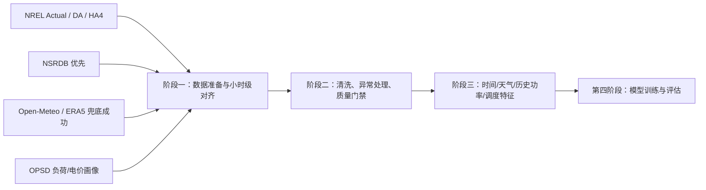

# 第一至第三阶段任务推进与质量评估报告（含天气特征主链路）

## 结论

重新推进后的主链路已经从“DA/HA4 天气代理”升级为“外部气象补充 + DA/HA4 预测 + 历史功率 + 储能调度”的建模数据集。当前第三阶段输出 `8560` 条有效监督样本、`145` 个字段、`112` 个派生特征，缺失值和无穷值均为 `0`，满足进入第四阶段建模的最低质量要求。

## 阶段一：数据准备

本轮主配置为 `configs/data_sources.nrel_opsd_weather.json`，输出目录为 `data/processed/nrel_opsd_weather`。数据准备阶段完成了四类数据对齐：

- NREL Solar Integration：光伏实际功率 `pv_power_kw`，日前预测 `pv_forecast_da_kw`，4小时前预测 `pv_forecast_ha4_kw`。
- NSRDB：已实现优先下载逻辑，但当前接口请求被服务端拒绝；流程按设计自动切换到 Open-Meteo/ERA5。
- Open-Meteo/ERA5：成功补齐 GHI、DNI、DHI、温度、湿度、露点、云量、风速、气压、降水等天气字段。
- OPSD：由于 OPSD 与 NREL 2006 年份不重叠，继续使用星期-小时画像映射到 PV 时间轴，用于负荷和电价调度信号。

阶段一输出 `8758` 行、`30` 列小时级数据，其中天气字段已进入主表。

Pitfall：NSRDB 当前未实际落地，主链路天气由 Open-Meteo/ERA5 兜底提供；报告中必须写成外部气象补充数据。

## 阶段二：数据清洗与质量评估

- 输入行数：`8758`
- 清洗后行数：`8752`
- 时间范围：`2006-01-01 06:00:00+00:00` 至 `2006-12-31 23:00:00+00:00`
- 目标小时覆盖率：`0.999087`
- 缺失目标删除数：`0`
- 重复时间戳：`0`

阶段二执行了时间戳 UTC 统一、小时级对齐、重复时间戳去重、物理边界裁剪、短缺口填充和质量门禁验证。当前质量门禁全部通过：无缺失值、PV 功率在容量边界内、储能 SOC 在物理边界内、时间戳单调递增。

Pitfall：OPSD 负荷和电价仍为画像映射，不是 2006 年同一市场真实逐时记录；经济性结论必须按仿真实验表述。

## 阶段三：特征工程

- 输入行数：`8752`
- 输出行数：`8560`
- 输入字段：`30`
- 输出字段：`145`
- 派生特征：`112`
- 特征模式：`observed_weather_plus_forecast_proxy`
- 删除样本：`192`，由 `168h` 历史窗口和 `24h` 未来标签自然产生。

特征工程构造了四类输入特征：

- 时间特征：`12` 个，包含小时、星期、月份、年内日及周期编码。
- 天气特征：`46` 个，包含辐照、温度、湿度、云量、风速、气压、降水及 DA/HA4 预测派生特征。
- 历史功率特征：`39` 个，包含多尺度 lag、rolling 统计和历史预测误差。
- 调度特征：`15` 个，包含 SOC、净出力、充放电比例、电价阈值距离和负荷/电价滚动统计。

Pitfall：历史功率和滚动特征必须保持先 `shift` 再 `rolling` 的因果顺序，第四阶段不得改成随机切分。

## 处理后数据集结构说明

阶段二清洗表是基础业务表，阶段三特征表是模型输入表。两者关系如下：

| 数据集 | 文件 | 行数 | 列数 | 作用 |
|---|---|---:|---:|---|
| 阶段二清洗表 | `stage2_cleaned_hourly_dataset.parquet` | `8752` | `30` | 业务字段、物理量、清洗后小时级样本 |
| 阶段三特征表 | `stage3_feature_dataset.parquet` | `8560` | `145` | 可直接进入建模的监督学习数据集 |

基础字段分组：

| 字段组 | 字段 | 说明 |
|---|---|---|
| 光伏功率 | `pv_power_kw, pv_forecast_da_kw, pv_forecast_ha4_kw` | 实际功率与 NREL DA/HA4 预测功率 |
| 天气 | `ghi_wm2, dni_wm2, dhi_wm2, temperature_c, relative_humidity_pct, dew_point_c, cloud_cover_pct, cloud_cover_low_pct, cloud_cover_mid_pct, cloud_cover_high_pct, wind_speed_ms, wind_direction_deg, wind_gusts_ms, pressure_hpa, surface_pressure_hpa, precipitation_mm, toa_radiation_wm2` | Open-Meteo/ERA5 外部气象补充字段 |
| 市场 | `load_mw`, `price_eur_mwh` | OPSD 画像映射后的负荷和电价信号 |
| 储能 | `storage_soc`, `storage_charge_kw`, `storage_discharge_kw`, `storage_revenue_eur` | 规则调度仿真状态和收益 |
| 时间 | `timestamp`, `hour`, `day_of_week`, `month` | UTC 时间戳和基础时间字段 |

阶段三额外生成三个监督学习标签：`target_pv_power_t_plus_1h`、`target_pv_power_t_plus_6h`、`target_pv_power_t_plus_24h`。它们分别对应短时、日内和日前预测任务。

Pitfall：`target_*` 字段只能作为标签 `y` 使用，不能混入模型输入 `X`。

## 可视化分析

该图显示实际 PV、DA、HA4 与 GHI 在同一周内的变化。PV 出力与 GHI 的日周期基本一致，说明补充天气字段对功率预测具有直接解释价值。

辐照度日内曲线清晰，温度和云量也呈现稳定日内结构。该结构可支撑时间特征与天气特征联合建模。

白天样本中 PV 出力随 GHI 上升而增加，云量对同等 GHI 下的离散程度有解释作用。这补强了项目从天气变量预测光伏功率的因果合理性。

相关性热图显示 PV、预测功率、辐照度、温度和云量之间存在可建模关系。市场字段与 PV 的相关性较弱，适合作为调度侧特征而非功率预测主解释变量。

Pitfall：相关性只说明线性关系强弱，不能替代严格的时间序列外推验证。

## 下一阶段可行性评估

可以进入第四阶段建模。依据：

- 样本量 `8560`，满足年度小时级基线建模需求。
- 气象字段已补齐，解决了上一版“无真实天气变量”的说服力缺口。
- 第三阶段无缺失值、无无穷值、时间戳单调递增。
- 已给出严格时间切分：训练 `5992` 行、验证 `1284` 行、测试 `1284` 行。
- 已生成 `1h`、`6h`、`24h` 三类预测标签，支持多任务或多模型对比。

第四阶段推荐先做三组模型：

| 模型组 | 输入 | 目的 |
|---|---|---|
| Baseline | DA/HA4 + 时间 | 验证 NREL 预测基线强度 |
| Weather-enhanced | DA/HA4 + 天气 + 时间 | 评估天气特征增益 |
| Full-feature | 全部特征 | 评估历史功率与调度状态的综合收益 |

评估指标建议使用 MAE、RMSE、nRMSE、MAPE（白天样本单独计算）和分时段误差分析。训练/验证/测试必须按当前报告中的时间顺序切分。

Pitfall：第四阶段如果随机切分，会把相邻小时和未来季节模式泄漏到训练集，导致指标虚高，实验无效。

## 总结

重新推进后的前三阶段已经达到进入建模阶段的质量门槛。当前主链路的主要限制不再是缺少天气特征，而是外部天气数据与 NREL 功率数据并非同一原始观测链路，以及 OPSD 市场信号仍为画像映射。该限制可接受，但必须在论文和实验说明中透明披露。
