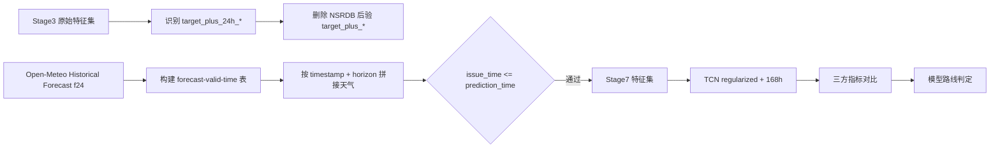

# Stage7 真实预报天气可用性验证进度报告

## 1. 阶段目标

验证 `t+24h` 的 `target_plus_*` 目标时刻天气特征，能否由真实 forecast issue/lead-time 天气替代，并判断 TCN 是否具备进入生产建模路线的价值。

本阶段不再使用 NSRDB 后验天气作为 `target_plus_*` 的上线等价输入。NSRDB 只保留为 Stage6 离线上限对照。

## 2. 已完成工作

| 工作项 | 状态 | 产物 |
|---|---:|---|
| 梳理 `target_plus_24h_*` 特征 | 完成 | `stage7_target_plus_feature_mapping.csv` |
| 选择真实预报源 | 完成 | Open-Meteo f24 可执行；HRRR f24 保留为生产级优先路线 |
| 构建 forecast-valid-time 数据集 | 完成 | `stage7_forecast_weather_dataset.parquet` |
| 重建 Stage3 特征 | 完成 | `stage7_feature_dataset.parquet` |
| 重训 TCN regularized + 168h | 完成 | `stage7_tcn_metrics.csv`, `stage7_tcn_predictions.csv`, `stage7_tcn_models/` |
| 三方对比 | 完成 | `stage7_forecast_validation_report.md` |
| 固化结论 | 完成 | 暂不推进 TCN 生产建模 |

关键路径已打通：真实预报天气表 -> 目标时刻天气替代 -> 泄漏审计 -> TCN 训练 -> 指标验收 -> 路线判定。

## 3. 数据与特征变更

Stage7 删除了原 Stage3 中由 NSRDB 后验天气生成的 `target_plus_6h_*` / `target_plus_24h_*`。删除字段包括 GHI/DHI/DNI、clearsky、solar zenith、surface albedo、precipitable water 等后验天气或太阳几何衍生字段。

替代后的 `target_plus_24h_*` 字段来自 Open-Meteo Historical Forecast f24，包含：

- 辐照：`ghi_wm2`, `dhi_wm2`, `dni_wm2`
- 气象：`temperature_c`, `dew_point_c`, `relative_humidity_pct`
- 风：`wind_speed_ms`, `wind_direction_deg`, `wind_gusts_ms`
- 气压与降水：`pressure_hpa`, `surface_pressure_hpa`, `precipitation_mm`
- 云量：`cloud_cover_pct`, `cloud_cover_low_pct`, `cloud_cover_mid_pct`, `cloud_cover_high_pct`
- 审计字段：`weather_forecast_issue_time`, `weather_forecast_lead_time_hour`

数据规模：

| 数据集 | 行数 | 说明 |
|---|---:|---|
| 原 Stage3 特征集 | 25,365 | 2020-2022 主线样本 |
| Open-Meteo f24 天气表 | 8,760 | 2022 全年小时级预报天气 |
| Stage7 特征集 | 8,716 | 完成 forecast-valid-time 拼接并剔除不完整样本 |

Pitfall: Stage7 当前只覆盖 2022 年可用 forecast-valid-time 数据，和 Stage5/Stage6 的 2020-2022 全量训练窗口不是完全同分布比较。

## 4. 指标完成度

| 验收项 | 门槛 | 实测 | 状态 |
|---|---:|---:|---:|
| `t+24h` TCN nRMSE | `<= 0.1225` | `0.1422` | 未通过 |
| `t+24h` 日间 nRMSE | `<= 0.1689` | `0.2020` | 未通过 |
| 质量门禁 | `100%` | `100%` | 通过 |
| 数据泄漏检查 | 必须通过 | 通过 | 通过 |
| 预测物理边界 | `[0, capacity_kw * 1.05]` | 通过 | 通过 |

三方对比：

| 实验 | nRMSE | 日间 nRMSE | 结论 |
|---|---:|---:|---|
| Stage5 tuned LightGBM | `0.1225` | `0.1689` | 当前稳健基线 |
| Stage6 TCN 上限实验 | `0.1159` | `0.1599` | 使用 NSRDB 后验 `target_plus_*`，只能视为上限 |
| Stage7 TCN 真实预报替代 | `0.1422` | `0.2020` | 未达到上线门槛 |

结论：真实预报天气替代后，TCN 指标明显退化。Stage6 的收益主要依赖目标时刻天气上限质量，不能直接证明 TCN 具备生产上线价值。

## 5. 质量门禁

| 门禁 | 结果 |
|---|---:|
| forecast weather 非空 | 通过 |
| `forecast_issue_time <= prediction_time` | 通过 |
| lead time 字段存在 | 通过 |
| 无 NSRDB `target_plus_*` 后验天气残留 | 通过 |
| timestamp 单调递增 | 通过 |
| 数值特征无缺失 | 通过 |
| 数值特征无无穷值 | 通过 |
| 测试集预测值在物理边界内 | 通过 |

质量结论：数据链路合格，失败原因不是数据泄漏或工程错误，而是真实预报天气替代后模型误差未达标。

## 6. 下一阶段可行性评估

| 路线 | 可行性 | 推荐级别 | 依据 | Pitfall |
|---|---:|---:|---|---|
| 回退并固化 tuned LightGBM `history_only` | 高 | 推荐 | Stage5 达到当前门槛，结构简单，训练和推理稳定 | 长周期天气突变时缺少目标时刻预报信息，极端天气下误差可能偏高 |
| 继续 TCN + Open-Meteo f24 | 低 | 不推荐 | Stage7 nRMSE `0.1422`，日间 nRMSE `0.2020`，均未过线 | 增加调参可能只是在 2022 小样本上过拟合 |
| 接入 HRRR 原生 f24 cycle/lead_time 后重跑 Stage7 | 中 | 条件推荐 | HRRR 具备原生 issue time / valid time / lead time，工程语义更接近生产 | GRIB 数据重、抽取慢、缺测处理复杂，成本显著高于当前收益 |
| 扩展多年度真实预报天气样本后重评 TCN | 中 | 条件推荐 | 可消除 2022 单年样本偏差，评估更稳健 | 若预报源质量仍弱，扩大样本只会更稳定地证明 TCN 不达标 |

推荐路线：短期固化 tuned LightGBM `history_only` 作为主模型；若必须验证深度学习上线价值，再投入 HRRR 原生 forecast-cycle 全年抽取，不继续在 Open-Meteo f24 假设 issue time 上堆 TCN 调参。

## 7. 下一阶段建议

1. 主模型路线：固化 Stage5 tuned LightGBM `history_only`，补齐模型加载、边界裁剪、批量推理和回测接口。
2. 天气路线：将 HRRR f24 作为单独技术预研，不阻塞主模型上线链路。
3. 评估路线：若 HRRR 全年抽取完成，复用 Stage7 框架重跑相同验收门槛，不更改判定标准。
4. 报告路线：论文或展示中明确区分 Stage6 上限实验和 Stage7 真实预报替代实验，禁止把 NSRDB target-plus 结果描述为上线可得天气预报。

## 8. 产物索引

| 产物 | 路径 |
|---|---|
| Stage7 验证报告 | `data/processed/pvdaq_nsrdb_2020_2022/stage7_forecast_validation_report.md` |
| Forecast-valid-time 数据集 | `data/processed/pvdaq_nsrdb_2020_2022/stage7_forecast_weather_dataset.parquet` |
| Stage7 特征集 | `data/processed/pvdaq_nsrdb_2020_2022/stage7_feature_dataset.parquet` |
| 特征映射表 | `data/processed/pvdaq_nsrdb_2020_2022/stage7_target_plus_feature_mapping.csv` |
| 泄漏审计表 | `data/processed/pvdaq_nsrdb_2020_2022/stage7_forecast_availability_audit.csv` |
| TCN 指标 | `data/processed/pvdaq_nsrdb_2020_2022/stage7_tcn_metrics.csv` |
| TCN 预测 | `data/processed/pvdaq_nsrdb_2020_2022/stage7_tcn_predictions.csv` |

## 9. 总结

Stage7 完成了真实预报天气可用性验证。工程链路成立，质量门禁成立，泄漏检查成立，但核心误差指标失败。

最终判断：TCN 暂无上线价值。下一阶段应以 tuned LightGBM `history_only` 为主模型路线，HRRR forecast-cycle 作为增强天气路线的独立预研。
