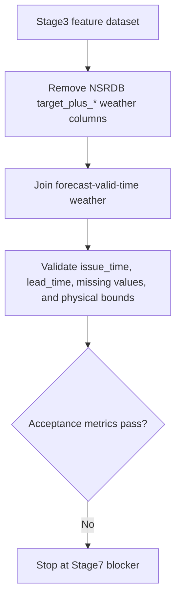

# Stage 7 Forecast Weather Blocker Review

## Scope

- Config: `configs/data_sources.pvdaq_nsrdb_2020_2022.json`
- Stage3 input: `data/processed/pvdaq_nsrdb_2020_2022/stage3_feature_dataset.parquet`
- Forecast weather input: `data/processed/pvdaq_nsrdb_2020_2022/stage7_forecast_weather_dataset.parquet`
- Report JSON: `data/processed/pvdaq_nsrdb_2020_2022/stage7_forecast_validation_report.json`

## Execution Summary

## Result

| Check | Result |
|---|---:|
| Forecast weather rows | `8760` |
| Stage7 feature rows | `8716` |
| Rows removed without complete forecast | `16642` |
| Quality gates pass | `true` |
| Leakage check pass | `true` |
| Physical bound pass | `true` |
| nRMSE pass | `false` |
| Daytime nRMSE pass | `false` |

## Metric Comparison

| Model / experiment | nRMSE capacity | Daytime nRMSE capacity |
|---|---:|---:|
| Stage5 tuned LightGBM | `0.078869` | `0.091788` |
| Stage6 TCN upper-bound | `0.080423` | `0.091894` |
| Stage7 forecast-weather TCN | `0.142840` | `0.208603` |

## Decision

Stop before Stage8/Stage9. The Stage7 input is structurally usable, but the real-forecast replacement degrades t+24h TCN accuracy beyond the acceptance threshold. Continuing would mix a failed production-weather validation with later model comparison and inference results.

## Route Options

| Route | Work | Recommendation | Pitfall |
|---|---|---:|---|
| A. Finish HRRR native cycle extraction | Complete full-year HRRR valid_time / issue_time / lead_time extraction and rerun Stage7 | High | GRIB extraction cost and missing-hour handling can bias metrics if not audited |
| B. Keep Stage5 LightGBM as production baseline | Proceed only after explicitly scoping Stage8/9 to the validated tabular baseline, excluding failed Stage7 TCN production claim | Medium | This changes the original Stage7-to-TCN upgrade goal and must be documented as a scope decision |
| C. Improve Open-Meteo forecast feature mapping | Audit forecast alignment, add solar geometry/clearsky compatibility features, then rerun Stage7 | Medium | Open-Meteo issue time remains an API-derived assumption, weaker than native forecast-cycle metadata |

## Stage Status

- Stage1/bootstrap: passed after PVDAQ timezone fix.
- Stage2 cleaning: passed; PV/GHI best shift is `0h`, zero-shift correlation is `0.894811`.
- Stage3 features: passed quality gates.
- Stage4 baseline: passed quality gates.
- Stage5 optimization: passed quality gates.
- Stage6 TCN: passed quality gates.
- Stage7 forecast-weather validation: blocked on acceptance metrics.
