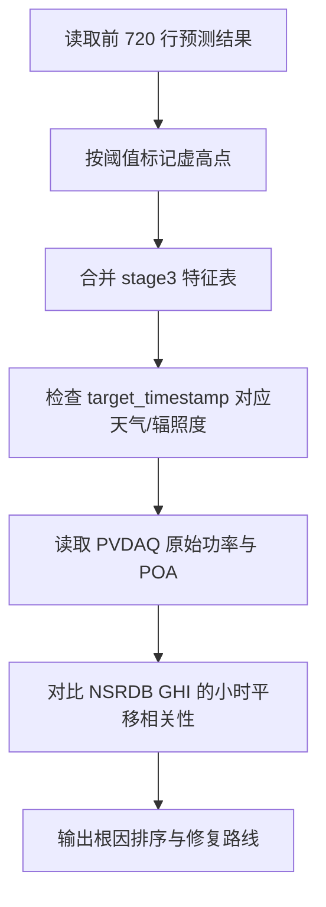

# PV 预测虚高数据诊断报告

## 结论摘要

本报告只诊断前端截图中 30 天窗口对应的数据，不修改训练链路、不重训模型、不改前端或后端接口。

| 结论 | 证据 | 判断 |
|---|---|---|
| 当前图表的虚高不是随机噪声 | 前 720 行预测中有 43 个小时满足 `prediction_kw >= 0.40`、`actual_kw <= 0.25`、`error_kw >= 0.25` | 系统性问题 |
| `actual_kw` 与 t+24h 目标列自洽 | `actual_kw` 与 `target_pv_power_t_plus_24h` 最大绝对差约 `1.11e-16` | 预测文件目标映射本身正确 |
| 根因优先级最高的是时间轴错位 | PVDAQ 功率时间整体后移 `+7h` 后，与 NSRDB GHI 相关性从 `-0.262` 升至 `0.904` | 优先修时间戳 |
| 模型本身也会放大虚高 | Stage9 主模型是 `history_only` t+24h LightGBM，只看历史功率和时间特征，不使用目标时刻天气 | 次要但真实 |
| 图表有解释风险 | 图表 x 轴展示输入 `timestamp`，但 `actual_kw` 是 `timestamp + 24h` 的目标值 | 容易误读日期 |

**最可能根因**：PVDAQ 原始 `measured_on` 是无时区时间，当前标准化逻辑直接用 `pd.to_datetime(..., utc=True)` 解释为 UTC，导致 PVDAQ 功率与 NSRDB UTC 辐照度错位。模型随后在错位时间轴上学习历史功率日周期，于是出现“真实接近 0、预测仍很高”的虚高。

**Pitfall**：如果后续只调模型参数或换模型，不先修正时间轴，虚高会被压低但根因不会消失，后续储能调度仍会基于错误发电时段做决策。

## 诊断范围与规则

| 项目 | 固定设置 |
|---|---|
| 预测文件 | `data/processed/pvdaq_nsrdb_2020_2022/stage9_main_model_predictions.csv` |
| 特征文件 | `data/processed/pvdaq_nsrdb_2020_2022/stage3_feature_dataset.parquet` |
| 原始 PVDAQ 文件 | `data/raw/pvdaq/pvdaq_system_10_2020.csv` |
| 原始 NSRDB 文件 | `data/raw/weather/nsrdb_system10_2020_2022.csv` |
| 图表窗口 | 前 `720` 行，对应前端“30 天”加载窗口 |
| 输入时间范围 | `2020-01-30 11:00Z` 到 `2020-02-29 10:00Z` |
| 目标时间范围 | `2020-01-31 11:00Z` 到 `2020-03-01 10:00Z` |
| 虚高规则 | `prediction_kw >= 0.40` 且 `actual_kw <= 0.25` 且 `error_kw >= 0.25` |
| 白天规则 | `target_plus_24h_clearsky_ghi_wm2 > 100` |

## 证据 1：虚高行级清单

下表中 `timestamp` 是模型输入时刻，`target_timestamp = timestamp + 24h` 才是 `actual_kw` 对应的真实目标时刻。

| timestamp | target_timestamp | actual_kw | prediction_kw | error_kw | target_plus_24h_ghi_wm2 | target_plus_24h_clearsky_ghi_wm2 | target_plus_24h_clearsky_index_ghi | pv_power_lag_24h |
|:---|:---|---:|---:|---:|---:|---:|---:|---:|
| 2020-02-02 09:00Z | 2020-02-03 09:00Z | 0.019 | 0.449 | 0.430 | 0 | 0 | 0.000 | 0.436 |
| 2020-02-02 10:00Z | 2020-02-03 10:00Z | 0.026 | 0.561 | 0.535 | 0 | 0 | 0.000 | 0.663 |
| 2020-02-02 11:00Z | 2020-02-03 11:00Z | 0.013 | 0.571 | 0.558 | 0 | 0 | 0.000 | 0.625 |
| 2020-02-02 12:00Z | 2020-02-03 12:00Z | 0.009 | 0.552 | 0.544 | 0 | 0 | 0.000 | 0.814 |
| 2020-02-02 13:00Z | 2020-02-03 13:00Z | 0.004 | 0.467 | 0.463 | 0 | 0 | 0.000 | 0.628 |
| 2020-02-03 10:00Z | 2020-02-04 10:00Z | 0.000 | 0.419 | 0.419 | 0 | 0 | 0.000 | 0.811 |
| 2020-02-03 11:00Z | 2020-02-04 11:00Z | 0.000 | 0.449 | 0.448 | 0 | 0 | 0.000 | 0.892 |
| 2020-02-03 12:00Z | 2020-02-04 12:00Z | 0.000 | 0.441 | 0.441 | 0 | 0 | 0.000 | 0.918 |
| 2020-02-03 13:00Z | 2020-02-04 13:00Z | 0.000 | 0.449 | 0.449 | 0 | 0 | 0.000 | 0.864 |
| 2020-02-03 14:00Z | 2020-02-04 14:00Z | 0.000 | 0.410 | 0.410 | 23 | 47 | 0.489 | 0.747 |
| 2020-02-04 10:00Z | 2020-02-05 10:00Z | 0.004 | 0.501 | 0.497 | 0 | 0 | 0.000 | 0.026 |
| 2020-02-04 11:00Z | 2020-02-05 11:00Z | 0.018 | 0.525 | 0.508 | 0 | 0 | 0.000 | 0.013 |
| 2020-02-04 12:00Z | 2020-02-05 12:00Z | 0.073 | 0.535 | 0.462 | 0 | 0 | 0.000 | 0.009 |
| 2020-02-05 10:00Z | 2020-02-06 10:00Z | 0.225 | 0.497 | 0.272 | 0 | 0 | 0.000 | 0.000 |
| 2020-02-06 09:00Z | 2020-02-07 09:00Z | 0.018 | 0.410 | 0.391 | 0 | 0 | 0.000 | 0.000 |
| 2020-02-06 10:00Z | 2020-02-07 10:00Z | 0.004 | 0.455 | 0.451 | 0 | 0 | 0.000 | 0.004 |
| 2020-02-06 11:00Z | 2020-02-07 11:00Z | 0.003 | 0.480 | 0.477 | 0 | 0 | 0.000 | 0.018 |
| 2020-02-06 12:00Z | 2020-02-07 12:00Z | 0.003 | 0.479 | 0.477 | 0 | 0 | 0.000 | 0.073 |
| 2020-02-06 13:00Z | 2020-02-07 13:00Z | 0.015 | 0.474 | 0.459 | 0 | 0 | 0.000 | 0.423 |
| 2020-02-06 14:00Z | 2020-02-07 14:00Z | 0.008 | 0.424 | 0.416 | 19 | 54 | 0.352 | 0.583 |
| 2020-02-08 09:00Z | 2020-02-09 09:00Z | 0.059 | 0.402 | 0.344 | 0 | 0 | 0.000 | 0.018 |
| 2020-02-08 10:00Z | 2020-02-09 10:00Z | 0.119 | 0.455 | 0.336 | 0 | 0 | 0.000 | 0.004 |
| 2020-02-08 11:00Z | 2020-02-09 11:00Z | 0.191 | 0.478 | 0.287 | 0 | 0 | 0.000 | 0.003 |
| 2020-02-10 09:00Z | 2020-02-11 09:00Z | 0.035 | 0.431 | 0.396 | 0 | 0 | 0.000 | 0.059 |
| 2020-02-11 12:00Z | 2020-02-12 12:00Z | 0.123 | 0.469 | 0.345 | 0 | 0 | 0.000 | 0.659 |
| 2020-02-11 13:00Z | 2020-02-12 13:00Z | 0.023 | 0.459 | 0.436 | 0 | 0 | 0.000 | 0.487 |
| 2020-02-18 09:00Z | 2020-02-19 09:00Z | 0.127 | 0.429 | 0.302 | 0 | 0 | 0.000 | 0.711 |
| 2020-02-18 10:00Z | 2020-02-19 10:00Z | 0.201 | 0.635 | 0.434 | 0 | 0 | 0.000 | 0.872 |
| 2020-02-18 11:00Z | 2020-02-19 11:00Z | 0.210 | 0.656 | 0.447 | 0 | 0 | 0.000 | 0.947 |
| 2020-02-18 12:00Z | 2020-02-19 12:00Z | 0.132 | 0.706 | 0.574 | 0 | 0 | 0.000 | 0.953 |
| 2020-02-18 13:00Z | 2020-02-19 13:00Z | 0.146 | 0.624 | 0.478 | 0 | 0 | 0.000 | 0.580 |
| 2020-02-18 14:00Z | 2020-02-19 14:00Z | 0.071 | 0.522 | 0.452 | 32 | 102 | 0.314 | 0.331 |
| 2020-02-22 09:00Z | 2020-02-23 09:00Z | 0.046 | 0.428 | 0.382 | 0 | 0 | 0.000 | 0.730 |
| 2020-02-22 10:00Z | 2020-02-23 10:00Z | 0.098 | 0.573 | 0.476 | 0 | 0 | 0.000 | 0.876 |
| 2020-02-22 11:00Z | 2020-02-23 11:00Z | 0.218 | 0.620 | 0.403 | 0 | 0 | 0.000 | 0.944 |
| 2020-02-23 09:00Z | 2020-02-24 09:00Z | 0.149 | 0.401 | 0.252 | 0 | 0 | 0.000 | 0.486 |
| 2020-02-24 09:00Z | 2020-02-25 09:00Z | 0.124 | 0.454 | 0.330 | 0 | 0 | 0.000 | 0.046 |
| 2020-02-24 10:00Z | 2020-02-25 10:00Z | 0.225 | 0.620 | 0.395 | 0 | 0 | 0.000 | 0.098 |
| 2020-02-25 14:00Z | 2020-02-26 14:00Z | 0.167 | 0.533 | 0.366 | 141 | 141 | 1.000 | 0.863 |
| 2020-02-28 09:00Z | 2020-02-29 09:00Z | 0.087 | 0.561 | 0.474 | 0 | 0 | 0.000 | 0.740 |
| 2020-02-28 10:00Z | 2020-02-29 10:00Z | 0.104 | 0.653 | 0.549 | 0 | 0 | 0.000 | 0.895 |
| 2020-02-28 11:00Z | 2020-02-29 11:00Z | 0.120 | 0.662 | 0.541 | 0 | 0 | 0.000 | 1.000 |
| 2020-02-29 10:00Z | 2020-03-01 10:00Z | 0.129 | 0.570 | 0.441 | 0 | 0 | 0.000 | 0.851 |

**解读**：

- 虚高集中在目标时刻 `09:00-14:00Z`，其中 `10:00Z` 最多。
- 多数虚高点的目标时刻 NSRDB GHI 与 clear-sky GHI 为 `0`，但历史滞后功率 `pv_power_lag_24h` 经常很高。
- 这不是单纯天气缺失。更强证据是 PVDAQ 自身存在“UTC 清晨已有高发电”的形态，说明 PV 时间轴被提前放到了 UTC 清晨。

## 证据 2：日级汇总

| target_date | rows | daylight_rows | false_high_rows | actual_day_mean | pred_day_mean | max_error | max_pred | min_actual_day | ghi_day_mean | clear_ghi_day_mean |
|:---|---:|---:|---:|---:|---:|---:|---:|---:|---:|---:|
| 2020-02-03 | 24 | 9 | 5 | 0.000 | 0.054 | 0.558 | 0.571 | 0.000 | 100.556 | 421.333 |
| 2020-02-04 | 24 | 9 | 5 | 0.000 | 0.049 | 0.449 | 0.449 | 0.000 | 339.778 | 444.000 |
| 2020-02-05 | 24 | 9 | 3 | 0.081 | 0.059 | 0.508 | 0.557 | 0.000 | 446.444 | 453.556 |
| 2020-02-06 | 24 | 9 | 1 | 0.044 | 0.056 | 0.272 | 0.528 | 0.000 | 226.556 | 446.778 |
| 2020-02-07 | 24 | 9 | 6 | 0.000 | 0.049 | 0.477 | 0.480 | 0.000 | 191.000 | 446.000 |
| 2020-02-09 | 24 | 9 | 3 | 0.005 | 0.058 | 0.344 | 0.508 | 0.000 | 318.111 | 454.333 |
| 2020-02-11 | 24 | 9 | 1 | 0.089 | 0.046 | 0.396 | 0.543 | 0.000 | 489.556 | 489.556 |
| 2020-02-12 | 24 | 9 | 2 | 0.011 | 0.052 | 0.436 | 0.476 | 0.000 | 278.556 | 483.556 |
| 2020-02-19 | 24 | 10 | 6 | 0.010 | 0.111 | 0.574 | 0.706 | 0.000 | 259.500 | 475.100 |
| 2020-02-23 | 24 | 10 | 3 | 0.082 | 0.111 | 0.476 | 0.625 | 0.000 | 312.800 | 479.100 |
| 2020-02-24 | 24 | 10 | 1 | 0.193 | 0.118 | 0.252 | 0.748 | 0.000 | 472.100 | 513.900 |
| 2020-02-25 | 24 | 10 | 2 | 0.069 | 0.122 | 0.395 | 0.691 | 0.000 | 328.900 | 514.300 |
| 2020-02-26 | 24 | 10 | 1 | 0.102 | 0.117 | 0.366 | 0.711 | 0.000 | 478.200 | 517.900 |
| 2020-02-29 | 24 | 10 | 3 | 0.167 | 0.133 | 0.549 | 0.699 | 0.000 | 254.100 | 532.700 |
| 2020-03-01 | 11 | 0 | 1 |  |  | 0.441 | 0.570 |  |  |  |

按目标小时统计：

| target_hour_utc | false_high_rows |
|---:|---:|
| 9 | 9 |
| 10 | 11 |
| 11 | 8 |
| 12 | 6 |
| 13 | 5 |
| 14 | 4 |

**解读**：

- 虚高不是平均分布在全天，而是集中在 UTC 上午。
- 对科罗拉多站点而言，UTC 上午通常不应是稳定高出力时段。
- 这些小时与原始 PVDAQ 中高出力出现的 `08:00-15:00` 无时区时间高度重叠，进一步支持“本地时间被当 UTC”的判断。

## 证据 3：时间轴审计

### 原始 PVDAQ 高出力样例

原始 `measured_on` 没有时区信息，但在 `2020-01-23 11:00` 已经出现 `0.430 kW`，POA 辐照度也达到 `474.393 W/m2`。

| measured_on | pv_power_kw | poa_irradiance_wm2 |
|:---|---:|---:|
| 2020-01-23 11:00 | 0.430 | 474.393 |
| 2020-01-23 12:00 | 0.812 | 894.356 |
| 2020-01-23 13:00 | 0.408 | 459.311 |
| 2020-01-23 14:00 | 0.368 | 416.517 |
| 2020-01-23 15:00 | 0.471 | 531.004 |
| 2020-01-24 08:00 | 0.402 | 446.473 |
| 2020-01-24 09:00 | 0.557 | 618.245 |
| 2020-01-24 10:00 | 0.698 | 777.564 |

当前代码把这类无时区时间直接转换为 UTC。若 `2020-01-23 11:00` 真是 UTC，则站点约为当地凌晨 `04:00`，不应有如此高的 POA 与 AC 功率。

### 小时平移相关性

将 PVDAQ 小时功率与 NSRDB GHI 做不同小时平移后，`+7h` 的相关性最高。

| pv_shift_hours | matched_rows | corr_power_vs_ghi | corr_poa_vs_ghi | mean_ghi_when_power_gt_0p2 |
|---:|---:|---:|---:|---:|
| 7.000 | 894.000 | 0.904 | 0.942 | 460.067 |
| 6.000 | 895.000 | 0.849 | 0.867 | 447.164 |
| 8.000 | 893.000 | 0.821 | 0.880 | 423.799 |
| 5.000 | 896.000 | 0.695 | 0.695 | 399.382 |
| 9.000 | 892.000 | 0.649 | 0.719 | 362.274 |
| 4.000 | 897.000 | 0.484 | 0.471 | 332.529 |
| 10.000 | 891.000 | 0.431 | 0.502 | 287.892 |
| 3.000 | 898.000 | 0.252 | 0.232 | 253.907 |

对比几个关键平移：

| pv_shift_hours | matched_rows | corr_power_vs_ghi | corr_poa_vs_ghi | mean_ghi_when_power_gt_0p2 |
|---:|---:|---:|---:|---:|
| -8.000 | 909.000 | -0.366 | -0.389 | 0.716 |
| -7.000 | 908.000 | -0.372 | -0.397 | 0.000 |
| 0.000 | 901.000 | -0.262 | -0.285 | 57.324 |
| 5.000 | 896.000 | 0.695 | 0.695 | 399.382 |
| 6.000 | 895.000 | 0.849 | 0.867 | 447.164 |
| 7.000 | 894.000 | 0.904 | 0.942 | 460.067 |
| 8.000 | 893.000 | 0.821 | 0.880 | 423.799 |

**解读**：

- 不平移时，PV 功率与 NSRDB GHI 的相关性为负，物理上异常。
- PV 时间整体后移 `+7h` 后，功率与 GHI 的相关性达到 `0.904`，POA 与 GHI 的相关性达到 `0.942`，符合太阳能系统的物理规律。
- `+7h` 与站点配置中的经纬度 `39.7404, -105.1774` 所在山地时区在冬季的 UTC 偏移一致。

## 根因排序

| 优先级 | 根因 | 证据 | 处理建议 | Pitfall |
|---:|---|---|---|---|
| P0 | PVDAQ 时间戳被错当 UTC | 原始 `measured_on` 无时区；`+7h` 后相关性最佳 | 修正 PVDAQ 标准化逻辑，按站点本地时区解释后转 UTC | 需要确认是否跨 DST，不能硬编码全年 `+7h` |
| P1 | Stage9 主模型为 `history_only` | 模型 bundle 特征仅含时间与历史功率，不含目标天气 | 时间轴修正后，重新比较 `history_only` 与天气增强模型 | 未修时间轴前比较模型，会把数据错位误判成模型能力问题 |
| P2 | 图表展示 t+24h 结果时使用输入时间 | 图表直接使用 `timestamp`，但真实目标是 `timestamp + 24h` | 前端或 API 可显式返回 `target_timestamp` 用于展示 | 仅改图表标签不会修复模型训练问题 |
| P3 | 设备异常或缺失值 | 当前前 30 天没有直接状态字段证据 | 时间轴修正后再查停机、限电、缺失 | 过早按设备异常清洗，会掩盖真实时间轴问题 |

## 推荐修复路线

| 方案 | 内容 | 推荐度 | Pitfall |
|---|---|---:|---|
| 先修时间轴再重跑 Stage 2-9 | 在 PVDAQ 标准化中按站点本地时区解析 `measured_on`，转 UTC 后重建数据、特征、模型和预测 | 高 | 必须处理 DST，否则夏季会残留 1 小时错位 |
| 增加时间轴诊断脚本 | 固化 PV/POA/GHI 平移相关性审计，作为数据接入质量门禁 | 高 | 只做诊断不重跑，现有虚高图仍不会变化 |
| 前端展示 `target_timestamp` | 让 t+24h 预测图按目标时刻显示，降低误读 | 中 | 只能改善解释，不解决训练数据错位 |
| 直接换模型或调参 | 用更复杂模型压低虚高 | 低 | 数据错位不解决，模型会学习错误物理关系 |

推荐执行顺序：

1. 修正 PVDAQ 时区解析，避免无时区 `measured_on` 被当 UTC。
2. 重跑 Stage 2-9，重新生成 `stage9_main_model_predictions.csv`。
3. 复算本报告的三组证据，确认虚高小时数显著下降，且 PV/GHI 相关性在 `0h` 平移附近达到最高。
4. 再评估是否需要加入目标时刻天气、设备状态或前端 `target_timestamp` 展示。

## 阶段总结

| 项目 | 状态 |
|---|---|
| 工作内容 | 已完成前 30 天虚高行级清单、日级汇总、PVDAQ-NSRDB 时间轴相关性审计 |
| 目标完成情况 | 已解释截图中若干虚高的主要数据原因，且未修改训练链路 |
| 当前阶段结论 | 时间轴错位优先级高于模型调参和设备异常排查 |
| 下一阶段可行性 | 高；只要修正 PVDAQ 时区并重跑 Stage 2-9，即可用相同诊断方法验证虚高是否消失 |

