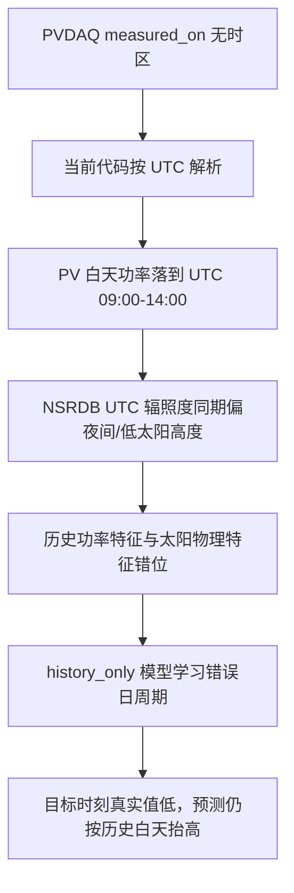

# PV 预测虚高全量确认与修正计划

## 结论摘要

本报告把前端截图前 720 行之外的剩余预测数据一并确认，并给出针对 PVDAQ 时间轴错误的修正计划。当前阶段仍不修改训练链路、不重训模型、不覆盖现有数据产物。

| 范围 | 行数 | 虚高小时数 | 虚高率 | 严重虚高小时数 | 最大正误差 | 判断 |
|---|---:|---:|---:|---:|---:|---|
| 前 720 行 | 720 | 43 | 5.9722% | 4 | 0.574 kW | 截图窗口问题明确 |
| 剩余数据 | 24,645 | 839 | 3.4043% | 56 | 0.724 kW | 问题贯穿后续数据 |
| 全量 Stage9 | 25,365 | 882 | 3.4772% | 60 | 0.724 kW | 不是局部异常 |

虚高定义保持不变：`prediction_kw >= 0.40` 且 `actual_kw <= 0.25` 且 `error_kw >= 0.25`。

**核心判断**：剩余数据仍然大量出现同类虚高，且集中在目标时刻 `09:00-14:00Z`。全量 2020-2022 原始 PVDAQ 与 NSRDB 审计显示，把 PVDAQ 时间整体后移 `+7h` 后，PV 功率与 GHI 的相关性从 `-0.248` 提升到 `0.898`。因此根因不是前 720 行偶然异常，而是 PVDAQ 无时区时间被错当 UTC 造成的系统性时间轴错位。

**Pitfall**：如果只在预测后处理里压低 `09:00-14:00Z` 的预测值，会让图表好看一些，但训练数据、特征工程、模型评估和储能调度仍然建立在错误时间轴上。

## 全量确认结果

### 剩余数据虚高分布

前 720 行之外共有 `24,645` 行，其中 `839` 个虚高小时。剩余虚高的中位预测值为 `0.520 kW`，中位真实值为 `0.098 kW`，中位误差为 `0.409 kW`，中位 `pv_power_lag_24h` 为 `0.627 kW`。

| 指标 | 值 |
|---|---:|
| 剩余虚高小时数 | 839 |
| `clearsky_ghi == 0` 的虚高小时 | 496 |
| `clearsky_ghi <= 100` 的虚高小时 | 625 |
| `ghi == 0` 的虚高小时 | 498 |
| 中位预测值 | 0.520 kW |
| 中位真实值 | 0.098 kW |
| 中位误差 | 0.409 kW |
| 中位 24h 滞后功率 | 0.627 kW |

按目标小时统计，剩余虚高高度集中在 UTC 上午：

| target_hour_utc | false_high_rows | false_high_rate |
|---:|---:|---:|
| 8 | 10 | 0.97% |
| 9 | 115 | 11.21% |
| 10 | 124 | 12.09% |
| 11 | 121 | 11.79% |
| 12 | 146 | 14.22% |
| 13 | 174 | 16.93% |
| 14 | 147 | 14.30% |
| 15 | 2 | 0.19% |

月度虚高最多的月份如下：

| target_month | false_high_rows | false_high_rate | severe_false_high_rows | max_error |
|---|---:|---:|---:|---:|
| 2021-05 | 48 | 6.45% | 0 | 0.562 |
| 2022-11 | 44 | 6.13% | 13 | 0.724 |
| 2022-01 | 41 | 5.51% | 0 | 0.525 |
| 2022-03 | 40 | 5.38% | 3 | 0.566 |
| 2020-12 | 36 | 4.84% | 1 | 0.572 |
| 2022-09 | 34 | 4.72% | 2 | 0.595 |
| 2022-12 | 34 | 4.57% | 3 | 0.618 |
| 2021-10 | 31 | 4.17% | 7 | 0.636 |
| 2022-07 | 30 | 4.03% | 0 | 0.503 |
| 2022-02 | 28 | 4.32% | 1 | 0.574 |

### 时间轴审计

全量 2020-2022 原始数据平移相关性：

| PVDAQ 时间平移 | 匹配行数 | PV 功率 vs GHI 相关性 | POA vs GHI 相关性 | 高功率时 GHI 均值 |
|---:|---:|---:|---:|---:|
| 0h | 25,765 | -0.248 | -0.213 | 107.047 |
| +5h | 25,760 | 0.692 | 0.588 | 481.874 |
| +6h | 25,759 | 0.836 | 0.710 | 538.582 |
| +7h | 25,758 | 0.898 | 0.764 | 565.514 |
| +8h | 25,757 | 0.834 | 0.713 | 541.990 |

分月最优平移统计：

| 最优平移 | 月份数量 | 说明 |
|---:|---:|---|
| +7h | 35 | 绝大多数月份最优 |
| +6h | 1 | 仅 2020-07 略优，且与 +7h 差值只有 `0.0068` |

**解释**：当前代码把 PVDAQ 原始 `measured_on` 直接解析成 UTC，导致系统把站点白天功率放到 UTC 上午。全量相关性证明，PVDAQ 时间更符合固定 UTC-7 的本地标准时间，而不是当前 UTC 解释。



## 根因与影响

| 优先级 | 问题 | 影响 | 证据 | Pitfall |
|---:|---|---|---|---|
| P0 | PVDAQ 无时区时间被错当 UTC | Stage2 之后的功率时间轴、特征、标签、模型和调度均受影响 | `+7h` 后全量相关性从 `-0.248` 到 `0.898` | 硬编码 `+7h` 到代码会污染其他数据源 |
| P1 | Stage9 主模型只用 `history_only` | 在错位数据上更容易复制错误日周期 | 虚高中位 24h 滞后功率 `0.627 kW` | 未修时间轴前比较模型优劣没有意义 |
| P2 | 图表展示输入 `timestamp` 而非 `target_timestamp` | t+24h 预测的日期解释容易错 | 预测文件中 `actual_kw` 对应 `timestamp + 24h` | 只改展示不能修复训练数据 |
| P3 | 缺少时间轴质量门禁 | 同类错误可再次进入数据集 | 当前质量报告只检查单调、缺失和范围 | 没有物理相关性门禁会漏过时间错位 |

## 修正计划

| 方案 | 内容 | 推荐度 | Pitfall |
|---|---|---:|---|
| 配置化时区修正 | 给 PVDAQ 数据源增加 `timezone: "Etc/GMT+7"`，标准化时把无时区 `measured_on` 先按该时区本地化，再转 UTC | 高 | `Etc/GMT+7` 表示 UTC-7，命名容易误用 |
| 时间轴质量门禁 | 在 Stage2 质量报告增加 PV/POA 与 GHI 的平移相关性审计，要求最优平移为 `0h` 或接近 `0h` | 高 | 阴雨月相关性较低，需要用全量或月度聚合判断 |
| 重跑 Stage2-9 | 修正后重建清洗数据、特征、模型、主模型推理结果 | 高 | 不重训模型会继续使用旧时间轴学到的错误规律 |
| 前端显示目标时间 | API 或前端增加 `target_timestamp = timestamp + 24h` 展示口径 | 中 | 只能减少误读，不解决模型根因 |

推荐实施顺序：

1. **配置修正**  
   在 `configs/data_sources.pvdaq_nsrdb_2020_2022.json` 的 `sources.pv_power` 中增加 `timezone: "Etc/GMT+7"`，只作用于 PVDAQ System 10 当前数据源。

2. **标准化逻辑修正**  
   修改 `src/new_energy_sys/standardize.py` 的 `normalize_pv_power`：
   - 若源时间列无时区且配置提供 `timezone`，先 `tz_localize(timezone)`，再 `tz_convert("UTC")`。
   - 若源时间列已经带时区，直接转 UTC。
   - 若配置未提供 `timezone`，保留当前 UTC 解析行为，并在报告中标记该假设。

3. **质量报告增强**  
   在 Stage2 清洗报告中增加时间轴审计字段：
   - 当前对齐 `0h` 的 `pv_power_kw` vs `ghi_wm2` 相关性。
   - `-10h` 到 `+10h` 的最佳平移和最佳相关性。
   - 质量门禁：全量最佳平移应为 `0h`，且 `corr_power_ghi >= 0.75`；若最佳平移非 `0h` 且相关性提升超过 `0.05`，直接失败。

4. **重跑链路**  
   使用同一配置重跑：

   ```powershell
   python -m new_energy_sys.cli.bootstrap_data --config configs\data_sources.pvdaq_nsrdb_2020_2022.json
   python -m new_energy_sys.cli.clean_data --config configs\data_sources.pvdaq_nsrdb_2020_2022.json --input data\processed\pvdaq_nsrdb_2020_2022\hourly_training_with_storage.parquet
   python -m new_energy_sys.cli.build_features --config configs\data_sources.pvdaq_nsrdb_2020_2022.json --input data\processed\pvdaq_nsrdb_2020_2022\stage2_cleaned_hourly_dataset.parquet
   python -m new_energy_sys.cli.train_baseline --config configs\data_sources.pvdaq_nsrdb_2020_2022.json --input data\processed\pvdaq_nsrdb_2020_2022\stage3_feature_dataset.parquet
   python -m new_energy_sys.cli.compare_tabular_models --config configs\data_sources.pvdaq_nsrdb_2020_2022.json --input data\processed\pvdaq_nsrdb_2020_2022\stage3_feature_dataset.parquet
   python -m new_energy_sys.cli.run_stage9_inference --config configs\data_sources.pvdaq_nsrdb_2020_2022.json --input data\processed\pvdaq_nsrdb_2020_2022\stage3_feature_dataset.parquet
   ```

5. **验收复核**  
   重跑后复用本报告口径检查：
   - 全量 PV/GHI 最优平移应从 `+7h` 回到 `0h`。
   - `corr_power_ghi` 在 `0h` 应接近当前修正前 `+7h` 的水平，目标不低于 `0.85`。
   - 全量虚高小时数应显著低于当前 `882`。
   - UTC `09:00-14:00` 的虚高集中现象应消失。
   - Stage9 指标需要重新评估，不沿用旧模型结论。

## 阶段总结

| 项目 | 状态 |
|---|---|
| 已完成工作 | 已确认前 720 行之外仍有 `839` 个虚高小时；已完成 2020-2022 全量 PVDAQ/NSRDB 时间轴审计 |
| 目标完成情况 | 已证明错误是全量系统性问题，不是截图窗口局部问题 |
| 修正优先级 | 先修 PVDAQ 时区解析，再重跑 Stage2-9，最后再评估模型和前端展示 |
| 下一阶段可行性 | 高；修正范围集中在配置、标准化函数和质量报告，验证指标明确 |

