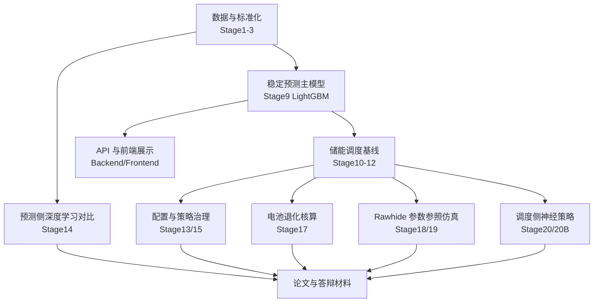

# 项目各模块进度评估报告

**日期**: 2026-05-05  
**评估口径**: 以 `PROGRESS.md`、`docs/reports_index.md`、`reports/project_status_2026-05-05.md` 和 `data/processed/pvdaq_nsrdb_2020_2022/` 下当前产物为准。完成度是工程交付成熟度估计，不是论文评分或自动化测试覆盖率。

---

## 一、总体结论

当前项目已经形成完整主链路：

总体完成度判断：**工程实验链路 90% 左右，论文整合 70% 左右，生产部署实机验收 75% 左右**。

Pitfall：不要把“实验链路完整”写成“生产系统已部署上线”。当前最强证据是可复现实验和本地演示系统，不是目标服务器上的长期运行记录。

---

## 二、模块完成度总表

| 模块 | 完成度 | 当前状态 | 关键证据 | 主要风险 |
|---|---:|---|---|---|
| 数据采集、清洗、特征工程 | 95% | 主线数据集稳定 | Stage2/3 产物完整，主配置为 `configs/data_sources.pvdaq_nsrdb_2020_2022.json` | 外部数据源语义要写清楚，NSRDB 不是实时 forecast-cycle |
| 主预测模型 | 95% | Stage9 LightGBM 已固化 | t+24h test nRMSE `0.122512`，daytime nRMSE `0.168903` | 不能宣称使用真实天气预报生产链路 |
| 预测侧深度学习 | 85% | Stage14 可作为补强对比 | TCN/DLinear/CNN-LSTM/Attention-LSTM 已形成比较材料 | DL 未形成稳定替代 LightGBM 的主结论 |
| 天气预报、HRRR、CSI、Quantile | 70% | 作为研究补充可用 | HRRR/CSI/Quantile 报告已归档为 REFERENCE | 不应替代 Stage9 主预测链 |
| 储能调度优化 | 95% | Stage12 rolling 是显式优化基线 | 物理约束审计通过，全窗口增量收益 `0.610039 EUR` | 收益依赖映射电价，不是真实市场结算 |
| 配置敏感性与策略治理 | 90% | Stage13/15 支撑配置决策 | Stage15 网格扫描、Pareto 配置和治理报告已完成 | 参数范围是实验设定，不是商业采购结论 |
| 电池退化核算 | 85% | Stage17 增强真实度 | Rainflow、SOH、退化成本和净收益核算完成 | 非厂商级电化学模型，不能过度解释寿命 |
| Rawhide 参数参照仿真 | 85% | Stage18/19 已接入仿真和前端 | 22 MW PV + 1 MW / 2 MWh BESS 参数缩放；质量门禁通过 | 不是 Rawhide 实测发电或真实结算收益 |
| 调度侧深度学习 | 90% | Stage20B 是最新神经策略结论 | Direction accuracy `0.9908`，Macro-F1 `0.9749`，严格回放 PASS | 不等于替代 Stage12 rolling optimizer |
| 后端 API | 85% | 核心只读接口和认证可用 | API smoke 覆盖登录、只读接口、权限失败 | 仍需目标部署环境验收和长期运行监控 |
| 前端可视化 | 88% | Demo 与答辩展示基本成熟 | 构建、E2E、响应式、安全整改均有记录 | ECharts warning 和大 chunk 仍是优化项 |
| 部署与测试体系 | 80% | 有指南和本地验收命令 | `docs/production_deployment_guide.md`、Playwright E2E、API smoke | 未看到目标服务器实机部署记录 |
| 论文与文档整合 | 70% | 当前最该推进 | 已有报告索引、状态摘要、初稿和写法边界 | 指标分散，需统一章节、图表和限制说明 |

Pitfall：完成度最高的模块也不代表没有论文风险；论文风险主要来自“表述越界”，不是代码是否能跑通。

---

## 三、下一步路线对比

| 方案 | 工作内容 | 收益 | 成本 | 推荐度 | Pitfall |
|---|---|---|---|---|---|
| A. 论文整合优先 | 将 Stage9/12/14/15/17/18/20B 组织成章节、图表、限制说明 | 最贴近当前目标，能快速形成可交付论文材料 | 需要认真统一术语和指标口径 | 推荐 | 如果直接复制阶段报告，会出现指标重复、结论前后不一致 |
| B. 生产部署验收优先 | 在目标机器按部署指南跑后端、前端、API smoke、E2E | 提升工程交付可信度 | 受机器环境、数据产物、浏览器依赖影响 | 次推荐 | 没有目标服务器或验收记录时，不能宣称生产上线 |
| C. 继续追加实验 | 做 PPO/DRL、TCN policy、更多 HRRR 年份或市场价格扩展 | 可能增加研究亮点 | 容易拖慢主线，且不一定改善论文结论 | 不推荐作为默认路线 | 新实验会制造新的解释边界，反而推迟论文收敛 |

推荐路线：**A. 论文整合优先**。当前证据已经足够支撑“预测、调度、退化、真实电站参数参照、神经策略蒸馏”的完整毕业设计主线。

Pitfall：如果先做 C，很容易陷入“实验越做越多，但论文主结论没有更清晰”的循环。

---

## 四、模块详评

### 4.1 数据与特征模块

- 已完成 Stage2 清洗、质量报告、Stage3 特征工程和主线数据集沉淀。
- 主线目录 `data/processed/pvdaq_nsrdb_2020_2022/` 产物完整，支撑后续预测、调度和展示。
- 当前可进入论文“数据来源与预处理”章节。

Pitfall：NSRDB 属于历史太阳资源/再分析数据语境，不能写成实时可获得的未来天气预报。

### 4.2 预测模型模块

- Stage9 LightGBM `history_only` 是当前稳定主预测模型。
- Stage14 深度学习用于系统性比较和补强，不要求强行胜出。
- HRRR/CSI/Quantile 可以作为扩展实验或不足分析，不作为主预测链替代。

Pitfall：论文中可以写“比较了深度学习模型”，不能写“深度学习全面优于 LightGBM”。

### 4.3 储能调度模块

- Stage10/11 提供阈值策略 baseline。
- Stage12 rolling optimization 是当前显式优化主基线，约束审计完整。
- Stage15 做了容量、功率和目标函数敏感性，能支撑配置建议。

Pitfall：收益基于项目已有电价/负荷映射，不是 Colorado 或 Rawhide 的真实市场结算。

### 4.4 电池退化与真实度增强模块

- Stage17 已经把调度收益从“毛收益”推进到“退化成本和净收益”。
- SOH、rainflow、退化敏感性都能写入论文方法章节。
- 该模块适合作为系统严谨性的加分项。

Pitfall：不要把简化退化核算写成厂商级电池寿命预测模型。

### 4.5 Rawhide 参照仿真模块

- Stage18 用 Rawhide Prairie Solar 公开参数做容量参照，Stage19 已接入展示层。
- 该模块能把原型实验和真实电站参数连接起来，论文价值高。
- 表述必须坚持“参数参照仿真”，不是“实测历史回放”。

Pitfall：`is_measured_rawhide_generation=false` 的边界必须放在论文和答辩图表旁边，不能只写在附录。

### 4.6 调度侧深度学习模块

- Stage20 regression MLP 是 audit baseline，结论是可行但弱。
- Stage20B two-stage policy 修复方向分类失败，已成为当前神经调度主证据。
- 可写成“监督式策略蒸馏”，不要包装成 PPO/DRL。

Pitfall：Stage20B 不能和 Stage14 公共窗口预测源消融混为同一张公平比较表；它们回答的问题不同。

### 4.7 后端、前端与部署模块

- 后端 API、认证、安全变量、CORS、只读数据接口已形成可演示闭环。
- 前端覆盖总览、模型、调度、治理、数据、报告，已做响应式、XSS 清洗、E2E 和包体拆分。
- 生产部署指南已经具备，但尚缺目标机器的实机验收记录。

Pitfall：`npm run build` 和 E2E 通过只能证明本地构建与核心交互可用，不能等价为服务器生产部署完成。

---

## 五、阶段进度评估

已完成：

- 主线实验从数据、预测、调度、退化、参照电站、神经调度到前端展示基本闭环。
- 当前结果边界已经明确：Stage9 是主预测模型，Stage12 是显式优化基线，Stage20B 是最新调度侧神经策略结果。
- Stage20 报告已修正为 regression MLP audit baseline，不再承担最新神经调度结论。

目标完成情况：

- “构建新能源储能侧优化调度系统”的工程目标：**基本完成**。
- “形成可答辩论文实验体系”的写作目标：**接近完成，但需要集中整合**。
- “生产级长期运行系统”的交付目标：**部分完成，仍需目标环境部署验收**。

下一阶段可行性：

- 最高可行方向是 `Thesis-Integration-1`：整理章节结构、统一指标表、制作图表清单、写限制与边界。
- 若必须推进工程交付，应做一次目标机器部署验收，而不是继续新增算法实验。

Pitfall：项目现在最大的风险不是“模块不够多”，而是“材料太多导致主线叙事发散”。下一阶段必须收敛，而不是扩张。
