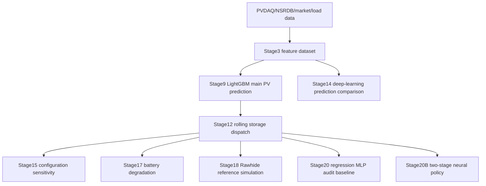

# Project Status - 2026-05-05

This is the current management summary for `New_Energy_Sys`. It is designed for fast handover between Codex, Claude Code, and thesis-writing sessions. For detailed metrics, read the original stage reports listed in `docs/reports_index.md`.

## Current Position

The project has moved beyond the earlier prediction-only work. The current technical route is:

Latest project stage: **Stage20B two-stage neural dispatch policy**.

Recommended next work: **thesis integration and document consolidation**. Do not add PPO/DRL, TCN policy, or new HRRR experiments unless explicitly requested.

## Canonical Results

| Area | Result | Use in thesis |
|---|---|---|
| PV prediction main model | Stage9 LightGBM `history_only`, t+24h test nRMSE `0.122512`, daytime nRMSE `0.168903` | Stable main forecast artifact |
| Prediction-side DL | Stage14 rerun includes TCN/DLinear/Persistence and earlier CNN-LSTM/Attention-LSTM context | DL comparison and negative/limited-result discussion |
| Rolling dispatch | Stage12 rolling optimization passes physical constraints; full-window incremental revenue `0.610039 EUR` | Explicit optimizer baseline |
| Rawhide reference | Stage18 scales PVDAQ System 10 to Rawhide public parameters: 22 MW PV, 1 MW / 2 MWh BESS | Real plant parameter reference, not measured Rawhide replay |
| Stage20 regression MLP | Direction accuracy `0.4017`, below majority baseline `0.5017`; strict replay feasible but weak | Audit baseline and motivation for Stage20B |
| Stage20B two-stage policy | Direction accuracy `0.9908`, Macro-F1 `0.9749`, discharge recall `0.9804`, discharge->charge errors `0` | Latest dispatch-side DL evidence |

Stage20B replay metrics on its same test window:

| Scenario | Incremental revenue EUR | Shortfall kWh | Equivalent cycles | Constraint status |
|---|---:|---:|---:|---|
| Two-stage neural policy | `0.076787` | `105.760068` | `14.120809` | PASS |
| Stage12 teacher same window | `0.058307` | `95.894494` | `16.789874` | PASS |

Interpretation: Stage20B fixes the direction-classification failure and is physically replayable. It should not be written as a universal replacement for Stage12 because it has higher shortfall on the same replay window.

## Current Writing Guidance

Recommended thesis narrative:

- Use Stage9 LightGBM as the stable deterministic PV forecast chain.
- Use Stage14 to show deep-learning prediction models were evaluated systematically; DL not clearly winning is acceptable.
- Use Stage12/15/17/18 to show storage dispatch, sensitivity, degradation, and real-plant-parameter reference simulation.
- Use Stage20/20B to show dispatch-side deep learning: regression MLP exposed the direction-decision weakness, and two-stage policy distillation fixed the core classification failure.
- Use HRRR/CSI/Quantile as supplemental prediction-enhancement and uncertainty-analysis experiments.

Do not write:

- "Deep learning fully outperforms LightGBM."
- "Stage20B replaces explicit rolling optimization."
- "Perfect forecast is a revenue upper bound."
- "Rawhide results are measured historical Rawhide generation or settlement."
- "HRRR/CSI/Quantile is now the production main forecast chain."

## Read Order For Future Tools

1. `PROGRESS.md`
2. `docs/reports_index.md`
3. This file
4. `data/processed/pvdaq_nsrdb_2020_2022/stage20b_two_stage_policy_report.md`
5. Task-specific original report

## Next Task

`Thesis-Integration-1`: convert the current route into thesis chapters and tables.

Suggested outputs:

- Chapter-level outline aligned with actual artifacts.
- Experiment table separating prediction, dispatch optimization, battery degradation, Rawhide reference, and dispatch-side DL.
- A "limitations and boundaries" section covering LightGBM vs DL, HRRR role, Rawhide scaling, and market-price assumptions.

Pitfall: do not use old handover `Next Task` entries from `PROGRESS.md` as current work items. They are retained as historical trace only.
