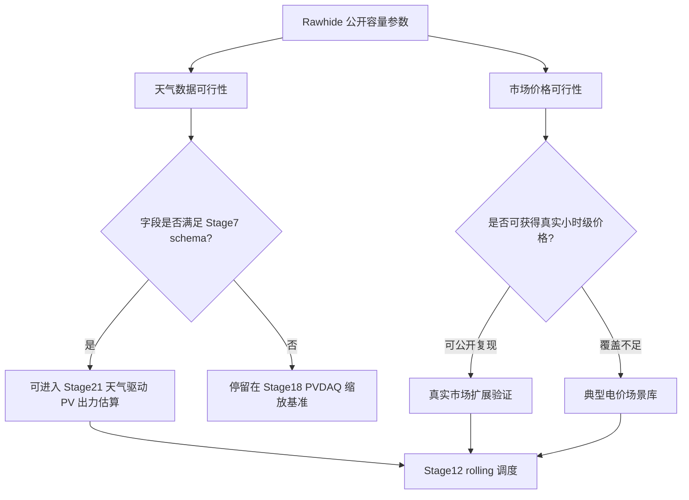

# Stage21A Rawhide 天气与市场场景数据可行性验证报告

## 1. 验证目标

本阶段只做数据可行性验证，不实现正式调度模块，也不改写 Stage18、Stage20B 的既有结论。

目标问题：

- Rawhide Prairie Solar 坐标 `40.8606, -105.0189` 是否可以接入实时或近期天气预报 API。
- 天气字段是否能映射到本项目已有 Stage7/Stage12 输入口径。
- 当地真实市场价格是否可公开复现；如果不能直接覆盖，是否可以设计可审计的典型电价场景库。
- Stage21 是否适合升级为“天气驱动 + 价格场景可配置”的 Rawhide 增强调度仿真。



## 2. 天气 API 验证

结论：`可行`。

Open-Meteo Forecast API 对 Rawhide 坐标的实时请求已成功返回 48 小时逐小时数据。返回网格点为 `40.85318, -105.03476`，海拔 `1727.0 m`，字段包含温度、湿度、露点、地表气压、降水、10m 风速/风向/阵风、GHI、DNI、DHI 与分层云量。

本轮验证请求：

```text
https://api.open-meteo.com/v1/forecast?latitude=40.8606&longitude=-105.0189&hourly=temperature_2m,relative_humidity_2m,dew_point_2m,surface_pressure,precipitation,wind_speed_10m,wind_direction_10m,wind_gusts_10m,shortwave_radiation,direct_radiation,direct_normal_irradiance,diffuse_radiation,cloud_cover,cloud_cover_low,cloud_cover_mid,cloud_cover_high&timezone=UTC&wind_speed_unit=ms&forecast_hours=48
```

字段映射：

| Open-Meteo 字段 | 项目标准字段 | 用途 |
|---|---|---|
| `time` | `timestamp` | UTC 有效时间 |
| `temperature_2m` | `temperature_c` | PV 出力温度修正 |
| `relative_humidity_2m` | `relative_humidity_pct` | 天气特征 |
| `dew_point_2m` | `dew_point_c` | 天气特征 |
| `surface_pressure` | `surface_pressure_hpa` | 天气特征 |
| `precipitation` | `precipitation_mm` | 天气特征 |
| `wind_speed_10m` | `wind_speed_ms` | 天气特征 |
| `wind_direction_10m` | `wind_direction_deg` | 天气特征 |
| `wind_gusts_10m` | `wind_gusts_ms` | 天气特征 |
| `shortwave_radiation` | `ghi_wm2` | PV 出力核心输入 |
| `direct_normal_irradiance` | `dni_wm2` | PV 出力/辐照审计 |
| `diffuse_radiation` | `dhi_wm2` | PV 出力/辐照审计 |
| `cloud_cover` | `cloud_cover_pct` | 天气特征 |
| `cloud_cover_low` | `cloud_cover_low_pct` | 天气特征 |
| `cloud_cover_mid` | `cloud_cover_mid_pct` | 天气特征 |
| `cloud_cover_high` | `cloud_cover_high_pct` | 天气特征 |

关键证据：

- Open-Meteo Forecast API 文档列出小时级温湿度、气压、云量、风速等变量，并支持 `forecast_hours` 调整小时预报范围。来源：[Open-Meteo Forecast API](https://open-meteo.com/en/docs)。
- Open-Meteo Forecast API 文档列出 GHI、DHI、DNI 等太阳辐射变量。来源：[Open-Meteo Forecast API - Solar Radiation Variables](https://open-meteo.com/en/docs)。
- Open-Meteo Historical Forecast API 从 2022 年起提供历史预报，并说明其 API 参数与 Forecast API 基本一致。来源：[Open-Meteo Historical Forecast API](https://open-meteo.com/en/docs/historical-forecast-api)。

Pitfall: Open-Meteo Forecast API 返回的是按请求时刻可获得的预报序列；如果用于论文历史复现，Historical Forecast API 的 issue-time 仍不是完整原生 cycle × lead-time 矩阵，必须保留 `weather_forecast_issue_time_is_assumed=true` 或切换 HRRR 原生归档。

## 3. 真实市场价格可行性

结论：`可作为扩展验证，不应作为唯一主线`。

Stage15A 已确认：SPP WEIS RTBM LMP 是最接近 Colorado/PSCO/Rawhide 区域的公开市场价格候选，但 2020-2022 主实验期不能用它替换 OPSD 映射电价。Stage21A 更新了截至 2026-05-05 的市场状态：

- Platte River Power Authority 已于 `2026-04-01` 加入 SPP RTO，并获得日前和实时市场能力。来源：[Platte River Energy Markets](https://prpa.org/energy-markets/)。
- SPP 西部 RTO 扩张于 `2026-04-01` 完成，覆盖 Colorado 等西部区域参与方。来源：[SPP RTO Expansion](https://www.spp.org/western-services/rto-expansion/)。
- SPP WEIS 项目已因 RTO 扩张于 `2026-04-01` 停用，历史文件仍可作为 2023-04-01 至 2026-03-31 区间的扩展验证候选。来源：[SPP WEIS](https://spp.org/western-services/weis/)。
- SPP Markets Public Data Guide 给出 RTBM/DA LMP by Settlement Location 的公开 FTP 与 Marketplace Portal 路径，字段包含 `Interval`, `Settlement Location`, `Pnode`, `LMP`, `MLC`, `MCC`, `MEC`。来源：[SPP Markets Public Data Guide](https://www.spp.org/documents/37657/spp%20markets%20public%20data%20guide--v13.pdf)。
- Platte River 当前能量生产页也提示，因 2026-04-01 加入 SPP RTO，实时能源生产图暂停至新市场数据完成验证。来源：[Platte River Current Energy Production](https://prpa.org/energy-production/)。

时间口径建议：

| 时间段 | 推荐价格来源 | 论文口径 |
|---|---|---|
| 2020-01-01 至 2022-12-31 | 继续使用 OPSD 映射价格或人工典型曲线 | 主实验离线敏感性，不是真实 Rawhide 结算 |
| 2023-04-01 至 2026-03-31 | SPP WEIS RTBM LMP 历史数据 | 真实同区域市场扩展验证候选 |
| 2026-04-01 之后 | SPP RTO Integrated Marketplace RTBM/DA LMP | 实时/近期演示候选，但需定位 Rawhide/PRPA 对应 Settlement Location 或 Pnode |

Pitfall: 不能把 SPP/WEIS/RTO 任意节点价格直接写成 Rawhide 电站真实结算价格。必须先确定对应 Settlement Location、Pnode 或可解释的区域代理节点。

## 4. 典型电价曲线 schema

结论：`必须保留`。

真实市场价格存在节点映射、时间覆盖、DST、币种和单位换算等风险。为了保证论文和演示不被外部数据卡死，Stage21 应把电价设计成可配置场景库，而不是把某一个市场源硬编码进调度器。

推荐 schema 已固化在：

```text
configs/market_price_scenarios.stage21a.json
```

最小消费规则：

- 输出统一列名：`price_eur_mwh`。
- 时间粒度：小时级。
- 合成场景：按 `hour_of_day` 循环映射，可自由编辑 24 个小时价格。
- 真实市场场景：保留 `source_url`, `market`, `settlement_location`, `pnode`, `currency`, `source_unit`, `aggregation` 等审计字段。
- 所有场景必须携带 `is_real_settlement_price`，避免把典型曲线误写成真实价格。

内置建议场景：

| 场景 | 用途 | 价格逻辑 |
|---|---|---|
| `flat_proxy_30` | 无价差基准 | 全天 30 EUR/MWh |
| `tou_peak_valley` | 常规峰谷电价 | 夜间低价、晚高峰高价 |
| `solar_duck_curve` | 高光伏渗透市场 | 中午低价/负价、晚高峰高价 |
| `high_volatility_stress` | 压力测试 | 中午负价、晚间极端高价 |
| `opsd_profile_reference` | 复用现有主线边界 | 继续作为离线敏感性基准 |

Pitfall: 典型电价曲线能证明调度策略响应能力，但不能证明当地真实收益；报告和前端必须把 `price_source_type=synthetic_scenario` 明确展示出来。

## 5. Stage21 升级判断

结论：`推荐推进 Stage21，但保留 Stage18 为基准`。

| 维度 | Stage18 | Stage21 推荐升级 |
|---|---|---|
| 电站参数 | Rawhide 公开容量参数 | 沿用 |
| PV 输入 | PVDAQ System 10 按容量比例放大 | Rawhide 坐标天气驱动 PV 出力估算 |
| 天气实时性 | 无 | Open-Meteo Forecast 48h 起步 |
| 近期复现 | 无 | Open-Meteo Historical Forecast 2022+ |
| 电价 | OPSD 映射价格 | 三层场景：真实候选、公开代理、典型曲线 |
| 论文定位 | 真实参数参照仿真 | 天气驱动 + 价格场景可配置的增强仿真 |

推荐 Stage21 实现边界：

1. Stage21 不替换 Stage9 主预测模型，也不替换 Stage20B 神经调度结论。
2. Stage21 的 PV 出力先采用透明物理近似：`pv_kw = capacity_kw * ghi_wm2 / 1000 * performance_ratio`，并保留温度修正作为可选增强。
3. Stage21 的调度器继续复用 Stage12 rolling optimization。
4. Stage21 的报告必须同时输出天气源、价格源、是否真实结算、是否实测 Rawhide 出力四类边界字段。
5. Stage21 可以作为论文“系统扩展能力”或“增强主实验”，不能写作 Rawhide 历史收益复盘。

## 6. 验收结论

Stage21A 数据可行性验证通过。

质量门禁：

| 门禁 | 结果 |
|---|---|
| Rawhide 坐标 Open-Meteo Forecast API 可返回 | `True` |
| 天气字段可映射到 Stage7/Stage21 标准 schema | `True` |
| Historical Forecast 可用于 2022+ 近期复现 | `True` |
| SPP/WEIS/RTO 价格存在公开候选路径 | `True` |
| 2020-2022 可替换为真实 Rawhide 结算价格 | `False` |
| 典型电价曲线 schema 已定义 | `True` |
| Stage21 可作为 Stage18 增强主实验 | `True` |

下一步建议：实现 `Stage21 Rawhide weather-driven price-scenario dispatch`，输入为 Open-Meteo 标准天气表和 `configs/market_price_scenarios.stage21a.json`，输出天气驱动 PV 估算、场景级调度结果、收益/SOC/约束报告。

Pitfall: Stage21A 证明“可实现”，但还没有证明“收益更真实”。真实收益仍依赖 Rawhide 对应市场节点、结算规则和小时级/5分钟价格数据的进一步接入。
