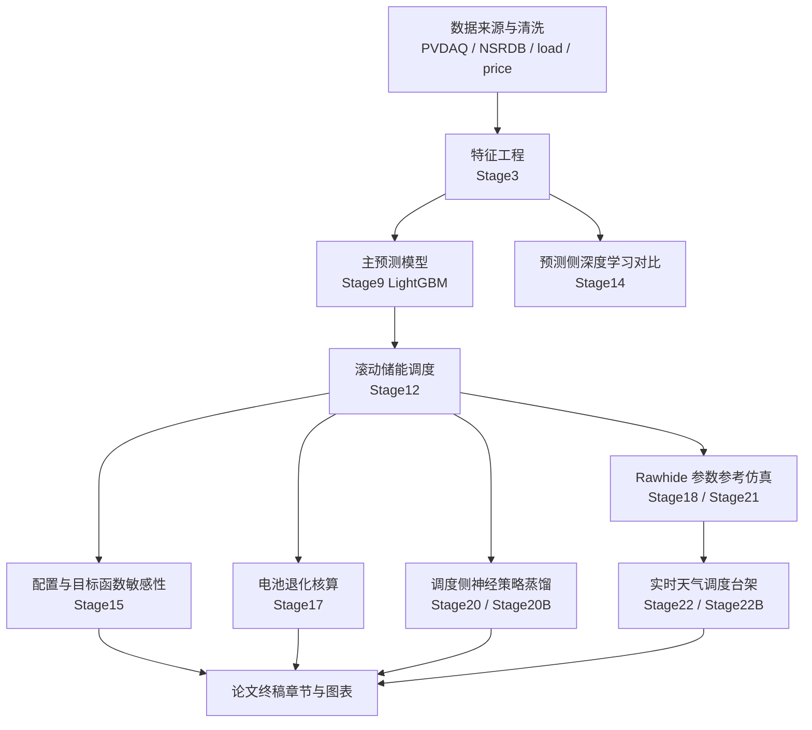

# Thesis Final Writing Handoff - 2026-05-07

本文件是终稿写作阶段的交接锚点。它不替代 `PROGRESS.md` 和 `docs/reports_index.md`，只用于把当前工程证据整理成论文终稿写作路线。

## 1. 当前阶段判断

当前项目已经从“继续扩展工程实验”切换到“论文终稿写作与证据整合”。工程侧最新可复现状态仍以 `PROGRESS.md` 顶部快照为准：

- 最新工程阶段：`Stage22B realtime weather dispatch run history and export hardening`。
- 最新调度侧深度学习结果：`Stage20B two-stage neural dispatch policy`。
- 当前写作优先级：围绕已生成的预测、调度、退化、Rawhide 参考仿真、实时天气调度台架和前后端展示证据，完成终稿章节、图表、限制条件和格式交付。
- 当前不建议继续追加默认实验：PPO/DRL、TCN policy、更大范围 HRRR、真实市场结算扩展，除非后续明确要求。

Pitfall：不要把“工程链路完整”写成“生产系统已上线运行”。当前最强证据是可复现实验链路、本地演示系统和导出记录，不是目标服务器长期运行记录。

## 2. 写作路线对比

| 方案 | 工作内容 | 收益 | 成本 | 推荐级别 | Pitfall |
|---|---|---|---|---|---|
| A. 终稿整合优先 | 基于现有报告与终稿候选文件，统一章节、图表、术语、边界说明和参考文献 | 最贴近当前目标，能快速形成可交付终稿 | 需要逐章核对证据和格式 | 推荐 | 直接复制阶段报告会导致叙事重复、指标口径不统一 |
| B. 工程验收补强优先 | 继续补齐部署验收、长时运行记录、E2E/监控记录 | 提升工程交付可信度 | 会推迟终稿写作 | 次选 | 没有目标服务器环境时，验收记录无法替代论文主体内容 |
| C. 继续追加算法实验 | 扩展 DRL、更多天气源、真实市场价格或新模型 | 可能增加亮点 | 解释成本高，容易拖慢收敛 | 不推荐作为默认路线 | 新实验会制造新的边界和对照问题，反而削弱终稿稳定性 |

推荐路线：执行 A。当前证据已经足够支撑本科毕业论文的主线，下一步应收敛，而不是继续扩张。

## 3. 终稿证据链

Pitfall：Stage14 和 Stage20B 不能合并成一张“深度学习统一排名表”。Stage14 回答预测模型问题，Stage20B 回答调度动作模仿问题，实验对象不同。

## 4. 终稿候选文件与写作入口

| 类型 | 路径 | 当前用途 | 使用规则 | Pitfall |
|---|---|---|---|---|
| 当前生成稿 | `thesis/main.docx` | 2026-05-06 生成的论文文档候选 | 优先检查是否包含最新 Stage20B/Stage22B 边界 | 文件名不含学校模板信息，不能默认视为格式最终版 |
| LaTeX/HTML 源 | `thesis/main.tex`, `thesis/main.html` | 可追溯正文来源与渲染结果 | 用于定位章节和重新生成正文 | 修改 DOCX 与修改 TEX 可能产生双源漂移 |
| 格式修正版 | `reports/胡家铭_本科毕业论文_Final_格式修正版.docx` | 2026-05-06 的格式修复候选稿 | 可作为格式检查参考 | 文件名为 Final 不等于内容证据已经完全同步 |
| 学校规范 | `reports/6.上海电力大学本科生毕业设计（论文）撰写规范.docx` | 写作规范依据 | 终稿格式、章节顺序、图表题注需对齐 | 规范文件只管格式，不证明项目内容 |
| 格式示范 | `reports/14.上海电力大学本科生毕业设计（论文）格式示范文本.docx` | 版式参考 | 用于页眉页脚、标题层级和目录样式核查 | 示例文本中的占位说明不能进入终稿 |

## 5. 章节写作边界

| 章节 | 可写内容 | 核心证据 | 禁止写法 | Pitfall |
|---|---|---|---|---|
| 绪论 | 新能源出力波动、储能调度价值、项目目标 | `reports/project_status_2026-05-05.md` | 宣称已实现商业化投运 | 背景不能膨胀成政策综述堆砌 |
| 需求分析 | 数据、预测、调度、展示、报告导出需求 | 前后端文档、API smoke、Stage22B 记录 | 写成泛泛管理系统需求 | 需求必须对应实际页面/API |
| 总体设计 | 数据处理、预测、调度、API、前端展示架构 | `docs/reports_index.md`, `backend/app/*`, `frontend/src/views/*` | 画不存在的微服务或云原生架构 | 架构图必须贴合代码目录 |
| 详细实现 | Stage9、Stage12、Stage15、Stage17、Stage18/21、Stage20B、Stage22B | 各阶段 CURRENT 报告 | 把 Stage20B 写成替代优化器 | 指标必须保留窗口和边界 |
| 系统测试 | 构建、API smoke、pytest、前端构建、浏览器 smoke | `PROGRESS.md` Stage22B validation | 写成完整生产验收 | 没有目标服务器记录时，不写长期运行结论 |
| 总结展望 | 已完成链路、局限、后续真实市场接入和部署验收 | 本交接报告和当前进度锚点 | 再承诺默认新增实验已经完成 | 展望应是边界，不是补写未做功能 |

## 6. 可直接进入论文的核心结论

- Stage9 LightGBM `history_only` 是当前稳定主预测模型，t+24h test nRMSE 为 `0.122512`，daytime nRMSE 为 `0.168903`。
- Stage14 可作为预测侧深度学习对比材料，但不能写成深度学习全面优于 LightGBM。
- Stage12 rolling optimization 是显式优化调度基线，完整窗口增量收益为 `0.610039 EUR`，并通过物理约束审计。
- Stage15 说明容量、功率和目标函数权重对调度收益有显著影响，可写入配置敏感性分析。
- Stage17 可写作退化成本和 SOH 约束增强，不应写成厂商级电化学寿命模型。
- Stage18/Stage21 可写作 Rawhide 公开参数参考仿真和天气驱动可行性，不是 Rawhide 实测发电或真实结算收益。
- Stage20B 可写作监督式两阶段神经策略蒸馏，方向准确率 `0.9908`、Macro-F1 `0.9749`，但不替代 Stage12 rolling optimizer。
- Stage22/Stage22B 可写作实时天气 API 驱动调度演示、运行记录与导出能力，不写成真实市场自动交易系统。

Pitfall：所有“收益”都必须标注数据来源与价格边界。OPSD 映射电价、合成/项目代理价格、Rawhide 真实结算价格不能混写。

## 7. 下一阶段执行清单

1. 确认终稿工作母本：在 `thesis/main.docx` 与 `reports/胡家铭_本科毕业论文_Final_格式修正版.docx` 中选择一个继续修改，避免 DOCX/TEX 双源漂移。
2. 按第 5 节逐章核对正文：删除不受代码和报告支持的承诺，补入 Stage20B 与 Stage22B 的当前边界。
3. 重做或核对图表清单：优先使用系统架构图、功能模块图、调度流程图、实验结果表、运行界面截图。
4. 统一指标表：预测、调度、配置敏感性、退化、Rawhide、神经策略分别成表，不跨任务强行排名。
5. 格式复核：对齐学校规范、封面、目录、摘要、标题层级、图表题注、参考文献和致谢。

Pitfall：如果同时改 `thesis/main.tex` 和 DOCX，必须明确哪一个是最终母本，否则后续格式修复会覆盖内容修订。

## 8. 参考文献修订检查点

2026-05-07 已根据外部核查结果更新 `thesis/main.tex` 的参考文献与正文引用：

- 删除同一文献的中英文重复计数风险，不再保留重复英文著录作为独立成果。
- 修正并补充储能优化调度、光伏预测、深度强化学习、数据源和开发框架相关文献。
- 将参考文献扩展到 37 条，覆盖中文电力/储能文献、LightGBM 原始论文、CNN-LSTM/Attention-CNN-LSTM 光伏预测文献、滚动优化/MPC 调度文献、PVDAQ/NSRDB/OPSD/Open-Meteo 数据源。
- 正文已补充对应引用点，当前检查结果为 `cites=37`, `bibitems=37`, `missing=0`, `unused=0`。
- `git diff --check -- thesis/main.tex reports/thesis_final_writing_handoff_2026-05-07.md` 通过。
- `xelatex -interaction=nonstopmode -halt-on-error main.tex` 在本机 MiKTeX 环境中 120 秒超时，日志停在宏包/编码加载阶段，未出现正文行号语法错误；残留 `xelatex` 进程已停止。后续需要在用户本机确认 MiKTeX 自动安装策略或改用已有 `thesis/main.docx` 工作母本。

Pitfall：参考文献数量达标不等于格式最终达标。下一步仍需按学校模板检查参考文献缩进、标点、著录类型和 DOI/URL 是否符合学院要求。

## 9. 前端截图展示检查点

2026-05-07 已按 `reports/毕业论文（示例）.docx` 的“功能实现章节集中展示界面图”风格，将前端界面截图写入 `thesis/main.tex`：

- 新增截图脚本：`scripts/capture_thesis_frontend_screenshots.mjs`。
- 截图输出目录：`thesis/figures/frontend/`。
- 正文截图 8 张：登录、系统总览、模型评估、实时天气调度实验、配置治理、数据管理、预测验收、项目报告浏览。
- 附录截图 3 张：Rawhide参考电站收益、电池退化成本评估、移动端系统总览。
- 截图采集命令已验证：`node scripts\capture_thesis_frontend_screenshots.mjs`。
- 图片检查结果：11 个 PNG 均存在；正文 10 张为 `1920x1080`，移动端截图为 `390x844`。
- LaTeX 图片路径检查结果：`includegraphics=11`, `missing=0`。
- LaTeX 图引用检查结果：`fig_labels=17`, `fig_refs=17`, `unreferenced=0`。
- `node --check scripts\capture_thesis_frontend_screenshots.mjs` 通过。
- `git diff --check -- thesis/main.tex scripts/capture_thesis_frontend_screenshots.mjs` 通过。
- `xelatex -interaction=nonstopmode -halt-on-error main.tex` 仍在本机 MiKTeX 环境中 120 秒超时，日志停在宏包/编码加载阶段，未进入正文行号语法错误；残留 `xelatex` 进程已停止。

Pitfall：截图已能用于论文正文，但最终 DOCX/PDF 仍需解决 MiKTeX 编译环境或改用 DOCX 母本导出流程。

## 10. MiKTeX 编译链路修复记录

2026-05-07 已完成论文编译链路修复与导出验证：
- 根因定位：MiKTeX 为最小/按需安装状态，缺失 `fancyhdr.sty`、`CJKfntef.sty`、`geometry.sty`、`kvsetkeys.sty` 等包时弹出 GUI 安装确认框，导致命令行 `xelatex`/`kpsewhich` 等待弹窗并表现为超时。
- 环境修复：执行 `initexmf --update-fndb`、`initexmf --mkmaps`、`mpm --update-db`、`mpm --update`，并通过 `initexmf --enable-installer`、`initexmf --set-config-value=[MPM]AutoInstall=1` 启用缺包自动安装。
- 已显式补齐包：`fancyhdr`、`geometry`、`cjk`、`multirow`、`appendix`、`titlesec`、`kvsetkeys`、`kvdefinekeys`、`infwarerr`、`pdfescape`、`hycolor`、`letltxmacro`、`auxhook`、`refcount`、`gettitlestring`、`stringenc`、`intcalc`、`bigintcalc`、`bitset`、`uniquecounter`、`rerunfilecheck` 等。
- LaTeX 源码小修：修复 TikZ 多行节点 `\\`、节点内 `\hline`、`\\ [` 可选参数误解析、`lstlisting` 标题中未转义下划线等行级错误；同时设置 `\setlength{\headheight}{14pt}`、`\hypersetup{hidelinks}`，并将图、表、公式编号改为“章-序号”格式。
- PDF 编译结果：`xelatex -interaction=nonstopmode -halt-on-error main.tex` 多轮通过，输出 `thesis/main.pdf`，共 73 页；最终日志无 `LaTeX Error`、无未定义引用、无缺包错误。
- DOCX 导出结果：执行 `pandoc main.tex --resource-path=".;C:/Project/New_Energy_Sys/thesis" -o main.docx` 成功，输出 `thesis/main.docx`；结构检查为 `paragraphs=459`、`tables=18`、`images=11`。
- 静态检查：`git diff --check -- thesis/main.tex reports/thesis_final_writing_handoff_2026-05-07.md scripts/capture_thesis_frontend_screenshots.mjs` 通过。

Pitfall：Pandoc 生成的 DOCX 是可交付母本，但对 LaTeX/TikZ 原生图和复杂编号的还原能力弱于 PDF；若学校最终要求 Word 版精排，仍需在 Word 中按示例模板做版式复核。

## 11. 阶段总结

- 已同步内容：当前项目正式进入论文终稿写作准备阶段；工程侧保持 Stage22B 为最新可复现实验台架，调度侧深度学习保持 Stage20B 为最新结论。
- 目标完成情况：工程实验链路基本完成；论文材料已具备终稿整合条件；当前短板是章节统一、格式核查和边界表述，而不是继续增加实验。
- 下一阶段可行性：高。只要先锁定终稿母本，再按证据链逐章收敛，终稿写作可以直接推进。

Pitfall：当前最大风险是“材料太多导致主线发散”。下一阶段必须以终稿章节为中心组织材料，而不是按阶段报告流水账堆叠。
